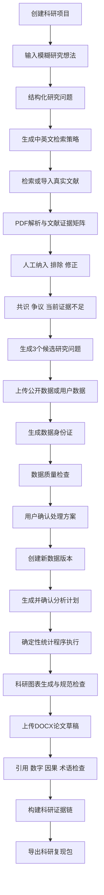
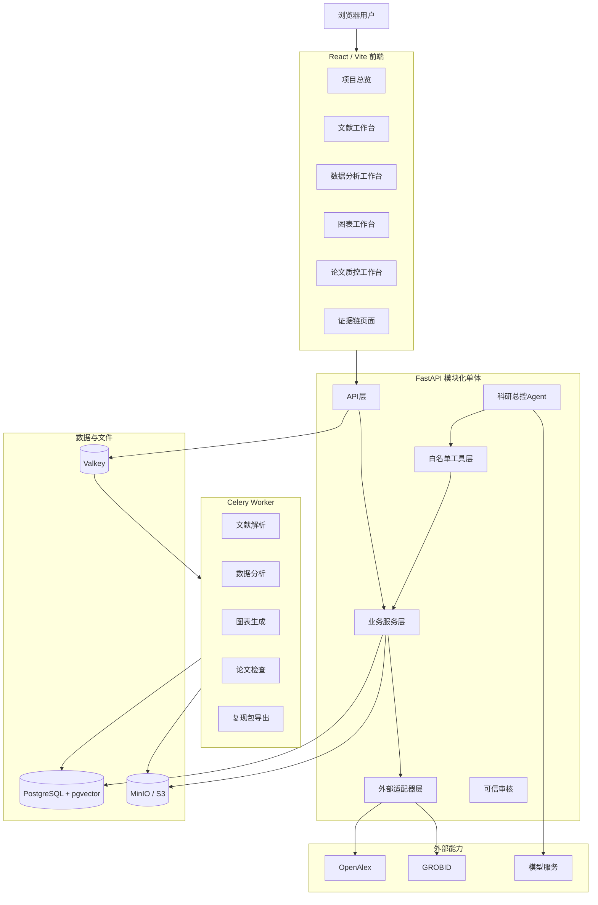

# 研证链 AI（RECA）

> M0 clean-room acceptance: run `./scripts/m0-acceptance.ps1` on Windows
> PowerShell or `./scripts/m0-acceptance.sh` on Linux/macOS. It uses only the
> scoped `reca_m0_acceptance` project and temporary random test secrets, never
> a developer `.env` or default volumes. M0 intentionally has no business seed
> data; an approved demonstration-data workflow begins in M1.

> 面向高校科研训练的全流程可信科研智能体
> Research Evidence Chain Agent

---

## 文档信息

| 项目     | 内容                             |
| ------ | ------------------------------ |
| 文档名称   | README.md                      |
| 文档版本   | 1.0.0                          |
| 适用项目版本 | RECA 0.1 Competition Edition   |
| 文档状态   | Approved                       |
| 项目类型   | Web 前后端项目 / 科研智能体平台            |
| 主要用户   | 本科生、研究生、教师                     |
| 维护团队   | RECA Team                      |
| 最后更新时间 | 2026-07-29                     |
| 需求基准   | `docs/PRODUCT_REQUIREMENTS.md` |
| 开发规则   | `AGENTS.md`                    |

> 本文档是项目总入口，用于介绍产品、技术架构、运行方式与正式文档位置。
> 详细需求、数据模型、API、AI 契约、安全规则和验收标准以 `docs/` 下的正式文档为准。

---

## 1. 项目简介

**研证链 AI（Research Evidence Chain Agent，RECA）** 是一个面向高校科研训练场景的可信科研智能体平台。

系统围绕一个科研项目，将以下环节连接为统一工作流：

```text
研究想法
→ 研究问题结构化
→ 真实文献检索与导入
→ 文献证据矩阵
→ 候选研究问题
→ 数据质量检查
→ 用户确认处理方案
→ 确定性统计分析
→ 科研图表生成
→ 论文质量检查
→ 科研证据链
→ 科研复现包导出
```

研证链 AI 不以“一键生成论文”为目标，而是帮助用户完成科研过程中重复、易错、难以追溯的工作，并让重要科研判断能够回到：

* 真实文献；
* 原文片段；
* PDF 页码；
* 数据来源；
* 数据版本；
* 数据处理记录；
* 分析方法；
* 分析代码；
* 统计结果；
* 科研图表；
* 用户确认记录。

项目的核心不是将多个工具简单拼接，而是建立统一的：

> **文献—数据—代码—图表—论文论述证据链。**

现有需求分析明确指出，传统科研流程往往需要在文献数据库、PDF 阅读器、Excel、统计软件、绘图工具、文献管理工具和 Word 之间反复切换，导致数据、证据和修改记录彼此割裂。研证链 AI 的目标是把这些过程组织成可追溯、可复核、可复现的科研工作流。

---

## 2. 项目定位

### 2.1 一句话定位

> 研证链 AI 是一个面向高校科研训练的模块化可信科研智能体，将真实文献、原文证据、数据版本、确定性分析、科研图表和论文论述连接为可追溯、可复核、可复现的科研工作流。

### 2.2 核心目标

项目同时服务四个目标。

#### 科研提效

减少以下重复劳动：

* 检索词设计；
* 文献元数据整理；
* 多篇论文横向比较；
* 数据质量检查；
* 基础统计分析；
* 科研图表绘制；
* 引用与数字核对；
* 复现材料整理。

#### 科研提质

通过以下机制减少低级错误：

* 文献真实性核验；
* 原文证据定位；
* 数据质量规则；
* 统计前提检查；
* 图表规范检查；
* 引用双向核对；
* 数字一致性检查；
* 因果夸大识别；
* 术语一致性检查。

#### 科研可信

让系统中的重要结论能够回溯到：

```text
Claim
├── LiteratureRecord
├── EvidenceSpan
├── DatasetVersion
├── DataTransformation
├── AnalysisPlan
├── AnalysisRun
├── AnalysisResult
├── Figure
├── ApprovalRecord
└── AuditResult
```

#### 科研教学

系统不仅输出结果，还应解释：

* 为什么采用某组检索词；
* 为什么某篇文献相关；
* 为什么推荐某种统计方法；
* 哪些统计前提已满足；
* 为什么推荐某种图表；
* 为什么某段论文表述存在风险；
* 哪些结论证据不足；
* 哪些步骤仍需导师或研究者确认。

---

## 3. 核心问题

研证链 AI 重点解决以下问题。

### 3.1 文献检索缺乏结构

传统关键词检索常出现：

* 不知道使用什么关键词；
* 中英文术语不统一；
* 检索范围过大或过小；
* 搜索结果重复；
* 文献表面相关但对象不匹配；
* 文献变量相似但方法不适用；
* AI 推荐出不存在的论文。

### 3.2 文献综述缺乏证据链

用户通常需要人工整理：

* 研究对象；
* 样本量；
* 核心变量；
* 研究设计；
* 分析方法；
* 主要结论；
* 研究局限。

普通 AI 总结容易出现：

* 将研究假设误认为研究结果；
* 忽略样本和方法限定；
* 将局部文献集合的缺失描述为整个学术界的空白；
* 无法返回原文和页码。

### 3.3 数据分析难以复现

常见问题包括：

* 原始表格格式混乱；
* 缺失值未处理；
* 类别编码不一致；
* 异常值未经确认便被删除；
* 不知道如何选择统计方法；
* 大模型直接生成统计数字；
* 数据清洗过程未保存；
* 图表无法追溯到数据版本。

### 3.4 论文内容难以核验

论文中容易出现：

* 文内引用与参考文献不匹配；
* 样本量前后不一致；
* 正文数字与分析结果不一致；
* 相关关系被写成因果关系；
* 单篇研究被写成学术共识；
* 术语前后不一致；
* 图表与正文描述不一致。

### 3.5 科研工具彼此割裂

现有工具通常分别解决：

* 文献管理；
* PDF 阅读；
* 数据清洗；
* 统计分析；
* 图表生成；
* 文档检查。

但缺少一个统一的科研项目状态和证据关系模型。

---

## 4. 当前版本

当前开发版本为：

```text
RECA 0.1 Competition Edition
```

该版本面向 AI 应用创新开发大赛，强调：

* 核心闭环完整；
* 真实来源；
* 确定性计算；
* 原始文件不可覆盖；
* 重要操作人工确认；
* 演示过程稳定；
* 结果能够追溯；
* 核心功能可离线展示。

RECA 0.1 不追求覆盖所有科研学科和所有统计方法，而是优先稳定实现一条做深、做准、做稳的垂直闭环。

---

## 5. RECA 0.1 核心闭环



---

## 6. P0 核心功能

### 6.1 科研项目管理

* 创建科研项目；
* 设置项目名称、专业、研究方向和阶段；
* 保存项目成员和基础权限；
* 展示当前研究问题；
* 展示文献数量；
* 展示数据版本；
* 展示分析运行；
* 展示图表数量；
* 展示论文风险问题；
* 展示待确认事项；
* 展示证据链完整度；
* 保存操作日志。

### 6.2 研究问题结构化

用户可以输入自然语言研究兴趣，例如：

> 我想研究生成式 AI 使用与师范生学习投入之间的关系。

系统提取：

* 研究对象；
* 核心现象；
* 自变量；
* 因变量；
* 控制变量；
* 研究目标；
* 研究类型；
* 时间范围；
* 地区范围；
* 文献范围；
* 方法偏好；
* 数据与资源限制。

用户可以编辑所有字段，并进行最终确认。

未确认的研究问题不得直接进入正式分析流程。

### 6.3 真实文献检索

P0 支持：

* OpenAlex 文献元数据检索；
* DOI 导入；
* 用户上传 PDF；
* 本地演示文献库；
* 检索结果缓存；
* 标题和 DOI 去重；
* 文献来源标记；
* 文献真实性状态；
* 中英文关键词生成；
* 布尔检索式生成；
* 文献相关性说明。

系统必须明确区分：

* AI 推荐的检索词；
* 外部数据源返回的文献；
* 用户上传的全文；
* 未验证的文献元数据。

大模型不得凭模型记忆生成论文列表。

### 6.4 PDF 文献解析

P0 以 GROBID 作为学术 PDF 主解析服务，以 pypdf 作为基础文本回退方案。

支持：

* PDF 上传；
* SHA-256 文件哈希；
* 文件重复检测；
* 标题和作者提取；
* 摘要提取；
* 正文结构提取；
* 参考文献提取；
* 页面信息保存；
* 解析状态显示；
* 失败重试；
* 低置信度标记；
* 扫描版 PDF 提示。

### 6.5 文献证据矩阵

比赛版固定提取十个核心字段：

1. 题目；
2. 作者；
3. 年份；
4. 研究对象；
5. 样本量；
6. 核心变量；
7. 研究设计；
8. 分析方法；
9. 主要结论；
10. 局限性。

语义字段必须尽可能绑定：

* `document_id`；
* `page_number`；
* `source_text`；
* `bounding_box`；
* `confidence`；
* `confirmed_by_user`。

用户可：

* 修改 AI 抽取结果；
* 查看原文；
* 跳转 PDF 页码；
* 确认或驳回；
* 添加备注；
* 保存修正历史；
* 导出文献矩阵。

### 6.6 文献筛选

P0 支持三种文献状态：

* 纳入；
* 排除；
* 待确认。

每次决策记录：

* 文献 ID；
* 决策状态；
* 排除理由；
* 决策人；
* 决策时间；
* AI 推荐分数；
* 修改历史。

AI 可以推荐，但不能替用户完成最终排除。

### 6.7 当前证据集合分析

系统基于当前已纳入文献生成：

* 共识；
* 争议；
* 反例；
* 方法差异；
* 样本差异；
* 当前证据集合中的不足；
* 待补充文献；
* 待核实问题。

所有表述必须限定范围，例如：

> 在当前纳入的 12 篇文献中，只有 2 篇研究农村师范生，且均采用横断面问卷。因此，在当前文献集合中，该群体的纵向研究证据相对不足。

不得表述为：

> 学术界从未研究该问题。

### 6.8 候选研究问题

每次生成 3 个候选研究问题。

每个候选项包含：

* 研究问题；
* 研究对象；
* 核心变量；
* 文献依据；
* 当前证据；
* 可能创新；
* 数据要求；
* 推荐方法；
* 方法难度；
* 数据可获得性；
* 周期可控性；
* 伦理风险；
* 主要限制；
* 导师确认事项。

评分采用等级而不是伪精确分数：

* 强 / 中 / 弱；
* 高 / 中 / 低。

### 6.9 数据上传与数据身份证

P0 支持：

* CSV；
* XLSX；
* 系统预置公开数据；
* 用户上传数据；
* 手工登记数据来源。

每个数据集记录：

* 数据集名称；
* 发布者；
* 来源平台；
* 来源标识；
* DOI 或网址标识；
* 获取日期；
* 数据版本；
* 许可证；
* 推荐引用；
* 样本量；
* 字段数量；
* 字段说明；
* 已知限制。

### 6.10 数据版本

版本原则：

```text
dataset_original_v1
    ↓
dataset_cleaned_v2
    ↓
dataset_cleaned_v3
```

强制规则：

* 原始数据永久只读；
* 原始数据不得覆盖；
* 数据处理必须生成新版本；
* 每个版本保存父版本；
* 每次处理保存参数；
* 每次处理保存受影响记录；
* 每次处理保存操作人；
* 每次处理保存用户确认记录；
* 数据版本支持失效，但不得无痕删除。

### 6.11 数据质量检查

P0 检查：

* 缺失值；
* 重复行；
* 重复 ID；
* 常量列；
* 数据类型混杂；
* 类别编码不一致；
* 不合理范围；
* 极端值；
* 分组不平衡；
* 疑似单位不一致；
* 日期异常；
* 可能的手机号；
* 可能的身份证号；
* 可能的学号；
* 其他疑似敏感字段。

每个问题包含：

* 问题类型；
* 严重程度；
* 字段或位置；
* 受影响记录；
* 判断证据；
* 建议方案；
* 是否需要审批。

系统不得自动认定异常值一定错误。

### 6.12 数据处理审批

数据处理流程必须采用：

```text
DataQualityIssue
→ CleaningPlan
→ 处理预览
→ 用户批准
→ DataTransformation
→ 新DatasetVersion
→ 重新检查
```

未经用户批准，不得：

* 删除记录；
* 修正数值；
* 插补缺失值；
* 合并类别；
* 统一单位；
* 改变变量类型。

### 6.13 确定性统计分析

P0 支持：

* 描述统计；
* 独立样本两组比较；
* 配对两组比较；
* Pearson 相关；
* Spearman 相关；
* 简单线性回归；
* 对应统计前提检查。

统计数字必须由 SciPy、statsmodels 或其他受控程序计算。

大模型不得直接生成：

* 均值；
* 标准差；
* 样本量；
* p 值；
* 回归系数；
* 相关系数；
* 置信区间；
* 效应量。

每次分析保存：

* 数据版本；
* 变量映射；
* 方法；
* 参数；
* 前提检查；
* 代码；
* 依赖版本；
* 运行环境；
* 结构化结果；
* 警告；
* 日志；
* 运行时间。

### 6.14 科研图表

P0 支持：

* 直方图；
* 箱线图；
* 散点图；
* 带置信区间的组间比较图；
* 相关矩阵。

每张图必须绑定：

* `dataset_version_id`；
* `analysis_run_id`；
* 变量；
* 参数；
* 图注；
* 图像文件；
* 绘图代码；
* 创建时间。

图表规范检查包括：

* 横轴名称；
* 纵轴名称；
* 单位；
* 图例；
* 样本量说明；
* 误差线含义；
* 图注完整性；
* 坐标轴截断风险；
* 图表与统计结果一致性。

### 6.15 DOCX 论文质控

P0 只支持 DOCX。

检查范围：

#### 引用问题

* 文内有引用但文末无条目；
* 文末有条目但正文未引用；
* 作者和年份不一致；
* 重复参考文献；
* DOI 格式异常；
* 项目文献库中不存在的引用。

#### 数字问题

* 样本量前后不一致；
* 正文与分析结果不一致；
* 正文与表格不一致；
* 正文与图表不一致；
* p 值表达不一致；
* 相关系数表达不一致；
* 回归系数表达不一致。

#### 语义问题

* 相关关系被写成因果；
* 结论超出样本范围；
* 单篇研究被写成学术共识；
* “当前材料未发现”被写成“学术界完全没有”；
* 术语前后不一致。

#### 基础格式问题

* 标题层级；
* 图表编号；
* 缩写首次出现；
* 数字与单位；
* 中英文标点；
* 多余空格。

比赛版只对低风险格式问题提供自动修复。

以下问题只给建议：

* 引用；
* 统计数字；
* 研究结论；
* 因果表达；
* 公式；
* 复杂图表；
* 修订记录。

### 6.16 科研证据链

证据链页面使用节点图展示：

```text
论文论述
→ 文献原文证据
→ PDF页码
→ 数据集
→ 数据版本
→ 数据处理
→ 分析计划
→ 分析运行
→ 统计结果
→ 科研图表
→ 人工确认
→ 可信审核
```

主要节点类型：

* Claim；
* LiteratureRecord；
* EvidenceSpan；
* DatasetVersion；
* DataTransformation；
* AnalysisPlan；
* AnalysisRun；
* AnalysisResult；
* Figure；
* ApprovalRecord；
* AuditResult。

主要关系类型：

* `SUPPORTED_BY`；
* `CONTRADICTED_BY`；
* `DERIVED_FROM`；
* `TRANSFORMED_FROM`；
* `ANALYZED_BY`；
* `PRODUCED`；
* `VISUALIZED_AS`；
* `CONFIRMED_BY`；
* `AUDITED_BY`。

### 6.17 科研复现包

最终支持导出 ZIP：

```text
reca-repro-package/
├── 01_research_question/
├── 02_literature/
├── 03_evidence_matrix/
├── 04_dataset_identity/
├── 05_dataset_versions/
├── 06_cleaning_log/
├── 07_analysis_plan/
├── 08_analysis_code/
├── 09_analysis_results/
├── 10_figures/
├── 11_manuscript_check/
├── 12_evidence_graph/
├── 13_agent_and_approval_logs/
├── README_REPRODUCE.md
├── requirements-lock.txt
└── manifest.json
```

---

## 7. 核心创新

### 7.1 科研证据链

研证链 AI 不只输出答案，而是保存答案与来源之间的关系。

用户点击一条结论后，应能够查看：

* 对应文献；
* 原文片段；
* PDF 页码；
* 使用的数据版本；
* 数据处理记录；
* 统计方法；
* 运行代码；
* 结构化结果；
* 对应图表；
* 人工确认；
* 审核状态。

### 7.2 受控科研智能体

智能体只负责：

* 理解用户意图；
* 识别当前阶段；
* 发现缺失信息；
* 生成计划；
* 推荐下一步；
* 调用白名单工具；
* 汇总结构化结果；
* 请求用户确认。

确定性程序负责：

* 文献数据源调用；
* 文件解析；
* 数据质量检测；
* 统计计算；
* 图表绘制；
* 文档结构检查；
* 文件导出。

用户负责：

* 最终科研判断；
* 文献纳入与排除；
* 数据处理批准；
* 变量角色确认；
* 统计方法确认；
* 论文修改采纳；
* 最终学术责任。

### 7.3 人工确认与版本留痕

以下操作必须经用户确认：

* 研究问题；
* 文献纳入或排除；
* 文献抽取修正；
* 数据处理方案；
* 自变量和因变量；
* 样本独立性；
* 统计方法；
* 图表选择；
* 论文修改建议；
* 最终结论。

### 7.4 确定性计算

模型不承担统计计算。

所有正式数字必须来自：

* 数据版本；
* 分析计划；
* 确定性统计工具；
* 结构化分析结果。

### 7.5 模块独立与数据互通

用户可以单独使用：

* 快速文献矩阵；
* 快速数据与图表；
* 快速论文检查。

快速工具产生的结果仍须归属于一个轻量项目，避免形成无法追溯的孤立产物。

---

## 8. 产品边界

研证链 AI 不是：

* 一键论文代写工具；
* 自动降重工具；
* 规避查重工具；
* 精确查重系统；
* 替代导师作出科研决策的系统；
* 自动修改数据以获得显著结果的系统；
* 全学科实验故障诊断系统；
* 任意代码执行平台；
* 自动获取付费全文的平台；
* 完整在线 Word 编辑器；
* 全功能统计软件替代品。

### RECA 0.1 明确不做

* 扫描 PDF 高精度 OCR；
* 全网付费论文抓取；
* 精确抄袭率计算；
* 自动降重；
* 一键生成完整论文；
* 任意 Python 执行；
* 任意 Shell 执行；
* 任意 SQL 执行；
* 自动删除异常值；
* 自动修改统计结果；
* 多元复杂模型；
* 结构方程模型；
* 混合效应模型；
* 全学科实验误差诊断；
* 复杂 DOCX 完整重排；
* 多人实时协作；
* 校级科研管理平台；
* LaTeX 自动排版；
* 大规模引文网络。

完整范围定义见：

```text
docs/PRODUCT_REQUIREMENTS.md
```

---

## 9. 目标用户

### 9.1 本科生

主要场景：

* 毕业论文；
* 课程论文；
* 大学生创新项目；
* 问卷分析；
* 科研入门；
* 学科竞赛。

主要需求：

* 学会构建检索策略；
* 整理文献；
* 缩小研究题目；
* 检查数据；
* 理解基础统计；
* 生成科研图表；
* 检查引用和格式。

### 9.2 研究生

主要场景：

* 开题报告；
* 文献综述；
* 实证研究；
* 论文投稿；
* 学位论文。

主要需求：

* 多文献横向比较；
* 研究争议识别；
* 当前证据不足定位；
* 数据处理复现；
* 统计结果核对；
* 图文一致性检查；
* AI 输出验证。

### 9.3 教师

比赛版主要支持教师作为授权项目成员查看项目。

教师关注：

* 学生纳入了哪些文献；
* 排除了哪些文献；
* 结论是否有原文依据；
* 数据来源是否合规；
* 数据经过哪些处理；
* 使用了什么方法；
* 论文数字是否来自真实分析；
* 哪些操作由 AI 建议；
* 哪些决定由学生确认。

---

## 10. 系统架构



总体采用：

> 模块化单体 + 少量独立服务。

不将文献、数据、图表和论文拆成大量微服务，以减少认证、部署、日志、接口和运维复杂度。

---

## 11. 技术栈

| 层级         | 技术                    |
| ---------- | --------------------- |
| 前端         | React、Vite、TypeScript |
| UI         | Tailwind CSS、模板现有组件体系 |
| 表格         | TanStack Table        |
| PDF 阅读     | PDF.js                |
| 证据链        | React Flow            |
| 后端         | FastAPI               |
| 数据模型       | SQLModel、Pydantic     |
| 数据库        | PostgreSQL            |
| 向量检索       | pgvector              |
| 对象存储       | MinIO / S3兼容存储        |
| 异步任务       | Celery                |
| 消息队列与缓存    | Valkey                |
| PDF 主解析    | GROBID                |
| PDF 回退     | pypdf                 |
| 文献检索       | OpenAlex、PyAlex       |
| 文献证据检索     | 自研关键词+向量混合检索          |
| 数据处理       | pandas、NumPy          |
| 数据质量       | Pandera + 自研科研规则      |
| 统计计算       | SciPy、statsmodels     |
| 科研图表       | Matplotlib            |
| DOCX 处理    | python-docx、lxml      |
| AI 编排      | OpenAI Agents SDK     |
| 后端测试       | pytest                |
| 前端测试       | Playwright            |
| 部署         | Docker Compose、Nginx  |
| Python依赖管理 | uv                    |
| 数据库迁移      | Alembic               |
| CI         | GitHub Actions        |

---

## 12. 开源使用策略

项目采用四层开源策略。

### 第一层：正式依赖

通过包管理器使用成熟通用库：

* OpenAI Agents SDK；
* PyAlex；
* Pandera；
* SciPy；
* statsmodels；
* Matplotlib；
* python-docx；
* Celery；
* PDF.js；
* TanStack Table；
* React Flow。

### 第二层：独立服务

以容器或数据库扩展运行：

* GROBID；
* PostgreSQL；
* pgvector；
* Valkey；
* MinIO。

### 第三层：研究后重新实现

研究其思想和流程，不整体嵌入：

* PaperQA；
* ASReview；
* DVC；
* Great Expectations；
* Zotero。

### 第四层：选择性内化

只允许内化：

* 边界独立；
* 许可证明确；
* 依赖少；
* 可测试；
* 可维护；
* 对 P0 有直接价值的少量代码或资源。

例如：

* DOI 标准化；
* 标题标准化；
* 排名融合纯函数；
* 少量 OOXML 辅助函数；
* 审核后的 CSL 样式。

正式系统不得在运行时依赖 `upstream-lab/`。

---

## 13. 项目目录

```text
reca/
├── README.md
├── AGENTS.md
├── LICENSE
├── THIRD_PARTY_NOTICES.md
├── docker-compose.yml
├── .env.example
│
├── frontend/
│   ├── src/
│   │   ├── app/
│   │   ├── features/
│   │   │   ├── projects/
│   │   │   ├── research-questions/
│   │   │   ├── literature/
│   │   │   ├── datasets/
│   │   │   ├── analysis/
│   │   │   ├── figures/
│   │   │   ├── manuscripts/
│   │   │   └── evidence/
│   │   ├── components/
│   │   ├── api/
│   │   ├── hooks/
│   │   ├── routes/
│   │   ├── schemas/
│   │   └── vendor-integrations/
│   │       ├── pdfjs/
│   │       ├── tanstack/
│   │       └── xyflow/
│   ├── tests/
│   ├── package.json
│   └── package-lock.json
│
├── backend/
│   ├── app/
│   │   ├── api/
│   │   ├── core/
│   │   ├── domain/
│   │   ├── modules/
│   │   │   ├── projects/
│   │   │   ├── research_questions/
│   │   │   ├── artifacts/
│   │   │   ├── literature/
│   │   │   ├── datasets/
│   │   │   ├── analysis/
│   │   │   ├── figures/
│   │   │   ├── manuscripts/
│   │   │   ├── evidence/
│   │   │   ├── approvals/
│   │   │   ├── jobs/
│   │   │   └── exports/
│   │   ├── services/
│   │   ├── adapters/
│   │   │   ├── literature/
│   │   │   ├── document_parser/
│   │   │   ├── evidence_retrieval/
│   │   │   ├── dataset_profile/
│   │   │   ├── statistics/
│   │   │   ├── charts/
│   │   │   └── manuscripts/
│   │   ├── agents/
│   │   ├── tools/
│   │   ├── quality_rules/
│   │   ├── chart_templates/
│   │   ├── manuscript_rules/
│   │   ├── ooxml_helpers/
│   │   ├── workers/
│   │   └── shared/
│   ├── tests/
│   ├── migrations/
│   ├── pyproject.toml
│   └── uv.lock
│
├── tests/
│   ├── fixtures/
│   ├── golden/
│   │   ├── literature/
│   │   ├── datasets/
│   │   ├── manuscripts/
│   │   └── end_to_end/
│   ├── integration/
│   └── e2e/
│
├── docs/
│   ├── PRODUCT_REQUIREMENTS.md
│   ├── ARCHITECTURE.md
│   ├── DATA_MODEL_AND_WORKFLOW.md
│   ├── API_AI_TOOL_CONTRACTS.md
│   ├── TEST_AND_ACCEPTANCE.md
│   ├── SECURITY_AND_OPEN_SOURCE.md
│   │
│   └── archive/
│       ├── README.md
│       ├── 功能需求.txt
│       ├── 详细需求报告.txt
│       ├── 设计方案.txt
│       ├── 最终开发策略.txt
│       ├── AI最终开源项目方案.txt
│       └── 四层开源策略.txt
│
├── vendor/
│   ├── csl/
│   └── licenses/
│
└── scripts/
    ├── bootstrap.sh
    ├── seed_demo.py
    ├── run_tests.sh
    └── export_demo_snapshot.sh
```

---

## 14. 正式文档

| 文档                                 | 作用                  |
| ---------------------------------- | ------------------- |
| `README.md`                        | 项目总入口               |
| `AGENTS.md`                        | Codex和开发人员必须遵循的开发规则 |
| `docs/PRODUCT_REQUIREMENTS.md`     | 唯一产品需求与范围基准         |
| `docs/ARCHITECTURE.md`             | 唯一技术架构基准            |
| `docs/DATA_MODEL_AND_WORKFLOW.md`  | 数据模型、版本、血缘和状态机      |
| `docs/API_AI_TOOL_CONTRACTS.md`    | API、AI输出和智能体工具契约    |
| `docs/TEST_AND_ACCEPTANCE.md`      | 测试策略、黄金集和验收门禁       |
| `docs/SECURITY_AND_OPEN_SOURCE.md` | 安全、隐私、依赖和许可证规则      |

### 文档权威优先级

当文档出现冲突时，按以下顺序处理：

```text
1. AGENTS.md中的开发红线
2. PRODUCT_REQUIREMENTS.md中的范围和功能要求
3. DATA_MODEL_AND_WORKFLOW.md中的领域规则
4. API_AI_TOOL_CONTRACTS.md中的接口和Schema
5. ARCHITECTURE.md中的技术边界
6. TEST_AND_ACCEPTANCE.md中的验收标准
7. SECURITY_AND_OPEN_SOURCE.md中的安全和合规要求
8. docs/archive中的历史资料
```

具体规则：

* 范围问题以 `PRODUCT_REQUIREMENTS.md` 为准；
* 数据对象以 `DATA_MODEL_AND_WORKFLOW.md` 为准；
* 请求响应以 `API_AI_TOOL_CONTRACTS.md` 为准；
* 技术实现边界以 `ARCHITECTURE.md` 为准；
* 是否完成以 `TEST_AND_ACCEPTANCE.md` 为准；
* 安全与许可证以 `SECURITY_AND_OPEN_SOURCE.md` 为准；
* 历史文档不得覆盖正式文档。

---

## 15. 历史文档说明

`docs/archive/` 中保存项目早期分析和完整愿景。

这些文档：

* 用于追溯设计过程；
* 可作为长期功能参考；
* 不作为 RECA 0.1 的正式开发依据；
* 不得覆盖当前正式文档；
* 不应被 Codex 当作同等优先级需求。

建议在 `docs/archive/README.md` 中写入：

```markdown
# 历史文档说明

本目录保存研证链 AI 的早期需求分析、完整产品愿景和开源研究材料。

这些文档仅用于历史参考，不作为 RECA 0.1 的正式开发基准。

正式开发必须以以下文档为准：

1. `/AGENTS.md`
2. `/docs/PRODUCT_REQUIREMENTS.md`
3. `/docs/DATA_MODEL_AND_WORKFLOW.md`
4. `/docs/API_AI_TOOL_CONTRACTS.md`
5. `/docs/ARCHITECTURE.md`
6. `/docs/TEST_AND_ACCEPTANCE.md`
7. `/docs/SECURITY_AND_OPEN_SOURCE.md`
```

---

## 16. 快速启动

> 以下命令是目标仓库接口约定。正式开发时应根据全栈模板的实际命令同步更新。

### 16.1 环境要求

建议开发环境：

* Docker 24 或更高；
* Docker Compose v2；
* Git；
* Node.js 20 LTS 或项目锁定版本；
* Python 3.11 或项目锁定版本；
* uv；
* 至少 8 GB 内存；
* 推荐 16 GB 内存；
* 预留至少 15 GB 磁盘空间。

如仅使用 Docker Compose，可不在宿主机安装 Python 和 Node.js。

### 16.2 克隆项目

```bash
git clone <RECA_REPOSITORY_URL> reca
cd reca
```

### 16.3 创建环境变量

```bash
cp .env.example .env
```

至少配置：

```dotenv
PROJECT_NAME=RECA
ENVIRONMENT=development

POSTGRES_SERVER=db
POSTGRES_PORT=5432
POSTGRES_DB=reca
POSTGRES_USER=reca
POSTGRES_PASSWORD=change-me

VALKEY_URL=redis://valkey:6379/0
CELERY_BROKER_URL=redis://valkey:6379/0
CELERY_RESULT_BACKEND=redis://valkey:6379/1

MINIO_ENDPOINT=minio:9000
MINIO_ACCESS_KEY=reca
MINIO_SECRET_KEY=change-me
MINIO_BUCKET=reca-artifacts

GROBID_BASE_URL=http://grobid:8070

OPENALEX_API_KEY=
OPENALEX_EMAIL=

MODEL_PROVIDER=
MODEL_NAME=
MODEL_API_KEY=

JWT_SECRET_KEY=change-me
```

### 16.4 启动服务

```bash
docker compose up -d --build
```

### 16.5 查看服务状态

```bash
docker compose ps
```

### 16.6 查看日志

```bash
docker compose logs -f api
docker compose logs -f worker
docker compose logs -f grobid
```

### 16.7 执行数据库迁移

```bash
docker compose exec api alembic upgrade head
```

### 16.8 初始化演示数据

```bash
docker compose exec api python scripts/seed_demo.py
```

### 16.9 访问地址

具体端口以 `docker-compose.yml` 为准。

默认约定：

| 服务       | 地址                           |
| -------- | ---------------------------- |
| 前端       | `http://localhost:5173`      |
| API      | `http://localhost:8000`      |
| API文档    | `http://localhost:8000/docs` |
| GROBID   | `http://localhost:8070`      |
| MinIO控制台 | `http://localhost:9001`      |

---

## 17. 本地开发

### 17.1 后端

```bash
cd backend
uv sync
uv run alembic upgrade head
uv run fastapi dev app/main.py
```

### 17.2 Celery Worker

```bash
cd backend
uv run celery -A app.workers.celery_app worker --loglevel=INFO
```

### 17.3 前端

```bash
cd frontend
npm ci
npm run dev
```

### 17.4 后端测试

```bash
cd backend
uv run pytest
```

### 17.5 前端测试

```bash
cd frontend
npm run test
npm run test:e2e
```

### 17.6 全部测试

```bash
./scripts/run_tests.sh
```

---

## 18. Docker Compose 服务

建议包含：

```text
frontend
api
worker
postgres
valkey
minio
grobid
nginx
```

可根据资源条件将 Worker 拆分为：

```text
worker-document
worker-analysis
worker-manuscript
worker-export
```

比赛版本不要求拆成独立微服务。

---

## 19. 环境变量原则

环境变量分为：

### 必填变量

* 数据库连接；
* JWT密钥；
  -对象存储凭据；
* Celery连接；
* 模型服务密钥。

### 可选变量

* OpenAlex API Key；
* 外部监控；
* 邮件服务；
* Sentry；
* 模型追踪。

### 禁止提交

以下内容不得进入 Git：

* `.env`；
* API Key；
* 数据库密码；
* 用户上传文件；
* 未脱敏数据；
* 私有模型配置；
  -访问令牌；
* 演示账户真实密码。

---

## 20. 演示模式

比赛演示使用同一案例贯穿核心流程：

> 生成式 AI 使用与师范生学习投入之间的关系。

演示材料包括：

* 10篇左右真实论文；
* 已核验文献元数据；
* 合法获取的论文全文；
* 一份来源和许可明确的教育数据；
* 一份包含测试错误的 DOCX；
* 预生成文献矩阵；
* 预生成 Embedding；
* 完整数据版本；
* 完整分析结果；
* 完整证据链；
* 完整复现包。

### 实时演示内容

现场优先实时执行：

* 一次研究问题解析；
* 一篇 PDF 抽取；
* 一次数据质量检查；
* 一次真实统计分析；
* 一次论文检查。

### 预处理内容

以下内容可以提前处理，但必须明确标注“已预处理”：

* 批量 PDF 解析；
* 全部 Embedding；
* 多篇文献矩阵；
* 完整证据关系；
* 全部图表；
* 完整复现包。

### 三重演示保障

* 云端部署；
* 本地 Docker；
* 完整录屏。

---

## 21. 离线与降级模式

核心流程不应完全依赖现场网络。

### OpenAlex不可用

降级到：

* 本地元数据缓存；
* 演示文献快照；
* 用户上传文献。

### GROBID不可用

降级到：

* pypdf 基础文本提取；
* 标记低置信度；
* 不执行复杂结构抽取；
* 允许用户手工补充。

### 模型服务不可用

降级到：

* 已缓存结构化结果；
* 保留确定性统计和图表功能；
* 禁止伪装成实时AI结果；
* 提示当前使用演示快照。

### Embedding服务不可用

降级到：

* 关键词检索；
* PostgreSQL全文搜索；
* 已缓存向量。

### Celery Worker不可用

* API 返回明确错误；
* 不在同步请求中执行重任务；
* 允许用户重试；
* 保留原始文件和任务记录。

---

## 22. 开发原则

### 22.1 先契约，后实现

每个模块按以下顺序开发：

```text
Schema
→ 接口
→ Mock
→ 单元测试
→ 真实适配器
→ 集成测试
→ 前端页面
→ E2E测试
```

### 22.2 先确定性工具，后智能体

开发顺序：

```text
业务服务
→ 确定性工具
→ 结构化输出
→ 测试
→ 智能体接入
```

不得用智能体掩盖未完成的业务能力。

### 22.3 一个 Issue 对应一个任务

禁止创建：

> 开发整个研证链 AI。

推荐拆分：

* 建立 ResearchProject 模型；
* 实现 Artifact 文件上传；
* 实现 GROBID TEI 转换器；
* 实现 LiteratureExtraction Schema；
* 实现 DatasetVersion；
* 实现数据质量报告；
* 实现相关分析工具；
* 实现 Figure 与 AnalysisRun 绑定；
* 实现 DOCX 引用双向匹配；
* 实现 Claim 到 EvidenceSpan 关系。

### 22.4 原始文件不可覆盖

* 原始 PDF 不可覆盖；
* 原始数据不可覆盖；
* 原始 DOCX 不可覆盖；
* 自动修复必须生成新 Artifact；
* 所有文件计算 SHA-256；
* 所有派生产物保存来源。

### 22.5 重要结果必须结构化

关键输出必须使用 Pydantic Schema。

禁止将自由文本直接写入：

* 统计结果表；
* 文献元数据表；
* 数据版本表；
* 证据关系表；
* 审批记录表。

---

## 23. 测试

测试体系包括：

* 单元测试；
* 适配器测试；
* 集成测试；
* 黄金测试；
* 端到端测试；
* 性能测试；
* 安全测试；
* 离线演示测试。

### 23.1 文献黄金集

准备 10—20 篇真实论文，人工标注：

* 研究对象；
* 样本量；
* 核心变量；
* 研究设计；
* 分析方法；
* 主要结论；
* 局限；
* 原文页码。

### 23.2 数据黄金集

至少准备：

1. 正常公开数据；
2. 包含缺失和编码问题的数据；
3. 包含极端值和分组偏移的数据。

### 23.3 论文黄金集

至少准备：

1. 正常 DOCX；
2. 引用缺失与虚假引用 DOCX；
3. 数字不一致、因果夸大和术语混乱 DOCX。

### 23.4 核心门禁

发布前必须满足：

* 核心 E2E 流程通过；
* 演示文献虚构率为 0；
* 正式统计数字全部来自 `AnalysisResult`；
* 原始文件覆盖次数为 0；
* 用户确认节点记录率为 100%；
* 主演示项目证据链完整；
* 阻断级 Bug 为 0；
* 全新 Docker 环境可以启动；
* 无网络时主演示项目可展示。

完整测试规范见：

```text
docs/TEST_AND_ACCEPTANCE.md
```

---

## 24. 安全与隐私

### 24.1 文件安全

* 文件类型白名单；
* 文件大小限制；
* 文件名标准化；
* SHA-256 哈希；
* 对象存储路径隔离；
* ZIP 防路径穿越；
* 禁止直接执行上传文件；
* 解析任务资源限制；
* 失败不破坏原始文件。

### 24.2 数据隐私

* 检测手机号、身份证号、学号等疑似敏感字段；
* 默认不向外部模型发送完整数据表；
* 发送模型前进行字段裁剪；
* 敏感字段需要用户确认；
* 演示数据必须脱敏；
* 数据来源和许可证必须登记。

### 24.3 代码执行

系统禁止：

* 用户任意 Shell；
* 用户任意 Python；
* 用户任意 SQL；
* Agent 任意系统命令；
* 未批准的数据修改；
* 直接访问宿主机敏感目录。

### 24.4 日志

日志不得包含：

* API Key；
* JWT；
* 数据库密码；
* 完整论文正文；
* 完整数据表；
* 敏感个人信息；
* 上传文件原始内容。

完整规则见：

```text
docs/SECURITY_AND_OPEN_SOURCE.md
```

---

## 25. AI 使用原则

### AI 可以做

* 研究问题结构化；
* 查询改写；
* 关键词扩展；
* 文献字段抽取；
* 文献相关性解释；
* 共识与争议总结；
* 候选研究问题生成；
* 数据处理建议；
* 分析计划建议；
* 统计结果解释；
* 图表推荐；
* 论文表达风险识别；
* 证据完整性审核。

### AI 不可以做

* 凭记忆生成论文；
* 伪造 DOI；
* 自行生成统计数字；
* 未经批准修改数据；
* 自动删除异常值；
* 修改结果以获得显著性；
* 把相关解释为因果；
* 一键生成完整论文并冒充用户成果；
* 隐藏证据范围；
* 隐藏模型限制；
* 直接操作数据库；
* 直接执行任意代码。

---

## 26. 贡献与开发任务

项目开发应通过 GitHub Issue 管理。

每个 Issue 至少包含：

* 背景；
* 目标；
* 修改目录；
* 输入输出；
* 依赖文档；
* 明确不做；
* 验收标准；
* 测试要求；
* 已知限制。

每个 Pull Request 至少包含：

* 改动说明；
* 关联 Issue；
* 数据库迁移；
* API变化；
* 测试结果；
* 截图或日志；
* 安全影响；
* 开源依赖影响；
* 已知限制。

Codex 的详细执行规则见：

```text
AGENTS.md
```

---

## 27. 开发路线

### 阶段一：工程底座

完成：

* 全栈模板改造；
* 用户认证；
* 项目；
* PostgreSQL；
* MinIO；
* Artifact；
* Celery；
* Valkey；
* Job；
* 审计日志；
* Docker Compose。

### 阶段二：文献闭环

完成：

* OpenAlex；
* GROBID；
* 文献元数据；
* 文献矩阵；
* EvidenceSpan；
* PDF.js；
* 人工修正；
* 文献筛选。

### 阶段三：证据检索

完成：

* 文档分块；
* 关键词召回；
* 向量召回；
* 排名融合；
* 重排序；
* 证据引用；
* 当前文献集合总结。

### 阶段四：数据闭环

完成：

* 数据身份证；
* DatasetVersion；
* 数据质量规则；
* CleaningPlan；
* Approval；
* DataTransformation；
* AnalysisPlan；
* 确定性统计；
* Figure。

### 阶段五：论文质控

完成：

* DOCX解析；
* 引用匹配；
* 数字核对；
* 因果检查；
* 术语检查；
* 问题清单。

### 阶段六：证据链和导出

完成：

* Claim；
* ClaimEvidenceLink；
* AuditResult；
* React Flow证据图；
* ReproPackage。

### 阶段七：智能体

最后接入：

* 科研总控Agent；
* 白名单工具；
* Guardrail；
* 运行追踪；
* 用户审批；
* 可信审核。

---

## 28. P1 与后续路线

P1 可在 P0 稳定后增加：

* 文献主题聚类；
* 研究时间线；
* 文献关系图；
* 多元线性回归；
* 非参数替代方法；
* 更多科研图表；
* CSL 多格式引用；
* 教师批注；
* DOCX 低风险自动修复；
* 更多公开数据源；
* 文献真实性在线扩展核验。

P2 可在比赛后增加：

* OCR；
* LaTeX；
* SPSS、Stata、R 数据文件；
* 多期刊模板；
* 团队实时协作；
* 引文网络；
* 撤稿检测；
* 领域实验误差包；
* 校级科研教学管理；
* 更复杂的统计模型。

---

## 29. 项目免责声明

研证链 AI 是科研辅助系统，不替代：

* 导师指导；
* 专业统计咨询；
* 伦理审查；
* 学校学术规范；
* 正式查重系统；
* 期刊审稿；
* 研究者本人判断。

用户应对以下内容承担最终责任：

* 研究问题；
* 文献纳入；
* 数据合法性；
* 数据处理；
* 统计方法；
* 研究结论；
* 论文内容；
* 引用规范；
* 学术诚信。

系统给出的“当前证据不足”“候选研究问题”“分析建议”和“论文风险”均为辅助信息，不构成最终学术结论。

---

## 30. 许可证

项目许可证将在仓库根目录的 `LICENSE` 中声明。

在许可证最终确定前：

* 不得删除第三方项目版权信息；
* 不得删除第三方许可证；
* 不得将研究区源码直接复制进正式项目；
* 不得发布许可证未审查的内置代码；
* 不得将用户数据或论文内容作为开源仓库内容提交。

---

## 31. 第三方声明

第三方依赖、容器镜像、内置资源和改编代码统一记录在：

```text
THIRD_PARTY_NOTICES.md
docs/SECURITY_AND_OPEN_SOURCE.md
vendor/licenses/
```

每个第三方项目应至少记录：

* 项目名称；
* 官方仓库；
* 固定版本或 Commit；
* 许可证；
* 使用方式；
* 是否修改；
* 是否随项目分发；
* 署名要求；
* 替代方案；
* 升级策略。

---

## 32. 项目状态

```text
当前阶段：开发前文档冻结
目标版本：RECA 0.1 Competition Edition
状态：Draft
```

在以下文档达到 `Approved` 前，不应开始大规模并行开发：

* `docs/PRODUCT_REQUIREMENTS.md`；
* `docs/ARCHITECTURE.md`；
* `docs/DATA_MODEL_AND_WORKFLOW.md`；
* `docs/API_AI_TOOL_CONTRACTS.md`；
* `docs/TEST_AND_ACCEPTANCE.md`；
* `docs/SECURITY_AND_OPEN_SOURCE.md`；
* `AGENTS.md`。

---

## 33. 本地 Compose 启动（M0-02）

Docker Desktop 或 Docker Engine 安装后，可直接使用仓库脚本。脚本优先读取
本地未提交的 `.env`，不存在时仅读取占位的 `.env.example`：

```powershell
./scripts/compose.ps1 config
./scripts/compose.ps1 build
./scripts/compose.ps1 up
./scripts/compose.ps1 ps
./scripts/compose.ps1 logs
./scripts/compose.ps1 down
```

Linux CI 可调用等价的 `scripts/compose.sh`。默认仅将前端和 API 绑定到
`127.0.0.1`；PostgreSQL、Valkey、MinIO 和 GROBID 只在内部 Compose 网络中可达。
在共享环境启动前，必须创建本地 `.env` 并替换 `.env.example` 中的全部占位符。

## 34. M0 配置边界

后端通过单一 Pydantic Settings 入口读取 `.env` 或容器环境，并支持
`local`、`test`、`demo` 和 `production`。`MODEL_API_KEY` 与
`OPENALEX_API_KEY` 可留空；它们会保持 `UNCONFIGURED`，不会阻止基础 API
启动。生产环境必须提供至少 32 位、非占位的 `SECRET_KEY`，且不得使用
`BACKEND_CORS_ORIGINS=*`。

浏览器构建只接受 `VITE_API_URL`、`VITE_APP_ENV` 和 `VITE_DEMO_MODE`。
不得以 `VITE_` 前缀传入数据库、对象存储、认证或 Provider 密钥。

## 35. M0 API 健康检查

API 提供 `GET /api/v1/health/live`（仅 API 进程存活）、
`/api/v1/health/ready`（PostgreSQL、pgvector、Valkey、MinIO 就绪）及
`/api/v1/health/dependencies`（完整且脱敏的依赖状态）。Compose 的 API
healthcheck 使用 `live`，因此它只判断进程可响应；流量就绪判断应使用
`ready`。所有 API 响应都会返回 `X-Request-ID`。

## 36. M0 Worker 与迁移

`worker` 是唯一的 Celery 进程，使用 Valkey 的 Redis 兼容协议作为 broker
和短期 result backend；它不是业务事实数据库。启动后可在 API 容器中运行
`alembic upgrade head`（重复执行安全），并使用
`celery -A app.core.celery:celery_app inspect ping` 验证 worker。M0 仅提供
无副作用的 `reca.health_ping`，正式异步业务任务保留至 M1。

## 37. 核心成功标准

RECA 0.1 的成功不以“页面数量”或“智能体数量”衡量。

最终成功标准是：

> 一名学生能够从一个模糊研究想法出发，使用真实文献形成结构化证据矩阵，在当前文献集合范围内识别共识与证据不足，使用来源明确的数据完成一次可复现的确定性分析，生成绑定数据版本的科研图表，发现论文中的引用、数字和因果表达问题，并从最终论述返回文献原文、数据版本、分析代码、统计结果、图表和人工确认记录。

这条链路稳定、真实、可解释、可追溯、可复现，即为 RECA 0.1 的核心交付成果。
