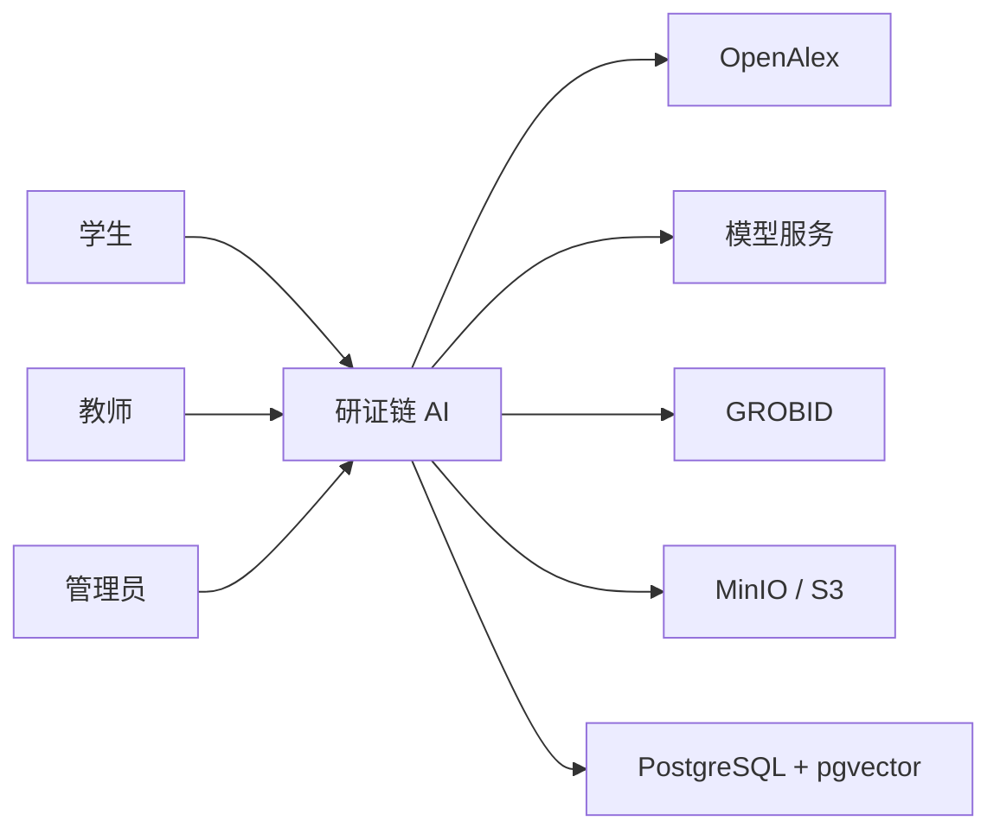
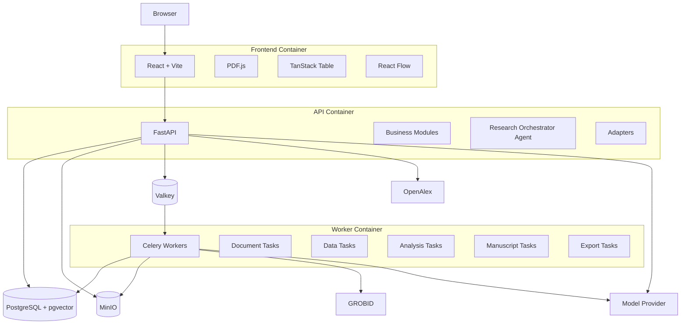

# 研证链 AI（RECA）技术架构文档

> 面向高校科研训练的全流程可信科研智能体
> Research Evidence Chain Agent

---

<!-- DOCUMENT_COMPOSITION_START -->
## 文档组成

本入口文档与其列出的子文档共同构成本领域的正式开发基准。
入口文档负责核心决策、红线和索引，子文档负责详细规范。
两者发生冲突属于文档缺陷，开发者和 Codex 不得自行猜测。

- [SYSTEM_COMPONENTS_AND_MODULES.md](./architecture/SYSTEM_COMPONENTS_AND_MODULES.md)
- [DATA_FLOWS_AND_ADAPTERS.md](./architecture/DATA_FLOWS_AND_ADAPTERS.md)
- [AGENT_ASYNC_AND_DEGRADATION.md](./architecture/AGENT_ASYNC_AND_DEGRADATION.md)
- [OPERATIONS_DEPLOYMENT_AND_ADRS.md](./architecture/OPERATIONS_DEPLOYMENT_AND_ADRS.md)

`archive/` 为非权威历史材料。
<!-- DOCUMENT_COMPOSITION_END -->

## 文档信息

| 项目     | 内容                                                                                                             |
| ------ | -------------------------------------------------------------------------------------------------------------- |
| 文档名称   | `ARCHITECTURE.md`                                                                                              |
| 文档版本   | 1.4.0                                                                                                          |
| 适用项目版本 | RECA 0.1 Competition Edition                                                                                   |
| 文档状态   | Conditional Approval                                                                                          |
| 文档类型   | 技术架构基准                                                                                                         |
| 主要读者   | 架构负责人、后端开发、前端开发、AI 开发、测试人员、运维人员、Codex                                                                          |
| 负责人    | RECA Team                                                                                                      |
| 最后更新时间 | 2026-07-31                                                                                                     |
| 上位文档   | `README.md`、`AGENTS.md`、`PRODUCT_REQUIREMENTS.md`                                                              |
| 关联文档   | `DATA_MODEL_AND_WORKFLOW.md`、`API_AI_TOOL_CONTRACTS.md`、`TEST_AND_ACCEPTANCE.md`、`SECURITY_AND_OPEN_SOURCE.md` |

---

## 变更记录

| 版本    | 日期         | 状态    | 变更说明                                       | 负责人       |
| ----- | ---------- | ----- | ------------------------------------------ | --------- |
| 1.0.0 | 2026-07-29 | Draft | 将原有设计方案、最终开发策略和开源项目方案统一重构为 RECA 0.1 技术架构基准 | RECA Team |
| 1.0.0 | 2026-07-29 | Approved | 确认为 M0 开发前正式基准 | Myles-7 |
| 1.1.0 | 2026-07-30 | Approved | 增加派生项目上下文、阶段解析、显式降级与论文修订漂移架构；保持单总控 Agent 与 M8 接入边界 | RECA Team |
| 1.2.0 | 2026-07-30 | Conditional Approval | 写入 M0 As-Built、当前/目标目录分离、Prompt manifest 与数据访问三层语义 | RECA Team |
| 1.3.0 | 2026-07-31 | Conditional Approval | 同步 effect-first 开源复用与按收益选择 Adapter；核心领域和单 Agent 边界不变 | RECA Team |
| 1.4.0 | 2026-07-31 | Conditional Approval | 正式同步六个开源能力栈、四层架构和统一接入模式；不改变领域、契约或里程碑边界 | RECA Team |

---

# 1. 文档目的

本文档用于统一 RECA 0.1 的技术实现方式，明确：

1. 系统由哪些组件构成；
2. 前端、后端、Worker、数据库和外部服务如何协作；
3. 各业务模块的边界；
4. 外部开源能力如何通过明确的直接、Provider/Adapter、服务、Vendor、资源或参考模式接入；
5. 文献、数据、图表、论文和证据链如何流转；
6. 智能体可以调用哪些能力；
7. 长任务如何异步执行；
8. 文件、数据和运行记录如何保存；
9. 系统故障时如何降级；
10. 后续功能如何扩展而不破坏核心架构。

RECA 0.1 采用“成熟开源能力承担通用基础，自研科研项目状态、证据链、人工确认和跨模块审核”的策略。现有方案已明确，比赛版本应优先跑通“文献—数据—分析—图表—论文—证据链—复现包”主闭环，而不是从零实现 PDF 解析、统计计算、图表引擎和文档格式底层。

---

# 2. 架构权威性

## 2.1 本文档负责的内容

本文档是以下内容的唯一正式基准：

* 技术栈；
* 系统部署形态；
* 服务划分；
* 前后端边界；
* 后端模块边界；
* 适配器接口；
* 异步任务机制；
* 文件和对象存储方式；
* 外部服务接入方式；
* 智能体技术边界；
* 离线和降级策略；
* 关键技术决策。

## 2.2 不由本文档决定的内容

以下内容由其他文档决定：

| 内容                 | 权威文档                          |
| ------------------ | ----------------------------- |
| 做什么、不做什么           | `PRODUCT_REQUIREMENTS.md`     |
| 数据对象、字段和状态机        | `DATA_MODEL_AND_WORKFLOW.md`  |
| API、AI Schema、工具参数 | `API_AI_TOOL_CONTRACTS.md`    |
| 测试和验收标准            | `TEST_AND_ACCEPTANCE.md`      |
| 安全、隐私和许可证          | `SECURITY_AND_OPEN_SOURCE.md` |
| Codex修改规则          | `AGENTS.md`                   |

## 2.3 冲突处理

技术实现冲突按统一权威矩阵处理：当前已实现事实以 Git 与 M0 验收证据为准；模块边界以本文档为准；数据、API、测试、安全和执行顺序分别由其专门权威文档决定。任何请求不得绕过安全、权限、原始不可变、审批或许可证红线。以下是已冻结的技术结论：

* 前端使用 React + Vite，不使用 Next.js；
* 消息队列和缓存使用 Valkey，不使用新版 Redis；
* 采用单总控 Agent，不采用自由多智能体系统；
* GROBID 是 PDF 主解析器，pypdf 是回退；
* PaperQA 不整体接管文献域；允许选择性复用检索、Evidence Packing、Prompt 和测试，但输出必须经过 RECA EvidenceSpan 验证；
* P0 统计范围仅包括描述统计、两组比较、相关和简单线性回归；
* 采用模块化单体，不拆分大量微服务。

## 2.4 M0 As-Built Architecture

M0 已完成于 `79825914c7c975e8be256a5a89abe812f486769e`（`m0-complete`）。已实现的边界是：

* `backend/app/core/config.py` 是单一 Settings 入口；
* `/api/v1/health/live`、`/ready`、`/dependencies` 是真实健康端点；未配置 `MODEL_API_KEY`、`OPENALEX_API_KEY` 时为 `UNCONFIGURED`，健康检查不调用模型或 OpenAlex；
* `backend/app/core/observability.py` 提供 request ID 与结构化、脱敏日志；
* 唯一 Celery App 为 `app.core.celery:celery_app`，唯一任务仅为无业务副作用的 `reca.health_ping`；
* MinIO 仅完成私有对象存储 smoke，GROBID 仅完成内部健康容器；二者尚未构成 Artifact 或 PDF 业务；
* OpenAPI generated client 位于 `frontend/src/api/generated/`，手写错误映射位于 `frontend/src/api/adapter/`，并使用稳定、脱敏的 `ApiError`。

---

# 3. 架构目标

## 3.1 稳定

系统应在比赛演示环境中稳定完成核心链路：

```text
研究问题
→ 文献检索
→ PDF解析
→ 文献矩阵
→ 数据处理
→ 统计分析
→ 图表生成
→ 论文检查
→ 证据链
→ 复现包
```

## 3.2 可追溯

所有关键输出应能够回到：

* 用户；
* 项目；
* 输入文件；
* 数据版本；
* 分析运行；
* 工具调用；
* 模型调用；
* 用户确认；
* 审核结果。

## 3.3 可复现

相同的数据版本、分析参数、代码版本和运行环境，应能够重现相同或数值容差内一致的结果。

## 3.4 可替换

外部能力必须具有明确且可测试的集成边界，使以下组件可替换或可移除：

* 文献数据源；
* PDF 解析器；
* Evidence Retriever；
* Embedding 服务；
* 模型服务；
* 数据质量引擎；
* 统计引擎；
* 图表引擎；
* DOCX 检查器；
* 对象存储。

## 3.5 可测试

业务服务应能通过 Mock Adapter 独立测试，不要求所有外部服务同时启动。

## 3.6 安全受控

* 不执行用户任意代码；
* 不覆盖原始文件；
* 不允许 Agent 越权；
* 不允许未批准的数据修改；
* 不允许模型写入正式统计结果；
* 不默认向模型发送完整敏感数据。

## 3.7 易部署

比赛版支持：

* 一套 Docker Compose；
* 本地运行；
* 云端单机部署；
* 离线演示；
* 数据和模型服务按配置替换。

## 3.8 开发效率

通过复用全栈 FastAPI 模板以及成熟开源项目，减少认证、数据库、容器化、PDF 渲染、统计计算和图表绘制等通用工作，将主要研发投入集中到证据链、人工确认和跨模块一致性审核。

---

# 4. 非目标

RECA 0.1 架构不为以下目标设计：

* 大规模多租户 SaaS；
* 跨地域高可用集群；
* 数百万篇论文检索；
* 超大规模数据仓库；
* 实时多人协同编辑；
* 任意代码执行平台；
* 全功能统计软件；
* 完整在线 Word 编辑器；
* 大型微服务体系；
* 自建学术搜索引擎；
* 自训练 PDF 解析模型；
* 自建通用多智能体框架。

---

# 5. 核心架构原则

## 5.1 模块化单体优先

后端使用一个 FastAPI 应用，业务按模块分离。

优点：

* 统一认证；
* 统一事务；
* 统一日志；
* 统一权限；
* 统一数据模型；
* 减少网络调用；
* 降低部署复杂度；
* 便于 Codex 分模块开发。

## 5.2 独立服务只用于必要能力

独立运行的组件仅包括：

* PostgreSQL + pgvector；
* Valkey；
* MinIO；
* GROBID；
* Celery Worker；
* 前端；
* 可选 Nginx。

不为 literature、datasets、analysis、manuscripts 分别部署独立微服务。

## 5.3 领域模型优先

业务代码不得围绕第三方 SDK 数据结构构建。

第三方返回结果必须转换为 RECA 内部领域模型。

例如：

```text
OpenAlex Work
→ OpenAlexProvider
→ LiteratureRecord

GROBID TEI
→ GrobidTeiAdapter
→ ParsedScholarlyDocument

statsmodels Result
→ StatsmodelsEngine
→ AnalysisResult
```

## 5.4 第三方接入按收益选择边界

RECA 使用以下正式接入方式：

```text
DIRECT_LIBRARY_INTEGRATION
PROVIDER_OR_ADAPTER_INTEGRATION
INDEPENDENT_SERVICE
ISOLATED_SERVICE
SELECTIVE_VENDOR
RESOURCE_SNAPSHOT
DESIGN_REFERENCE
```

选择依据是能力是否可能更换、第三方对象是否污染领域模型、是否需要离线
Mock、是否存在许可证或安全边界、接口复杂度、直接集成能否明显缩短工期，
以及后续维护成本。

- 成熟稳定、接口很小、无替换需求且不污染领域模型的库可以直接集成；
- 外部 API、多实现、离线替代、复杂降级或领域转换使用 Provider 或 Adapter；
- 独立运行、资源密集但边界稳定的能力使用独立服务；
- 特殊许可证、安全边界或进程隔离要求使用隔离服务；
- 只复用经过审查的 Prompt、工作流、脚本或测试时使用 Selective Vendor；
- 固定 CSL 等非代码资源时使用 Resource Snapshot；
- 只借鉴 UX、报告或复现思想时使用 Design Reference。

直接集成不等于 Router 或 Agent 直接操作第三方 SDK。复杂业务仍由 Service
负责权限、事务、状态、版本、审批和审计；第三方对象不得直接成为核心领域
模型，统计结果、EvidenceSpan 和版本关系仍由 RECA 规则控制。

## 5.5 确定性程序优先

所有正式统计数字、图表和文件处理结果必须来自确定性程序。

AI 只负责：

* 规划；
* 推荐；
* 解释；
* 审核。

## 5.6 原始输入不可变

所有原始文件和原始数据版本只读。

处理后生成新 Artifact 或新版本。

## 5.7 人工确认是领域对象

用户确认不是前端按钮状态，而是正式的 `ApprovalRecord`。

## 5.8 异步任务幂等

PDF 解析、批量抽取、数据处理、统计分析、图表生成、DOCX 检查和复现包导出必须幂等。

## 5.9 所有重要结果必须有来源 ID

包括：

* `document_id`；
* `evidence_span_id`；
* `dataset_version_id`；
* `analysis_run_id`；
* `figure_id`；
* `approval_record_id`。

## 5.10 先工具后 Agent

确定性工具完成并通过测试后，才允许接入 Agent。

## 5.11 四层开源能力架构

```text
RECA DOMAIN CORE
├── ResearchProject / ApprovalRecord / AuditResult
├── EvidenceSpan / ClaimEvidenceLink
├── DatasetVersion / AnalysisResult / ReproPackage
└── 跨文献—数据—分析—图表—论文证据链

CAPABILITY INTEGRATION
├── PyAlex Provider、pgvector Repository
├── Pandera、SciPy、statsmodels、Matplotlib
├── python-docx / controlled OOXML
├── PDF.js、TanStack Table、React Flow
└── OpenAI Agents SDK Function Tool wrappers

VENDORED RESEARCH ASSETS
├── selected PaperQA retrieval / Evidence Packing / Prompt / tests
├── selected ARS Workflow / Prompt / Policy Marker / tests
└── selected CSL resource snapshot

EXTERNAL SERVICES
├── GROBID
├── Valkey / Celery Worker
├── MinIO / S3-compatible storage
└── external model and literature APIs
```

上层可以依赖下层提供能力，但下层不得反向拥有 RECA 领域状态。Vendor 资产
必须保留来源和许可证，外部服务必须有超时、降级与离线边界。

---

# 6. 系统上下文

## 6.1 系统参与者

| 参与者    | 作用                    |
| ------ | --------------------- |
| 学生     | 创建项目、上传资料、确认科研决策      |
| 教师     | 查看授权项目、复核证据和分析        |
| 管理员    | 用户、示例项目和服务配置管理        |
| 外部文献服务 | 返回真实文献元数据             |
| 模型服务   | 结构化理解、抽取、解释和审核        |
| 对象存储   | 保存 PDF、数据、DOCX、图表和导出包 |
| GROBID | 学术 PDF 结构解析           |
| Worker | 执行耗时任务                |

## 6.2 系统上下文图



---

# 7. 总体架构

## 7.1 容器级架构



## 7.2 推荐部署单元

| 服务         | 责任                    |
| ---------- | --------------------- |
| `frontend` | Web UI                |
| `api`      | API、业务服务、Agent 编排     |
| `worker`   | 执行异步任务                |
| `postgres` | 业务数据和向量               |
| `valkey`   | Celery Broker、结果状态和缓存 |
| `minio`    | 文件和产物                 |
| `grobid`   | 学术 PDF 解析             |
| `nginx`    | 可选反向代理和静态入口           |

## 7.3 比赛版部署原则

* 一个代码仓库；
* 一套 Docker Compose；
* 一个数据库；
* 一个对象存储；
* 一个 API；
* 一个或多个相同代码镜像的 Worker；
* 不引入 Kubernetes；
* 不引入服务网格；
* 不引入独立消息总线。

---

# 8. 技术栈

## 8.1 技术选型表

| 层级        | 技术                      | 状态 | 选型理由                     |
| --------- | ------------------------- | --- | ------------------------ |
| 前端框架      | React + Vite + TypeScript | IMPLEMENTED_IN_M0 | 复用 FastAPI 全栈模板，开发稳定     |
| 样式与组件     | Tailwind CSS、模板组件体系       | IMPLEMENTED | 快速统一 UI                  |
| 表格        | TanStack Table v8         | IMPLEMENTED | Headless、适合文献矩阵；业务决策仍在后端 |
| PDF 阅读    | PDF.js                    | PLANNED_M2_M3 | 浏览器 PDF 渲染和页码跳转          |
| 证据链画布     | React Flow                | PLANNED_M6_M8 | 节点关系可视化                  |
| 后端        | FastAPI                   | IMPLEMENTED_IN_M0 | 与 Python 科研生态统一          |
| Schema    | Pydantic                  | IMPLEMENTED_IN_M0 | 严格输入输出校验                 |
| ORM       | SQLModel                  | IMPLEMENTED_IN_M0 | 沿用模板并减少模型重复              |
| 数据库       | PostgreSQL                | IMPLEMENTED_IN_M0 | 关系数据、事务和 JSONB           |
| 向量        | pgvector                  | IMPLEMENTED_IN_M0 | 避免单独向量数据库                |
| 数据迁移      | Alembic                   | IMPLEMENTED_IN_M0 | 数据库版本管理                  |
| 对象存储      | MinIO/S3                  | IMPLEMENTED_IN_M0_SMOKE | 文件与数据库分离                 |
| 任务队列      | Celery                    | IMPLEMENTED_IN_M0_SMOKE | 成熟异步任务体系                 |
| Broker/缓存 | Valkey                    | IMPLEMENTED_IN_M0 | Redis 协议兼容、开源许可清晰        |
| PDF 主解析   | GROBID                    | IMPLEMENTED_IN_M0_HEALTHCHECK | 学术论文结构化解析                |
| PDF 回退    | pypdf                     | PLANNED_M2_M3 | 基础页级文本提取                 |
| 文献检索      | PyAlex/OpenAlex           | PLANNED_M2_M3 | 真实开放文献元数据                |
| 文献检索算法    | RECA 混合检索 + PaperQA 选择性资产 | EXPERIMENT_REQUIRED | 只产生候选证据，必须经 EvidenceSpan 验证 |
| 文献筛选建议    | ASReview Provider          | EXPERIMENT_REQUIRED | 只生成阅读优先级，不写 LiteratureDecision |
| 数据质量      | Pandera + 自研规则            | PLANNED_M4_M5 | 通用验证加科研场景规则              |
| 数据处理      | pandas、NumPy              | PLANNED_M4_M5 | 成熟表格处理                   |
| 统计        | SciPy、statsmodels         | PLANNED_M4_M5 | 确定性统计计算                  |
| 图表        | Matplotlib                | PLANNED_M4_M5 | 静态科研图表和代码复现              |
| DOCX      | python-docx + lxml        | PLANNED_M6_M8 | 基础结构与 OOXML 增强           |
| 引用资源      | selected CSL Styles       | PLANNED_M6_M7 | 固定文件、rights、Locale 和哈希 |
| 完整引用引擎    | 隔离 Citation Engine        | EXPERIMENT_REQUIRED | citeproc-js 或替代方案需许可证与隔离决策 |
| 文献管理参考    | Zotero / Web Library       | RESEARCHED | 仅 UX 与交换格式参考，不复制完整产品 |
| AI 编排     | OpenAI Agents SDK         | PLANNED_M8 | 工具调用、Guardrail、Tracing   |
| 研究工作流资产   | selected ARS-Codex assets | EXPERIMENT_REQUIRED | 遵守 ADR-001，不改变单总控 Agent |
| 后端测试      | pytest                    | IMPLEMENTED_IN_M0 | Python 测试生态              |
| 前端 E2E    | Playwright                | IMPLEMENTED_IN_M0 | 模板复用、浏览器流程测试             |
| 部署        | Docker Compose            | IMPLEMENTED_IN_M0 | 易复制、易离线                  |

---

# 9. 当前结构与目标结构

## 9.1 当前 M0 结构

当前工程结构以实际仓库为准。M0 已建立 React/Vite 前端、FastAPI 后端、PostgreSQL/pgvector、Valkey、Celery、MinIO 与 GROBID 的基础 Compose 和健康检查边界。

以下路径是当前冻结事实：

| 能力 | 当前唯一位置 |
| --- | --- |
| Settings | `backend/app/core/config.py` |
| Alembic 迁移 | `backend/app/alembic/` |
| Celery App | `backend/app/core/celery.py`，导入路径 `app.core.celery:celery_app` |
| M0 Celery 任务 | `reca.health_ping` |
| OpenAPI 生成客户端 | `frontend/src/api/generated/` |
| 手写适配器 | `frontend/src/api/adapter/` |

MinIO 当前仅为 `IMPLEMENTED_IN_M0_SMOKE`，GROBID 当前仅为 `IMPLEMENTED_IN_M0_HEALTHCHECK`；两者均不代表 Artifact 或 PDF 正式工作流已经完成。

## 9.2 P0 目标结构

P0 在现有模块化单体中逐步增加项目、文献、证据、数据、分析、图表、论文、导出和 Agent 模块。目标目录描述的是里程碑完成后的组织方式，不得反推为当前已实现能力。

详细的前后端、Worker、数据库、对象存储、模块依赖和边界见 [系统组件与模块](architecture/SYSTEM_COMPONENTS_AND_MODULES.md)。

# 10. 模块化单体与核心模块

RECA 继续采用单 FastAPI 应用的模块化单体。模块通过 Service 和明确契约协作，共享认证、事务、数据库和部署边界；P0 不拆分文献、数据、论文或 Agent 微服务。

核心模块按研究闭环组织：

1. `auth` 与 `projects`：用户、项目、成员和权限。
2. `artifacts`：原始文件、派生产物和血缘。
3. `literature` 与 `documents`：文献元数据、PDF、页面、Chunk 和抽取。
4. `evidence`：EvidenceSpan、Claim 关联和证据图。
5. `datasets`、`analysis` 与 `figures`：版本化数据、确定性分析和图表。
6. `manuscripts` 与 `exports`：论文版本、审核和复现包。
7. `jobs`：异步执行、状态和事件。
8. `agents`：M8 接入的受控单总控 Agent。

依赖方向、事务边界和组件职责的完整定义见 [系统组件与模块](architecture/SYSTEM_COMPONENTS_AND_MODULES.md)。

# 11. 数据流与适配器边界

外部文献 API、可替换 PDF 解析器、对象存储 Provider、模型服务和其他复杂
边界通过 Adapter Protocol 转换为 RECA 内部 Schema。成熟小型库可以按
`DIRECT_LIBRARY_INTEGRATION` 使用；外部 API 使用
`PROVIDER_OR_ADAPTER_INTEGRATION`；独立运行时、特殊许可证和选择性资产分别
使用 `INDEPENDENT_SERVICE`、`ISOLATED_SERVICE` 或 `SELECTIVE_VENDOR`。
固定非代码资源使用 `RESOURCE_SNAPSHOT`，只借鉴设计使用 `DESIGN_REFERENCE`。
无论方式如何，外部响应不得直接成为领域
事实，第三方结构不得泄漏为持久化核心契约。

通用能力尽量复用；RECA 自研重点集中在项目状态、EvidenceSpan、版本血缘、
ClaimEvidenceLink、审核规则和跨文献—数据—分析—图表—论文证据链。

文献、PDF、数据、分析、图表、DOCX 和 Evidence 的完整数据流，以及外部服务转换边界，见 [数据流与适配器](architecture/DATA_FLOWS_AND_ADAPTERS.md)。

# 12. Agent、异步任务与降级

## 12.1 Agent 总体边界

RECA 只采用一个受控的 `ResearchOrchestrator`：

`StageResolver → ProjectContextSnapshotBuilder → PromptRegistry → ToolPolicy → ApprovalPolicy → ModelDataPolicy → AuditPolicy → ResponseComposer`

数据库是业务状态的唯一事实来源。`ProjectContextSnapshot` 是从数据库重建的只读查询 DTO，不能反向覆盖领域对象；`AgentRun` 必须记录快照 Schema、修订号、哈希和来源版本。

Prompt 治理在 M1 建立，清单位置为 `backend/app/agents/prompts/prompt-manifest.yaml`；M8 消费该治理并接入正式 Agent 运行时。M8 之前不得接入正式 Agent，不引入自由多 Agent。

M8 计划使用 OpenAI Agents SDK 提供 Runner、Function Tool、HITL、结构化
输出、usage 和受控 tracing。SDK Session 不是 ResearchProject，SDK Trace
不是 AuditLog。经 ADR-001 审查的 ARS 资产只能通过 RECA Prompt manifest、
StageResolver、Tool Policy、Approval 和 Evidence 规则接入。

Agent 只提出结构化建议并调用白名单 Tool；Tool 必须通过 Service、权限、项目隔离、审批和审计。正式统计数字与图表只能由确定性程序产生，模型不得替代计算。

## 12.2 异步与降级

耗时流程使用 Job、ProcessingRun、唯一 Celery App 和 SSE/轮询反馈。失败、回退和离线模式必须显式记录，不能把不可用能力显示为成功。

完整契约见 [Agent、异步与降级](architecture/AGENT_ASYNC_AND_DEGRADATION.md)。

# 13. 运维、部署与架构决策

Compose、网络、配置、日志、缓存、健康检查、部署、备份、恢复、性能、扩展、架构测试和风险见 [运维、部署与 ADR](architecture/OPERATIONS_DEPLOYMENT_AND_ADRS.md)。

## 13.1 ADR 索引

| ID | 决策摘要 |
| --- | --- |
| [DEC-001](architecture/OPERATIONS_DEPLOYMENT_AND_ADRS.md#dec-001) | React/Vite 而不是 Next.js |
| [DEC-002](architecture/OPERATIONS_DEPLOYMENT_AND_ADRS.md#dec-002) | 采用模块化单体 |
| [DEC-003](architecture/OPERATIONS_DEPLOYMENT_AND_ADRS.md#dec-003) | 使用 Valkey |
| [DEC-004](architecture/OPERATIONS_DEPLOYMENT_AND_ADRS.md#dec-004) | 单总控 Agent |
| [DEC-005](architecture/OPERATIONS_DEPLOYMENT_AND_ADRS.md#dec-005) | GROBID 为主解析器 |
| [DEC-006](architecture/OPERATIONS_DEPLOYMENT_AND_ADRS.md#dec-006) | PaperQA 不整体接入 |
| [DEC-007](architecture/OPERATIONS_DEPLOYMENT_AND_ADRS.md#dec-007) | PostgreSQL + pgvector |
| [DEC-008](architecture/OPERATIONS_DEPLOYMENT_AND_ADRS.md#dec-008) | 原始文件不可变 |
| [DEC-009](architecture/OPERATIONS_DEPLOYMENT_AND_ADRS.md#dec-009) | AI 输出必须结构化 |
| [DEC-010](architecture/OPERATIONS_DEPLOYMENT_AND_ADRS.md#dec-010) | 统计结果只来自确定性程序 |
| [DEC-011](architecture/OPERATIONS_DEPLOYMENT_AND_ADRS.md#dec-011) | 图数据库不进入 P0 |
| [DEC-012](architecture/OPERATIONS_DEPLOYMENT_AND_ADRS.md#dec-012) | 快速工具自动归属轻量项目 |
| [ADR-002](decisions/ADR-002-OPEN-SOURCE-INTEGRATION-MODES.md) | 开源接入模式与直接/Adapter 边界 |
| [ADR-003](decisions/ADR-003-LITERATURE-EVIDENCE-STACK.md) | 文献与候选证据能力栈 |
| [ADR-004](decisions/ADR-004-DATA-STATISTICS-STACK.md) | 数据质量、统计与图表能力栈 |
| [ADR-005](decisions/ADR-005-MANUSCRIPT-CITATION-STACK.md) | DOCX 与引用能力栈 |
| [ADR-006](decisions/ADR-006-RESEARCH-WORKBENCH-UX.md) | 科研工作台 UX 能力栈 |
| [ADR-007](decisions/ADR-007-AGENT-WORKFLOW-STACK.md) | Agent SDK 与 ARS 工作流能力栈 |
| [ADR-008](decisions/ADR-008-IMPLEMENTATION-METADATA.md) | 第三方实施与来源元数据 |

# 14. 子架构文档导航

本入口文档与以下子文档共同构成架构领域的正式开发基准：

[系统组件与模块](architecture/SYSTEM_COMPONENTS_AND_MODULES.md)
[数据流与适配器](architecture/DATA_FLOWS_AND_ADAPTERS.md)
[Agent、异步与降级](architecture/AGENT_ASYNC_AND_DEGRADATION.md)
[运维、部署与 ADR](architecture/OPERATIONS_DEPLOYMENT_AND_ADRS.md)

入口文档负责核心决策、红线和索引，子文档负责详细规范。两者发生冲突属于文档缺陷，开发者和 Codex 不得自行猜测。

# 15. 架构结论

RECA 以 Full Stack FastAPI Template 为工程底座，以 React/Vite 构建科研工作台，以 FastAPI 模块化单体承载业务，以 PostgreSQL + pgvector 保存关系数据和文献向量，以 MinIO 保存原始文件和派生产物，以 Celery + Valkey 执行异步任务，以 GROBID 解析学术 PDF，并由确定性科研工具和受控单总控 Agent 分工完成可信科研闭环。
