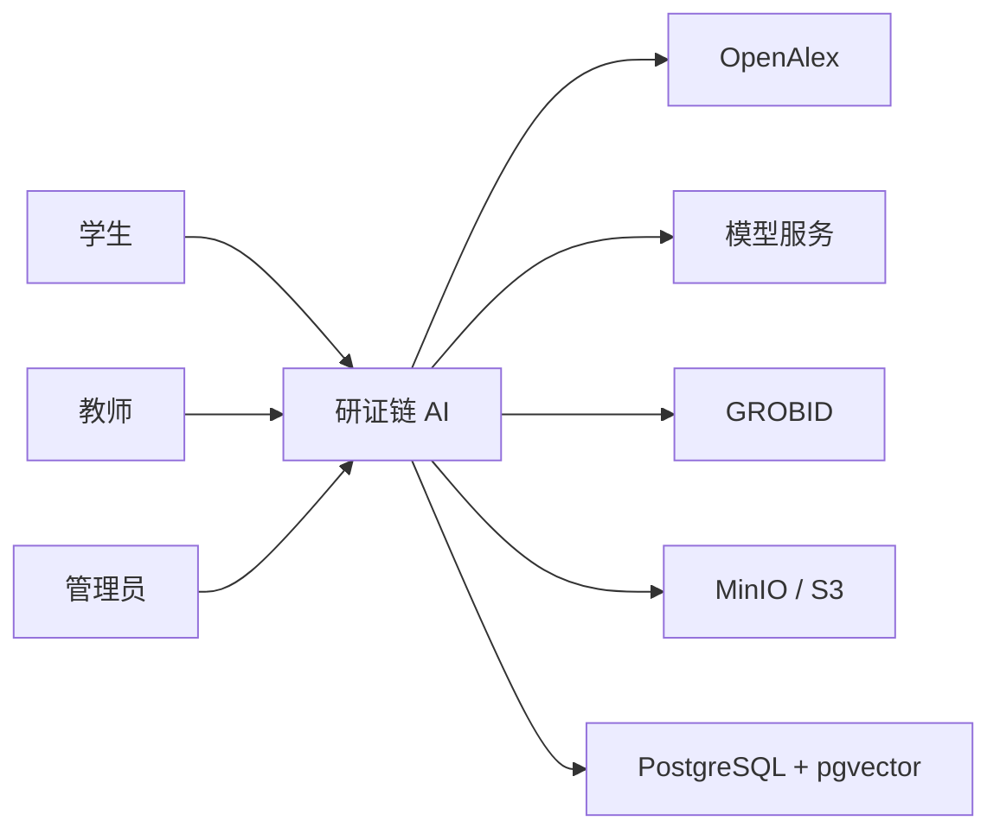
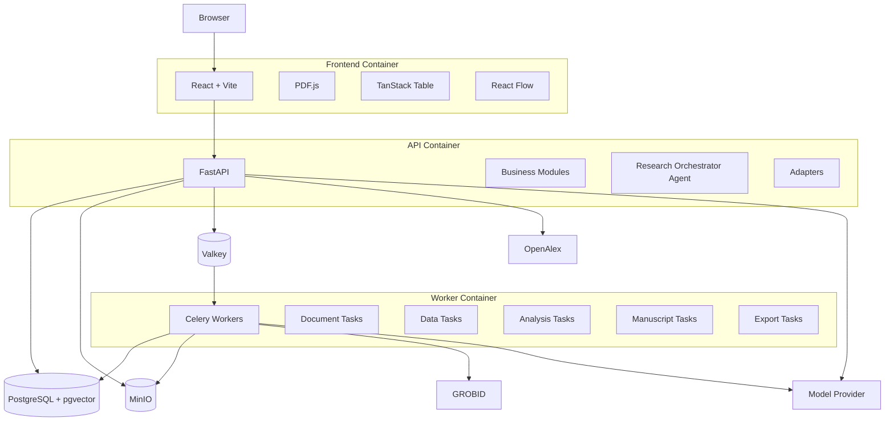
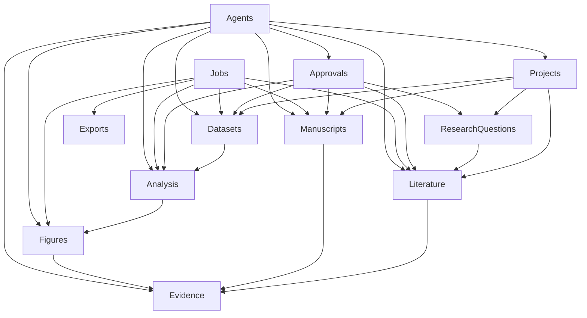
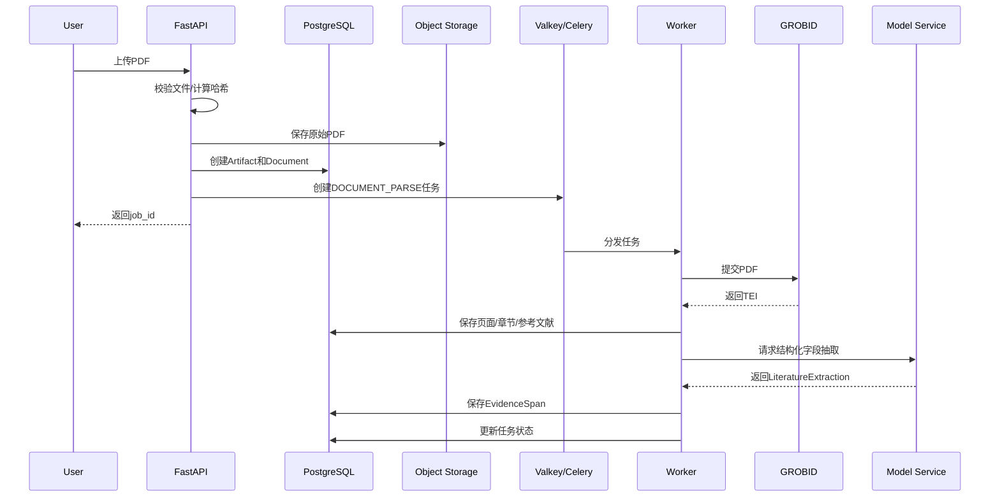
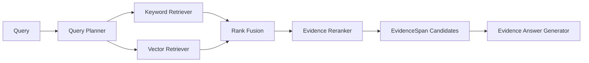
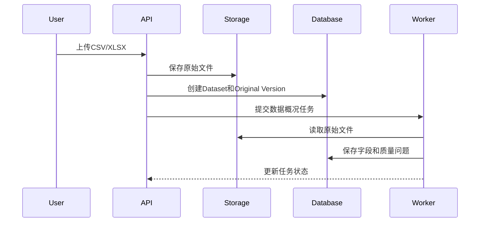
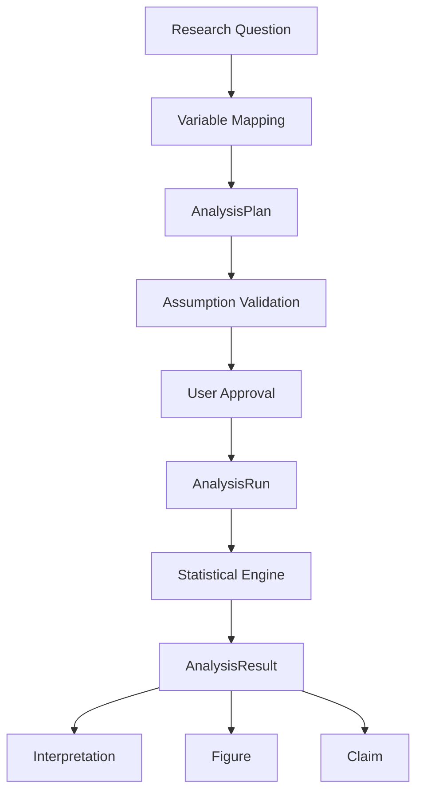
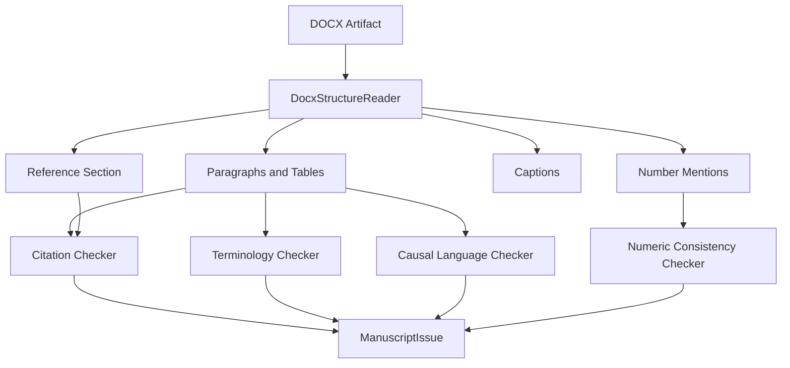
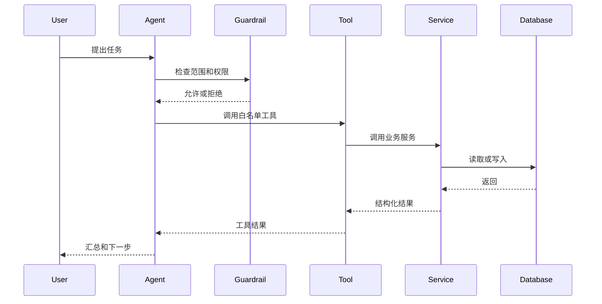
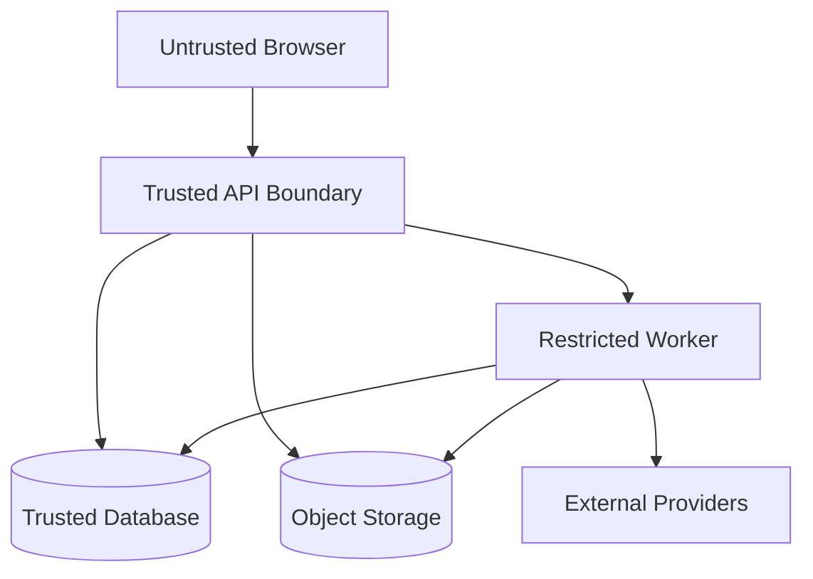

# 研证链 AI（RECA）技术架构文档

> 面向高校科研训练的全流程可信科研智能体
> Research Evidence Chain Agent

---

## 文档信息

| 项目     | 内容                                                                                                             |
| ------ | -------------------------------------------------------------------------------------------------------------- |
| 文档名称   | `ARCHITECTURE.md`                                                                                              |
| 文档版本   | 1.0.0                                                                                                          |
| 适用项目版本 | RECA 0.1 Competition Edition                                                                                   |
| 文档状态   | Approved                                                                                                       |
| 文档类型   | 技术架构基准                                                                                                         |
| 主要读者   | 架构负责人、后端开发、前端开发、AI 开发、测试人员、运维人员、Codex                                                                          |
| 负责人    | RECA Team                                                                                                      |
| 最后更新时间 | 2026-07-29                                                                                                     |
| 上位文档   | `README.md`、`AGENTS.md`、`PRODUCT_REQUIREMENTS.md`                                                              |
| 关联文档   | `DATA_MODEL_AND_WORKFLOW.md`、`API_AI_TOOL_CONTRACTS.md`、`TEST_AND_ACCEPTANCE.md`、`SECURITY_AND_OPEN_SOURCE.md` |

---

## 变更记录

| 版本    | 日期         | 状态    | 变更说明                                       | 负责人       |
| ----- | ---------- | ----- | ------------------------------------------ | --------- |
| 1.0.0 | 2026-07-29 | Draft | 将原有设计方案、最终开发策略和开源项目方案统一重构为 RECA 0.1 技术架构基准 | RECA Team |
| 1.0.0 | 2026-07-29 | Approved | 确认为 M0 开发前正式基准 | Myles-7 |

---

# 1. 文档目的

本文档用于统一 RECA 0.1 的技术实现方式，明确：

1. 系统由哪些组件构成；
2. 前端、后端、Worker、数据库和外部服务如何协作；
3. 各业务模块的边界；
4. 外部开源能力如何通过适配器接入；
5. 文献、数据、图表、论文和证据链如何流转；
6. 智能体可以调用哪些能力；
7. 长任务如何异步执行；
8. 文件、数据和运行记录如何保存；
9. 系统故障时如何降级；
10. 后续功能如何扩展而不破坏核心架构。

RECA 0.1 采用“成熟开源能力承担通用基础，自研科研项目状态、证据链、人工确认和跨模块审核”的策略。现有方案已明确，比赛版本应优先跑通“文献—数据—分析—图表—论文—证据链—复现包”主闭环，而不是从零实现 PDF 解析、统计计算、图表引擎和文档格式底层。

---

# 2. 架构权威性

## 2.1 本文档负责的内容

本文档是以下内容的唯一正式基准：

* 技术栈；
* 系统部署形态；
* 服务划分；
* 前后端边界；
* 后端模块边界；
* 适配器接口；
* 异步任务机制；
* 文件和对象存储方式；
* 外部服务接入方式；
* 智能体技术边界；
* 离线和降级策略；
* 关键技术决策。

## 2.2 不由本文档决定的内容

以下内容由其他文档决定：

| 内容                 | 权威文档                          |
| ------------------ | ----------------------------- |
| 做什么、不做什么           | `PRODUCT_REQUIREMENTS.md`     |
| 数据对象、字段和状态机        | `DATA_MODEL_AND_WORKFLOW.md`  |
| API、AI Schema、工具参数 | `API_AI_TOOL_CONTRACTS.md`    |
| 测试和验收标准            | `TEST_AND_ACCEPTANCE.md`      |
| 安全、隐私和许可证          | `SECURITY_AND_OPEN_SOURCE.md` |
| Codex修改规则          | `AGENTS.md`                   |

## 2.3 冲突处理

当历史文档与本文档发生冲突时，以下技术结论为最终结论：

* 前端使用 React + Vite，不使用 Next.js；
* 消息队列和缓存使用 Valkey，不使用新版 Redis；
* 采用单总控 Agent，不采用自由多智能体系统；
* GROBID 是 PDF 主解析器，pypdf 是回退；
* PaperQA 仅用于研究检索链路，不作为完整运行时产品依赖；
* P0 统计范围仅包括描述统计、两组比较、相关和简单线性回归；
* 采用模块化单体，不拆分大量微服务。

---

# 3. 架构目标

## 3.1 稳定

系统应在比赛演示环境中稳定完成核心链路：

```text
研究问题
→ 文献检索
→ PDF解析
→ 文献矩阵
→ 数据处理
→ 统计分析
→ 图表生成
→ 论文检查
→ 证据链
→ 复现包
```

## 3.2 可追溯

所有关键输出应能够回到：

* 用户；
* 项目；
* 输入文件；
* 数据版本；
* 分析运行；
* 工具调用；
* 模型调用；
* 用户确认；
* 审核结果。

## 3.3 可复现

相同的数据版本、分析参数、代码版本和运行环境，应能够重现相同或数值容差内一致的结果。

## 3.4 可替换

外部能力必须通过适配器接入，使以下组件可替换：

* 文献数据源；
* PDF 解析器；
* Evidence Retriever；
* Embedding 服务；
* 模型服务；
* 数据质量引擎；
* 统计引擎；
* 图表引擎；
* DOCX 检查器；
* 对象存储。

## 3.5 可测试

业务服务应能通过 Mock Adapter 独立测试，不要求所有外部服务同时启动。

## 3.6 安全受控

* 不执行用户任意代码；
* 不覆盖原始文件；
* 不允许 Agent 越权；
* 不允许未批准的数据修改；
* 不允许模型写入正式统计结果；
* 不默认向模型发送完整敏感数据。

## 3.7 易部署

比赛版支持：

* 一套 Docker Compose；
* 本地运行；
* 云端单机部署；
* 离线演示；
* 数据和模型服务按配置替换。

## 3.8 开发效率

通过复用全栈 FastAPI 模板以及成熟开源项目，减少认证、数据库、容器化、PDF 渲染、统计计算和图表绘制等通用工作，将主要研发投入集中到证据链、人工确认和跨模块一致性审核。

---

# 4. 非目标

RECA 0.1 架构不为以下目标设计：

* 大规模多租户 SaaS；
* 跨地域高可用集群；
* 数百万篇论文检索；
* 超大规模数据仓库；
* 实时多人协同编辑；
* 任意代码执行平台；
* 全功能统计软件；
* 完整在线 Word 编辑器；
* 大型微服务体系；
* 自建学术搜索引擎；
* 自训练 PDF 解析模型；
* 自建通用多智能体框架。

---

# 5. 核心架构原则

## 5.1 模块化单体优先

后端使用一个 FastAPI 应用，业务按模块分离。

优点：

* 统一认证；
* 统一事务；
* 统一日志；
* 统一权限；
* 统一数据模型；
* 减少网络调用；
* 降低部署复杂度；
* 便于 Codex 分模块开发。

## 5.2 独立服务只用于必要能力

独立运行的组件仅包括：

* PostgreSQL + pgvector；
* Valkey；
* MinIO；
* GROBID；
* Celery Worker；
* 前端；
* 可选 Nginx。

不为 literature、datasets、analysis、manuscripts 分别部署独立微服务。

## 5.3 领域模型优先

业务代码不得围绕第三方 SDK 数据结构构建。

第三方返回结果必须转换为 RECA 内部领域模型。

例如：

```text
OpenAlex Work
→ OpenAlexProvider
→ LiteratureRecord

GROBID TEI
→ GrobidTeiAdapter
→ ParsedScholarlyDocument

statsmodels Result
→ StatsmodelsEngine
→ AnalysisResult
```

## 5.4 适配器隔离

业务服务只能依赖抽象接口，不直接依赖具体第三方库。

错误示例：

```python
from pyalex import Works

def search_literature(...):
    return Works().search(...)
```

推荐方式：

```python
class LiteratureProvider(Protocol):
    async def search(self, query: QueryPlan) -> list[LiteratureRecord]:
        ...
```

## 5.5 确定性程序优先

所有正式统计数字、图表和文件处理结果必须来自确定性程序。

AI 只负责：

* 规划；
* 推荐；
* 解释；
* 审核。

## 5.6 原始输入不可变

所有原始文件和原始数据版本只读。

处理后生成新 Artifact 或新版本。

## 5.7 人工确认是领域对象

用户确认不是前端按钮状态，而是正式的 `ApprovalRecord`。

## 5.8 异步任务幂等

PDF 解析、批量抽取、数据处理、统计分析、图表生成、DOCX 检查和复现包导出必须幂等。

## 5.9 所有重要结果必须有来源 ID

包括：

* `document_id`；
* `evidence_span_id`；
* `dataset_version_id`；
* `analysis_run_id`；
* `figure_id`；
* `approval_record_id`。

## 5.10 先工具后 Agent

确定性工具完成并通过测试后，才允许接入 Agent。

---

# 6. 系统上下文

## 6.1 系统参与者

| 参与者    | 作用                    |
| ------ | --------------------- |
| 学生     | 创建项目、上传资料、确认科研决策      |
| 教师     | 查看授权项目、复核证据和分析        |
| 管理员    | 用户、示例项目和服务配置管理        |
| 外部文献服务 | 返回真实文献元数据             |
| 模型服务   | 结构化理解、抽取、解释和审核        |
| 对象存储   | 保存 PDF、数据、DOCX、图表和导出包 |
| GROBID | 学术 PDF 结构解析           |
| Worker | 执行耗时任务                |

## 6.2 系统上下文图



---

# 7. 总体架构

## 7.1 容器级架构



## 7.2 推荐部署单元

| 服务         | 责任                    |
| ---------- | --------------------- |
| `frontend` | Web UI                |
| `api`      | API、业务服务、Agent 编排     |
| `worker`   | 执行异步任务                |
| `postgres` | 业务数据和向量               |
| `valkey`   | Celery Broker、结果状态和缓存 |
| `minio`    | 文件和产物                 |
| `grobid`   | 学术 PDF 解析             |
| `nginx`    | 可选反向代理和静态入口           |

## 7.3 比赛版部署原则

* 一个代码仓库；
* 一套 Docker Compose；
* 一个数据库；
* 一个对象存储；
* 一个 API；
* 一个或多个相同代码镜像的 Worker；
* 不引入 Kubernetes；
* 不引入服务网格；
* 不引入独立消息总线。

---

# 8. 技术栈

## 8.1 技术选型表

| 层级        | 最终技术                      | 选型理由                     |
| --------- | ------------------------- | ------------------------ |
| 前端框架      | React + Vite + TypeScript | 复用 FastAPI 全栈模板，开发稳定     |
| 样式与组件     | Tailwind CSS、模板组件体系       | 快速统一 UI                  |
| 表格        | TanStack Table v8         | Headless、适合文献矩阵          |
| PDF 阅读    | PDF.js                    | 浏览器 PDF 渲染和页码跳转          |
| 证据链画布     | React Flow                | 节点关系可视化                  |
| 后端        | FastAPI                   | 与 Python 科研生态统一          |
| Schema    | Pydantic                  | 严格输入输出校验                 |
| ORM       | SQLModel                  | 沿用模板并减少模型重复              |
| 数据库       | PostgreSQL                | 关系数据、事务和 JSONB           |
| 向量        | pgvector                  | 避免单独向量数据库                |
| 数据迁移      | Alembic                   | 数据库版本管理                  |
| 对象存储      | MinIO/S3                  | 文件与数据库分离                 |
| 任务队列      | Celery                    | 成熟异步任务体系                 |
| Broker/缓存 | Valkey                    | Redis 协议兼容、开源许可清晰        |
| PDF 主解析   | GROBID                    | 学术论文结构化解析                |
| PDF 回退    | pypdf                     | 基础页级文本提取                 |
| 文献检索      | PyAlex/OpenAlex           | 真实开放文献元数据                |
| 文献检索算法    | 自研混合检索链                   | 与 RECA EvidenceSpan 模型一致 |
| 数据质量      | Pandera + 自研规则            | 通用验证加科研场景规则              |
| 数据处理      | pandas、NumPy              | 成熟表格处理                   |
| 统计        | SciPy、statsmodels         | 确定性统计计算                  |
| 图表        | Matplotlib                | 静态科研图表和代码复现              |
| DOCX      | python-docx + lxml        | 基础结构与 OOXML 增强           |
| AI 编排     | OpenAI Agents SDK         | 工具调用、Guardrail、Tracing   |
| 后端测试      | pytest                    | Python 测试生态              |
| 前端 E2E    | Playwright                | 模板复用、浏览器流程测试             |
| 部署        | Docker Compose            | 易复制、易离线                  |

---

# 9. 仓库结构

```text
reca/
├── README.md
├── AGENTS.md
├── LICENSE
├── THIRD_PARTY_NOTICES.md
├── docker-compose.yml
├── .env.example
│
├── frontend/
│   ├── src/
│   │   ├── app/
│   │   ├── routes/
│   │   ├── features/
│   │   │   ├── projects/
│   │   │   ├── research-questions/
│   │   │   ├── literature/
│   │   │   ├── datasets/
│   │   │   ├── analysis/
│   │   │   ├── figures/
│   │   │   ├── manuscripts/
│   │   │   ├── evidence/
│   │   │   ├── approvals/
│   │   │   └── jobs/
│   │   ├── components/
│   │   ├── api/
│   │   ├── hooks/
│   │   ├── schemas/
│   │   ├── state/
│   │   └── vendor-integrations/
│   │       ├── pdfjs/
│   │       ├── tanstack/
│   │       └── xyflow/
│   └── tests/
│
├── backend/
│   ├── app/
│   │   ├── main.py
│   │   ├── api/
│   │   ├── core/
│   │   │   ├── config.py
│   │   │   ├── security.py
│   │   │   ├── logging.py
│   │   │   ├── database.py
│   │   │   └── celery.py
│   │   ├── domain/
│   │   │   ├── enums.py
│   │   │   ├── errors.py
│   │   │   └── protocols.py
│   │   ├── modules/
│   │   │   ├── projects/
│   │   │   ├── research_questions/
│   │   │   ├── artifacts/
│   │   │   ├── literature/
│   │   │   ├── datasets/
│   │   │   ├── analysis/
│   │   │   ├── figures/
│   │   │   ├── manuscripts/
│   │   │   ├── evidence/
│   │   │   ├── approvals/
│   │   │   ├── jobs/
│   │   │   ├── agents/
│   │   │   └── exports/
│   │   ├── services/
│   │   ├── adapters/
│   │   │   ├── openalex/
│   │   │   ├── grobid/
│   │   │   ├── pypdf/
│   │   │   ├── retrieval/
│   │   │   ├── pandera/
│   │   │   ├── statistics/
│   │   │   ├── matplotlib/
│   │   │   ├── docx/
│   │   │   ├── object_storage/
│   │   │   └── model_provider/
│   │   ├── tools/
│   │   ├── agents/
│   │   ├── quality_rules/
│   │   ├── chart_templates/
│   │   ├── manuscript_rules/
│   │   ├── ooxml_helpers/
│   │   ├── workers/
│   │   └── shared/
│   ├── migrations/
│   └── tests/
│
├── tests/
│   ├── fixtures/
│   ├── golden/
│   ├── integration/
│   └── e2e/
│
├── docs/
│   ├── PRODUCT_REQUIREMENTS.md
│   ├── ARCHITECTURE.md
│   ├── DATA_MODEL_AND_WORKFLOW.md
│   ├── API_AI_TOOL_CONTRACTS.md
│   ├── TEST_AND_ACCEPTANCE.md
│   ├── SECURITY_AND_OPEN_SOURCE.md
│   └── archive/
│
├── vendor/
│   ├── csl/
│   └── licenses/
│
└── scripts/
```

---

# 10. 前端架构

## 10.1 前端目标

前端不是聊天机器人界面，而是科研工作台。

聊天或 Agent 面板仅用于：

* 下一步建议；
* 信息补充；
* 任务规划；
* 解释结果；
* 发起确认。

正式科研数据主要通过结构化页面展示。

## 10.2 前端模块

### 项目模块

负责：

* 项目列表；
* 创建项目；
* 项目总览；
* 项目阶段；
* 待办事项；
* 最近操作。

### 研究问题模块

负责：

* 原始研究想法；
* 结构化字段；
* 版本历史；
* 用户确认。

### 文献模块

负责：

* 查询规划；
* 搜索结果；
* 文献矩阵；
* 文献决策；
* PDF 原文；
* EvidenceSpan；
* 共识争议。

### 数据模块

负责：

* 数据上传；
* 数据身份证；
* 数据预览；
* 字段字典；
* 数据版本；
* 数据质量；
* CleaningPlan。

### 分析模块

负责：

* AnalysisPlan；
* 前提检查；
* 分析运行；
* 结构化结果；
* 运行日志。

### 图表模块

负责：

* 图表推荐；
* 变量选择；
* 图表预览；
* 图表规范检查；
* 导出。

### 论文模块

负责：

* DOCX 上传；
* 问题清单；
* 原文定位；
* 证据展示；
* 采纳或驳回。

### 证据链模块

负责：

* 图谱；
* 节点详情；
* 风险筛选；
* 证据范围；
* 完整度。

## 10.3 状态管理

前端状态分为三类：

### 服务端状态

使用查询缓存管理：

* 项目；
* 文献；
* 数据版本；
* Job；
* 分析结果；
* 论文问题。

推荐通过模板现有查询方案或 TanStack Query 管理。

### 页面状态

例如：

* 当前选中行；
* 表格筛选；
* PDF 当前页；
* 图谱缩放；
* 面板展开状态。

### 表单状态

例如：

* 研究问题编辑；
* 数据身份证；
* 分析计划；
* 图表参数。

不得将业务权威状态只保存在前端。

## 10.4 自动生成 API Client

前端 API Client 应根据 OpenAPI 自动生成。

禁止手工维护大量重复类型。

## 10.5 PDF.js 集成边界

PDF.js 负责：

* PDF 渲染；
* 页码导航；
* 文本层；
* 页面搜索；
* 坐标高亮。

RECA 前端负责：

* 文献 ID；
* EvidenceSpan；
* 证据状态；
* 高亮样式；
* 用户确认；
* 与矩阵联动。

## 10.6 React Flow 集成边界

React Flow 只负责：

* 节点布局；
* 连线；
* 缩放；
* 拖动；
* 交互。

图谱数据必须来自后端。

前端不得自行推断证据关系。

## 10.7 前端权限

前端可隐藏无权限按钮，但后端必须再次校验。

前端权限不能替代后端权限。

## 10.8 前端错误处理

所有 API 错误统一进入：

* 页面错误提示；
* 可重试状态；
* 请求 ID 展示；
* 不破坏当前页面数据。

---

# 11. 后端总体分层

## 11.1 分层结构

```text
API Layer
    ↓
Application Service
    ↓
Domain Model / Policy
    ↓
Repository / Adapter
    ↓
Database / External Service
```

## 11.2 API 层

负责：

* 认证；
* 参数校验；
* 权限检查；
* 调用 Service；
* 返回 DTO；
* HTTP 状态码；
* 请求 ID。

不得：

* 执行统计；
* 直接解析 PDF；
* 直接访问第三方 SDK；
* 直接写复杂业务事务。

## 11.3 Application Service

负责具体用例，例如：

* 创建项目；
* 上传文献；
* 批准清洗计划；
* 创建 AnalysisPlan；
* 启动 AnalysisRun；
* 生成复现包。

Service 负责：

* 业务规则；
* 事务边界；
* 状态转换；
* 权限；
* 审计；
* 调用 Adapter；
* 创建 Job。

## 11.4 Domain 层

负责：

* 领域枚举；
* 领域错误；
* 状态机规则；
* 不变量；
* 接口协议；
* 证据关系规则。

## 11.5 Repository 层

负责：

* 数据库持久化；
* 查询；
* 乐观锁；
* 分页；
* 项目隔离。

## 11.6 Adapter 层

负责将外部能力转换为内部领域结构。

## 11.7 Worker 层

负责耗时任务：

* PDF 解析；
* 文献抽取；
* Embedding；
* 数据质量；
* 数据转换；
* 统计分析；
* 图表生成；
* DOCX 检查；
* 复现包导出。

---

# 12. 后端业务模块

## 12.1 Projects 模块

负责：

* ResearchProject；
* ProjectMember；
* 项目阶段；
* 项目总览；
* 项目归档；
* 权限。

不得直接实现：

* 文献解析；
* 数据分析；
* 图表生成。

## 12.2 Research Questions 模块

负责：

* ResearchQuestion；
* ResearchQuestionVersion；
* 结构化问题；
* 用户确认；
* 版本影响分析。

## 12.3 Artifacts 模块

负责所有文件和产物：

* 上传；
* 哈希；
* MIME；
* 对象存储路径；
* 版本；
* 来源；
* 下载；
* 软删除；
* 完整性检查。

## 12.4 Literature 模块

负责：

* LiteratureRecord；
* Document；
* DocumentPage；
* DocumentChunk；
* LiteratureExtraction；
* LiteratureDecision；
* EvidenceSpan；
* 文献矩阵；
* 当前证据集合分析。

## 12.5 Datasets 模块

负责：

* Dataset；
* DatasetVersion；
* DatasetColumn；
* DataQualityIssue；
* CleaningPlan；
* DataTransformation；
* 数据身份证；
* 数据血缘。

## 12.6 Analysis 模块

负责：

* AnalysisPlan；
* 前提检查；
* 用户批准；
* AnalysisRun；
* AnalysisResult；
* CodeArtifact；
* 结果失效。

## 12.7 Figures 模块

负责：

* Figure；
* 图表参数；
* 图注；
* 图表规范；
* 图表版本；
* 图像 Artifact；
* 绘图代码 Artifact。

## 12.8 Manuscripts 模块

负责：

* Manuscript；
* ManuscriptVersion；
* ManuscriptIssue；
* 引用匹配；
* 数字检查；
* 因果语言；
* 术语；
* 低风险修复。

## 12.9 Evidence 模块

负责：

* Claim；
* ClaimEvidenceLink；
* EvidenceGraph；
* AuditResult；
* 完整度；
* 失效传播。

## 12.10 Approvals 模块

负责：

* ApprovalRecord；
* 审批对象；
* 审批内容；
* 状态；
* 操作人；
* 到期；
* 撤销。

## 12.11 Jobs 模块

负责：

* Job；
* 进度；
* 状态；
* 重试；
* 取消；
* 错误；
* Worker 关联；
* SSE 输出。

## 12.12 Agents 模块

负责：

* AgentRun；
* ModelInvocation；
* ToolCall；
* Agent 上下文；
* Guardrail；
* 工具权限；
* 追踪。

## 12.13 Exports 模块

负责：

* Export；
* ReproPackage；
* manifest；
* 文件收集；
* 敏感信息检查；
* ZIP 打包。

---

# 13. 模块依赖规则

## 13.1 推荐依赖方向



## 13.2 禁止循环依赖

业务模块之间不得直接形成 Python import 循环。

跨模块访问应通过：

* Application Service；
* Protocol；
* Query Service；
* 领域事件；
* 共享 ID。

## 13.3 Shared 模块限制

`shared/` 只允许放置：

* 时间工具；
* ID；
* 哈希；
* 分页；
* 通用错误；
* 通用 DTO；
* 日志上下文。

不得把具体业务逻辑放入 `shared/`。

---

# 14. 适配器层

## 14.1 文献数据源接口

```python
class LiteratureProvider(Protocol):
    async def search(
        self,
        query_plan: QueryPlan,
    ) -> list[LiteratureRecordDTO]:
        ...

    async def get_by_doi(
        self,
        doi: str,
    ) -> LiteratureRecordDTO | None:
        ...

    async def verify(
        self,
        record: LiteratureRecordDTO,
    ) -> LiteratureVerificationResult:
        ...
```

P0 实现：

```text
OpenAlexLiteratureProvider
CachedLiteratureProvider
```

## 14.2 学术文档解析接口

```python
class ScholarlyDocumentParser(Protocol):
    async def parse(
        self,
        artifact: ArtifactReference,
    ) -> ParsedScholarlyDocument:
        ...
```

实现：

```text
GrobidDocumentParser
PypdfFallbackParser
```

## 14.3 Evidence Retriever 接口

```python
class EvidenceRetriever(Protocol):
    async def retrieve(
        self,
        project_id: UUID,
        query: str,
        document_ids: list[UUID],
        top_k: int,
    ) -> list[EvidenceCandidate]:
        ...
```

P0 实现：

```text
HybridEvidenceRetriever
├── KeywordRetriever
├── VectorRetriever
├── ReciprocalRankFusion
└── EvidenceReranker
```

## 14.4 数据质量接口

```python
class DatasetProfiler(Protocol):
    async def profile(
        self,
        dataset_version_id: UUID,
    ) -> DatasetProfileResult:
        ...
```

实现：

```text
PanderaDatasetProfiler
```

## 14.5 统计引擎接口

```python
class StatisticalEngine(Protocol):
    async def run(
        self,
        analysis_plan: AnalysisPlanDTO,
    ) -> AnalysisResultDTO:
        ...
```

实现：

```text
ScipyStatsmodelsEngine
```

## 14.6 图表引擎接口

```python
class FigureRenderer(Protocol):
    async def render(
        self,
        figure_plan: FigurePlanDTO,
    ) -> FigureRenderResult:
        ...
```

实现：

```text
MatplotlibFigureRenderer
```

## 14.7 论文检查接口

```python
class ManuscriptChecker(Protocol):
    async def check(
        self,
        manuscript_version_id: UUID,
        project_context: ManuscriptProjectContext,
    ) -> ManuscriptCheckResult:
        ...
```

实现：

```text
DocxManuscriptChecker
```

## 14.8 对象存储接口

```python
class ObjectStorage(Protocol):
    async def put(...): ...
    async def get(...): ...
    async def delete(...): ...
    async def exists(...): ...
    async def presign_download(...): ...
```

实现：

```text
MinioObjectStorage
LocalObjectStorage
```

## 14.9 模型服务接口

```python
class ModelGateway(Protocol):
    async def structured_generate(
        self,
        task: ModelTask,
        input_data: dict,
        output_schema: type[BaseModel],
    ) -> BaseModel:
        ...
```

模型 Adapter 不得直接写业务数据库。

---

# 15. 文献处理架构

## 15.1 文献处理流程



## 15.2 文件上传阶段

API 同步完成：

* 权限检查；
* MIME 检查；
* 文件大小检查；
* 文件哈希；
* 重复检测；
* Artifact 创建；
* 对象存储写入；
* Job 创建。

不在同步请求中解析 PDF。

## 15.3 GROBID 处理

GROBID 返回 TEI XML 后，由自研 `GrobidTeiAdapter` 转换为：

* 文档元数据；
* 章节；
* 段落；
* 引文标记；
* 文末参考文献；
* 页面和坐标。

业务代码不得直接遍历任意 TEI XPath。

TEI 细节集中在 Adapter 中。

## 15.4 回退机制

GROBID 失败时：

1. 保存失败类型；
2. 尝试 pypdf；
3. 保存页级文本；
4. 标记解析方式；
5. 标记低置信度；
6. 不执行依赖复杂结构的规则；
7. 提示用户人工复核。

## 15.5 文献字段抽取

模型输入只包含：

* 当前文档；
* 当前字段任务；
* 相关文本块；
* 页码；
* 文档元数据。

模型输出必须通过 `LiteratureExtraction` Schema。

## 15.6 EvidenceSpan

EvidenceSpan 不应只保存文本。

推荐保存：

* 文档；
* 页面；
* 章节；
* 原文；
* 字符范围；
* 坐标；
* 解析器；
* 解析器版本；
* 模型；
* 提示版本；
* 置信度；
* 用户确认状态。

---

# 16. 文献检索与证据检索架构

## 16.1 元数据检索

```text
ResearchQuestionSpec
→ QueryPlanner
→ QueryPlan
→ OpenAlexProvider
→ LiteratureRecordDTO
→ Normalizer
→ Deduplicator
→ RelevanceReranker
→ LiteratureRecord
```

## 16.2 查询规划

AI 可以生成：

* 中文词；
* 英文词；
* 同义词；
* 对象词；
* 方法词；
* 布尔表达式。

但实际文献结果只能来自 Provider。

## 16.3 文献去重

优先级：

1. DOI；
2. 标准化标题；
3. 作者 + 年份；
4. 题目相似度；
5. 用户确认。

## 16.4 混合证据检索



## 16.5 关键词召回

P0 可使用：

* PostgreSQL 全文搜索；
* 规范化关键词匹配；
* 标题、摘要、章节加权；
* 项目范围过滤。

## 16.6 向量召回

Embedding 保存：

* 模型名称；
* 模型版本；
* 维度；
* 创建时间；
* 文本哈希。

必须按 `project_id` 限制检索。

## 16.7 排名融合

推荐使用简单、可测试的排名融合，例如 Reciprocal Rank Fusion。

不直接复制 PaperQA 的完整运行时状态系统。

## 16.8 Evidence Reranker

P0 可以采用：

* 规则加权；
* 模型结构化重排；
* 文献字段匹配；
* 页码和章节偏好。

## 16.9 检索结果约束

回答只能引用召回列表中的 EvidenceSpan。

未召回内容不能成为正式依据。

---

# 17. 数据处理架构

## 17.1 数据上传流程



## 17.2 原始数据保护

原始文件：

* 只允许读取；
* 不提供修改 API；
* 不允许覆盖；
* 不允许 Worker 写回；
* 仅通过 Artifact ID 访问。

## 17.3 数据处理流程

```text
DatasetVersion
→ DatasetProfile
→ DataQualityIssue
→ CleaningPlan
→ Preview
→ ApprovalRecord
→ DataTransformation
→ New DatasetVersion
→ Reprofile
```

## 17.4 CleaningPlan 与 Transformation 分离

CleaningPlan 是用户批准前的方案。

DataTransformation 是实际执行记录。

不得将二者合并。

## 17.5 受控数据转换

P0 只允许预定义转换操作：

* 删除明确指定行；
* 替换明确值；
* 统一类别编码；
* 类型转换；
* 缺失值标记；
* 用户选择的插补；
* 单位换算；
* 字段重命名。

禁止执行用户提供的任意代码。

## 17.6 数据文件生成

每个新版本：

1. 从父版本读取；
2. 应用批准操作；
3. 写入临时文件；
4. 校验文件可读；
5. 计算哈希；
6. 保存对象存储；
7. 创建 DatasetVersion；
8. 提交事务；
9. 更新 Job。

失败时不得创建正式版本。

---

# 18. 统计分析架构

## 18.1 分析流程



## 18.2 分析计划

AnalysisPlan 保存：

* 数据版本；
* 研究问题；
* 变量；
* 方法；
* 参数；
* 样本定义；
* 缺失处理；
* 前提检查；
* 用户确认。

## 18.3 统计工具白名单

P0：

* `run_descriptive_statistics`；
* `run_independent_group_comparison`；
* `run_paired_group_comparison`；
* `run_correlation`；
* `run_simple_linear_regression`；
* `validate_analysis_assumptions`。

## 18.4 统计引擎输出

统计库对象必须转换为内部 Schema。

不得将 statsmodels 原始 Result 对象直接返回前端。

## 18.5 数字来源

所有正式数字从 `AnalysisResult` 读取。

AI 解释不得重新计算或改写。

## 18.6 分析代码

每次运行生成 CodeArtifact，记录：

* 模板版本；
* 参数；
* 代码；
* 依赖；
* Python 版本；
* 数据版本哈希。

## 18.7 运行隔离

P0 不执行用户代码，因此可在受控 Worker 内运行。

Worker 设置：

* 任务超时；
* 内存限制；
* CPU 限制；
* 临时目录；
* 文件访问范围；
* 禁止外网或按任务配置。

## 18.8 结果失效

若上游 DatasetVersion 失效：

* AnalysisRun 不删除；
* 状态改为失效；
* Figure 显示警告；
* 关联 Claim 进入待审核。

---

# 19. 图表架构

## 19.1 图表生成流程

```text
FigurePlan
→ Variable Validation
→ DatasetVersion Load
→ Optional AnalysisResult Load
→ Matplotlib Template
→ Render
→ Figure Validation
→ Artifact Save
→ Figure Record
```

## 19.2 图表模板层

目录：

```text
chart_templates/
├── histogram.py
├── boxplot.py
├── scatter.py
├── group_comparison.py
└── correlation_matrix.py
```

每个模板定义：

* 支持变量类型；
* 必填参数；
* 默认尺寸；
* 轴规则；
* 图注规则；
* 导出格式；
* 规范检查。

## 19.3 图表与分析绑定

涉及统计结果的图表必须绑定：

* `analysis_run_id`；
* `analysis_result_id`；
* `dataset_version_id`。

纯描述性图表至少绑定 DatasetVersion。

## 19.4 图表输出

输出：

* PNG；
* SVG；
* PDF；
* 代码；
* 图注；
* 参数 JSON。

## 19.5 图表规范检查

检查器与渲染器分离。

渲染成功不代表图表通过规范检查。

---

# 20. DOCX 论文处理架构

## 20.1 处理流程



## 20.2 python-docx 边界

python-docx 负责：

* 段落；
* Run；
* 样式；
* 表格；
* Section；
* 基础图片信息。

OOXML 辅助层负责：

* 文档顺序；
* 字段；
* 图题表题；
* 脚注只读；
* 命名空间；
* 部分复杂引用。

## 20.3 检查器分离

推荐独立检查器：

* `InTextCitationChecker`；
* `ReferenceListChecker`；
* `NumericConsistencyChecker`；
* `CausalLanguageChecker`；
* `TerminologyChecker`；
* `CaptionChecker`；
* `BasicStyleChecker`。

## 20.4 项目上下文

论文检查可读取：

* LiteratureRecord；
* AnalysisResult；
* Figure；
* ResearchQuestion；
* Claim。

不得依赖模型记忆核对数字。

## 20.5 自动修改边界

高风险内容只提示。

自动修改器必须：

* 输入原 ManuscriptVersion；
* 输出新 Artifact；
* 生成差异记录；
* 不覆盖原文件；
* 失败时不产生正式版本。

---

# 21. 科研证据链架构

## 21.1 核心目标

证据链不是前端可视化功能，而是正式领域模型。

## 21.2 核心节点

* Claim；
* LiteratureRecord；
* EvidenceSpan；
* DatasetVersion；
* DataTransformation；
* AnalysisPlan；
* AnalysisRun；
* AnalysisResult；
* Figure；
* ManuscriptIssue；
* ApprovalRecord；
* AuditResult。

## 21.3 核心关系

```text
SUPPORTED_BY
CONTRADICTED_BY
QUALIFIED_BY
DERIVED_FROM
TRANSFORMED_FROM
ANALYZED_BY
PRODUCED
VISUALIZED_AS
MENTIONED_IN
CONFIRMED_BY
AUDITED_BY
INVALIDATED_BY
```

## 21.4 图谱存储

P0 不引入图数据库。

使用 PostgreSQL 关系表存储节点和边。

React Flow 仅用于展示。

## 21.5 图谱查询

后端返回：

* 节点；
* 边；
* 节点状态；
* 风险；
* 点击目标；
* 证据范围；
* 完整度。

## 21.6 失效传播

失效传播采用显式业务服务，不依赖数据库级联删除。

示例：

```text
DatasetVersion INVALIDATED
→ AnalysisRun NEEDS_REVIEW
→ Figure NEEDS_REVIEW
→ Claim NEEDS_REVIEW
→ AuditResult重新生成
```

## 21.7 完整度

完整度只用于提醒，不作为学术质量评分。

---

# 22. Agent 架构

## 22.1 设计结论

采用：

```text
一个科研总控Agent
├── 文献工具组
├── 数据工具组
├── 分析工具组
├── 图表工具组
├── 论文工具组
├── 证据工具组
└── 可信审核步骤
```

不采用：

* 多 Agent 自由讨论；
* Agent 直接写业务表；
* Agent 自动批准；
* Agent 任意执行 Python；
* Agent 任意调用外部服务。

## 22.2 Agent 职责

Agent 负责：

* 读取项目状态；
* 判断当前科研阶段；
* 识别缺少的信息；
* 推荐下一步；
* 生成任务计划；
* 选择工具；
* 请求用户确认；
* 汇总工具结果；
* 解释限制。

## 22.3 Agent 不负责

* 文献真实性数据库查询的底层执行；
* PDF 解析；
* 统计数字计算；
* 图表渲染；
* 数据实际修改；
* DOCX 文件底层改写；
* 权限判断；
* 业务状态强制修改。

## 22.4 工具调用流程



## 22.5 Guardrail

Guardrail 检查：

* 是否要求虚构文献；
* 是否要求修改统计数字；
* 是否要求绕过用户确认；
* 是否要求执行任意代码；
* 是否超出当前项目权限；
* 是否含敏感数据；
* 是否试图把相关写成因果；
* 是否要求自动生成完整论文。

## 22.6 Agent 状态

业务状态保存在 RECA 数据库。

Agents SDK Session 不作为业务事实来源。

## 22.7 ToolCall 审计

每次调用保存：

* AgentRun；
* Tool 名称；
* 参数摘要；
* 发起时间；
* 完成时间；
* 状态；
* 错误；
* 结果对象 ID；
* Project ID；
* 用户 ID。

## 22.8 ModelInvocation

每次模型调用记录：

* 模型；
* 供应商；
* 任务类型；
* Prompt 版本；
* Schema 版本；
* 输入 Token；
* 输出 Token；
* 耗时；
* 状态；
* 输入来源 ID；
* 输出对象 ID。

---

# 23. 异步任务架构

## 23.1 异步任务类型

```text
DOCUMENT_PARSE
LITERATURE_EXTRACT
DOCUMENT_EMBED
LITERATURE_SUMMARIZE
DATASET_PROFILE
DATASET_TRANSFORM
ANALYSIS_RUN
FIGURE_RENDER
MANUSCRIPT_CHECK
EVIDENCE_AUDIT
REPRO_PACKAGE_EXPORT
```

## 23.2 Job 创建

API 在同一数据库事务中：

1. 校验前置条件；
2. 创建业务对象；
3. 创建 Job；
4. 提交事务；
5. 将任务发送到 Celery。

若队列发送失败：

* Job 标记 `DISPATCH_FAILED`；
* 可由补偿任务重新发送；
* 不丢失业务请求。

## 23.3 Job 状态

```text
DRAFT
QUEUED
RUNNING
NEEDS_REVIEW
COMPLETED
FAILED
CANCEL_REQUESTED
CANCELLED
DISPATCH_FAILED
```

## 23.4 幂等键

任务幂等键建议包含：

```text
task_type
resource_id
input_version
parameters_hash
```

## 23.5 Worker 锁

Worker 开始执行前：

* 查询 Job；
* 检查状态；
* 获取数据库或 Valkey 锁；
* 检查是否已有结果；
* 更新为 RUNNING。

## 23.6 重试

可重试错误：

* 网络超时；
* GROBID 暂时不可用；
* OpenAlex 限流；
* 对象存储暂时失败；
* 模型服务临时错误。

不可自动重试错误：

* 文件损坏；
* Schema 不合法；
* 数据版本失效；
* 用户权限不足；
* 处理计划未批准；
* 参数错误。

## 23.7 超时

不同任务设置不同超时。

建议：

| 任务        |  默认超时 |
| --------- | ----: |
| 单篇 PDF 解析 | 180 秒 |
| 文献抽取      | 180 秒 |
| 数据质量      | 120 秒 |
| 数据转换      | 300 秒 |
| 统计分析      | 180 秒 |
| 图表生成      |  60 秒 |
| DOCX 检查   | 180 秒 |
| 复现包       | 600 秒 |

## 23.8 进度

Job 保存：

* 当前阶段；
* 总步骤；
* 已完成步骤；
* 进度百分比；
* 当前消息；
* 最后心跳。

## 23.9 SSE

前端通过 SSE 订阅：

```text
/api/v1/jobs/{job_id}/events
```

事件类型：

* `job.created`；
* `job.started`；
* `job.progress`；
* `job.needs_review`；
* `job.completed`；
* `job.failed`；
* `job.cancelled`。

## 23.10 任务取消

取消为协作式取消。

Worker 在关键步骤检查取消标记。

不得强制中断数据库事务而留下半成品。

---

# 24. 文件与对象存储架构

## 24.1 Artifact 统一模型

所有文件统一使用 Artifact：

* PDF；
* CSV；
* XLSX；
* DOCX；
* PNG；
* SVG；
* PDF 图表；
* 分析代码；
* 日志；
* JSON；
* ZIP；
* manifest。

## 24.2 数据库与文件分离

数据库保存：

* 元数据；
* 哈希；
* 大小；
* MIME；
* 存储键；
* 来源；
* 版本；
* 状态。

对象存储保存文件内容。

## 24.3 存储键

推荐：

```text
projects/{project_id}/
  artifacts/{artifact_id}/
    original/{filename}
    derived/{filename}
```

不得直接使用用户文件名作为唯一存储键。

## 24.4 上传安全

上传流程：

1. 校验扩展名；
2. 校验 MIME；
3. 限制大小；
4. 规范化文件名；
5. 计算哈希；
6. 写入临时对象；
7. 验证成功；
8. 转为正式对象；
9. 创建 Artifact。

## 24.5 下载

下载使用短期签名 URL 或 API 代理。

下载前检查：

* 用户权限；
* 项目归属；
* Artifact 状态；
* 是否已删除；
* 是否包含敏感数据。

## 24.6 文件删除

采用软删除和保留期。

物理删除由后台清理任务执行。

原始演示数据和审计相关文件不得立即删除。

---

# 25. 数据库架构

## 25.1 PostgreSQL 作为唯一业务数据库

保存：

* 用户；
* 项目；
* 文献；
* 数据版本；
* 分析；
* 图表；
* 论文；
* 证据关系；
* Agent；
* Job；
* 审计。

## 25.2 pgvector

用于：

* DocumentChunk Embedding；
* 项目内语义检索；
* 相似证据召回。

P0 数据量较小，优先精确检索。

P1 再评估 HNSW。

## 25.3 JSONB 使用原则

JSONB 适合：

* 第三方原始响应摘要；
* 可变参数；
* 统计结果细节；
* 图表参数；
* 模型元数据。

以下字段必须正式建列：

* Project ID；
* Status；
* Version；
* Parent ID；
* Created At；
* Created By；
* Artifact ID；
* DatasetVersion ID；
* AnalysisRun ID。

## 25.4 主键

所有核心对象使用 UUID。

## 25.5 乐观锁

可编辑对象建议包含：

```text
version_number
updated_at
```

避免用户编辑覆盖。

## 25.6 数据库迁移

所有模型变化必须：

1. 修改 SQLModel；
2. 创建 Alembic Migration；
3. 提供升级；
4. 必要时提供降级；
5. 更新文档；
6. 增加迁移测试。

---

# 26. API 通信架构

## 26.1 API 风格

使用 REST 风格 JSON API。

统一前缀：

```text
/api/v1
```

## 26.2 同步请求

适合：

* CRUD；
* 项目总览；
* 列表；
* 轻量校验；
* 获取状态。

## 26.3 异步请求

适合：

* PDF 解析；
* 批量抽取；
* 数据质量；
* 数据转换；
* 统计分析；
* 图表生成；
* DOCX 检查；
* 导出。

异步请求返回：

```json
{
  "job_id": "uuid",
  "resource_type": "document_parse",
  "resource_id": "uuid",
  "status": "QUEUED",
  "status_url": "/api/v1/jobs/uuid"
}
```

## 26.4 错误格式

统一错误：

```json
{
  "error": {
    "code": "DOC_PARSE_002",
    "message": "PDF解析服务暂时不可用",
    "details": {},
    "request_id": "uuid",
    "retryable": true
  }
}
```

## 26.5 API 版本

破坏性变化通过 `/api/v2` 或 Schema 版本升级处理。

P0 阶段保持 `/api/v1` 稳定。

---

# 27. 事务与一致性

## 27.1 单模块事务

同一业务动作的核心数据库修改应在同一事务中完成。

## 27.2 文件与数据库一致性

文件写入流程采用：

1. 上传临时对象；
2. 校验；
3. 创建数据库记录；
4. 转为正式状态；
5. 失败清理临时对象。

## 27.3 异步任务一致性

Job 和业务对象先入库，再发送队列。

避免队列已有任务但数据库无记录。

## 27.4 正式结果写入

Worker 应先在临时状态生成结果，全部成功后再将对象标记为正式完成。

## 27.5 幂等结果

重复执行任务时：

* 已存在相同结果则返回；
* 或创建明确的新运行版本；
* 不重复写同一个正式对象。

---

# 28. 缓存架构

## 28.1 Valkey 用途

* Celery Broker；
* Celery Result Backend；
* 短期 API 缓存；
* 分布式锁；
* SSE 临时事件；
* 限流状态。

## 28.2 不应缓存

* 正式业务事实；
* ApprovalRecord；
* AnalysisResult 唯一副本；
* 审计日志；
* 用户权限唯一来源。

数据库是权威数据源。

## 28.3 文献检索缓存

缓存键包含：

* Provider；
* 查询；
* 过滤器；
* 页码；
* API 版本。

缓存结果保存获取时间和来源。

---

# 29. 外部服务边界

## 29.1 OpenAlex

用于：

* 文献元数据搜索；
* DOI 记录；
* 作者；
* 年份；
* 来源；
* 开放获取状态。

必须：

* Provider 封装；
* 缓存；
* 超时；
* 重试；
* 限流；
* 演示快照。

## 29.2 GROBID

作为独立 Docker 服务。

API 不直接暴露给前端。

## 29.3 模型服务

通过 ModelGateway 接入。

模型服务不得接收：

* 用户未批准的完整敏感数据；
* 系统密钥；
* 无关项目内容。

## 29.4 MinIO

仅通过 ObjectStorage Adapter 使用。

业务代码不直接创建 MinIO Client。

---

# 30. 安全边界

## 30.1 信任边界



## 30.2 Browser 不可信

所有输入重新校验。

## 30.3 Worker 受限

Worker：

* 不访问宿主机任意路径；
* 不执行用户代码；
* 使用临时目录；
* 设置超时；
* 设置资源限制；
* 日志脱敏。

## 30.4 外部模型不可信

模型输出必须：

* Schema 校验；
* 来源校验；
* 业务规则校验；
* 需要时人工确认。

## 30.5 上传文件不可信

* 类型白名单；
* 大小限制；
* ZIP 路径检查；
* 文件名清理；
* 不直接执行；
* 解析隔离。

---

# 31. 日志与可观测性

## 31.1 结构化日志

日志字段：

* timestamp；
* level；
* service；
* request_id；
* user_id；
* project_id；
* job_id；
* agent_run_id；
* tool_call_id；
* error_code；
* duration_ms。

## 31.2 请求追踪

每个请求生成 `request_id`。

异步任务继承请求上下文。

## 31.3 审计日志与系统日志分离

系统日志用于运维。

AuditLog 用于业务追溯。

不得仅依赖应用日志作为审计。

## 31.4 指标

建议监控：

* API 响应时间；
* 错误率；
* Job 队列长度；
* Job 成功率；
* Worker 心跳；
* GROBID 响应时间；
* 模型调用失败率；
* 对象存储失败；
* 数据库连接；
* 文献解析成功率。

## 31.5 比赛版实现

P0 可采用：

* JSON 日志；
* Docker 日志；
* 简单健康检查；
* 后台服务状态页面。

完整 Prometheus/Grafana 可放 P1。

---

# 32. 健康检查

建议端点：

```text
/health/live
/health/ready
/health/dependencies
```

## 32.1 Live

仅表示进程存活。

## 32.2 Ready

检查：

* 数据库；
* Valkey；
* 对象存储。

## 32.3 Dependencies

检查：

* GROBID；
* OpenAlex；
* 模型服务。

外部服务不可用不一定让 API 不 Ready，但应显示降级。

---

# 33. 配置管理

## 33.1 配置来源

* 环境变量；
* `.env`；
* 部署密钥；
* 数据库中的非敏感运行配置。

## 33.2 配置分组

* 应用；
* 数据库；
* 对象存储；
* Valkey；
* Celery；
* GROBID；
* OpenAlex；
* 模型；
* 文件限制；
* 任务超时；
* 日志。

## 33.3 密钥

密钥不得：

* 写入代码；
* 写入 Git；
* 返回前端；
* 写入日志；
* 放入复现包。

---

# 34. 离线与降级方案

## 34.1 OpenAlex 不可用

降级：

* 本地缓存；
* 演示快照；
* DOI 手工录入；
* 用户上传 PDF。

## 34.2 GROBID 不可用

降级：

* pypdf；
* 页级文本；
* 低置信度；
* 手工补充。

## 34.3 模型服务不可用

降级：

* 已缓存结构化结果；
* 确定性统计和图表继续；
* 显示服务不可用；
* 禁止伪装为实时生成。

## 34.4 Embedding 不可用

降级：

* 关键词召回；
* PostgreSQL 全文搜索；
* 已缓存向量。

## 34.5 Valkey 不可用

* 新异步任务不可提交；
* API 返回可重试错误；
* 已完成数据可查看；
* 不切换为同步重任务。

## 34.6 MinIO 不可用

* 禁止新文件上传；
* 数据库保持一致；
* 不创建空 Artifact；
* 展示明确错误。

## 34.7 本地演示模式

启动参数可启用：

```text
DEMO_MODE=true
```

Demo Mode：

* 使用预置项目；
* 使用缓存文献；
* 使用预计算 Embedding；
* 使用本地模型结果快照；
* 实时执行少量确定性任务。

---

# 35. 性能架构

## 35.1 性能目标

| 场景          | 目标          |
| ----------- | ----------- |
| 普通 API P95  | ≤ 2 秒       |
| 项目总览        | ≤ 2 秒       |
| 异步任务提交      | ≤ 2 秒       |
| 小型数据质量      | ≤ 10 秒      |
| 图表生成        | ≤ 10 秒      |
| 单篇 PDF 初步解析 | ≤ 30 秒或显示进度 |
| DOCX 基础检查   | ≤ 30 秒或显示进度 |

## 35.2 数据规模

P0 建议：

* 每项目 5—20 篇 PDF；
* 单数据集不超过 100,000 行；
* 单数据集不超过 200 列；
* 单 DOCX 不超过 30 MB；
* 单项目 Claim 不超过 500 条。

## 35.3 数据库索引

重点索引：

* `project_id`；
* `status`；
* `created_at`；
* `document_id`；
* `dataset_id`；
* `dataset_version_id`；
* `analysis_run_id`；
* `doi_normalized`；
* `sha256`；
* `job_id`。

## 35.4 向量检索

P0 优先精确向量搜索。

数据量增大后再评估 HNSW。

---

# 36. 扩展性设计

## 36.1 新文献数据源

实现新的 `LiteratureProvider`。

不得修改 Literature Service 核心流程。

## 36.2 新 PDF 解析器

实现新的 `ScholarlyDocumentParser`。

## 36.3 新统计方法

必须同时增加：

* AnalysisPlan Schema；
* 前提检查；
* 工具；
* 结果 Schema；
* 黄金测试；
* 图表适配；
* 论文数字规则。

不得只新增一个函数。

## 36.4 新图表

实现新的 Figure Template 和 Validator。

## 36.5 新文档格式

P1 可实现：

* MarkdownManuscriptReader；
* LatexManuscriptReader。

不得破坏 Manuscript 领域模型。

## 36.6 新模型供应商

实现 ModelGateway Adapter。

业务代码不得依赖特定供应商响应格式。

## 36.7 新领域规则包

可增加：

* 教育问卷；
* 体育体测；
* 心理行为实验。

规则包只能读取受控输入并输出统一 DataQualityIssue。

---

# 37. 架构测试策略

## 37.1 单元测试

重点：

* 领域规则；
* 状态转换；
* 适配器转换；
* 去重；
* 哈希；
* 排名融合；
* 统计输出转换；
* 图表参数；
* 引用匹配。

## 37.2 合约测试

针对：

* LiteratureProvider；
* DocumentParser；
* StatisticalEngine；
* ObjectStorage；
* ModelGateway。

## 37.3 集成测试

针对：

* PostgreSQL；
* MinIO；
* Valkey；
* Celery；
* GROBID；
* OpenAlex Mock Server。

## 37.4 E2E

覆盖核心主线。

## 37.5 架构规则测试

可使用静态检查确保：

* 模块不循环依赖；
* API 层不直接导入第三方 SDK；
* Agent Tool 不直接访问数据库；
* Statistics 模块不调用模型；
* 原始 Artifact 无更新接口。

---

# 38. 部署拓扑

## 38.1 本地开发

```text
Browser
→ Vite Dev Server
→ FastAPI
→ Docker PostgreSQL
→ Docker Valkey
→ Docker MinIO
→ Docker GROBID
→ Local Celery Worker
```

## 38.2 本地 Docker

```text
docker compose up
```

所有服务容器化。

## 38.3 云端单机

```text
Nginx
├── Frontend
└── FastAPI
    ├── Worker
    ├── PostgreSQL
    ├── Valkey
    ├── MinIO
    └── GROBID
```

## 38.4 不建议

P0 不采用：

* Kubernetes；
* 多区域数据库；
* 服务网格；
* 独立 API Gateway；
* Kafka；
* Elasticsearch；
* 单独向量数据库。

---

# 39. 备份与恢复

## 39.1 需要备份

* PostgreSQL；
* MinIO；
* `.env` 安全副本；
* 演示项目；
* 依赖锁文件；
* Docker 镜像列表。

## 39.2 演示前备份

必须准备：

* 数据库快照；
* MinIO 文件快照；
* 完整 Docker 镜像；
* 演示项目导出；
* 录屏。

## 39.3 恢复验证

演示前应在全新环境恢复一次。

---

# 40. 关键架构决策记录

## DEC-001：使用 React/Vite 而不是 Next.js

| 项目     | 内容                                    |
| ------ | ------------------------------------- |
| 状态     | Accepted                              |
| 决策     | React + Vite + TypeScript             |
| 原因     | 复用 Full Stack FastAPI Template，减少工程替换 |
| 放弃方案   | Next.js App Router                    |
| 代价     | 不使用 SSR 和 Next.js 服务端能力               |
| 重新评估条件 | 产品需要 SEO、SSR 或复杂服务端渲染                 |

## DEC-002：采用模块化单体

| 项目     | 内容                 |
| ------ | ------------------ |
| 状态     | Accepted           |
| 决策     | 单 FastAPI 应用，模块化组织 |
| 原因     | 比赛周期短，统一认证、事务和部署   |
| 放弃方案   | 文献、数据、论文拆分微服务      |
| 代价     | 单应用代码规模增加          |
| 重新评估条件 | 团队扩大或模块需独立扩缩容      |

## DEC-003：使用 Valkey

| 项目     | 内容                         |
| ------ | -------------------------- |
| 状态     | Accepted                   |
| 决策     | Celery Broker 和缓存使用 Valkey |
| 原因     | Redis 协议兼容，许可证边界更清晰        |
| 放弃方案   | 新版 Redis                   |
| 代价     | 部分文档仍使用 redis:// 协议名称      |
| 重新评估条件 | Celery 官方兼容性发生变化           |

## DEC-004：单总控 Agent

| 项目     | 内容                       |
| ------ | ------------------------ |
| 状态     | Accepted                 |
| 决策     | 一个总控 Agent + 工具组 + 审核    |
| 原因     | 科研流程需要可控、可追踪和人工确认        |
| 放弃方案   | 多 Agent 自由对话             |
| 代价     | Agent 自主性较低              |
| 重新评估条件 | P1 需要明确独立专业 Agent 且有测试支持 |

## DEC-005：GROBID 为主解析器

| 项目     | 内容                     |
| ------ | ---------------------- |
| 状态     | Accepted               |
| 决策     | GROBID 主解析，pypdf 回退    |
| 原因     | 学术文档结构、参考文献和 TEI 输出更适合 |
| 放弃方案   | 仅 pypdf/pdfplumber     |
| 代价     | 增加 Java 服务和模型资源        |
| 重新评估条件 | GROBID 对目标文献长期效果不足     |

## DEC-006：PaperQA 不整体接入

| 项目     | 内容                    |
| ------ | --------------------- |
| 状态     | Accepted              |
| 决策     | 研究其检索链并按 RECA 模型重写    |
| 原因     | 避免文档、状态、Agent 和向量存储重复 |
| 放弃方案   | 直接运行完整 PaperQA        |
| 代价     | 需要自研轻量检索链             |
| 重新评估条件 | 直接接入可证明显著减少工作且不冲突     |

## DEC-007：PostgreSQL + pgvector

| 项目     | 内容                       |
| ------ | ------------------------ |
| 状态     | Accepted                 |
| 决策     | 关系数据与向量统一保存              |
| 原因     | P0 数据量小，减少独立服务           |
| 放弃方案   | Pinecone、Milvus、Weaviate |
| 代价     | 向量扩展能力有限                 |
| 重新评估条件 | 文献规模大幅增长                 |

## DEC-008：原始文件不可变

| 项目     | 内容            |
| ------ | ------------- |
| 状态     | Accepted      |
| 决策     | 所有原始文件和原始版本只读 |
| 原因     | 科研可追溯和文件安全    |
| 放弃方案   | 原地修改          |
| 代价     | 存储空间增加        |
| 重新评估条件 | 不允许推翻，只可优化去重  |

## DEC-009：AI 输出必须结构化

| 项目     | 内容                         |
| ------ | -------------------------- |
| 状态     | Accepted                   |
| 决策     | 关键 AI 输出通过 Pydantic Schema |
| 原因     | 可落库、可测试、可审核                |
| 放弃方案   | 自由文本直接驱动业务                 |
| 代价     | Prompt 和 Schema 维护成本       |
| 重新评估条件 | 不允许完全取消                    |

## DEC-010：统计结果只来自确定性程序

| 项目     | 内容                         |
| ------ | -------------------------- |
| 状态     | Accepted                   |
| 决策     | SciPy/statsmodels 计算，模型只解释 |
| 原因     | 保证准确性和复现                   |
| 放弃方案   | 模型计算或口算                    |
| 代价     | 工具接口开发                     |
| 重新评估条件 | 不允许推翻                      |

## DEC-011：图数据库不进入 P0

| 项目     | 内容                  |
| ------ | ------------------- |
| 状态     | Accepted            |
| 决策     | PostgreSQL 关系表保存证据链 |
| 原因     | 数据规模小，减少服务          |
| 放弃方案   | Neo4j               |
| 代价     | 复杂图查询能力有限           |
| 重新评估条件 | P1 图谱规模与查询显著增长      |

## DEC-012：快速工具自动归属轻量项目

| 项目     | 内容           |
| ------ | ------------ |
| 状态     | Accepted     |
| 决策     | 快速工具结果必须归属项目 |
| 原因     | 避免孤立结果，保持证据链 |
| 放弃方案   | 无项目独立结果      |
| 代价     | 用户多一步项目确认    |
| 重新评估条件 | 不建议推翻        |

---

# 41. 架构风险

| 风险             | 影响    | 缓解措施          |
| -------------- | ----- | ------------- |
| GROBID 资源消耗高   | 演示卡顿  | 预处理、单篇实时、资源限制 |
| OpenAlex 网络不稳定 | 检索失败  | 缓存和演示快照       |
| 模型 Schema 失败   | 任务失败  | 重试、修复提示、人工补充  |
| PDF 坐标不稳定      | 高亮错误  | 页码回退、文本上下文    |
| Celery 重复执行    | 重复结果  | 幂等键和数据库锁      |
| 文件与数据库不一致      | 孤立文件  | 临时对象和补偿清理     |
| DOCX 结构复杂      | 解析不完整 | 检查优先、低置信度     |
| Agent 越权       | 科研风险  | 工具白名单和审批      |
| 模块依赖失控         | 难维护   | 分层和架构测试       |
| 证据链过度复杂        | 页面难用  | P0 限定节点和关系    |

---

# 42. 架构验收标准

## 42.1 工程底座

* Docker Compose 可启动；
* 前端、API、Worker、数据库、Valkey、MinIO、GROBID 正常；
* 健康检查可用；
* 数据库迁移可执行。

## 42.2 模块边界

* 业务模块分离；
* API 不直接调用第三方 SDK；
* Adapter 可 Mock；
* Agent Tool 不直接写数据库；
* 统计模块不调用模型。

## 42.3 文件

* 原始文件不可覆盖；
* 文件哈希存在；
* 文件与 Artifact 对应；
* 对象存储路径隔离。

## 42.4 异步任务

* 长任务返回 Job ID；
* Job 状态可查看；
* 失败可重试；
* 重复执行不重复写结果；
* Worker 崩溃不破坏原始数据。

## 42.5 文献

* GROBID 可解析；
* pypdf 可回退；
* LiteratureExtraction 可结构化；
* EvidenceSpan 可定位；
* 文献检索可缓存。

## 42.6 数据与分析

* DatasetVersion 不可变；
* CleaningPlan 必须审批；
* AnalysisRun 绑定数据版本；
* AnalysisResult 来自统计程序；
* Figure 绑定 AnalysisRun。

## 42.7 论文

* DOCX 原文件不覆盖；
* 检查器独立；
* 数字从 AnalysisResult 核对；
* 高风险内容不自动修改。

## 42.8 Agent

* 单总控 Agent；
* 工具白名单；
* ToolCall 可审计；
* 高风险操作需要 Approval；
* 模型输出通过 Schema。

## 42.9 离线演示

* 演示项目可加载；
* 缓存文献可展示；
* 已缓存模型结果可展示；
* 确定性统计可本地运行；
* 证据链可完整打开。

---

# 43. 后续扩展边界

P1 可在不改变核心架构的前提下扩展：

* 新 LiteratureProvider；
* 新统计工具；
* 新图表模板；
* 新 ManuscriptReader；
* 新 CitationFormatter；
* 新领域质量规则；
* 新教师审核界面；
* 新主动学习筛选；
* 新模型供应商；
* 新证据图谱布局。

任何扩展不得破坏：

1. 原始文件不可变；
2. 确定性统计；
3. 用户确认；
4. 项目隔离；
5. Schema 校验；
6. Tool 白名单；
7. 证据来源；
8. 版本血缘；
9. 审计记录。

---

# 44. 最终架构结论

RECA 0.1 最终采用：

> 以 Full Stack FastAPI Template 为工程底座，以 React/Vite 构建科研工作台，以 FastAPI 模块化单体承载业务，以 PostgreSQL + pgvector 保存关系数据和文献向量，以 MinIO 保存原始文件和派生产物，以 Celery + Valkey 执行异步任务，以 GROBID 解析学术 PDF，以 OpenAlex/PyAlex 提供真实文献元数据，以 Pandera、SciPy、statsmodels、Matplotlib 和 python-docx 承担确定性通用能力，以 OpenAI Agents SDK 完成受控科研编排。

RECA 自主开发的核心集中在：

* 科研项目状态；
* 研究问题版本；
* 文献证据矩阵；
* EvidenceSpan；
* 文献筛选；
* 数据版本和处理审批；
* AnalysisPlan 与 AnalysisRun；
* 图表与数据版本绑定；
* 论文数字和证据核对；
* Claim 证据链；
* 人工确认；
* 跨模块可信审核；
* 科研复现包。

该架构的评价标准不是技术数量，而是能否稳定完成：

> 从真实文献和原文证据出发，经过用户确认的数据处理和确定性分析，生成可追溯图表，发现论文中的证据与数字问题，并将最终论述连接回文献、数据、代码、结果和人工确认记录。
