# 研证链 AI（RECA）数据模型与工作流文档

> 面向高校科研训练的全流程可信科研智能体
> Research Evidence Chain Agent

---

## 文档信息

| 项目     | 内容                                                                                |
| ------ | --------------------------------------------------------------------------------- |
| 文档名称   | `DATA_MODEL_AND_WORKFLOW.md`                                                      |
| 文档版本   | 1.0.0                                                                             |
| 适用项目版本 | RECA 0.1 Competition Edition                                                      |
| 文档状态   | Draft                                                                             |
| 文档类型   | 领域模型、数据模型、版本血缘与状态机基准                                                              |
| 主要读者   | 后端开发、前端开发、数据库开发、AI 开发、测试人员、Codex                                                  |
| 负责人    | RECA Team                                                                         |
| 最后更新时间 | 2026-07-29                                                                        |
| 上位文档   | `README.md`、`AGENTS.md`、`PRODUCT_REQUIREMENTS.md`、`ARCHITECTURE.md`               |
| 关联文档   | `API_AI_TOOL_CONTRACTS.md`、`TEST_AND_ACCEPTANCE.md`、`SECURITY_AND_OPEN_SOURCE.md` |

---

## 变更记录

| 版本    | 日期         | 状态    | 变更说明                                           | 负责人       |
| ----- | ---------- | ----- | ---------------------------------------------- | --------- |
| 1.0.0 | 2026-07-29 | Draft | 合并原数据模型、版本管理、证据链、审批和状态机设计，形成 RECA 0.1 唯一领域模型基准 | RECA Team |

---

# 1. 文档目的

本文档定义 RECA 0.1 的领域对象、数据库模型、对象关系、版本规则、数据血缘、人工确认、异步任务和业务状态机。

本文档重点回答：

1. 系统中有哪些核心对象；
2. 每个对象代表什么；
3. 哪些对象允许修改，哪些对象不可变；
4. 文件、文献、数据、分析、图表和论文如何关联；
5. 用户确认如何保存；
6. AI 调用和工具执行如何留痕；
7. 上游对象变化时，下游对象如何失效；
8. 删除、归档和恢复如何处理；
9. 前端可以根据哪些状态展示操作；
10. Codex 应按哪些字段和约束实现数据库模型。

RECA 的核心创新之一是把文献原文、数据版本、分析运行、科研图表、论文论述和人工确认连接为统一证据链，因此这些关系必须成为正式后端数据模型，而不能只存在于前端图谱或模型生成文本中。

---

# 2. 文档权威性

## 2.1 本文档负责

本文档是以下内容的唯一正式基准：

* 核心领域对象；
* 表和字段；
* 主键和外键；
* 版本规则；
* 数据血缘；
* 状态枚举；
* 状态转换；
* 证据链节点和关系；
* 人工确认；
* 异步任务记录；
* AI 和工具运行记录；
* 删除、归档、失效和恢复规则；
* 数据完整性约束。

## 2.2 其他文档职责

| 内容         | 权威文档                          |
| ---------- | ----------------------------- |
| 产品功能范围     | `PRODUCT_REQUIREMENTS.md`     |
| 技术组件和模块边界  | `ARCHITECTURE.md`             |
| API 请求响应   | `API_AI_TOOL_CONTRACTS.md`    |
| 测试数据与验收    | `TEST_AND_ACCEPTANCE.md`      |
| 权限、安全和隐私   | `SECURITY_AND_OPEN_SOURCE.md` |
| Codex 修改规则 | `AGENTS.md`                   |

## 2.3 实现优先级

当代码、迁移、API Schema 与本文档冲突时：

1. 先停止继续扩展；
2. 明确冲突来源；
3. 更新本文档或修正实现；
4. 不允许数据库和 API 长期维持两个含义不同的字段；
5. 不允许通过 JSONB 绕过正式字段定义。

---

# 3. 领域模型设计原则

## 3.1 项目是统一边界

除系统级配置外，所有科研对象必须归属于 `ResearchProject`。

核心业务表原则上包含：

```text
project_id
```

包括：

* 研究问题；
* 文献；
* 数据；
* 分析；
* 图表；
* 论文；
* Claim；
* Approval；
* Audit；
* AgentRun；
* Job；
* Export。

## 3.2 逻辑对象与具体版本分离

以下对象采用“逻辑对象 + 版本对象”模式：

| 逻辑对象             | 版本对象                         |
| ---------------- | ---------------------------- |
| ResearchQuestion | ResearchQuestionVersion      |
| Dataset          | DatasetVersion               |
| Manuscript       | ManuscriptVersion            |
| Figure           | FigureVersion 或不可变 Figure 记录 |
| PromptContract   | PromptVersion                |
| SchemaContract   | SchemaVersion                |

逻辑对象表示“这是哪个研究问题、数据集或论文”。

版本对象表示“该对象在某个时间点的具体内容”。

## 3.3 原始对象不可变

以下对象创建后不得原地覆盖内容：

* 原始 Artifact；
* 原始 DatasetVersion；
* 原始 ManuscriptVersion；
* 已完成 AnalysisRun；
* 已完成 AnalysisResult；
* 已确认 ApprovalRecord；
* 已完成 ToolCall；
* 已完成 ModelInvocation；
* 已生成 Export。

修改通过创建新对象或新版本完成。

## 3.4 计划与执行分离

所有高风险操作必须区分：

```text
计划
→ 审批
→ 执行
→ 结果
```

对应对象：

| 计划                | 执行                       | 结果                |
| ----------------- | ------------------------ | ----------------- |
| CleaningPlan      | DataTransformation       | DatasetVersion    |
| AnalysisPlan      | AnalysisRun              | AnalysisResult    |
| FigurePlan        | FigureRenderRun          | Figure            |
| ManuscriptFixPlan | ManuscriptTransformation | ManuscriptVersion |
| ExportRequest     | ExportRun                | ReproPackage      |

P0 中可不为每项都创建独立表，但领域概念必须保持分离。

## 3.5 AI 输出与业务事实分离

AI 输出只是建议或抽取结果，不自动成为正式事实。

例如：

```text
AI生成 LiteratureExtraction
→ Schema校验
→ 保存为候选结果
→ 用户确认或修正
→ 形成已确认字段
```

AI 不得直接写入：

* AnalysisResult；
* DatasetVersion 文件内容；
* ApprovalRecord；
* 最终文献纳入状态；
* 正式统计数字。

## 3.6 所有重要结果保留来源

正式结果必须至少能回答：

* 谁创建；
* 什么时间；
* 来源对象；
* 使用什么版本；
* 使用什么工具；
* 使用什么模型；
* 是否确认；
* 是否失效；
* 当前限制是什么。

## 3.7 失效不等于删除

科研记录出现错误时，通常采用：

```text
INVALIDATED
```

而不是删除。

失效对象仍保留：

* 原内容；
* 失效原因；
* 失效人；
* 失效时间；
* 关联下游对象。

## 3.8 审计记录追加写

AuditLog、ApprovalRecord、ToolCall、ModelInvocation 原则上采用追加写。

不允许无痕修改历史。

## 3.9 状态转换必须由业务服务控制

前端不能直接把状态从任意值改到任意值。

状态转换必须经过：

* 权限检查；
* 前置条件检查；
* 幂等检查；
* 审计；
* 必要时审批；
* 事务。

## 3.10 JSONB 只保存可变细节

JSONB 适合：

* 第三方原始响应摘要；
* 模型参数；
* 图表参数；
* 统计方法特定字段；
* 扩展元数据。

核心查询字段必须建正式列。

---

# 4. 通用字段规范

## 4.1 主键

所有核心对象使用 UUID。

推荐：

```text
UUID v4
```

数据库字段：

```sql
id UUID PRIMARY KEY
```

## 4.2 时间字段

统一使用 UTC 存储。

核心字段：

```text
created_at
updated_at
deleted_at
invalidated_at
completed_at
```

API 根据用户时区展示。

## 4.3 创建人

可由用户或系统创建。

字段建议：

```text
created_by_user_id
created_by_actor_type
```

`created_by_actor_type`：

* `USER`；
* `SYSTEM`；
* `AGENT`；
* `WORKER`；
* `IMPORT`。

## 4.4 项目归属

除系统表外，核心表必须包含：

```text
project_id
```

并建立索引。

## 4.5 状态

状态字段使用大写字符串枚举。

禁止同时出现：

```text
completed
COMPLETED
done
finished
```

## 4.6 版本号

版本对象使用：

```text
version_number INTEGER
```

从 1 开始。

同一逻辑对象内唯一：

```text
UNIQUE(parent_object_id, version_number)
```

## 4.7 乐观锁

可编辑逻辑对象建议包含：

```text
lock_version INTEGER DEFAULT 1
```

更新时验证旧版本。

## 4.8 软删除

需要软删除的对象包含：

```text
deleted_at
deleted_by_user_id
deletion_reason
```

默认查询排除已删除对象。

## 4.9 失效字段

可失效对象包含：

```text
is_invalidated
invalidated_at
invalidated_by_user_id
invalidation_reason
```

## 4.10 元数据

扩展字段统一使用：

```text
metadata JSONB
```

不得用 `metadata` 保存应该正式建模的核心关系。

## 4.11 Schema 版本

AI 输出、导出清单和复杂结构应包含：

```text
schema_version
```

## 4.12 内容哈希

文件和关键结构化输入应保存：

```text
content_hash
```

文件统一 SHA-256。

---

# 5. 核心对象总览

## 5.1 项目领域

* User；
* ResearchProject；
* ProjectMember；
* AuditLog。

## 5.2 研究问题领域

* ResearchQuestion；
* ResearchQuestionVersion。

## 5.3 文件领域

* Artifact；
* ArtifactRelation；
* Document；
* DocumentPage；
* DocumentChunk。

## 5.4 文献领域

* LiteratureRecord；
* LiteratureAuthor；
* LiteratureExtraction；
* LiteratureExtractionField；
* EvidenceSpan；
* LiteratureDecision；
* LiteratureSearchRun；
* QueryPlan。

## 5.5 选题领域

* TopicGenerationRun；
* TopicCandidate；
* TopicCandidateEvidence。

## 5.6 数据领域

* Dataset；
* DatasetVersion；
* DatasetColumn；
* DataQualityRun；
* DataQualityIssue；
* CleaningPlan；
* CleaningPlanAction；
* DataTransformation。

## 5.7 分析领域

* AnalysisPlan；
* AnalysisRun；
* AnalysisResult；
* AnalysisAssumptionCheck；
* CodeArtifact。

## 5.8 图表领域

* Figure；
* FigurePlan；
* FigureValidationIssue。

## 5.9 论文领域

* Manuscript；
* ManuscriptVersion；
* ManuscriptCheckRun；
* ManuscriptIssue；
* ManuscriptIssueEvidence；
* ManuscriptTransformation。

## 5.10 证据链领域

* Claim；
* ClaimEvidenceLink；
* EvidenceGraphSnapshot；
* AuditResult。

## 5.11 人工确认领域

* ApprovalRecord；
* ApprovalItem。

## 5.12 运行领域

* Job；
* ProcessingRun；
* AgentRun；
* ToolCall；
* ModelInvocation。

## 5.13 导出领域

* Export；
* ReproPackage；
* ExportItem。

---

# 6. 核心概念区别

| 概念A                  | 概念B                | 关键区别                                       |
| -------------------- | ------------------ | ------------------------------------------ |
| Artifact             | Document           | Artifact 是通用文件对象；Document 是可解析文档业务对象       |
| Document             | LiteratureRecord   | Document 是实际 PDF；LiteratureRecord 是学术元数据   |
| DocumentPage         | DocumentChunk      | Page 对应物理页；Chunk 是检索或抽取单元                  |
| LiteratureExtraction | EvidenceSpan       | Extraction 是结构化字段结果；EvidenceSpan 是支持该字段的原文 |
| Dataset              | DatasetVersion     | Dataset 是逻辑数据集；DatasetVersion 是不可变具体版本     |
| DataQualityIssue     | CleaningPlan       | Issue 是发现的问题；Plan 是拟采取的处理方案                |
| CleaningPlan         | DataTransformation | Plan 是待批准建议；Transformation 是实际执行记录         |
| AnalysisPlan         | AnalysisRun        | Plan 是方案；Run 是一次程序执行                       |
| AnalysisRun          | AnalysisResult     | Run 是执行过程；Result 是结构化结果                    |
| FigurePlan           | Figure             | Plan 是绘图配置；Figure 是生成的图表产物                 |
| Manuscript           | ManuscriptVersion  | Manuscript 是论文逻辑对象；Version 是具体 DOCX        |
| ManuscriptIssue      | Claim              | Issue 是发现的问题；Claim 是科研论述                   |
| Claim                | EvidenceSpan       | Claim 是要被支持的论述；EvidenceSpan 是文献原文证据        |
| ApprovalRecord       | AuditResult        | Approval 是用户确认；Audit 是系统可信审核               |
| Job                  | ProcessingRun      | Job 是调度记录；ProcessingRun 是业务处理运行            |
| AgentRun             | ToolCall           | AgentRun 是一次 Agent 会话；ToolCall 是其中一次工具调用   |
| ToolCall             | ModelInvocation    | ToolCall 调用业务工具；ModelInvocation 调用模型       |
| Export               | ReproPackage       | Export 是导出任务逻辑对象；ReproPackage 是具体导出包       |

---

# 7. 项目领域模型

## 7.1 User

用户对象沿用全栈 FastAPI 模板。

### 主要字段

| 字段              | 类型       | 必填 | 说明                    |
| --------------- | -------- | -: | --------------------- |
| id              | UUID     |  是 | 用户 ID                 |
| email           | String   |  是 | 登录邮箱                  |
| full_name       | String   |  否 | 姓名                    |
| hashed_password | String   |  是 | 密码哈希                  |
| is_active       | Boolean  |  是 | 是否启用                  |
| is_superuser    | Boolean  |  是 | 是否管理员                 |
| role            | Enum     |  是 | STUDENT、TEACHER、ADMIN |
| created_at      | DateTime |  是 | 创建时间                  |
| updated_at      | DateTime |  是 | 更新时间                  |

### 约束

* Email 唯一；
* 密码不得明文存储；
* 用户删除不应级联删除科研项目；
* 被停用用户不能发起新任务。

---

## 7.2 ResearchProject

科研项目是所有业务对象的统一容器。

### 主要字段

| 字段                                   | 类型          | 必填 | 说明                                     |
| ------------------------------------ | ----------- | -: | -------------------------------------- |
| id                                   | UUID        |  是 | 项目 ID                                  |
| owner_id                             | UUID        |  是 | 项目所有者                                  |
| name                                 | String(200) |  是 | 项目名称                                   |
| description                          | Text        |  否 | 项目说明                                   |
| discipline                           | String(100) |  否 | 学科                                     |
| research_direction                   | String(200) |  否 | 研究方向                                   |
| project_type                         | Enum        |  是 | THESIS、COURSE、INNOVATION、RESEARCH、DEMO |
| current_stage                        | Enum        |  是 | 当前科研阶段                                 |
| status                               | Enum        |  是 | ACTIVE、ARCHIVED、DELETED                |
| expected_completion_date             | Date        |  否 | 预计完成时间                                 |
| resource_constraints                 | JSONB       |  否 | 资源约束                                   |
| ethical_constraints                  | JSONB       |  否 | 伦理约束                                   |
| current_research_question_version_id | UUID        |  否 | 当前研究问题版本                               |
| lock_version                         | Integer     |  是 | 乐观锁                                    |
| created_at                           | DateTime    |  是 | 创建时间                                   |
| updated_at                           | DateTime    |  是 | 更新时间                                   |
| deleted_at                           | DateTime    |  否 | 软删除时间                                  |

### 项目阶段

```text
INTENT
LITERATURE
REVIEW
TOPIC
DATA
ANALYSIS
FIGURE
MANUSCRIPT
EVIDENCE
EXPORT
```

### 约束

* `name` 在同一用户下不要求唯一；
* `owner_id` 必须有对应 ProjectMember；
* 已归档项目默认只读；
* 被软删除项目不允许发起任务。

---

## 7.3 ProjectMember

### 主要字段

| 字段          | 类型       | 必填 | 说明                           |
| ----------- | -------- | -: | ---------------------------- |
| id          | UUID     |  是 | 成员关系 ID                      |
| project_id  | UUID     |  是 | 项目                           |
| user_id     | UUID     |  是 | 用户                           |
| role        | Enum     |  是 | OWNER、EDITOR、REVIEWER、VIEWER |
| permissions | JSONB    |  否 | 细粒度扩展权限                      |
| invited_by  | UUID     |  否 | 邀请人                          |
| joined_at   | DateTime |  是 | 加入时间                         |
| removed_at  | DateTime |  否 | 移除时间                         |

### 约束

```text
UNIQUE(project_id, user_id)
```

项目必须至少有一个 OWNER。

---

## 7.4 AuditLog

AuditLog 记录业务操作，不等同于系统日志。

### 主要字段

| 字段              | 类型          | 必填 | 说明                       |
| --------------- | ----------- | -: | ------------------------ |
| id              | UUID        |  是 | 审计 ID                    |
| project_id      | UUID        |  否 | 项目                       |
| actor_type      | Enum        |  是 | USER、AGENT、SYSTEM、WORKER |
| actor_id        | UUID/String |  否 | 操作者                      |
| action          | String      |  是 | 操作代码                     |
| object_type     | String      |  是 | 对象类型                     |
| object_id       | UUID        |  否 | 对象 ID                    |
| before_snapshot | JSONB       |  否 | 修改前摘要                    |
| after_snapshot  | JSONB       |  否 | 修改后摘要                    |
| reason          | Text        |  否 | 原因                       |
| request_id      | UUID        |  否 | 请求 ID                    |
| job_id          | UUID        |  否 | 任务 ID                    |
| created_at      | DateTime    |  是 | 时间                       |

### 约束

* 追加写；
* 不允许普通用户修改；
* 不保存完整敏感文件内容；
* 快照只保存必要字段。

---

# 8. 研究问题领域模型

## 8.1 ResearchQuestion

表示一个逻辑研究问题。

### 字段

| 字段                 | 类型       | 必填 | 说明                                  |
| ------------------ | -------- | -: | ----------------------------------- |
| id                 | UUID     |  是 | 逻辑对象 ID                             |
| project_id         | UUID     |  是 | 项目                                  |
| status             | Enum     |  是 | DRAFT、CONFIRMED、SUPERSEDED、ARCHIVED |
| current_version_id | UUID     |  否 | 当前版本                                |
| created_by         | UUID     |  是 | 创建人                                 |
| created_at         | DateTime |  是 | 创建时间                                |
| updated_at         | DateTime |  是 | 更新时间                                |

---

## 8.2 ResearchQuestionVersion

### 字段

| 字段                         | 类型       | 必填 | 说明                                            |
| -------------------------- | -------- | -: | --------------------------------------------- |
| id                         | UUID     |  是 | 版本 ID                                         |
| research_question_id       | UUID     |  是 | 逻辑对象                                          |
| project_id                 | UUID     |  是 | 项目                                            |
| version_number             | Integer  |  是 | 版本号                                           |
| raw_input                  | Text     |  是 | 用户原始输入                                        |
| normalized_question        | Text     |  否 | 规范化问题                                         |
| research_object            | Text     |  否 | 研究对象                                          |
| population                 | Text     |  否 | 人群                                            |
| context                    | Text     |  否 | 场景                                            |
| independent_variables      | JSONB    |  否 | 自变量                                           |
| dependent_variables        | JSONB    |  否 | 因变量                                           |
| control_variables          | JSONB    |  否 | 控制变量                                          |
| research_goal              | Enum     |  否 | DESCRIBE、COMPARE、RELATE、PREDICT               |
| relationship_type          | Enum     |  否 | ASSOCIATION、COMPARISON、PREDICTION、UNSPECIFIED |
| method_preference          | JSONB    |  否 | 方法偏好                                          |
| time_scope                 | JSONB    |  否 | 时间范围                                          |
| region_scope               | JSONB    |  否 | 地区范围                                          |
| language_scope             | JSONB    |  否 | 语言范围                                          |
| resource_constraints       | JSONB    |  否 | 资源约束                                          |
| ethical_constraints        | JSONB    |  否 | 伦理约束                                          |
| uncertainties              | JSONB    |  否 | 不确定项                                          |
| source_model_invocation_id | UUID     |  否 | AI 来源                                         |
| status                     | Enum     |  是 | DRAFT、NEEDS_INPUT、READY、CONFIRMED、SUPERSEDED  |
| created_by                 | UUID     |  是 | 创建人                                           |
| created_at                 | DateTime |  是 | 创建时间                                          |

### 约束

```text
UNIQUE(research_question_id, version_number)
```

确认版本必须有 ApprovalRecord。

---

# 9. Artifact 与文件模型

## 9.1 Artifact

Artifact 是所有文件和系统产物的统一模型。

### Artifact 类型

```text
PDF_DOCUMENT
DATASET_FILE
MANUSCRIPT_DOCX
FIGURE_PNG
FIGURE_SVG
FIGURE_PDF
ANALYSIS_CODE
ANALYSIS_LOG
JSON_RESULT
CSV_EXPORT
XLSX_EXPORT
REPRO_PACKAGE
MANIFEST
MODEL_OUTPUT
OTHER
```

### 字段

| 字段                 | 类型         | 必填 | 说明                                             |
| ------------------ | ---------- | -: | ---------------------------------------------- |
| id                 | UUID       |  是 | Artifact ID                                    |
| project_id         | UUID       |  是 | 项目                                             |
| artifact_type      | Enum       |  是 | 类型                                             |
| filename           | String     |  是 | 显示文件名                                          |
| original_filename  | String     |  否 | 原文件名                                           |
| storage_provider   | Enum       |  是 | MINIO、S3、LOCAL                                 |
| storage_key        | String     |  是 | 对象存储键                                          |
| mime_type          | String     |  是 | MIME                                           |
| size_bytes         | BigInteger |  是 | 大小                                             |
| sha256             | String(64) |  是 | 文件哈希                                           |
| source_artifact_id | UUID       |  否 | 直接上游文件                                         |
| is_original        | Boolean    |  是 | 是否原始文件                                         |
| is_immutable       | Boolean    |  是 | 是否不可变                                          |
| status             | Enum       |  是 | UPLOADING、AVAILABLE、FAILED、DELETED、QUARANTINED |
| metadata           | JSONB      |  否 | 扩展元数据                                          |
| created_by         | UUID       |  否 | 创建用户                                           |
| created_at         | DateTime   |  是 | 创建时间                                           |
| deleted_at         | DateTime   |  否 | 删除时间                                           |

### 约束

* `storage_key` 唯一；
* 原始 Artifact 必须 `is_immutable=true`；
* 已完成 Artifact 不允许修改存储内容；
* 内容变化必须创建新 Artifact；
* 同项目、同 SHA-256 可复用文件内容，但业务关系独立。

---

## 9.2 ArtifactRelation

用于表示复杂文件来源。

### 关系类型

* `DERIVED_FROM`；
* `GENERATED_FROM`；
* `PACKAGED_IN`；
* `PREVIEW_OF`；
* `REPLACEMENT_OF`；
* `CODE_FOR`；
* `LOG_FOR`。

### 字段

| 字段                 | 类型       | 必填 |
| ------------------ | -------- | -: |
| id                 | UUID     |  是 |
| project_id         | UUID     |  是 |
| source_artifact_id | UUID     |  是 |
| target_artifact_id | UUID     |  是 |
| relation_type      | Enum     |  是 |
| metadata           | JSONB    |  否 |
| created_at         | DateTime |  是 |

---

# 10. 文档解析模型

## 10.1 Document

Document 表示上传后可被解析的文档。

### 字段

| 字段               | 类型       | 必填 | 说明                             |
| ---------------- | -------- | -: | ------------------------------ |
| id               | UUID     |  是 | 文档 ID                          |
| project_id       | UUID     |  是 | 项目                             |
| artifact_id      | UUID     |  是 | 原始 PDF Artifact                |
| document_type    | Enum     |  是 | SCHOLARLY_PDF、MANUSCRIPT、OTHER |
| parser_type      | Enum     |  否 | GROBID、PYPDF、NONE              |
| parser_version   | String   |  否 | 解析器版本                          |
| parse_status     | Enum     |  是 | 状态                             |
| page_count       | Integer  |  否 | 页数                             |
| language         | String   |  否 | 文档语言                           |
| is_scanned       | Boolean  |  否 | 是否扫描件                          |
| parse_confidence | Enum     |  否 | HIGH、MEDIUM、LOW、UNKNOWN        |
| created_at       | DateTime |  是 | 创建时间                           |
| updated_at       | DateTime |  是 | 更新时间                           |

### 区别

Document 是实际文件的业务对象。

LiteratureRecord 是学术文献信息。

一篇文献可以没有 PDF；一个 PDF 也可能暂未匹配 LiteratureRecord。

---

## 10.2 DocumentPage

### 字段

| 字段                 | 类型       | 必填 |
| ------------------ | -------- | -: |
| id                 | UUID     |  是 |
| document_id        | UUID     |  是 |
| project_id         | UUID     |  是 |
| page_number        | Integer  |  是 |
| printed_page_label | String   |  否 |
| text_content       | Text     |  否 |
| width              | Float    |  否 |
| height             | Float    |  否 |
| parser_metadata    | JSONB    |  否 |
| created_at         | DateTime |  是 |

### 约束

```text
UNIQUE(document_id, page_number)
```

---

## 10.3 DocumentChunk

### 字段

| 字段                | 类型       | 必填 |
| ----------------- | -------- | -: |
| id                | UUID     |  是 |
| project_id        | UUID     |  是 |
| document_id       | UUID     |  是 |
| page_start        | Integer  |  是 |
| page_end          | Integer  |  是 |
| section_path      | JSONB    |  否 |
| chunk_index       | Integer  |  是 |
| content           | Text     |  是 |
| content_hash      | String   |  是 |
| token_count       | Integer  |  否 |
| embedding         | Vector   |  否 |
| embedding_model   | String   |  否 |
| embedding_version | String   |  否 |
| metadata          | JSONB    |  否 |
| created_at        | DateTime |  是 |

### 约束

* 只能检索当前项目；
* Embedding 模型变化时可重新生成；
* 重建 Chunk 不覆盖旧解析版本时，应保留 ProcessingRun 关联。

---

# 11. 文献领域模型

## 11.1 LiteratureRecord

表示一条文献学术元数据。

### 字段

| 字段                  | 类型       | 必填 | 说明                                                |
| ------------------- | -------- | -: | ------------------------------------------------- |
| id                  | UUID     |  是 | 文献 ID                                             |
| project_id          | UUID     |  是 | 项目                                                |
| document_id         | UUID     |  否 | 关联 PDF                                            |
| source_type         | Enum     |  是 | OPENALEX、DOI_IMPORT、USER_UPLOAD、MANUAL、CACHE      |
| source_identifier   | String   |  否 | OpenAlex ID 等                                     |
| title               | Text     |  是 | 题目                                                |
| normalized_title    | Text     |  是 | 标准化题目                                             |
| abstract            | Text     |  否 | 摘要                                                |
| publication_year    | Integer  |  否 | 年份                                                |
| journal_name        | String   |  否 | 期刊                                                |
| doi                 | String   |  否 | DOI                                               |
| normalized_doi      | String   |  否 | 规范化 DOI                                           |
| authors_text        | Text     |  否 | 作者显示文本                                            |
| keywords            | JSONB    |  否 | 关键词                                               |
| work_type           | String   |  否 | 文献类型                                              |
| open_access_status  | String   |  否 | 开放状态                                              |
| verification_status | Enum     |  是 | VERIFIED、PARTIALLY_VERIFIED、UNVERIFIED、CONFLICTED |
| raw_source_data     | JSONB    |  否 | 数据源摘要                                             |
| current_decision    | Enum     |  是 | INCLUDED、EXCLUDED、UNCERTAIN                       |
| created_at          | DateTime |  是 | 创建时间                                              |
| updated_at          | DateTime |  是 | 更新时间                                              |
| deleted_at          | DateTime |  否 | 删除时间                                              |

### 唯一性

同项目中：

* `normalized_doi` 非空时应唯一；
* 无 DOI 时通过去重服务判断；
* 不设置标题强唯一，避免误合并。

---

## 11.2 LiteratureAuthor

可选独立表。

### 字段

| 字段                   | 类型      | 必填 |
| -------------------- | ------- | -: |
| id                   | UUID    |  是 |
| literature_record_id | UUID    |  是 |
| author_order         | Integer |  是 |
| display_name         | String  |  是 |
| family_name          | String  |  否 |
| given_name           | String  |  否 |
| orcid                | String  |  否 |
| institution          | String  |  否 |

---

## 11.3 QueryPlan

### 字段

| 字段                           | 类型       | 必填 |
| ---------------------------- | -------- | -: |
| id                           | UUID     |  是 |
| project_id                   | UUID     |  是 |
| research_question_version_id | UUID     |  是 |
| chinese_terms                | JSONB    |  否 |
| english_terms                | JSONB    |  否 |
| synonyms                     | JSONB    |  否 |
| object_terms                 | JSONB    |  否 |
| method_terms                 | JSONB    |  否 |
| boolean_query                | Text     |  否 |
| filters                      | JSONB    |  否 |
| limitations                  | JSONB    |  否 |
| source_model_invocation_id   | UUID     |  否 |
| status                       | Enum     |  是 |
| created_at                   | DateTime |  是 |

---

## 11.4 LiteratureSearchRun

记录一次真实数据源调用。

### 字段

| 字段             | 类型       | 必填 |
| -------------- | -------- | -: |
| id             | UUID     |  是 |
| project_id     | UUID     |  是 |
| query_plan_id  | UUID     |  是 |
| provider       | String   |  是 |
| provider_query | JSONB    |  是 |
| result_count   | Integer  |  是 |
| cache_hit      | Boolean  |  是 |
| fetched_at     | DateTime |  是 |
| status         | Enum     |  是 |
| error_code     | String   |  否 |
| job_id         | UUID     |  否 |

---

## 11.5 LiteratureExtraction

表示一次对文献的结构化抽取。

### 字段

| 字段                         | 类型       | 必填 |
| -------------------------- | -------- | -: |
| id                         | UUID     |  是 |
| project_id                 | UUID     |  是 |
| literature_record_id       | UUID     |  是 |
| document_id                | UUID     |  是 |
| extraction_version         | Integer  |  是 |
| schema_version             | String   |  是 |
| status                     | Enum     |  是 |
| overall_confidence         | Enum     |  否 |
| source_model_invocation_id | UUID     |  否 |
| processing_run_id          | UUID     |  否 |
| created_at                 | DateTime |  是 |
| confirmed_at               | DateTime |  否 |

### 状态

* `DRAFT`；
* `NEEDS_REVIEW`；
* `CONFIRMED`；
* `SUPERSEDED`；
* `INVALIDATED`。

---

## 11.6 LiteratureExtractionField

为便于逐字段证据和修正，P0 推荐独立字段表。

### 字段

| 字段                   | 类型       | 必填 |
| -------------------- | -------- | -: |
| id                   | UUID     |  是 |
| extraction_id        | UUID     |  是 |
| field_code           | Enum     |  是 |
| value_text           | Text     |  否 |
| value_json           | JSONB    |  否 |
| confidence           | Enum     |  否 |
| evidence_span_id     | UUID     |  否 |
| confirmation_status  | Enum     |  是 |
| corrected_by_user_id | UUID     |  否 |
| correction_reason    | Text     |  否 |
| created_at           | DateTime |  是 |
| updated_at           | DateTime |  是 |

### P0 field_code

```text
TITLE
AUTHORS
YEAR
RESEARCH_OBJECT
SAMPLE_SIZE
CORE_VARIABLES
RESEARCH_DESIGN
ANALYSIS_METHOD
MAIN_CONCLUSION
LIMITATION
```

---

## 11.7 EvidenceSpan

### 字段

| 字段                  | 类型       | 必填 |
| ------------------- | -------- | -: |
| id                  | UUID     |  是 |
| project_id          | UUID     |  是 |
| document_id         | UUID     |  是 |
| document_page_id    | UUID     |  否 |
| chunk_id            | UUID     |  否 |
| page_number         | Integer  |  是 |
| section_path        | JSONB    |  否 |
| source_text         | Text     |  是 |
| context_before      | Text     |  否 |
| context_after       | Text     |  否 |
| bounding_boxes      | JSONB    |  否 |
| char_start          | Integer  |  否 |
| char_end            | Integer  |  否 |
| evidence_type       | Enum     |  是 |
| confidence          | Enum     |  否 |
| parser_version      | String   |  否 |
| model_invocation_id | UUID     |  否 |
| confirmation_status | Enum     |  是 |
| created_at          | DateTime |  是 |
| invalidated_at      | DateTime |  否 |

### Evidence 类型

* `FIELD_SUPPORT`；
* `CLAIM_SUPPORT`；
* `CLAIM_CONTRADICTION`；
* `METHOD_DESCRIPTION`；
* `SAMPLE_DESCRIPTION`；
* `LIMITATION`；
* `OTHER`。

### 约束

* `source_text` 必须来自实际文档；
* 不允许模型凭空生成；
* 页码必须对应 DocumentPage；
* 原文定位失败时不得伪造坐标。

---

## 11.8 LiteratureDecision

### 字段

| 字段                     | 类型       | 必填 |
| ---------------------- | -------- | -: |
| id                     | UUID     |  是 |
| project_id             | UUID     |  是 |
| literature_record_id   | UUID     |  是 |
| decision               | Enum     |  是 |
| reason_code            | Enum     |  否 |
| reason_text            | Text     |  否 |
| ai_recommendation      | Enum     |  否 |
| ai_score               | Float    |  否 |
| decided_by_user_id     | UUID     |  是 |
| supersedes_decision_id | UUID     |  否 |
| created_at             | DateTime |  是 |

### 规则

* 当前状态取最新有效决策；
* 历史决策不覆盖；
* AI 不得创建最终 LiteratureDecision；
* 撤销通过创建新决策。

---

# 12. 文献分析与选题模型

## 12.1 EvidenceSetSummary

P0 可作为结构化 JSON 存在于 ProcessingRun 结果中，也可建独立表。

建议字段：

* project_id；
* included_literature_ids；
* consensus_items；
* controversy_items；
* evidence_gaps；
* counterexamples；
* limitations；
* source_model_invocation_id；
* created_at。

每项结论必须关联 EvidenceSpan 或 LiteratureRecord。

---

## 12.2 TopicGenerationRun

### 字段

| 字段                           | 类型       | 必填 |
| ---------------------------- | -------- | -: |
| id                           | UUID     |  是 |
| project_id                   | UUID     |  是 |
| research_question_version_id | UUID     |  是 |
| evidence_summary_id          | UUID     |  否 |
| user_constraints             | JSONB    |  否 |
| source_model_invocation_id   | UUID     |  否 |
| status                       | Enum     |  是 |
| created_at                   | DateTime |  是 |

---

## 12.3 TopicCandidate

### 字段

| 字段                            | 类型       | 必填 |
| ----------------------------- | -------- | -: |
| id                            | UUID     |  是 |
| topic_generation_run_id       | UUID     |  是 |
| project_id                    | UUID     |  是 |
| candidate_order               | Integer  |  是 |
| question_text                 | Text     |  是 |
| research_object               | Text     |  否 |
| variables                     | JSONB    |  否 |
| research_goal                 | String   |  否 |
| literature_basis              | Text     |  否 |
| possible_innovation           | Text     |  否 |
| data_requirements             | JSONB    |  否 |
| recommended_method            | Text     |  否 |
| difficulty_level              | Enum     |  否 |
| data_availability             | Enum     |  否 |
| time_feasibility              | Enum     |  否 |
| ethical_risk                  | Enum     |  否 |
| major_risks                   | JSONB    |  否 |
| supervisor_confirmation_items | JSONB    |  否 |
| status                        | Enum     |  是 |
| created_at                    | DateTime |  是 |

### 状态

* `PROPOSED`；
* `SHORTLISTED`；
* `ADOPTED`；
* `REJECTED`；
* `EXPIRED`。

---

## 12.4 TopicCandidateEvidence

关联候选题与文献证据。

| 字段                   | 类型   | 必填 |
| -------------------- | ---- | -: |
| id                   | UUID |  是 |
| topic_candidate_id   | UUID |  是 |
| literature_record_id | UUID |  否 |
| evidence_span_id     | UUID |  否 |
| relation_type        | Enum |  是 |
| explanation          | Text |  否 |

---

# 13. 数据领域模型

## 13.1 Dataset

逻辑数据集。

### 字段

| 字段                   | 类型       | 必填 |
| -------------------- | -------- | -: |
| id                   | UUID     |  是 |
| project_id           | UUID     |  是 |
| name                 | String   |  是 |
| description          | Text     |  否 |
| source_type          | Enum     |  是 |
| publisher            | String   |  否 |
| source_platform      | String   |  否 |
| source_identifier    | String   |  否 |
| doi                  | String   |  否 |
| acquired_at          | Date     |  否 |
| license_name         | String   |  否 |
| license_status       | Enum     |  是 |
| recommended_citation | Text     |  否 |
| known_limitations    | JSONB    |  否 |
| current_version_id   | UUID     |  否 |
| status               | Enum     |  是 |
| created_by           | UUID     |  是 |
| created_at           | DateTime |  是 |
| updated_at           | DateTime |  是 |

### source_type

* `USER_UPLOAD`；
* `PUBLIC_DATASET`；
* `DEMO_DATASET`；
* `MANUAL_ENTRY`。

### license_status

* `VERIFIED`；
* `DECLARED_BY_USER`；
* `UNKNOWN`；
* `RESTRICTED`。

---

## 13.2 DatasetVersion

不可变数据版本。

### 字段

| 字段                  | 类型       | 必填 |
| ------------------- | -------- | -: |
| id                  | UUID     |  是 |
| project_id          | UUID     |  是 |
| dataset_id          | UUID     |  是 |
| version_number      | Integer  |  是 |
| parent_version_id   | UUID     |  否 |
| artifact_id         | UUID     |  是 |
| version_type        | Enum     |  是 |
| row_count           | Integer  |  否 |
| column_count        | Integer  |  否 |
| file_format         | Enum     |  是 |
| schema_hash         | String   |  否 |
| data_hash           | String   |  是 |
| transformation_id   | UUID     |  否 |
| status              | Enum     |  是 |
| created_by          | UUID     |  否 |
| created_at          | DateTime |  是 |
| invalidated_at      | DateTime |  否 |
| invalidation_reason | Text     |  否 |

### version_type

* `ORIGINAL`；
* `CLEANED`；
* `FILTERED`；
* `TRANSFORMED`；
* `DERIVED`。

### 状态

* `CREATING`；
* `AVAILABLE`；
* `FAILED`；
* `INVALIDATED`；
* `DELETED`。

### 约束

```text
UNIQUE(dataset_id, version_number)
```

`ORIGINAL` 版本：

* `parent_version_id` 为空；
* `transformation_id` 为空；
* 永久只读。

---

## 13.3 DatasetColumn

### 字段

| 字段                  | 类型       | 必填 |
| ------------------- | -------- | -: |
| id                  | UUID     |  是 |
| dataset_version_id  | UUID     |  是 |
| project_id          | UUID     |  是 |
| source_name         | String   |  是 |
| display_name        | String   |  否 |
| column_order        | Integer  |  是 |
| inferred_type       | Enum     |  是 |
| confirmed_type      | Enum     |  否 |
| semantic_role       | Enum     |  否 |
| unit                | String   |  否 |
| description         | Text     |  否 |
| missing_codes       | JSONB    |  否 |
| category_mapping    | JSONB    |  否 |
| is_identifier       | Boolean  |  是 |
| is_sensitive        | Boolean  |  是 |
| confirmation_status | Enum     |  是 |
| created_at          | DateTime |  是 |

### semantic_role

* `ID`；
* `INDEPENDENT_VARIABLE`；
* `DEPENDENT_VARIABLE`；
* `CONTROL_VARIABLE`；
* `GROUP_VARIABLE`；
* `TIME_VARIABLE`；
* `WEIGHT`；
* `UNASSIGNED`。

### 规则

用户确认的变量角色只对特定 DatasetVersion 有效。

新版本创建时可继承，但必须记录来源。

---

# 14. 数据质量模型

## 14.1 DataQualityRun

表示一次数据质量检查。

### 字段

| 字段                 | 类型       | 必填 |
| ------------------ | -------- | -: |
| id                 | UUID     |  是 |
| project_id         | UUID     |  是 |
| dataset_version_id | UUID     |  是 |
| rule_set_version   | String   |  是 |
| status             | Enum     |  是 |
| issue_count        | Integer  |  否 |
| high_issue_count   | Integer  |  否 |
| started_at         | DateTime |  否 |
| completed_at       | DateTime |  否 |
| processing_run_id  | UUID     |  否 |
| created_at         | DateTime |  是 |

---

## 14.2 DataQualityIssue

### 字段

| 字段                  | 类型       | 必填 |
| ------------------- | -------- | -: |
| id                  | UUID     |  是 |
| project_id          | UUID     |  是 |
| data_quality_run_id | UUID     |  是 |
| dataset_version_id  | UUID     |  是 |
| issue_type          | Enum     |  是 |
| severity            | Enum     |  是 |
| column_id           | UUID     |  否 |
| affected_row_count  | Integer  |  否 |
| affected_rows       | JSONB    |  否 |
| evidence            | JSONB    |  是 |
| description         | Text     |  是 |
| suggested_actions   | JSONB    |  否 |
| requires_approval   | Boolean  |  是 |
| status              | Enum     |  是 |
| created_at          | DateTime |  是 |
| resolved_at         | DateTime |  否 |

### issue_type

* `MISSING_VALUE`；
* `DUPLICATE_ROW`；
* `DUPLICATE_ID`；
* `CONSTANT_COLUMN`；
* `MIXED_TYPE`；
* `CATEGORY_INCONSISTENCY`；
* `OUT_OF_RANGE`；
* `EXTREME_VALUE`；
* `GROUP_IMBALANCE`；
* `SUSPICIOUS_UNIT`；
* `INVALID_DATE`；
* `POSSIBLE_SENSITIVE_FIELD`。

### 状态

* `OPEN`；
* `ACKNOWLEDGED`；
* `PLANNED`；
* `RESOLVED`；
* `IGNORED`；
* `INVALIDATED`。

---

# 15. 数据处理模型

## 15.1 CleaningPlan

表示待批准的数据处理方案。

### 字段

| 字段                         | 类型       | 必填 |
| -------------------------- | -------- | -: |
| id                         | UUID     |  是 |
| project_id                 | UUID     |  是 |
| dataset_version_id         | UUID     |  是 |
| title                      | String   |  是 |
| rationale                  | Text     |  否 |
| status                     | Enum     |  是 |
| preview_summary            | JSONB    |  否 |
| affected_row_count         | Integer  |  否 |
| affected_column_count      | Integer  |  否 |
| source_model_invocation_id | UUID     |  否 |
| approval_record_id         | UUID     |  否 |
| created_by                 | UUID     |  否 |
| created_at                 | DateTime |  是 |
| updated_at                 | DateTime |  是 |

### 状态

* `DRAFT`；
* `VALIDATING`；
* `NEEDS_INPUT`；
* `READY`；
* `NEEDS_APPROVAL`；
* `APPROVED`；
* `REJECTED`；
* `QUEUED`；
* `RUNNING`；
* `COMPLETED`；
* `FAILED`；
* `CANCELLED`；
* `INVALIDATED`。

---

## 15.2 CleaningPlanAction

### action_type

* `KEEP_ROWS`；
* `DROP_ROWS`；
* `REPLACE_VALUE`；
* `MAP_CATEGORY`；
* `CAST_TYPE`；
* `MARK_MISSING`；
* `IMPUTE_VALUE`；
* `CONVERT_UNIT`；
* `RENAME_COLUMN`；
* `CREATE_DERIVED_COLUMN`。

P0 中 `CREATE_DERIVED_COLUMN` 应受严格限制。

### 字段

| 字段               | 类型      | 必填 |
| ---------------- | ------- | -: |
| id               | UUID    |  是 |
| cleaning_plan_id | UUID    |  是 |
| action_order     | Integer |  是 |
| action_type      | Enum    |  是 |
| target_columns   | JSONB   |  否 |
| row_selector     | JSONB   |  否 |
| parameters       | JSONB   |  是 |
| reason           | Text    |  是 |
| source_issue_ids | JSONB   |  否 |
| preview_before   | JSONB   |  否 |
| preview_after    | JSONB   |  否 |
| risk_level       | Enum    |  是 |

### 禁止

* 保存任意 Python 代码；
* 保存任意 SQL；
* 保存任意 Shell；
* 使用无法审计的表达式。

---

## 15.3 DataTransformation

实际执行记录。

### 字段

| 字段                        | 类型       | 必填 |
| ------------------------- | -------- | -: |
| id                        | UUID     |  是 |
| project_id                | UUID     |  是 |
| cleaning_plan_id          | UUID     |  是 |
| source_dataset_version_id | UUID     |  是 |
| target_dataset_version_id | UUID     |  否 |
| status                    | Enum     |  是 |
| action_count              | Integer  |  是 |
| affected_row_count        | Integer  |  否 |
| affected_column_count     | Integer  |  否 |
| parameters_hash           | String   |  是 |
| code_artifact_id          | UUID     |  否 |
| log_artifact_id           | UUID     |  否 |
| processing_run_id         | UUID     |  否 |
| started_at                | DateTime |  否 |
| completed_at              | DateTime |  否 |
| error_code                | String   |  否 |

### 规则

* 只有 Approved CleaningPlan 可创建；
* 成功后创建 Target DatasetVersion；
* 失败时 Target 版本不得进入 AVAILABLE；
* 重复执行相同幂等键不得重复创建正式版本。

---

# 16. 分析领域模型

## 16.1 AnalysisPlan

### 字段

| 字段                           | 类型       | 必填 |
| ---------------------------- | -------- | -: |
| id                           | UUID     |  是 |
| project_id                   | UUID     |  是 |
| research_question_version_id | UUID     |  是 |
| dataset_version_id           | UUID     |  是 |
| analysis_goal                | Enum     |  是 |
| method                       | Enum     |  是 |
| dependent_variable_ids       | JSONB    |  否 |
| independent_variable_ids     | JSONB    |  否 |
| control_variable_ids         | JSONB    |  否 |
| group_variable_id            | UUID     |  否 |
| pair_identifier_column_id    | UUID     |  否 |
| missing_data_policy          | JSONB    |  是 |
| sample_filter                | JSONB    |  否 |
| parameters                   | JSONB    |  否 |
| assumption_summary           | JSONB    |  否 |
| warnings                     | JSONB    |  否 |
| limitations                  | JSONB    |  否 |
| status                       | Enum     |  是 |
| approval_record_id           | UUID     |  否 |
| source_model_invocation_id   | UUID     |  否 |
| created_by                   | UUID     |  否 |
| created_at                   | DateTime |  是 |
| updated_at                   | DateTime |  是 |

### analysis_goal

* `DESCRIPTIVE`；
* `GROUP_COMPARISON`；
* `CORRELATION`；
* `SIMPLE_PREDICTION`。

### method

* `DESCRIPTIVE_STATISTICS`；
* `INDEPENDENT_TWO_GROUP`；
* `PAIRED_TWO_GROUP`；
* `PEARSON_CORRELATION`；
* `SPEARMAN_CORRELATION`；
* `SIMPLE_LINEAR_REGRESSION`。

---

## 16.2 AnalysisAssumptionCheck

### 字段

| 字段               | 类型       | 必填 |
| ---------------- | -------- | -: |
| id               | UUID     |  是 |
| analysis_plan_id | UUID     |  是 |
| check_code       | Enum     |  是 |
| status           | Enum     |  是 |
| observed_value   | JSONB    |  否 |
| threshold        | JSONB    |  否 |
| explanation      | Text     |  否 |
| warning_level    | Enum     |  否 |
| created_at       | DateTime |  是 |

### check_code

* `DATA_TYPE`；
* `SAMPLE_SIZE`；
* `INDEPENDENCE`；
* `NORMALITY`；
* `VARIANCE_HOMOGENEITY`；
* `LINEARITY`；
* `OUTLIER_INFLUENCE`；
* `PAIRING_VALIDITY`；
* `MISSINGNESS`。

### status

* `PASSED`；
* `FAILED`；
* `WARNING`；
* `NOT_APPLICABLE`；
* `REQUIRES_USER_CONFIRMATION`；
* `UNKNOWN`。

---

## 16.3 AnalysisRun

一次确定性执行。

### 字段

| 字段                   | 类型       | 必填 |
| -------------------- | -------- | -: |
| id                   | UUID     |  是 |
| project_id           | UUID     |  是 |
| analysis_plan_id     | UUID     |  是 |
| dataset_version_id   | UUID     |  是 |
| run_number           | Integer  |  是 |
| status               | Enum     |  是 |
| idempotency_key      | String   |  是 |
| statistical_engine   | String   |  是 |
| engine_version       | String   |  是 |
| python_version       | String   |  否 |
| environment_snapshot | JSONB    |  否 |
| code_artifact_id     | UUID     |  否 |
| log_artifact_id      | UUID     |  否 |
| processing_run_id    | UUID     |  否 |
| started_at           | DateTime |  否 |
| completed_at         | DateTime |  否 |
| invalidated_at       | DateTime |  否 |
| invalidation_reason  | Text     |  否 |
| error_code           | String   |  否 |
| error_message        | Text     |  否 |

### 状态

* `QUEUED`；
* `RUNNING`；
* `COMPLETED`；
* `FAILED`；
* `CANCEL_REQUESTED`；
* `CANCELLED`；
* `INVALIDATED`。

### 约束

* 完成后不可修改结果；
* 重新运行创建新 AnalysisRun；
* 失效不删除。

---

## 16.4 AnalysisResult

### 字段

| 字段                         | 类型       | 必填 |
| -------------------------- | -------- | -: |
| id                         | UUID     |  是 |
| project_id                 | UUID     |  是 |
| analysis_run_id            | UUID     |  是 |
| result_type                | Enum     |  是 |
| method                     | Enum     |  是 |
| variables                  | JSONB    |  是 |
| sample_size                | Integer  |  是 |
| statistics                 | JSONB    |  是 |
| confidence_intervals       | JSONB    |  否 |
| effect_information         | JSONB    |  否 |
| assumption_results         | JSONB    |  否 |
| warnings                   | JSONB    |  否 |
| interpretation_constraints | JSONB    |  否 |
| schema_version             | String   |  是 |
| created_at                 | DateTime |  是 |

### 约束

* 一次 AnalysisRun 可有一个主结果和多个子结果；
* 结果数字来自统计引擎；
* 模型不能更新 `statistics`；
* 前端不得通过文本解析获取正式数字。

---

## 16.5 CodeArtifact

CodeArtifact 可直接复用 Artifact，并增加业务关系。

建议字段：

* artifact_id；
* code_type；
* template_version；
* language；
* execution_entry；
* dependency_snapshot；
* input_hash；
* output_hash。

代码是系统生成的受控代码，不接受用户任意代码。

---

# 17. 图表领域模型

## 17.1 FigurePlan

### 字段

| 字段                 | 类型       | 必填 |
| ------------------ | -------- | -: |
| id                 | UUID     |  是 |
| project_id         | UUID     |  是 |
| dataset_version_id | UUID     |  是 |
| analysis_run_id    | UUID     |  否 |
| chart_type         | Enum     |  是 |
| x_column_id        | UUID     |  否 |
| y_column_id        | UUID     |  否 |
| group_column_id    | UUID     |  否 |
| parameters         | JSONB    |  是 |
| caption_draft      | Text     |  否 |
| status             | Enum     |  是 |
| approval_record_id | UUID     |  否 |
| created_at         | DateTime |  是 |

### chart_type

* `HISTOGRAM`；
* `BOXPLOT`；
* `SCATTER`；
* `GROUP_COMPARISON`；
* `CORRELATION_MATRIX`。

---

## 17.2 Figure

P0 推荐将 Figure 记录视为不可变产物。

参数修改后创建新 Figure。

### 字段

| 字段                  | 类型       | 必填 |
| ------------------- | -------- | -: |
| id                  | UUID     |  是 |
| project_id          | UUID     |  是 |
| figure_plan_id      | UUID     |  是 |
| dataset_version_id  | UUID     |  是 |
| analysis_run_id     | UUID     |  否 |
| chart_type          | Enum     |  是 |
| image_artifact_id   | UUID     |  是 |
| svg_artifact_id     | UUID     |  否 |
| pdf_artifact_id     | UUID     |  否 |
| code_artifact_id    | UUID     |  是 |
| caption             | Text     |  是 |
| parameters          | JSONB    |  是 |
| status              | Enum     |  是 |
| created_at          | DateTime |  是 |
| invalidated_at      | DateTime |  否 |
| invalidation_reason | Text     |  否 |

### 状态

* `DRAFT`；
* `READY`；
* `CONFIRMED`；
* `INVALIDATED`；
* `ARCHIVED`。

---

## 17.3 FigureValidationIssue

### issue_type

* `MISSING_AXIS_LABEL`；
* `MISSING_UNIT`；
* `MISSING_LEGEND`；
* `MISSING_CAPTION`；
* `UNDEFINED_ERROR_BAR`；
* `MISLEADING_AXIS_RANGE`；
* `LOW_RESOLUTION`；
* `VERSION_MISMATCH`；
* `RESULT_MISMATCH`。

### 字段

| 字段         | 类型       | 必填 |
| ---------- | -------- | -: |
| id         | UUID     |  是 |
| figure_id  | UUID     |  是 |
| issue_type | Enum     |  是 |
| severity   | Enum     |  是 |
| evidence   | JSONB    |  否 |
| suggestion | Text     |  否 |
| status     | Enum     |  是 |
| created_at | DateTime |  是 |

---

# 18. 论文领域模型

## 18.1 Manuscript

逻辑论文对象。

### 字段

| 字段                 | 类型       | 必填 |
| ------------------ | -------- | -: |
| id                 | UUID     |  是 |
| project_id         | UUID     |  是 |
| title              | String   |  否 |
| current_version_id | UUID     |  否 |
| status             | Enum     |  是 |
| created_by         | UUID     |  是 |
| created_at         | DateTime |  是 |
| updated_at         | DateTime |  是 |

---

## 18.2 ManuscriptVersion

具体 DOCX 版本。

### 字段

| 字段                       | 类型       | 必填 |
| ------------------------ | -------- | -: |
| id                       | UUID     |  是 |
| manuscript_id            | UUID     |  是 |
| project_id               | UUID     |  是 |
| version_number           | Integer  |  是 |
| parent_version_id        | UUID     |  否 |
| artifact_id              | UUID     |  是 |
| version_type             | Enum     |  是 |
| source_transformation_id | UUID     |  否 |
| status                   | Enum     |  是 |
| created_by               | UUID     |  否 |
| created_at               | DateTime |  是 |

### version_type

* `ORIGINAL`；
* `USER_UPLOAD`；
* `AUTO_FIXED`；
* `USER_REVISED`；
* `DERIVED`。

### 规则

* 原始版本不可覆盖；
* 自动修复生成新版本；
* 高风险语义问题不得自动生成修改版。

---

## 18.3 ManuscriptCheckRun

### 字段

| 字段                         | 类型       | 必填 |
| -------------------------- | -------- | -: |
| id                         | UUID     |  是 |
| project_id                 | UUID     |  是 |
| manuscript_version_id      | UUID     |  是 |
| rule_set_version           | String   |  是 |
| status                     | Enum     |  是 |
| issue_count                | Integer  |  否 |
| high_issue_count           | Integer  |  否 |
| processing_run_id          | UUID     |  否 |
| source_model_invocation_id | UUID     |  否 |
| started_at                 | DateTime |  否 |
| completed_at               | DateTime |  否 |
| created_at                 | DateTime |  是 |

---

## 18.4 ManuscriptIssue

### 字段

| 字段                         | 类型       | 必填 |
| -------------------------- | -------- | -: |
| id                         | UUID     |  是 |
| project_id                 | UUID     |  是 |
| manuscript_check_run_id    | UUID     |  是 |
| manuscript_version_id      | UUID     |  是 |
| issue_type                 | Enum     |  是 |
| severity                   | Enum     |  是 |
| section_name               | String   |  否 |
| paragraph_index            | Integer  |  否 |
| table_index                | Integer  |  否 |
| original_text              | Text     |  否 |
| normalized_reference       | Text     |  否 |
| reason                     | Text     |  是 |
| suggestion                 | Text     |  否 |
| auto_fixable               | Boolean  |  是 |
| status                     | Enum     |  是 |
| source_model_invocation_id | UUID     |  否 |
| created_at                 | DateTime |  是 |
| resolved_at                | DateTime |  否 |

### issue_type

* `IN_TEXT_CITATION_MISSING_REFERENCE`；
* `UNUSED_REFERENCE`；
* `CITATION_METADATA_MISMATCH`；
* `DUPLICATE_REFERENCE`；
* `INVALID_DOI_FORMAT`；
* `SAMPLE_SIZE_MISMATCH`；
* `STATISTIC_MISMATCH`；
* `FIGURE_TEXT_MISMATCH`；
* `CAUSAL_OVERCLAIM`；
* `POPULATION_OVERGENERALIZATION`；
* `CONSENSUS_OVERCLAIM`；
* `TERMINOLOGY_INCONSISTENCY`；
* `UNDEFINED_ABBREVIATION`；
* `HEADING_LEVEL_ISSUE`；
* `FIGURE_NUMBERING_ISSUE`；
* `UNIT_FORMAT_ISSUE`；
* `PUNCTUATION_ISSUE`。

### status

* `OPEN`；
* `ACKNOWLEDGED`；
* `ACCEPTED`；
* `REJECTED`；
* `RESOLVED`；
* `INVALIDATED`。

---

## 18.5 ManuscriptIssueEvidence

关联论文问题的证据。

| 字段                   | 类型     | 必填 |
| -------------------- | ------ | -: |
| id                   | UUID   |  是 |
| manuscript_issue_id  | UUID   |  是 |
| evidence_type        | Enum   |  是 |
| evidence_object_type | String |  是 |
| evidence_object_id   | UUID   |  否 |
| evidence_text        | Text   |  否 |
| metadata             | JSONB  |  否 |

evidence_type：

* `LITERATURE_RECORD`；
* `EVIDENCE_SPAN`；
* `ANALYSIS_RESULT`；
* `FIGURE`；
* `MANUSCRIPT_LOCATION`；
* `RULE`。

---

## 18.6 ManuscriptTransformation

P0 仅用于低风险格式修复。

字段：

* manuscript_version_id；
* approved_issue_ids；
* output_manuscript_version_id；
* code_artifact_id；
* status；
* log；
* created_at。

---

# 19. Claim 与证据链模型

## 19.1 Claim

Claim 表示系统中需要被证据支持、反对或限定的科研论述。

### Claim 来源

* 文献综述结论；
* 候选研究问题依据；
* 数据分析解释；
* 图表说明；
* 论文中的句子或段落；
* 审核生成的待验证论述。

### 字段

| 字段                    | 类型          | 必填 |
| --------------------- | ----------- | -: |
| id                    | UUID        |  是 |
| project_id            | UUID        |  是 |
| claim_type            | Enum        |  是 |
| source_object_type    | String      |  否 |
| source_object_id      | UUID        |  否 |
| source_location       | JSONB       |  否 |
| claim_text            | Text        |  是 |
| normalized_claim      | Text        |  否 |
| scope_statement       | Text        |  否 |
| status                | Enum        |  是 |
| confidence            | Enum        |  否 |
| created_by_actor_type | Enum        |  是 |
| created_by_actor_id   | UUID/String |  否 |
| created_at            | DateTime    |  是 |
| updated_at            | DateTime    |  是 |
| invalidated_at        | DateTime    |  否 |

### claim_type

* `LITERATURE_SUMMARY`；
* `CONSENSUS`；
* `CONTROVERSY`；
* `EVIDENCE_GAP`；
* `TOPIC_RATIONALE`；
* `DATA_DESCRIPTION`；
* `STATISTICAL_RESULT`；
* `INTERPRETATION`；
* `MANUSCRIPT_STATEMENT`。

### 状态

* `DRAFT`；
* `NEEDS_EVIDENCE`；
* `SUPPORTED`；
* `CONFLICTED`；
* `INSUFFICIENT`；
* `CONFIRMED`；
* `REJECTED`；
* `INVALIDATED`。

---

## 19.2 ClaimEvidenceLink

证据链核心关系表。

### 字段

| 字段                         | 类型       | 必填 |
| -------------------------- | -------- | -: |
| id                         | UUID     |  是 |
| project_id                 | UUID     |  是 |
| claim_id                   | UUID     |  是 |
| evidence_object_type       | Enum     |  是 |
| evidence_object_id         | UUID     |  是 |
| relation_type              | Enum     |  是 |
| strength                   | Enum     |  否 |
| explanation                | Text     |  否 |
| source_model_invocation_id | UUID     |  否 |
| confirmed_by_user_id       | UUID     |  否 |
| status                     | Enum     |  是 |
| created_at                 | DateTime |  是 |
| invalidated_at             | DateTime |  否 |

### evidence_object_type

* `LITERATURE_RECORD`；
* `EVIDENCE_SPAN`；
* `DATASET`；
* `DATASET_VERSION`；
* `DATA_TRANSFORMATION`；
* `ANALYSIS_PLAN`；
* `ANALYSIS_RUN`；
* `ANALYSIS_RESULT`；
* `FIGURE`；
* `APPROVAL_RECORD`；
* `AUDIT_RESULT`；
* `MANUSCRIPT_ISSUE`；
* `ARTIFACT`。

### relation_type

* `SUPPORTED_BY`；
* `CONTRADICTED_BY`；
* `QUALIFIED_BY`；
* `DERIVED_FROM`；
* `TRANSFORMED_FROM`；
* `ANALYZED_BY`；
* `PRODUCED_BY`；
* `VISUALIZED_AS`；
* `CONFIRMED_BY`；
* `AUDITED_BY`；
* `INVALIDATED_BY`。

### 强度

* `STRONG`；
* `MODERATE`；
* `WEAK`；
* `UNKNOWN`。

### 约束

* 关系不得跨项目；
* EvidenceSpan 必须真实存在；
* 失效证据不能继续作为 VERIFIED；
* 模型可建议关系，但高风险 Claim 需审核。

---

## 19.3 AuditResult

表示可信审核结果。

### 字段

| 字段                         | 类型       | 必填 |
| -------------------------- | -------- | -: |
| id                         | UUID     |  是 |
| project_id                 | UUID     |  是 |
| audit_type                 | Enum     |  是 |
| target_object_type         | String   |  是 |
| target_object_id           | UUID     |  是 |
| status                     | Enum     |  是 |
| findings                   | JSONB    |  是 |
| evidence_object_ids        | JSONB    |  否 |
| limitations                | JSONB    |  否 |
| source_model_invocation_id | UUID     |  否 |
| rule_set_version           | String   |  否 |
| created_at                 | DateTime |  是 |
| invalidated_at             | DateTime |  否 |

### audit_type

* `LITERATURE_EVIDENCE_AUDIT`；
* `NUMERIC_CONSISTENCY_AUDIT`；
* `FIGURE_VERSION_AUDIT`；
* `CAUSALITY_AUDIT`；
* `CLAIM_COMPLETENESS_AUDIT`；
* `EXPORT_READINESS_AUDIT`。

### status

* `VERIFIED`；
* `NEEDS_REVIEW`；
* `INSUFFICIENT_EVIDENCE`；
* `SOURCE_INCOMPLETE`；
* `CONFLICTED`；
* `DATA_MISMATCH`；
* `FIGURE_MISMATCH`；
* `OVERCLAIM_RISK`；
* `REJECTED_BY_USER`；
* `INVALIDATED`。

---

## 19.4 EvidenceGraphSnapshot

用于保存某次导出或演示时的图谱快照。

### 字段

* project_id；
* node_count；
* edge_count；
* snapshot_json；
* generated_at；
* source_export_id；
* schema_version。

数据库事实仍以节点和边表为准。

---

# 20. 人工确认模型

## 20.1 ApprovalRecord

ApprovalRecord 是正式科研决策记录。

### approval_type

* `RESEARCH_QUESTION_CONFIRMATION`；
* `LITERATURE_DECISION_CONFIRMATION`；
* `LITERATURE_EXTRACTION_CONFIRMATION`；
* `CLEANING_PLAN_APPROVAL`；
* `VARIABLE_ROLE_CONFIRMATION`；
* `ANALYSIS_PLAN_APPROVAL`；
* `FIGURE_CONFIRMATION`；
* `MANUSCRIPT_FIX_APPROVAL`；
* `CLAIM_CONFIRMATION`；
* `EXPORT_CONFIRMATION`。

### 字段

| 字段                      | 类型          | 必填 |
| ----------------------- | ----------- | -: |
| id                      | UUID        |  是 |
| project_id              | UUID        |  是 |
| approval_type           | Enum        |  是 |
| target_object_type      | String      |  是 |
| target_object_id        | UUID        |  是 |
| requested_by_actor_type | Enum        |  是 |
| requested_by_actor_id   | UUID/String |  否 |
| requested_at            | DateTime    |  是 |
| status                  | Enum        |  是 |
| decision_by_user_id     | UUID        |  否 |
| decision_at             | DateTime    |  否 |
| decision_reason         | Text        |  否 |
| payload_snapshot        | JSONB       |  是 |
| impact_summary          | JSONB       |  否 |
| expires_at              | DateTime    |  否 |
| supersedes_approval_id  | UUID        |  否 |
| created_at              | DateTime    |  是 |

### 状态

* `PENDING`；
* `APPROVED`；
* `REJECTED`；
* `CANCELLED`；
* `EXPIRED`；
* `SUPERSEDED`。

### 规则

* Agent 不能批准；
* Worker 不能批准；
* 审批内容必须保存快照；
* 目标对象变化后旧审批应失效或 superseded；
* 审批通过不等于执行完成。

---

## 20.2 ApprovalItem

用于一个审批中包含多个项目，例如多个 CleaningPlanAction。

字段：

* approval_record_id；
* item_type；
* item_id；
* decision；
* reason。

P0 可根据实现复杂度放入 `payload_snapshot`，但必须保留逐项决定能力。

---

# 21. 异步任务与运行模型

## 21.1 Job

Job 表示调度层任务。

### 字段

| 字段                   | 类型       | 必填 |
| -------------------- | -------- | -: |
| id                   | UUID     |  是 |
| project_id           | UUID     |  是 |
| task_type            | Enum     |  是 |
| resource_type        | String   |  是 |
| resource_id          | UUID     |  是 |
| status               | Enum     |  是 |
| idempotency_key      | String   |  是 |
| progress_percent     | Integer  |  是 |
| current_step         | String   |  否 |
| total_steps          | Integer  |  否 |
| completed_steps      | Integer  |  否 |
| retry_count          | Integer  |  是 |
| max_retries          | Integer  |  是 |
| celery_task_id       | String   |  否 |
| requested_by_user_id | UUID     |  否 |
| created_at           | DateTime |  是 |
| queued_at            | DateTime |  否 |
| started_at           | DateTime |  否 |
| completed_at         | DateTime |  否 |
| last_heartbeat_at    | DateTime |  否 |
| error_code           | String   |  否 |
| error_message        | Text     |  否 |
| retryable            | Boolean  |  否 |

### 状态

* `DRAFT`；
* `QUEUED`；
* `RUNNING`；
* `NEEDS_REVIEW`；
* `COMPLETED`；
* `FAILED`；
* `CANCEL_REQUESTED`；
* `CANCELLED`；
* `DISPATCH_FAILED`。

---

## 21.2 ProcessingRun

ProcessingRun 表示一次具体业务处理。

### 示例

* PDF 解析；
* 文献字段抽取；
* 数据质量检查；
* 图表渲染；
* DOCX 检查；
* 复现包打包。

### 字段

| 字段                 | 类型       | 必填 |
| ------------------ | -------- | -: |
| id                 | UUID     |  是 |
| project_id         | UUID     |  是 |
| job_id             | UUID     |  是 |
| process_type       | Enum     |  是 |
| input_object_type  | String   |  是 |
| input_object_id    | UUID     |  是 |
| input_hash         | String   |  否 |
| parameters         | JSONB    |  否 |
| parameters_hash    | String   |  是 |
| engine             | String   |  是 |
| engine_version     | String   |  否 |
| status             | Enum     |  是 |
| output_object_type | String   |  否 |
| output_object_id   | UUID     |  否 |
| log_artifact_id    | UUID     |  否 |
| started_at         | DateTime |  否 |
| completed_at       | DateTime |  否 |

### 区别

Job 关心队列和进度。

ProcessingRun 关心业务输入、引擎和输出。

---

# 22. Agent 与模型运行模型

## 22.1 AgentRun

### 字段

| 字段                     | 类型       | 必填 |
| ---------------------- | -------- | -: |
| id                     | UUID     |  是 |
| project_id             | UUID     |  是 |
| user_id                | UUID     |  是 |
| agent_type             | Enum     |  是 |
| session_id             | String   |  否 |
| status                 | Enum     |  是 |
| user_goal              | Text     |  否 |
| project_state_snapshot | JSONB    |  否 |
| plan                   | JSONB    |  否 |
| started_at             | DateTime |  是 |
| completed_at           | DateTime |  否 |
| error_code             | String   |  否 |
| trace_identifier       | String   |  否 |

agent_type P0：

```text
RESEARCH_ORCHESTRATOR
TRUST_AUDITOR
```

可信审核可以实现为总控 Agent 的审核步骤，也可记录独立类型。

---

## 22.2 ToolCall

### 字段

| 字段                 | 类型       | 必填 |
| ------------------ | -------- | -: |
| id                 | UUID     |  是 |
| project_id         | UUID     |  是 |
| agent_run_id       | UUID     |  是 |
| tool_name          | String   |  是 |
| tool_version       | String   |  是 |
| input_summary      | JSONB    |  是 |
| input_hash         | String   |  是 |
| status             | Enum     |  是 |
| approval_record_id | UUID     |  否 |
| output_object_type | String   |  否 |
| output_object_id   | UUID     |  否 |
| output_summary     | JSONB    |  否 |
| started_at         | DateTime |  是 |
| completed_at       | DateTime |  否 |
| error_code         | String   |  否 |
| error_message      | Text     |  否 |

### 状态

* `REQUESTED`；
* `WAITING_APPROVAL`；
* `RUNNING`；
* `COMPLETED`；
* `FAILED`；
* `DENIED`；
* `CANCELLED`。

---

## 22.3 ModelInvocation

### 字段

| 字段                 | 类型       | 必填 |
| ------------------ | -------- | -: |
| id                 | UUID     |  是 |
| project_id         | UUID     |  否 |
| agent_run_id       | UUID     |  否 |
| tool_call_id       | UUID     |  否 |
| task_type          | Enum     |  是 |
| provider           | String   |  是 |
| model              | String   |  是 |
| prompt_version     | String   |  是 |
| schema_name        | String   |  否 |
| schema_version     | String   |  否 |
| input_source_ids   | JSONB    |  否 |
| input_hash         | String   |  是 |
| status             | Enum     |  是 |
| token_input        | Integer  |  否 |
| token_output       | Integer  |  否 |
| latency_ms         | Integer  |  否 |
| output_artifact_id | UUID     |  否 |
| error_code         | String   |  否 |
| created_at         | DateTime |  是 |
| completed_at       | DateTime |  否 |

### 规则

* 不默认存储完整敏感输入；
* 可保存脱敏摘要和哈希；
* 输出必须可追溯到 Schema；
* 统计数字不得来自 ModelInvocation。

---

# 23. 导出模型

## 23.1 Export

### 字段

| 字段                   | 类型       | 必填 |
| -------------------- | -------- | -: |
| id                   | UUID     |  是 |
| project_id           | UUID     |  是 |
| export_type          | Enum     |  是 |
| status               | Enum     |  是 |
| requested_by_user_id | UUID     |  是 |
| scope                | JSONB    |  是 |
| readiness_audit_id   | UUID     |  否 |
| job_id               | UUID     |  否 |
| created_at           | DateTime |  是 |
| completed_at         | DateTime |  否 |
| error_code           | String   |  否 |

export_type：

* `REPRO_PACKAGE`；
* `LITERATURE_MATRIX`；
* `DATA_QUALITY_REPORT`；
* `ANALYSIS_REPORT`；
* `MANUSCRIPT_CHECK_REPORT`。

---

## 23.2 ReproPackage

### 字段

| 字段                       | 类型         | 必填 |
| ------------------------ | ---------- | -: |
| id                       | UUID       |  是 |
| export_id                | UUID       |  是 |
| project_id               | UUID       |  是 |
| artifact_id              | UUID       |  是 |
| manifest_artifact_id     | UUID       |  是 |
| package_version          | Integer    |  是 |
| schema_version           | String     |  是 |
| contains_sensitive_data  | Boolean    |  是 |
| contains_restricted_data | Boolean    |  是 |
| file_count               | Integer    |  是 |
| total_size_bytes         | BigInteger |  是 |
| sha256                   | String     |  是 |
| created_at               | DateTime   |  是 |

---

## 23.3 ExportItem

记录包内每项来源。

字段：

* export_id；
* object_type；
* object_id；
* artifact_id；
* package_path；
* sha256；
* include_status；
* exclusion_reason。

---

# 24. ER 总览图

```mermaid
erDiagram
    USER ||--o{ PROJECT_MEMBER : joins
    USER ||--o{ RESEARCH_PROJECT : owns
    RESEARCH_PROJECT ||--o{ PROJECT_MEMBER : has
    RESEARCH_PROJECT ||--o{ RESEARCH_QUESTION : contains
    RESEARCH_QUESTION ||--o{ RESEARCH_QUESTION_VERSION : versions

    RESEARCH_PROJECT ||--o{ ARTIFACT : owns
    ARTIFACT ||--o| DOCUMENT : represents
    DOCUMENT ||--o{ DOCUMENT_PAGE : has
    DOCUMENT ||--o{ DOCUMENT_CHUNK : split_into

    RESEARCH_PROJECT ||--o{ LITERATURE_RECORD : contains
    LITERATURE_RECORD o|--o| DOCUMENT : linked_to
    LITERATURE_RECORD ||--o{ LITERATURE_EXTRACTION : extracted_as
    LITERATURE_EXTRACTION ||--o{ LITERATURE_EXTRACTION_FIELD : has
    DOCUMENT ||--o{ EVIDENCE_SPAN : contains
    LITERATURE_RECORD ||--o{ LITERATURE_DECISION : decisions

    RESEARCH_PROJECT ||--o{ DATASET : contains
    DATASET ||--o{ DATASET_VERSION : versions
    DATASET_VERSION ||--o{ DATASET_COLUMN : columns
    DATASET_VERSION ||--o{ DATA_QUALITY_RUN : profiled_by
    DATA_QUALITY_RUN ||--o{ DATA_QUALITY_ISSUE : finds
    DATASET_VERSION ||--o{ CLEANING_PLAN : plans
    CLEANING_PLAN ||--o{ CLEANING_PLAN_ACTION : actions
    CLEANING_PLAN ||--o| DATA_TRANSFORMATION : executed_as
    DATA_TRANSFORMATION ||--o| DATASET_VERSION : creates

    RESEARCH_PROJECT ||--o{ ANALYSIS_PLAN : contains
    ANALYSIS_PLAN ||--o{ ANALYSIS_ASSUMPTION_CHECK : checks
    ANALYSIS_PLAN ||--o{ ANALYSIS_RUN : runs
    ANALYSIS_RUN ||--o{ ANALYSIS_RESULT : produces
    ANALYSIS_RUN ||--o{ FIGURE : visualized_as

    RESEARCH_PROJECT ||--o{ MANUSCRIPT : contains
    MANUSCRIPT ||--o{ MANUSCRIPT_VERSION : versions
    MANUSCRIPT_VERSION ||--o{ MANUSCRIPT_CHECK_RUN : checked_by
    MANUSCRIPT_CHECK_RUN ||--o{ MANUSCRIPT_ISSUE : finds

    RESEARCH_PROJECT ||--o{ CLAIM : contains
    CLAIM ||--o{ CLAIM_EVIDENCE_LINK : linked
    EVIDENCE_SPAN ||--o{ CLAIM_EVIDENCE_LINK : supports

    RESEARCH_PROJECT ||--o{ APPROVAL_RECORD : approvals
    RESEARCH_PROJECT ||--o{ AUDIT_RESULT : audits
    RESEARCH_PROJECT ||--o{ JOB : jobs
    JOB ||--o{ PROCESSING_RUN : runs
    RESEARCH_PROJECT ||--o{ AGENT_RUN : agents
    AGENT_RUN ||--o{ TOOL_CALL : tools
    AGENT_RUN ||--o{ MODEL_INVOCATION : models

    RESEARCH_PROJECT ||--o{ EXPORT : exports
    EXPORT ||--o| REPRO_PACKAGE : produces
```

---

# 25. 版本与血缘规则

## 25.1 不可变对象

以下对象一旦完成不得修改核心内容：

* Artifact 文件内容；
* DatasetVersion 文件；
* ManuscriptVersion 文件；
* AnalysisRun 输入快照；
* AnalysisResult 数字；
* Figure 图像和参数；
* ApprovalRecord 决策；
* AuditLog；
* ModelInvocation；
* ToolCall；
* ReproPackage。

## 25.2 可修改逻辑对象

以下对象可更新当前指针或显示信息：

* ResearchProject；
* ResearchQuestion；
* Dataset；
* Manuscript；
* LiteratureRecord 的用户备注；
* Claim 草稿。

## 25.3 上游与下游

典型血缘：

```text
Artifact(PDF)
→ Document
→ DocumentPage
→ DocumentChunk
→ EvidenceSpan
→ LiteratureExtraction
→ Claim
```

```text
Artifact(CSV)
→ Dataset
→ DatasetVersion V1
→ CleaningPlan
→ DataTransformation
→ DatasetVersion V2
→ AnalysisPlan
→ AnalysisRun
→ AnalysisResult
→ Figure
→ Claim
```

```text
Artifact(DOCX)
→ Manuscript
→ ManuscriptVersion
→ ManuscriptCheckRun
→ ManuscriptIssue
→ Claim/AuditResult
```

## 25.4 版本号规则

逻辑对象内版本号连续递增，但不要求无空洞。

创建失败的版本不进入 AVAILABLE。

## 25.5 版本当前指针

`current_version_id` 仅指向当前有效版本。

旧版本始终保留。

## 25.6 参数哈希

DataTransformation、AnalysisRun、Figure 应保存参数哈希。

用于：

* 幂等；
* 复现；
* 比较；
* 缓存。

## 25.7 环境快照

AnalysisRun 至少保存：

* Python 版本；
* SciPy 版本；
* statsmodels 版本；
* pandas 版本；
* NumPy 版本；
* 代码模板版本。

---

# 26. 失效传播规则

## 26.1 ResearchQuestionVersion 变化

已确认问题被新版本替代时：

* 旧 QueryPlan 可保留；
* 旧 AnalysisPlan 标记需要复核；
* 不自动删除旧结果；
* 当前项目指向新版本。

## 26.2 LiteratureRecord 失效

元数据冲突或文献被移除时：

* 相关 EvidenceSpan 保留但标记；
* 相关 Claim 进入 NEEDS_EVIDENCE；
* AuditResult 重新生成。

## 26.3 EvidenceSpan 失效

原文定位错误时：

* LiteratureExtractionField 进入 NEEDS_REVIEW；
* ClaimEvidenceLink 标记 INVALIDATED；
* Claim 状态重新计算。

## 26.4 DatasetVersion 失效

* 下游 AnalysisRun 标记 INVALIDATED 或 NEEDS_REVIEW；
* Figure 标记 INVALIDATED；
* ManuscriptIssue 重新检查；
* Claim 标记 NEEDS_EVIDENCE；
* 已导出包不修改，但新导出显示警告。

## 26.5 AnalysisRun 失效

* AnalysisResult 不删除；
* Figure 标记 NEEDS_REVIEW；
* 数字 Claim 标记 INVALIDATED；
* 论文数字核对重新执行。

## 26.6 Figure 失效

* ManuscriptIssue 重新检查；
* Claim 到 Figure 的关系标记失效；
* 不影响 AnalysisResult 本身。

## 26.7 Approval 失效

当目标对象内容变化：

* 原 Approval 标记 SUPERSEDED；
* 新版本重新审批；
* 不复用旧批准。

---

# 27. 删除、归档与恢复

## 27.1 项目归档

归档后：

* 默认只读；
* 可查看；
* 可导出；
* 不允许新 Job；
* 可由所有者恢复。

## 27.2 项目软删除

软删除后：

* 普通列表不可见；
* 所有业务对象保留；
* 后台按保留策略处理物理删除；
* 管理员可恢复。

## 27.3 文献删除

从项目移除文献时：

* LiteratureRecord 软删除；
* Document 和 Artifact 可保留；
* 相关 Claim 标记待审核；
* 不级联删除 EvidenceSpan。

## 27.4 数据删除

原始数据不能立即物理删除。

删除时：

* Dataset 标记删除；
* DatasetVersion 保留；
* 下游分析进入不可用；
* 导出受限制。

## 27.5 论文删除

Manuscript 软删除。

Artifact 依据保留策略处理。

## 27.6 物理删除

物理删除由后台任务执行，并满足：

* 保留期结束；
* 无法律或审计保留要求；
* 无仍有效关联；
* 已生成删除审计记录。

---

# 28. 状态机统一约定

## 28.1 状态机字段

每个状态机必须明确：

* 当前状态；
* 允许来源状态；
* 允许目标状态；
* 触发人；
* 前置条件；
* 是否需要审批；
* 是否写审计；
* 是否创建版本；
* 是否可重试；
* 是否可取消；
* 失败后的恢复方式。

## 28.2 禁止直接状态赋值

业务代码不得出现：

```python
object.status = requested_status
```

必须使用：

```python
state_service.transition(
    object_id=...,
    action=...,
    actor=...,
)
```

## 28.3 终态

终态不一定表示对象永远不变，而是该次运行结束。

例如 AnalysisRun COMPLETED 后不能修改，但可创建新 Run。

---

# 29. ResearchQuestion 状态机

## 29.1 状态

```text
DRAFT
NEEDS_INPUT
READY
NEEDS_APPROVAL
CONFIRMED
SUPERSEDED
ARCHIVED
```

## 29.2 转换

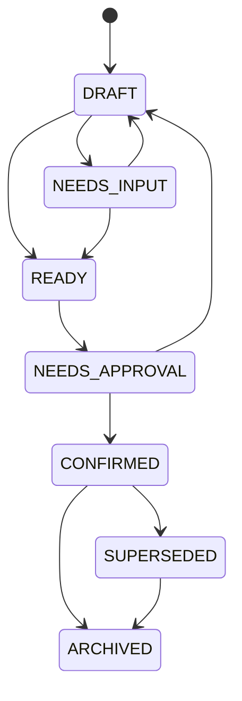

## 29.3 转换表

| 来源             | 动作                 | 目标             | 触发人        | 条件         |
| -------------- | ------------------ | -------------- | ---------- | ---------- |
| DRAFT          | parse              | NEEDS_INPUT    | User/Agent | 信息不足       |
| DRAFT          | validate           | READY          | System     | 必填字段完整     |
| NEEDS_INPUT    | update             | DRAFT          | User       | 补充输入       |
| READY          | request_approval   | NEEDS_APPROVAL | User/Agent | Schema通过   |
| NEEDS_APPROVAL | approve            | CONFIRMED      | User       | Approval通过 |
| NEEDS_APPROVAL | reject             | DRAFT          | User       | 修改后重提      |
| CONFIRMED      | create_new_version | SUPERSEDED     | User       | 新版本确认      |
| CONFIRMED      | archive            | ARCHIVED       | User       | 项目归档       |

---

# 30. Document 解析状态机

## 30.1 状态

```text
UPLOADED
QUEUED
PARSING
FALLBACK_PARSING
EXTRACTING
NEEDS_REVIEW
COMPLETED
FAILED
LOW_CONFIDENCE
CANCELLED
```

## 30.2 流程

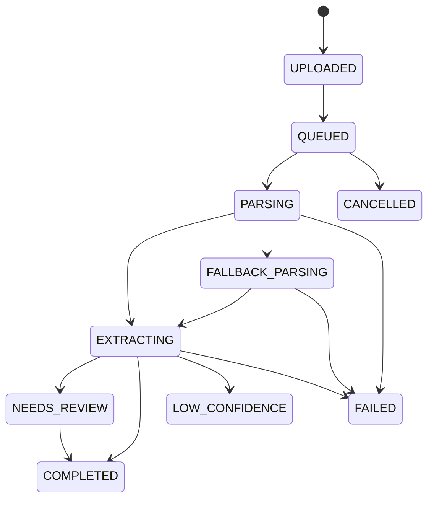

## 30.3 规则

* GROBID 失败后可进入回退；
* 扫描件可直接 LOW_CONFIDENCE；
* 用户修正后可 COMPLETED；
* 失败可重试；
* 重试创建新的 ProcessingRun。

---

# 31. LiteratureDecision 状态机

LiteratureDecision 采用事件历史，不直接修改同一行。

当前状态：

```text
UNCERTAIN
INCLUDED
EXCLUDED
```

允许转换：

* UNCERTAIN → INCLUDED；
* UNCERTAIN → EXCLUDED；
* INCLUDED → EXCLUDED；
* EXCLUDED → INCLUDED；
* INCLUDED/EXCLUDED → UNCERTAIN。

每次转换创建新 LiteratureDecision。

---

# 32. LiteratureExtraction 状态机

```text
DRAFT
EXTRACTING
NEEDS_REVIEW
CONFIRMED
SUPERSEDED
INVALIDATED
FAILED
```

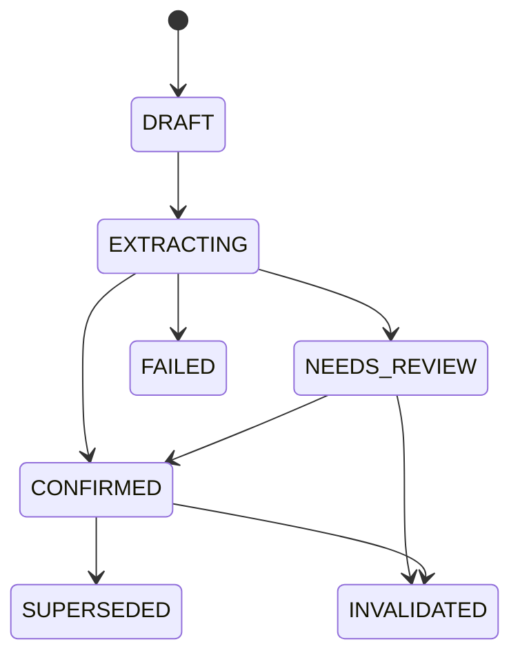

字段修正不应直接覆盖确认历史。

---

# 33. DatasetVersion 状态机

```text
CREATING
VALIDATING
AVAILABLE
FAILED
INVALIDATED
DELETED
```

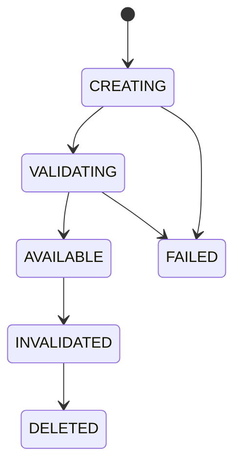

规则：

* AVAILABLE 后文件不可修改；
* FAILED 版本不设为 current；
* INVALIDATED 仍可查看；
* DELETED 是软删除状态。

---

# 34. CleaningPlan 状态机

```text
DRAFT
VALIDATING
NEEDS_INPUT
READY
NEEDS_APPROVAL
APPROVED
REJECTED
QUEUED
RUNNING
COMPLETED
FAILED
CANCELLED
INVALIDATED
```

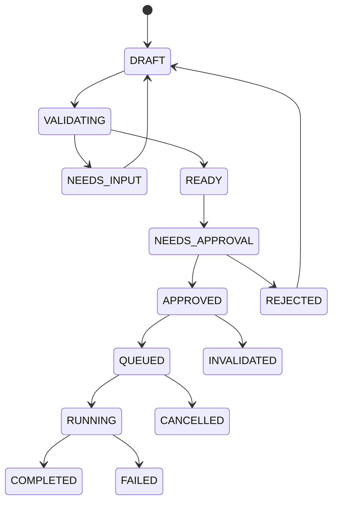

关键约束：

* APPROVED 后计划内容不可改；
* 修改计划需要创建新版本或重置 Draft；
* COMPLETED 必须有 DataTransformation 和 Target DatasetVersion；
* 计划所依赖的数据版本失效时进入 INVALIDATED。

---

# 35. AnalysisPlan 状态机

```text
DRAFT
VALIDATING
NEEDS_INPUT
READY
NEEDS_APPROVAL
APPROVED
REJECTED
QUEUED
RUNNING
COMPLETED
FAILED
CANCELLED
INVALIDATED
```

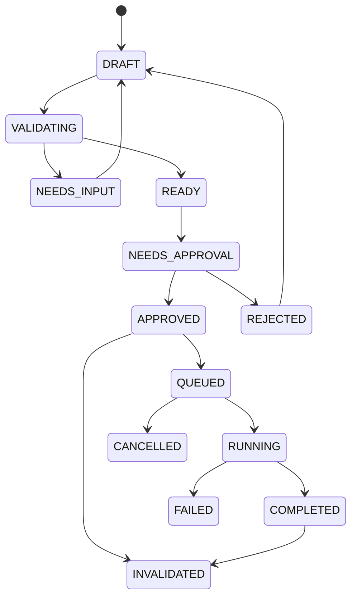

说明：

* AnalysisPlan 的 RUNNING/COMPLETED 可表示关联执行进度；
* 实际每次执行状态保存在 AnalysisRun；
* 同一 Plan 可产生多个 Run；
* 若允许重复运行，Plan 完成后仍保留 APPROVED 语义，代码实现可将运行状态完全放在 AnalysisRun。

推荐实现：

```text
AnalysisPlan: DRAFT → READY → NEEDS_APPROVAL → APPROVED → INVALIDATED
AnalysisRun: QUEUED → RUNNING → COMPLETED/FAILED/CANCELLED/INVALIDATED
```

---

# 36. AnalysisRun 状态机

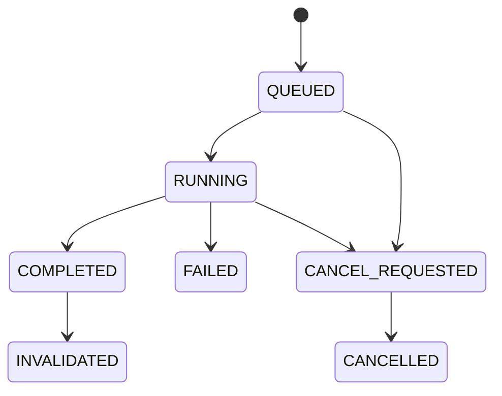

规则：

* COMPLETED 后不可改；
* 失败可基于同一 Plan 创建新 Run；
* INVALIDATED 必须说明原因；
* 取消不删除日志。

---

# 37. Figure 状态机

```text
DRAFT
RENDERING
READY
NEEDS_REVIEW
CONFIRMED
FAILED
INVALIDATED
ARCHIVED
```

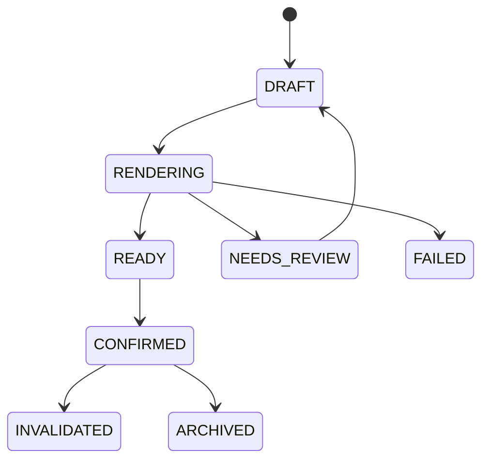

规则：

* 参数改变创建新 Figure；
* 不原地替换图像；
* AnalysisRun 失效时 Figure 失效。

---

# 38. ManuscriptCheck 状态机

```text
UPLOADED
QUEUED
PARSING
CHECKING_RULES
CHECKING_PROJECT_CONSISTENCY
NEEDS_REVIEW
COMPLETED
FAILED
LOW_CONFIDENCE
CANCELLED
```

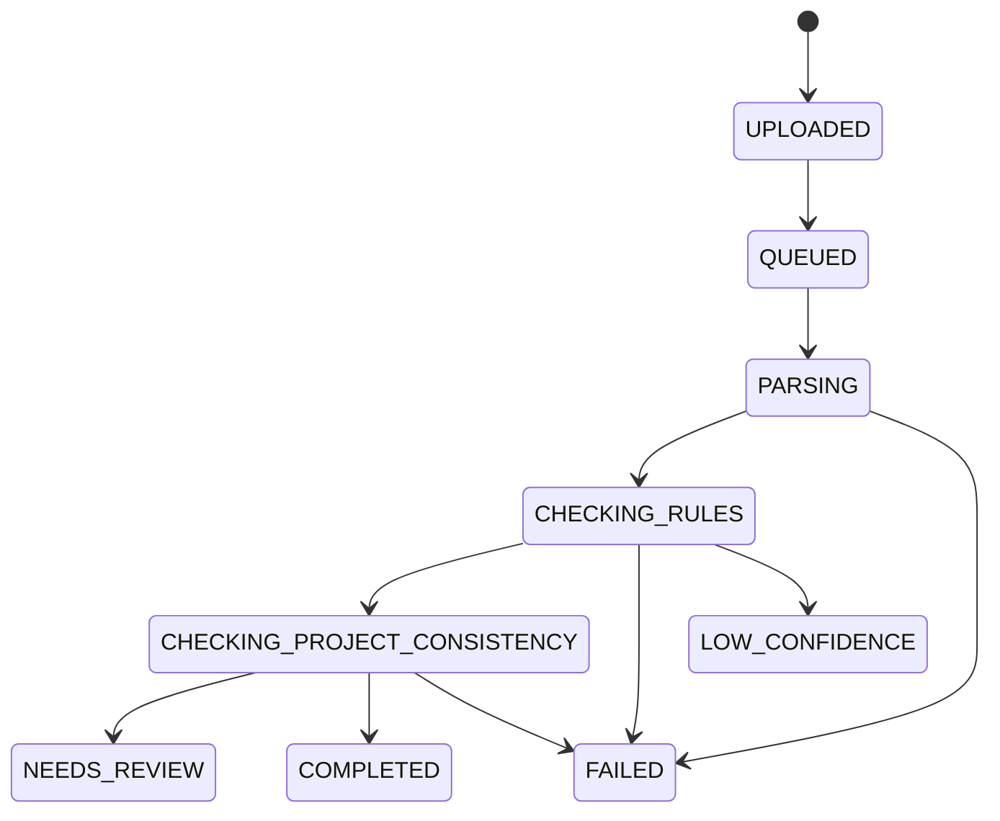

---

# 39. ManuscriptIssue 状态机

```text
OPEN
ACKNOWLEDGED
ACCEPTED
REJECTED
RESOLVED
INVALIDATED
```

| 来源                         | 动作                | 目标           |
| -------------------------- | ----------------- | ------------ |
| OPEN                       | acknowledge       | ACKNOWLEDGED |
| OPEN/ACKNOWLEDGED          | accept_suggestion | ACCEPTED     |
| OPEN/ACKNOWLEDGED          | reject_suggestion | REJECTED     |
| ACCEPTED                   | apply_fix         | RESOLVED     |
| OPEN/ACKNOWLEDGED/ACCEPTED | invalidate        | INVALIDATED  |

高风险问题被 ACCEPTED 不表示系统自动修改。

---

# 40. Claim 状态机

```text
DRAFT
NEEDS_EVIDENCE
SUPPORTED
CONFLICTED
INSUFFICIENT
CONFIRMED
REJECTED
INVALIDATED
```

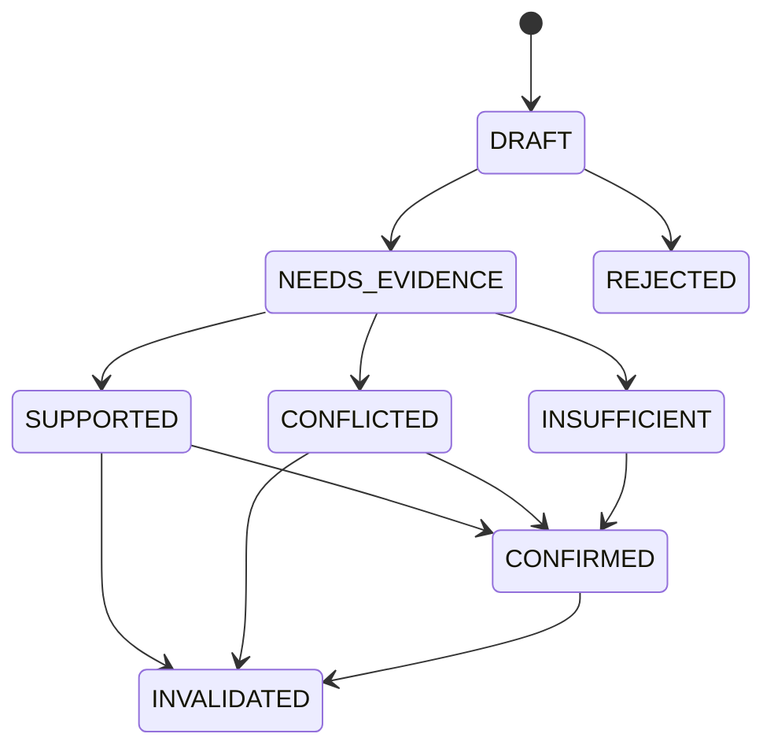

说明：

* CONFIRMED 表示用户确认该状态和表述，不等于“科学真理”；
* CONFLICTED 仍可作为综述中的争议 Claim；
* INSUFFICIENT 可作为“当前证据不足”结论。

---

# 41. ApprovalRecord 状态机

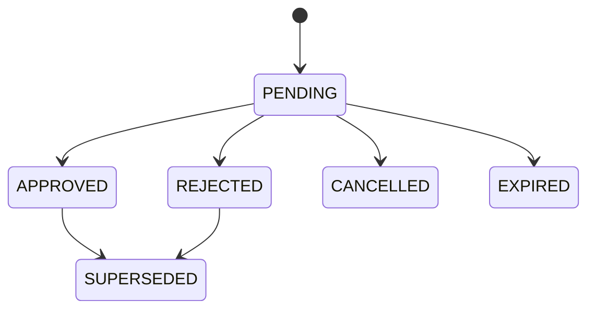

规则：

* 决策后不可修改；
* 修正通过新 Approval；
* 目标内容改变后旧 Approval 不自动沿用。

---

# 42. Job 状态机

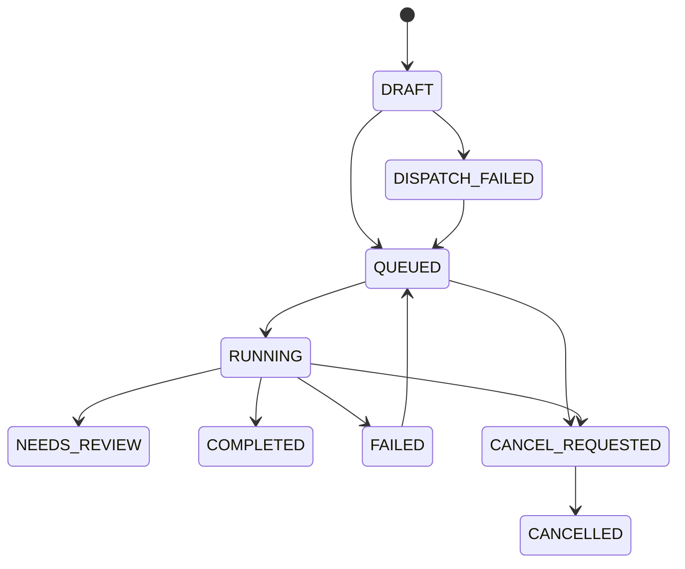

重试必须满足：

* `retryable=true`；
* 未超过 `max_retries`；
* 输入对象仍有效；
* 不存在已完成幂等结果。

---

# 43. AgentRun 状态机

```text
CREATED
PLANNING
WAITING_FOR_INPUT
WAITING_FOR_APPROVAL
CALLING_TOOL
REVIEWING
COMPLETED
FAILED
CANCELLED
```

AgentRun 不直接代表业务对象完成。

业务状态仍由对应模块状态机管理。

---

# 44. Export 状态机

```text
DRAFT
VALIDATING
NEEDS_CONFIRMATION
QUEUED
PACKAGING
COMPLETED
FAILED
CANCELLED
```

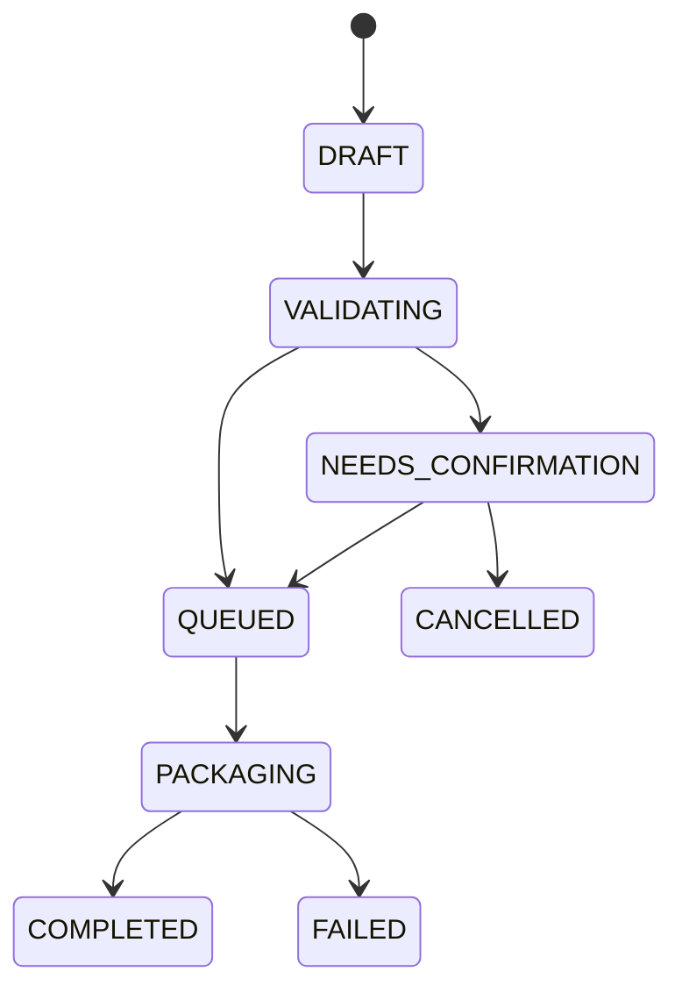

导出前验证：

* 许可证；
* 敏感数据；
* 失效对象；
* 未确认对象；
* 缺失 Artifact；
* Manifest 完整性。

---

# 45. 数据库索引建议

## 45.1 通用索引

所有核心表：

```text
(project_id)
(project_id, status)
(project_id, created_at)
```

## 45.2 文献

```text
(normalized_doi)
(project_id, normalized_title)
(document_id)
(literature_record_id, status)
```

## 45.3 EvidenceSpan

```text
(project_id, document_id)
(document_id, page_number)
(chunk_id)
```

## 45.4 数据

```text
(dataset_id, version_number)
(project_id, status)
(parent_version_id)
```

## 45.5 分析

```text
(analysis_plan_id)
(dataset_version_id)
(project_id, status)
(idempotency_key)
```

## 45.6 ClaimEvidenceLink

```text
(claim_id)
(evidence_object_type, evidence_object_id)
(project_id, status)
```

## 45.7 Job

```text
(project_id, status)
(celery_task_id)
(idempotency_key)
(status, created_at)
```

---

# 46. 数据库约束建议

## 46.1 同项目约束

应用服务必须确保关联对象属于同一 `project_id`。

P0 可由应用层校验；重要关系可增加复合外键或数据库触发验证，但不应让迁移过度复杂。

## 46.2 互斥字段

例如 LiteratureExtractionField：

* `value_text` 与 `value_json` 至少一个非空；
* `evidence_span_id` 允许空，但确认时应提示。

## 46.3 Check Constraint

示例：

```text
progress_percent BETWEEN 0 AND 100
version_number >= 1
row_count >= 0
column_count >= 0
page_number >= 1
```

## 46.4 删除行为

推荐：

* 核心对象外键使用 `RESTRICT` 或 `NO ACTION`；
* 不使用大范围 `ON DELETE CASCADE`；
* 子对象通过软删除或业务服务处理。

---

# 47. 数据迁移规则

## 47.1 新增字段

新增非空字段时：

1. 先允许空；
2. 回填；
3. 增加约束；
4. 更新代码；
5. 更新测试。

## 47.2 枚举变更

新增枚举需：

* 更新数据库；
* 更新 Pydantic；
* 更新前端类型；
* 更新状态机；
* 更新测试。

## 47.3 删除字段

P0 尽量不直接删除。

先：

* 停止写入；
* 保留读取；
* 数据迁移；
* 后续版本再删除。

## 47.4 表重命名

必须提供兼容迁移，避免破坏已有演示数据。

---

# 48. 数据完整性检查

系统应提供周期性完整性任务，检查：

* Artifact 存在但对象存储缺失；
* 对象存储存在但数据库无 Artifact；
* Dataset.current_version_id 无效；
* Manuscript.current_version_id 无效；
* AnalysisResult 无 AnalysisRun；
* Figure 无图像 Artifact；
* ClaimEvidenceLink 指向不存在对象；
* ApprovalRecord 目标不存在；
* Completed Job 无输出对象；
* ReproPackage Manifest 与文件不一致。

---

# 49. 前端状态映射

前端不应自行猜测可操作项。

API 应返回：

* 当前状态；
* `allowed_actions`；
* `requires_approval`；
* `blocking_reasons`；
* `warnings`。

示例：

```json
{
  "status": "NEEDS_APPROVAL",
  "allowed_actions": [
    "approve",
    "reject",
    "edit"
  ],
  "requires_approval": true,
  "blocking_reasons": [],
  "warnings": [
    "将影响数据集中的12条记录"
  ]
}
```

---

# 50. P0 实现优先顺序

## 第一批：基础对象

1. User；
2. ResearchProject；
3. ProjectMember；
4. Artifact；
5. Job；
6. AuditLog。

## 第二批：研究问题与文献

1. ResearchQuestion；
2. ResearchQuestionVersion；
3. Document；
4. DocumentPage；
5. DocumentChunk；
6. LiteratureRecord；
7. LiteratureExtraction；
8. EvidenceSpan；
9. LiteratureDecision。

## 第三批：数据

1. Dataset；
2. DatasetVersion；
3. DatasetColumn；
4. DataQualityRun；
5. DataQualityIssue；
6. CleaningPlan；
7. CleaningPlanAction；
8. DataTransformation；
9. ApprovalRecord。

## 第四批：分析和图表

1. AnalysisPlan；
2. AnalysisAssumptionCheck；
3. AnalysisRun；
4. AnalysisResult；
5. FigurePlan；
6. Figure；
7. FigureValidationIssue。

## 第五批：论文与证据链

1. Manuscript；
2. ManuscriptVersion；
3. ManuscriptCheckRun；
4. ManuscriptIssue；
5. Claim；
6. ClaimEvidenceLink；
7. AuditResult。

## 第六批：Agent 与导出

1. AgentRun；
2. ToolCall；
3. ModelInvocation；
4. Export；
5. ReproPackage；
6. ExportItem。

---

# 51. 最小可用字段策略

若工期有限，不得删除以下关键字段：

## 所有核心表

* id；
* project_id；
* status；
* created_at。

## 版本表

* version_number；
* parent_version_id；
* artifact_id；
* status。

## 运行表

* input object；
* parameters；
* engine version；
* status；
* started_at；
* completed_at；
* error。

## 证据对象

* source object；
* source text；
* page；
* relation；
* status。

## 审批对象

* target；
* payload snapshot；
* decision user；
* decision time；
* status。

---

# 52. 禁止的数据模型反模式

## 52.1 一个大 JSON 保存整个项目

禁止：

```text
projects.state JSONB
```

存储全部文献、数据和分析。

## 52.2 用聊天消息代替业务对象

聊天记录不能代替：

* AnalysisPlan；
* CleaningPlan；
* ApprovalRecord；
* LiteratureDecision。

## 52.3 用状态字段保存所有流程

禁止只用：

```text
status = "done"
```

而不保存运行、结果和审批。

## 52.4 覆盖旧版本

禁止更新 DatasetVersion 对应文件内容。

## 52.5 统计结果只保存文本

禁止：

```text
result_text = "r=0.42, p<0.05"
```

而无结构化 statistics。

## 52.6 证据链只保存在前端

React Flow 节点不是权威数据。

## 52.7 ToolCall 直接写结果表

工具必须通过业务 Service 和领域规则。

## 52.8 AI 输出直接成为用户确认

AI 建议和用户决定必须分离。

---

# 53. 数据模型验收标准

## 53.1 基础

* 所有核心对象使用 UUID；
* 核心业务对象包含 project_id；
* 所有表有创建时间；
* 可编辑对象有乐观锁或并发策略；
* 数据库迁移可执行。

## 53.2 文件

* 原始 Artifact 不可覆盖；
* SHA-256 存在；
* 文件来源可追溯；
* 删除采用软删除。

## 53.3 文献

* Document 与 LiteratureRecord 分离；
* EvidenceSpan 保存原文和页码；
* LiteratureDecision 保存历史；
* AI 抽取与用户确认分离。

## 53.4 数据

* Dataset 与 DatasetVersion 分离；
* 原始版本只读；
* CleaningPlan 与 Transformation 分离；
* 每次处理生成新版本；
* 版本血缘可查询。

## 53.5 分析

* AnalysisPlan、Run、Result 分离；
* 所有结果绑定 DatasetVersion；
* 完成的 AnalysisRun 不可修改；
* 数字结构化保存；
* 环境版本可查询。

## 53.6 图表

* Figure 绑定 DatasetVersion；
* 统计图绑定 AnalysisRun；
* 图像和代码有 Artifact；
* 参数变化不覆盖旧 Figure。

## 53.7 论文

* Manuscript 与 Version 分离；
* 原始 DOCX 不覆盖；
* Issue 可定位；
* Issue 可关联 AnalysisResult 或文献证据。

## 53.8 证据链

* Claim 和 EvidenceSpan 分离；
* ClaimEvidenceLink 可表示支持、反对和限定；
* 节点关系不可跨项目；
* 上游失效可传播；
* React Flow 数据来自后端。

## 53.9 审批

* 高风险操作有 ApprovalRecord；
* Agent 不能批准；
* 审批保存内容快照；
* 对象变化后旧审批失效。

## 53.10 运行

* Job 与 ProcessingRun 分离；
* 任务幂等；
* ToolCall 和 ModelInvocation 可审计；
* 失败保留错误码；
* 重试不重复写正式结果。

---

# 54. 附录A：推荐 SQLModel 基类

以下为说明性结构，不替代正式代码审查。

```python
from datetime import datetime
from uuid import UUID, uuid4

from sqlmodel import Field, SQLModel


class BaseEntity(SQLModel):
    id: UUID = Field(default_factory=uuid4, primary_key=True)
    created_at: datetime = Field(default_factory=datetime.utcnow)
    updated_at: datetime = Field(default_factory=datetime.utcnow)


class ProjectScopedEntity(BaseEntity):
    project_id: UUID = Field(index=True, foreign_key="researchproject.id")
```

不可变对象不应提供通用 update 方法。

---

# 55. 附录B：推荐状态转换接口

```python
class StateTransitionResult(BaseModel):
    object_type: str
    object_id: UUID
    previous_status: str
    current_status: str
    action: str
    approval_required: bool
    audit_log_id: UUID
    warnings: list[str]


class StateMachine(Protocol):
    async def transition(
        self,
        object_id: UUID,
        action: str,
        actor: ActorContext,
        payload: dict | None = None,
    ) -> StateTransitionResult:
        ...
```

---

# 56. 附录C：证据链示例

论文论述：

> 生成式 AI 使用频率与师范生学习投入呈正相关。

对应数据：

```text
Claim
├── claim_type: MANUSCRIPT_STATEMENT
├── status: CONFIRMED
├── scope: 某公开数据集中的师范生样本
│
├── SUPPORTED_BY → EvidenceSpan A
│   ├── 文献ID
│   ├── PDF第8页
│   └── 原文片段
│
├── QUALIFIED_BY → EvidenceSpan B
│   ├── 研究为横断面设计
│   └── 不支持因果解释
│
├── DERIVED_FROM → DatasetVersion V2
├── ANALYZED_BY → AnalysisRun RUN-018
├── PRODUCED_BY → AnalysisResult RESULT-018
├── VISUALIZED_AS → Figure FIG-006
├── CONFIRMED_BY → ApprovalRecord APR-014
└── AUDITED_BY → AuditResult AUD-009
```

页面必须明确显示：

* 相关不等于因果；
* 数据版本；
* 样本范围；
* 方法；
* 原文支持；
* 限制条件。

---

# 57. 附录D：数据版本示例

```text
Dataset: 师范生生成式AI使用调查数据
│
├── V1 ORIGINAL
│   ├── rows: 1,020
│   ├── sha256: ...
│   └── status: AVAILABLE
│
├── CleaningPlan CP-001
│   ├── 统一性别编码
│   ├── 将999标记为缺失
│   └── 用户批准 APR-021
│
├── DataTransformation DT-001
│   └── 输入 V1
│
└── V2 CLEANED
    ├── parent: V1
    ├── rows: 1,020
    ├── sha256: ...
    └── status: AVAILABLE
```

---

# 58. 附录E：分析运行示例

```text
AnalysisPlan AP-003
├── DatasetVersion: V2
├── Method: PEARSON_CORRELATION
├── X: ai_usage_frequency
├── Y: learning_engagement
├── Missing Policy: pairwise complete
├── Assumption: linearity warning
└── Approval: APR-025

AnalysisRun AR-006
├── Plan: AP-003
├── Engine: SciPy
├── Engine Version: x.x.x
├── Status: COMPLETED
├── CodeArtifact: CODE-006
└── Result: RESULT-006

AnalysisResult RESULT-006
├── sample_size: 984
├── coefficient: 0.31
├── p_value: ...
├── confidence_interval: ...
└── warnings:
    └── 不支持因果推断
```

所有正式论文数字从 `AnalysisResult` 读取，而不是从 AI 文本中读取。

---

# 59. 最终数据模型结论

RECA 0.1 的数据模型必须围绕以下主链构建：

```text
ResearchProject
├── ResearchQuestionVersion
├── LiteratureRecord
│   ├── Document
│   ├── LiteratureExtraction
│   └── EvidenceSpan
├── Dataset
│   └── DatasetVersion
│       ├── DataQualityIssue
│       ├── CleaningPlan
│       └── DataTransformation
├── AnalysisPlan
│   └── AnalysisRun
│       └── AnalysisResult
├── Figure
├── ManuscriptVersion
│   └── ManuscriptIssue
├── Claim
│   └── ClaimEvidenceLink
├── ApprovalRecord
├── AuditResult
├── AgentRun
│   ├── ToolCall
│   └── ModelInvocation
└── ReproPackage
```

该模型必须坚持：

1. 项目统一归属；
2. 原始文件不可覆盖；
3. 逻辑对象与版本分离；
4. 计划、审批、执行和结果分离；
5. AI 建议与正式事实分离；
6. 统计结果来自确定性程序；
7. Claim 与证据关系结构化；
8. 用户确认成为正式对象；
9. 上游失效能够传播；
10. 所有关键过程可追溯、可复核、可复现。

完成本文档定义的数据模型后，前端、API、Agent、测试和复现包才能建立在同一套可靠的科研领域事实之上。
