# 研证链 AI（RECA）数据模型与工作流

> 面向高校科研训练的全流程可信科研智能体
> Research Evidence Chain Agent

## 文档信息

| 项目 | 内容 |
| --- | --- |
| 文档名称 | `DATA_MODEL_AND_WORKFLOW.md` |
| 文档版本 | 1.3.0 |
| 文档状态 | Conditional Approval |
| 文档类型 | 领域模型与状态机基准入口 |
| 最后更新时间 | 2026-07-31 |

# 1. 文档目的

本入口文档定义 RECA 领域模型的权威边界、设计原则、通用字段、核心对象、概念区别和 ER 总览。完整字段、枚举、约束、状态转换与不变量由下列子文档承载；拆分不改变任何已有领域语义。

# 2. 文档权威性

## 2.1 本文档负责

本文档是以下内容的唯一正式基准：

* 核心领域对象；
* 表和字段；
* 主键和外键；
* 版本规则；
* 数据血缘；
* 状态枚举；
* 状态转换；
* 证据链节点和关系；
* 人工确认；
* 异步任务记录；
* AI 和工具运行记录；
* 删除、归档、失效和恢复规则；
* 数据完整性约束。

## 2.2 其他文档职责

| 内容         | 权威文档                          |
| ---------- | ----------------------------- |
| 产品功能范围     | `PRODUCT_REQUIREMENTS.md`     |
| 技术组件和模块边界  | `ARCHITECTURE.md`             |
| API 请求响应   | `API_AI_TOOL_CONTRACTS.md`    |
| 测试数据与验收    | `TEST_AND_ACCEPTANCE.md`      |
| 权限、安全和隐私   | `SECURITY_AND_OPEN_SOURCE.md` |
| Codex 修改规则 | `AGENTS.md`                   |

## 2.3 实现优先级

当代码、迁移、API Schema 与本文档冲突时：

1. 先停止继续扩展；
2. 明确冲突来源；
3. 更新本文档或修正实现；
4. 不允许数据库和 API 长期维持两个含义不同的字段；
5. 不允许通过 JSONB 绕过正式字段定义。

---

# 3. 领域模型设计原则

## 3.1 项目是统一边界

除系统级配置外，所有科研对象必须归属于 `ResearchProject`。

核心业务表原则上包含：

```text
project_id
```

包括：

* 研究问题；
* 文献；
* 数据；
* 分析；
* 图表；
* 论文；
* Claim；
* Approval；
* Audit；
* AgentRun；
* Job；
* Export。

## 3.2 逻辑对象与具体版本分离

以下对象采用“逻辑对象 + 版本对象”模式：

| 逻辑对象             | 版本对象                         |
| ---------------- | ---------------------------- |
| ResearchQuestion | ResearchQuestionVersion      |
| Dataset          | DatasetVersion               |
| Manuscript       | ManuscriptVersion            |
| Figure           | FigureVersion 或不可变 Figure 记录 |
| PromptContract   | PromptVersion                |
| SchemaContract   | SchemaVersion                |

逻辑对象表示“这是哪个研究问题、数据集或论文”。

版本对象表示“该对象在某个时间点的具体内容”。

## 3.3 原始对象不可变

以下对象创建后不得原地覆盖内容：

* 原始 Artifact；
* 原始 DatasetVersion；
* 原始 ManuscriptVersion；
* 已完成 AnalysisRun；
* 已完成 AnalysisResult；
* 已确认 ApprovalRecord；
* 已完成 ToolCall；
* 已完成 ModelInvocation；
* 已生成 Export。

修改通过创建新对象或新版本完成。

## 3.4 计划与执行分离

所有高风险操作必须区分：

```text
计划
→ 审批
→ 执行
→ 结果
```

对应对象：

| 计划                | 执行                       | 结果                |
| ----------------- | ------------------------ | ----------------- |
| CleaningPlan      | DataTransformation       | DatasetVersion    |
| AnalysisPlan      | AnalysisRun              | AnalysisResult    |
| FigurePlan        | FigureRenderRun          | Figure            |
| ManuscriptFixPlan | ManuscriptTransformation | ManuscriptVersion |
| ExportRequest     | ExportRun                | ReproPackage      |

P0 中可不为每项都创建独立表，但领域概念必须保持分离。

## 3.5 AI 输出与业务事实分离

AI 输出只是建议或抽取结果，不自动成为正式事实。

例如：

```text
AI生成 LiteratureExtraction
→ Schema校验
→ 保存为候选结果
→ 用户确认或修正
→ 形成已确认字段
```

AI 不得直接写入：

* AnalysisResult；
* DatasetVersion 文件内容；
* ApprovalRecord；
* 最终文献纳入状态；
* 正式统计数字。

## 3.6 所有重要结果保留来源

正式结果必须至少能回答：

* 谁创建；
* 什么时间；
* 来源对象；
* 使用什么版本；
* 使用什么工具；
* 使用什么模型；
* 是否确认；
* 是否失效；
* 当前限制是什么。

## 3.7 失效不等于删除

科研记录出现错误时，通常采用：

```text
INVALIDATED
```

而不是删除。

失效对象仍保留：

* 原内容；
* 失效原因；
* 失效人；
* 失效时间；
* 关联下游对象。

## 3.8 审计记录追加写

AuditLog、ApprovalRecord、ToolCall、ModelInvocation 原则上采用追加写。

不允许无痕修改历史。

## 3.9 状态转换必须由业务服务控制

前端不能直接把状态从任意值改到任意值。

状态转换必须经过：

* 权限检查；
* 前置条件检查；
* 幂等检查；
* 审计；
* 必要时审批；
* 事务。

审批要求按操作风险采用以下规范性分类：

```text
NONE
LIGHT_CONFIRMATION
FORMAL_APPROVAL
```

`NONE` 适用于只读查询、检索、解析、质量扫描、候选生成和预览；`LIGHT_CONFIRMATION` 适用于采用候选研究问题、修正候选字段、选择图表类型和低风险格式修复；`FORMAL_APPROVAL` 仅适用于修改科研数据、改变正式科研事实、执行正式 AnalysisPlan、失效正式结果、导出原始或敏感数据等高风险操作。该分类是领域政策语义，不自动新增持久化字段或稳定枚举；实现可复用现有 `requires_approval`、确认记录和 `ApprovalRecord` 表达等效含义。

模型调用和低风险 ToolCall 不因“由 AI 发起”而自动需要正式审批。需要正式审批的副作用必须在执行前绑定有效 `ApprovalRecord`；Agent 不得自行批准。

## 3.10 JSONB 只保存可变细节

JSONB 适合：

* 第三方原始响应摘要；
* 模型参数；
* 图表参数；
* 统计方法特定字段；
* 扩展元数据。

核心查询字段必须建正式列。

---

# 4. 通用字段规范

## 4.1 主键

所有核心对象使用 UUID。

推荐：

```text
UUID v4
```

数据库字段：

```sql
id UUID PRIMARY KEY
```

## 4.2 时间字段

统一使用 UTC 存储。

核心字段：

```text
created_at
updated_at
deleted_at
invalidated_at
completed_at
```

API 根据用户时区展示。

## 4.3 创建人

可由用户或系统创建。

字段建议：

```text
created_by_user_id
created_by_actor_type
```

`created_by_actor_type`：

* `USER`；
* `SYSTEM`；
* `AGENT`；
* `WORKER`；
* `IMPORT`。

## 4.4 项目归属

除系统表外，核心表必须包含：

```text
project_id
```

并建立索引。

## 4.5 状态

状态字段使用大写字符串枚举。

禁止同时出现：

```text
completed
COMPLETED
done
finished
```

## 4.6 版本号

版本对象使用：

```text
version_number INTEGER
```

从 1 开始。

同一逻辑对象内唯一：

```text
UNIQUE(parent_object_id, version_number)
```

## 4.7 乐观锁

可编辑逻辑对象建议包含：

```text
lock_version INTEGER DEFAULT 1
```

更新时验证旧版本。

## 4.8 软删除

需要软删除的对象包含：

```text
deleted_at
deleted_by_user_id
deletion_reason
```

默认查询排除已删除对象。

## 4.9 失效字段

可失效对象包含：

```text
is_invalidated
invalidated_at
invalidated_by_user_id
invalidation_reason
```

## 4.10 元数据

扩展字段统一使用：

```text
metadata JSONB
```

不得用 `metadata` 保存应该正式建模的核心关系。

## 4.11 Schema 版本

AI 输出、导出清单和复杂结构应包含：

```text
schema_version
```

## 4.12 内容哈希

文件和关键结构化输入应保存：

```text
content_hash
```

文件统一 SHA-256。

---

# 5. 核心对象总览

## 5.1 项目领域

* User；
* ResearchProject；
* ProjectMember；
* AuditLog。

## 5.2 研究问题领域

* ResearchQuestion；
* ResearchQuestionVersion。

## 5.3 文件领域

* Artifact；
* ArtifactRelation；
* Document；
* DocumentPage；
* DocumentChunk。

## 5.4 文献领域

* LiteratureRecord；
* LiteratureAuthor；
* LiteratureExtraction；
* LiteratureExtractionField；
* EvidenceSpan；
* LiteratureDecision；
* LiteratureSearchRun；
* QueryPlan。

## 5.5 选题领域

* TopicGenerationRun；
* TopicCandidate；
* TopicCandidateEvidence。

## 5.6 数据领域

* Dataset；
* DatasetVersion；
* DatasetColumn；
* DataQualityRun；
* DataQualityIssue；
* CleaningPlan；
* CleaningPlanAction；
* DataTransformation。

## 5.7 分析领域

* AnalysisPlan；
* AnalysisRun；
* AnalysisResult；
* AnalysisAssumptionCheck；
* CodeArtifact。

## 5.8 图表领域

* Figure；
* FigurePlan；
* FigureValidationIssue。

## 5.9 论文领域

* Manuscript；
* ManuscriptVersion；
* ManuscriptCheckRun；
* ManuscriptIssue；
* ManuscriptIssueEvidence；
* ManuscriptTransformation。

## 5.10 证据链领域

* Claim；
* ClaimEvidenceLink；
* EvidenceGraphSnapshot；
* AuditResult。

## 5.11 人工确认领域

* ApprovalRecord；
* ApprovalItem。

## 5.12 运行领域

* Job；
* ProcessingRun；
* AgentRun；
* ToolCall；
* ModelInvocation。

## 5.13 导出领域

* Export；
* ReproPackage；
* ExportItem。

---

# 6. 核心概念区别

| 概念A                  | 概念B                | 关键区别                                       |
| -------------------- | ------------------ | ------------------------------------------ |
| Artifact             | Document           | Artifact 是通用文件对象；Document 是可解析文档业务对象       |
| Document             | LiteratureRecord   | Document 是实际 PDF；LiteratureRecord 是学术元数据   |
| DocumentPage         | DocumentChunk      | Page 对应物理页；Chunk 是检索或抽取单元                  |
| LiteratureExtraction | EvidenceSpan       | Extraction 是结构化字段结果；EvidenceSpan 是支持该字段的原文 |
| Dataset              | DatasetVersion     | Dataset 是逻辑数据集；DatasetVersion 是不可变具体版本     |
| DataQualityIssue     | CleaningPlan       | Issue 是发现的问题；Plan 是拟采取的处理方案                |
| CleaningPlan         | DataTransformation | Plan 是待批准建议；Transformation 是实际执行记录         |
| AnalysisPlan         | AnalysisRun        | Plan 是方案；Run 是一次程序执行                       |
| AnalysisRun          | AnalysisResult     | Run 是执行过程；Result 是结构化结果                    |
| FigurePlan           | Figure             | Plan 是绘图配置；Figure 是生成的图表产物                 |
| Manuscript           | ManuscriptVersion  | Manuscript 是论文逻辑对象；Version 是具体 DOCX        |
| ManuscriptIssue      | Claim              | Issue 是发现的问题；Claim 是科研论述                   |
| Claim                | EvidenceSpan       | Claim 是要被支持的论述；EvidenceSpan 是文献原文证据        |
| ApprovalRecord       | AuditResult        | Approval 是用户确认；Audit 是系统可信审核               |
| Job                  | ProcessingRun      | Job 是调度记录；ProcessingRun 是业务处理运行            |
| AgentRun             | ToolCall           | AgentRun 是一次 Agent 会话；ToolCall 是其中一次工具调用   |
| ToolCall             | ModelInvocation    | ToolCall 调用业务工具；ModelInvocation 调用模型       |
| Export               | ReproPackage       | Export 是导出任务逻辑对象；ReproPackage 是具体导出包       |

---

# 24. ER 总览图

```mermaid
erDiagram
    USER ||--o{ PROJECT_MEMBER : joins
    USER ||--o{ RESEARCH_PROJECT : owns
    RESEARCH_PROJECT ||--o{ PROJECT_MEMBER : has
    RESEARCH_PROJECT ||--o{ RESEARCH_QUESTION : contains
    RESEARCH_QUESTION ||--o{ RESEARCH_QUESTION_VERSION : versions

    RESEARCH_PROJECT ||--o{ ARTIFACT : owns
    ARTIFACT ||--o| DOCUMENT : represents
    DOCUMENT ||--o{ DOCUMENT_PAGE : has
    DOCUMENT ||--o{ DOCUMENT_CHUNK : split_into

    RESEARCH_PROJECT ||--o{ LITERATURE_RECORD : contains
    LITERATURE_RECORD o|--o| DOCUMENT : linked_to
    LITERATURE_RECORD ||--o{ LITERATURE_EXTRACTION : extracted_as
    LITERATURE_EXTRACTION ||--o{ LITERATURE_EXTRACTION_FIELD : has
    DOCUMENT ||--o{ EVIDENCE_SPAN : contains
    LITERATURE_RECORD ||--o{ LITERATURE_DECISION : decisions

    RESEARCH_PROJECT ||--o{ DATASET : contains
    DATASET ||--o{ DATASET_VERSION : versions
    DATASET_VERSION ||--o{ DATASET_COLUMN : columns
    DATASET_VERSION ||--o{ DATA_QUALITY_RUN : profiled_by
    DATA_QUALITY_RUN ||--o{ DATA_QUALITY_ISSUE : finds
    DATASET_VERSION ||--o{ CLEANING_PLAN : plans
    CLEANING_PLAN ||--o{ CLEANING_PLAN_ACTION : actions
    CLEANING_PLAN ||--o| DATA_TRANSFORMATION : executed_as
    DATA_TRANSFORMATION ||--o| DATASET_VERSION : creates

    RESEARCH_PROJECT ||--o{ ANALYSIS_PLAN : contains
    ANALYSIS_PLAN ||--o{ ANALYSIS_ASSUMPTION_CHECK : checks
    ANALYSIS_PLAN ||--o{ ANALYSIS_RUN : runs
    ANALYSIS_RUN ||--o{ ANALYSIS_RESULT : produces
    ANALYSIS_RUN ||--o{ FIGURE : visualized_as

    RESEARCH_PROJECT ||--o{ MANUSCRIPT : contains
    MANUSCRIPT ||--o{ MANUSCRIPT_VERSION : versions
    MANUSCRIPT_VERSION ||--o{ MANUSCRIPT_CHECK_RUN : checked_by
    MANUSCRIPT_CHECK_RUN ||--o{ MANUSCRIPT_ISSUE : finds

    RESEARCH_PROJECT ||--o{ CLAIM : contains
    CLAIM ||--o{ CLAIM_EVIDENCE_LINK : linked
    EVIDENCE_SPAN ||--o{ CLAIM_EVIDENCE_LINK : supports

    RESEARCH_PROJECT ||--o{ APPROVAL_RECORD : approvals
    RESEARCH_PROJECT ||--o{ AUDIT_RESULT : audits
    RESEARCH_PROJECT ||--o{ JOB : jobs
    JOB ||--o{ PROCESSING_RUN : runs
    RESEARCH_PROJECT ||--o{ AGENT_RUN : agents
    AGENT_RUN ||--o{ TOOL_CALL : tools
    AGENT_RUN ||--o{ MODEL_INVOCATION : models

    RESEARCH_PROJECT ||--o{ EXPORT : exports
    EXPORT ||--o| REPRO_PACKAGE : produces
```



---

# 25. 版本、血缘与不可变摘要

所有原始 Artifact、Original DatasetVersion、上传的 ManuscriptVersion 和其他原始输入不可覆盖。派生对象必须创建新版本或新运行，并记录来源对象、版本、参数、代码、Prompt/Schema 和审批信息。

逻辑对象与版本对象保持分离。任何上游版本变化都必须保留历史结果，并按规则把下游对象标记为过期、待复核或失效；不得通过删除历史对象伪装一致性。

完整版本、血缘、删除恢复和失效传播规则见 [STATE_MACHINES_AND_INVARIANTS.md](data-model/STATE_MACHINES_AND_INVARIANTS.md)。

# 26. 状态机与不变量索引

| 范围 | 权威位置 |
| --- | --- |
| ResearchQuestion、Document、LiteratureDecision、LiteratureExtraction | [状态机与不变量](data-model/STATE_MACHINES_AND_INVARIANTS.md) |
| DatasetVersion、CleaningPlan、AnalysisPlan、AnalysisRun、Figure | [状态机与不变量](data-model/STATE_MACHINES_AND_INVARIANTS.md) |
| ManuscriptCheck、ManuscriptIssue、Claim、ApprovalRecord | [状态机与不变量](data-model/STATE_MACHINES_AND_INVARIANTS.md) |
| Job、AgentRun、Export | [状态机与不变量](data-model/STATE_MACHINES_AND_INVARIANTS.md) |
| 唯一约束、外键一致性、项目隔离、索引、迁移 | [状态机与不变量](data-model/STATE_MACHINES_AND_INVARIANTS.md) |
| requested/max/effective data access | [状态机与不变量](data-model/STATE_MACHINES_AND_INVARIANTS.md) |
| ProjectContextSnapshot 哈希与版本 | [状态机与不变量](data-model/STATE_MACHINES_AND_INVARIANTS.md) |

# 27. 子模型文档导航

* [FOUNDATION_AND_PROJECT_MODELS.md](data-model/FOUNDATION_AND_PROJECT_MODELS.md)：用户、项目、Artifact、审批、审计、Job、ProcessingRun、Prompt 元数据和降级记录。
* [LITERATURE_AND_EVIDENCE_MODELS.md](data-model/LITERATURE_AND_EVIDENCE_MODELS.md)：研究问题、文献、文档、抽取、EvidenceSpan、筛选和候选问题。
* [DATA_ANALYSIS_AND_FIGURE_MODELS.md](data-model/DATA_ANALYSIS_AND_FIGURE_MODELS.md)：数据版本、质量、处理、分析和图表。
* [MANUSCRIPT_AGENT_AND_EXPORT_MODELS.md](data-model/MANUSCRIPT_AGENT_AND_EXPORT_MODELS.md)：论文、Claim、审核、Agent/Tool/模型调用和导出。
* [STATE_MACHINES_AND_INVARIANTS.md](data-model/STATE_MACHINES_AND_INVARIANTS.md)：状态、转换、约束、血缘、失效传播和跨对象不变量。

本入口与五份子文档共同构成本领域的正式开发基准。入口负责核心原则、概念和索引，子文档负责完整定义。发生冲突属于文档缺陷，开发者和 Codex 不得自行猜测。
