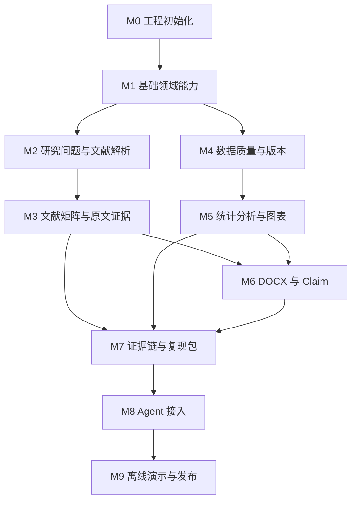
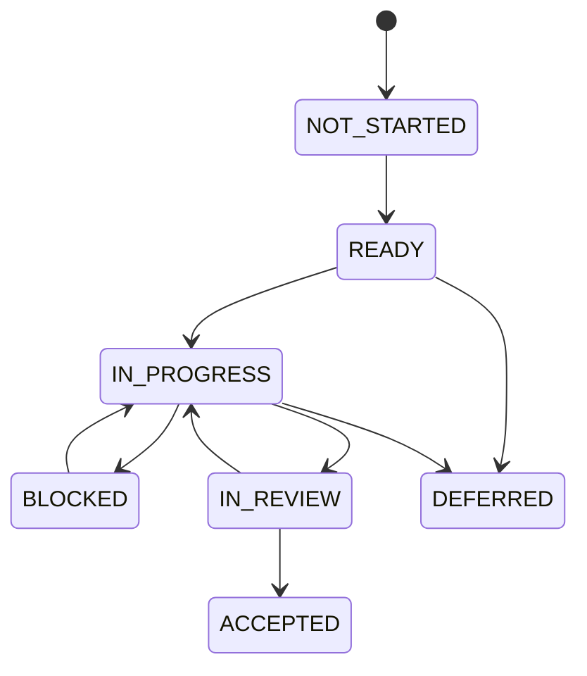

# 研证链 AI（RECA）实施路线图

> 面向高校科研训练的全流程可信科研智能体
> Research Evidence Chain Agent
> RECA 0.1 Competition Edition 开发执行计划

---

## 文档信息

| 项目     | 内容                                                                                                                                              |
| ------ | ----------------------------------------------------------------------------------------------------------------------------------------------- |
| 文档名称   | `IMPLEMENTATION_ROADMAP.md`                                                                                                                     |
| 文档版本   | 1.1.0                                                                                                                                           |
| 适用项目版本 | RECA 0.1 Competition Edition                                                                                                                    |
| 文档状态   | Approved                                                                                                                                        |
| 文档类型   | 实施路线图、里程碑计划、任务依赖与交付门禁                                                                                                                           |
| 主要读者   | 项目负责人、产品负责人、架构负责人、前端开发、后端开发、AI 开发、测试人员、Codex                                                                                                    |
| 负责人    | RECA Team                                                                                                                                       |
| 最后更新时间 | 2026-07-29                                                                                                                                      |
| 建议位置   | `docs/IMPLEMENTATION_ROADMAP.md`                                                                                                                |
| 上位文档   | `README.md`、`AGENTS.md`、`docs/PRODUCT_REQUIREMENTS.md`、`docs/ARCHITECTURE.md`、`docs/DATA_MODEL_AND_WORKFLOW.md`、`docs/API_AI_TOOL_CONTRACTS.md` |
| 关联文档   | `docs/TEST_AND_ACCEPTANCE.md`、`docs/SECURITY_AND_OPEN_SOURCE.md`                                                                                |

---

## 变更记录

| 版本    | 日期         | 状态     | 变更说明                                                 | 负责人       |
| ----- | ---------- | ------ | ---------------------------------------------------- | --------- |
| 1.0.0 | 2026-07-29 | Draft  | 建立 RECA 0.1 从工程初始化到比赛发布的实施路线图                        | RECA Team |
| 1.1.0 | 2026-07-29 | Review | 补充 P0-Must 与 P0-Full、里程碑依赖、Codex 任务拆分、阶段门禁、风险与离线演示要求 | RECA Team |
| 1.1.0 | 2026-07-29 | Approved | 确认为 M0 开发前正式基准 | Myles-7 |

---

# 1. 文档目的

本文档用于将 RECA 的产品需求、技术架构、领域模型、API 契约、测试标准和安全要求转换为可以逐步执行的开发计划。

本文档重点回答：

1. RECA 应按什么顺序开发；
2. 各模块之间存在哪些前置依赖；
3. 哪些能力可以并行开发；
4. 哪些能力必须在其他能力完成后开发；
5. 每个里程碑需要交付哪些后端、前端、数据库、API、测试和文档内容；
6. 第一个可以对外展示的闭环何时形成；
7. P0-Must 与 P0-Full 如何分层交付；
8. Codex 应如何拆分和执行开发任务；
9. 哪些缺陷会阻止进入下一阶段；
10. 什么时候才允许接入科研总控 Agent；
11. 什么时候可以进入比赛演示和发布阶段；
12. 项目进度、风险、阻塞和范围变化如何管理。

本文档不重新定义产品需求、数据模型、API、技术栈、安全规则或测试标准。

当本文档与其他正式文档发生冲突时，应以对应领域的权威文档为准。

---

# 2. 文档权威边界

## 2.1 本文档负责

本文档是以下内容的执行基准：

* 开发阶段；
* 里程碑顺序；
* 前置依赖；
* 阶段交付物；
* 阶段完成条件；
* 阶段验收门禁；
* P0-Must 和 P0-Full 的实施顺序；
* Codex 任务拆分顺序；
* 并行开发边界；
* 阻塞项处理；
* 风险与降级安排；
* 演示检查点；
* 发布准备计划。

## 2.2 本文档不负责

| 内容                  | 权威文档                          |
| ------------------- | ----------------------------- |
| 产品功能和范围             | `PRODUCT_REQUIREMENTS.md`     |
| 技术栈和模块边界            | `ARCHITECTURE.md`             |
| 领域对象、字段、关系和状态机      | `DATA_MODEL_AND_WORKFLOW.md`  |
| API、AI Schema 和工具参数 | `API_AI_TOOL_CONTRACTS.md`    |
| 测试、指标和发布门禁          | `TEST_AND_ACCEPTANCE.md`      |
| 安全、隐私和许可证           | `SECURITY_AND_OPEN_SOURCE.md` |
| Codex 行为和代码修改规范     | `AGENTS.md`                   |

## 2.3 冲突处理

发现路线图与核心文档冲突时：

1. 不得通过修改路线图绕过正式需求；
2. 不得通过调整排期降低安全要求；
3. 不得通过“演示需要”覆盖数据不可变和审批规则；
4. 不得在路线图中自行新增 P0 功能；
5. 应先识别冲突所属领域；
6. 按对应权威文档修正实现或正式更新文档；
7. 未完成正式变更前，采用更保守且不破坏原始数据的方案；
8. 在里程碑风险记录中说明冲突及处理结果。

---

# 3. 实施总原则

## 3.1 先领域能力，后 Agent

RECA 必须按照以下顺序建设：

```text
领域对象
→ 业务规则
→ 确定性工具
→ Application Service
→ API
→ 前端交互
→ 自动化测试
→ Agent Tool
→ Agent 编排
```

禁止采用以下顺序：

```text
先做聊天页面
→ 先接模型
→ 让模型直接操作数据
→ 后补领域模型和权限
```

Agent 只能编排已经独立可用、已通过测试且拥有正式 Tool Contract 的业务能力。

## 3.2 先纵向闭环，后横向扩展

优先形成一条能够真实运行的端到端链路，而不是同时实现大量未连通的页面。

优先顺序：

```text
一个主题
→ 一组真实文献
→ 一份真实数据
→ 一次确定性分析
→ 一张图表
→ 一份 DOCX
→ 一个 Claim
→ 一个复现包
```

之后再扩展：

* 更多统计方法；
* 更多图表；
* 更多文献来源；
* 更多论文检查规则；
* 更多 Agent 工具；
* 更多角色与协作能力。

## 3.3 原始输入不可变

任何开发阶段都必须遵守：

* 原始 PDF 不覆盖；
* 原始 CSV/XLSX 不覆盖；
* Original DatasetVersion 不覆盖；
* 原始 DOCX 不覆盖；
* 已完成 AnalysisResult 不修改；
* 已批准 ApprovalRecord 不无痕修改；
* 已完成 ToolCall 和 ModelInvocation 不无痕修改；
* ReproPackage 创建后不原地修改。

## 3.4 计划、审批、执行和结果分离

所有高风险能力必须保持：

```text
计划
→ 校验
→ 预览
→ 审批
→ 执行
→ 结果
→ 审计
```

适用：

* 数据处理；
* 分析运行；
* 图表生成；
* DOCX 自动修复；
* 复现包导出；
* 有副作用的 Agent 工具。

## 3.5 确定性能力必须可脱离 Agent 运行

以下能力在接入 Agent 前必须能够通过 API 或测试独立运行：

* 文献检索；
* PDF 解析；
* 文献字段抽取；
* EvidenceSpan 定位；
* 数据质量检查；
* 数据转换；
* 统计分析；
* 图表生成；
* DOCX 检查；
* 证据链查询；
* 复现包导出。

## 3.6 每个里程碑必须可测试

里程碑完成不等于页面可打开。

每个里程碑必须至少满足：

* 核心领域规则有单元测试；
* API 与 Schema 有契约测试；
* 权限和项目隔离有测试；
* 失败路径有测试；
* 幂等和重复提交有测试；
* 关键文件哈希有测试；
* 阶段演示流程可重复运行。

## 3.7 比赛稳定性优先于功能数量

当工期、性能、外部服务或团队能力不足时，优先保证：

1. P0-Must 闭环完整；
2. 文献与数据来源真实；
3. 正式数字确定性计算；
4. 用户审批有效；
5. 原始文件不可变；
6. 证据链可以追溯；
7. 离线演示可用；
8. 失败有明确降级。

不得为了增加入口数量牺牲主流程稳定性。

---

# 4. 交付范围分层

## 4.1 P0-Must

P0-Must 是比赛现场必须能够稳定、真实运行的最小完整闭环。

必须包含：

1. 创建 ResearchProject；
2. 输入自然语言研究想法；
3. 创建 ResearchQuestionVersion；
4. 结构化研究问题；
5. 用户确认研究问题；
6. 生成中英文检索计划；
7. 检索、导入或载入 5—10 篇真实文献；
8. 上传并解析真实 PDF；
9. 生成固定十字段文献矩阵；
10. 为主要结论、样本量和方法绑定 EvidenceSpan；
11. 用户对文献执行纳入、排除或待确认；
12. 基于当前纳入文献生成共识、争议和证据不足分析；
13. 生成固定 3 个候选研究问题；
14. 上传一份 CSV 或 XLSX；
15. 生成 Dataset 和 Original DatasetVersion；
16. 生成数据身份证；
17. 检查基础数据质量问题；
18. 创建 CleaningPlan；
19. 展示处理预览；
20. 用户批准 CleaningPlan；
21. 执行 DataTransformation；
22. 生成新的 DatasetVersion；
23. 创建并批准 AnalysisPlan；
24. 完成描述统计；
25. 完成 Pearson 或 Spearman 相关分析；
26. 生成散点图或组间比较图；
27. 上传一份 DOCX；
28. 完成引用、数字、因果和术语中的核心检查；
29. 创建或提取至少一个 Claim；
30. 建立 Claim 到文献、数据、分析和图表的证据链；
31. 生成 AuditResult；
32. 导出 ReproPackage；
33. Agent 能识别项目阶段、推荐下一步并调用受控工具；
34. 无外网时可运行固定演示项目。

## 4.2 P0-Full

P0-Full 是 RECA 0.1 Competition Edition 的完整目标。

在 P0-Must 基础上增加：

* 全部六类统计方法；
* 全部五类图表；
* 更完整的文献搜索过滤；
* 更完整的 PDF 批量解析；
* 更完整的文献字段修正历史；
* 全部项目角色和细粒度权限；
* 通用 Job 管理；
* SSE 断线恢复；
* 更完整的 DOCX 检查规则；
* 低风险 DOCX 自动修复；
* 更完整的证据图；
* 上游失效传播；
* 全部复现包内容；
* 更多 Agent 工具；
* 更多离线缓存和降级策略；
* 完整黄金集和性能测试。

## 4.3 P1

以下能力不阻塞 RECA 0.1 发布：

* LaTeX；
* 扫描 PDF 高精度 OCR；
* 复杂多元回归；
* 结构方程模型；
* 混合效应模型；
* 实时多人协作；
* 在线 Word 编辑；
* 自定义 Python；
* 自定义 SQL；
* 自定义 Shell；
* 在线 Notebook；
* 大规模引文网络；
* 图数据库；
* 自建学术搜索引擎；
* 自由多 Agent；
* 企业级多租户；
* Kubernetes；
* 大规模分布式任务平台。

---

# 5. 里程碑总览

| 里程碑 | 名称           | 核心目标               | 主要输出                          | P0-Must |
| --- | ------------ | ------------------ | ----------------------------- | ------- |
| M0  | 工程初始化        | 建立可运行、可测试、可部署的基础工程 | 前后端、基础设施、CI、配置                | 是       |
| M1  | 基础领域能力       | 建立项目、文件、审批、任务和审计底座 | Project、Artifact、Approval、Job | 是       |
| M2  | 研究问题与文献解析    | 跑通研究问题、真实文献、PDF 解析 | RQ、OpenAlex、Document          | 是       |
| M3  | 文献矩阵与原文证据    | 形成第一个对外可展示的文献闭环    | 十字段矩阵、EvidenceSpan            | 是       |
| M4  | 数据质量与版本      | 建立数据身份证、质量、审批和新版本  | DatasetVersion、CleaningPlan   | 是       |
| M5  | 统计分析与图表      | 完成确定性分析和可复现图表      | AnalysisResult、Figure         | 是       |
| M6  | DOCX 与 Claim | 检查论文并形成可追踪论述       | ManuscriptIssue、Claim         | 是       |
| M7  | 证据链与复现包      | 连接全流程并导出复现材料       | Evidence Graph、ReproPackage   | 是       |
| M8  | Agent 接入     | 让 Agent 受控编排已有能力   | AgentRun、ToolCall             | 是       |
| M9  | 离线演示与发布      | 完成稳定性、合规和比赛验收      | Demo、Release Candidate        | 是       |

---

# 6. 依赖关系



## 6.1 严格前置依赖

以下依赖不得绕过：

* M1 必须在 M2、M4 前完成；
* M2 必须在 M3 前完成；
* M4 必须在 M5 前完成；
* M3 和 M5 必须在 M6 的跨模块数字核对前完成；
* M3、M5、M6 必须在 M7 完整证据链前完成；
* M7 核心查询能力必须在 M8 Agent 编排前完成；
* P0-Must E2E 必须在 M9 发布前通过。

## 6.2 可并行部分

以下任务可以在契约冻结后并行：

* M2 前端文献页面与后端 OpenAlex Adapter；
* M3 PDF.js 高亮与后端 EvidenceSpan API；
* M4 数据预览前端与质量规则引擎；
* M5 图表前端配置与统计引擎；
* M6 DOCX 问题页面与检查规则；
* M7 React Flow 页面与后端证据图查询；
* M9 演示脚本与发布测试准备。

并行开发前必须先冻结：

* 领域对象；
* 枚举；
* API 路径；
* 请求响应 Schema；
* 错误码；
* 测试样例。

---

# 7. 第一个可演示闭环

第一个对外可展示的闭环必须在 M3 完成，而不是等到 M9。

```text
创建项目
→ 输入研究想法
→ 结构化研究问题
→ 真实文献检索
→ 上传 PDF
→ PDF 解析
→ 十字段文献矩阵
→ 点击字段查看原文和页码
→ 文献纳入或排除
→ 当前证据集合分析
```

M3 演示必须证明：

* 文献真实；
* PDF 真实；
* 原文真实；
* 页码可定位；
* AI 抽取可修正；
* 文献决策由用户完成；
* 总结限定在当前证据集合；
* 所有关键操作有项目归属和审计记录。

---

# 8. M0：工程初始化

## 8.1 目标

建立一个可以在全新环境中启动、测试和开发的基础工程。

M0 不实现科研业务功能，但必须确保后续模块拥有一致的工程基础。

## 8.2 前置依赖

无。

## 8.3 本阶段范围

* 仓库目录；
* 前端工程；
* 后端工程；
* Docker Compose；
* PostgreSQL；
* pgvector；
* Valkey；
* MinIO；
* Celery；
* GROBID；
* 配置管理；
* 日志；
* 请求 ID；
* 数据库迁移框架；
* 基础 CI；
* 健康检查；
* 本地开发命令；
* 测试基础设施。

## 8.4 明确不做

* 不实现完整认证业务以外的科研模块；
* 不接入 Agent；
* 不实现统计；
* 不实现文献抽取；
* 不实现 DOCX 检查；
* 不实现证据图；
* 不实现复杂监控平台；
* 不引入 Kubernetes。

## 8.5 后端交付物

```text
backend/
├── app/
│   ├── main.py
│   ├── api/
│   ├── core/
│   │   ├── config.py
│   │   ├── database.py
│   │   ├── security.py
│   │   ├── logging.py
│   │   ├── request_context.py
│   │   └── celery.py
│   ├── domain/
│   ├── modules/
│   ├── adapters/
│   ├── workers/
│   └── shared/
├── migrations/
└── tests/
```

必须完成：

* FastAPI 应用启动；
* `/health/live`；
* `/health/ready`；
* 数据库连接；
* Valkey 连接；
* MinIO 连接；
* Worker 启动；
* GROBID 可用性检查；
* 请求 ID 中间件；
* 统一错误处理基础；
* Alembic 初始化；
* pytest 初始化。

## 8.6 前端交付物

```text
frontend/
├── src/
│   ├── app/
│   ├── routes/
│   ├── features/
│   ├── components/
│   ├── api/
│   ├── schemas/
│   └── state/
└── tests/
```

必须完成：

* React + Vite + TypeScript；
* Tailwind CSS；
* 基础路由；
* API Client 基础；
* 全局错误边界；
* 基础布局；
* 登录页占位或模板集成；
* Playwright 初始化；
* 构建命令；
* 环境变量配置。

## 8.7 基础设施交付物

```text
docker-compose.yml
.env.example
Makefile 或等效脚本
```

Docker Compose 至少包含：

* frontend；
* api；
* worker；
* postgres；
* valkey；
* minio；
* grobid。

## 8.8 数据库与迁移

完成：

* 数据库扩展初始化；
* pgvector 扩展；
* Alembic 从空库执行；
* 测试数据库配置；
* UTC 时间规范；
* UUID 基础类型；
* 通用时间字段约定。

## 8.9 API 与契约

冻结：

```text
/api/v1
```

完成：

* 公共成功响应基础；
* 公共错误响应基础；
* `X-Request-ID`；
* OpenAPI 文档；
* 健康检查 API。

## 8.10 测试要求

必须通过：

* 前端构建；
* 后端导入；
* Ruff 或现有静态检查；
* TypeScript 检查；
* pytest 空套件；
* 数据库连接测试；
* MinIO 连接测试；
* Valkey 连接测试；
* Worker Smoke Test；
* Docker Compose 启动测试；
* Alembic 空库升级测试。

## 8.11 安全要求

* `.env` 不进入仓库；
* `.env.example` 不包含真实密钥；
* 容器不使用不必要的特权；
* 上传目录不挂载到仓库源代码目录；
* GROBID 不挂载宿主机敏感目录；
* 日志不打印 Token 和密钥；
* 默认配置不得使用生产凭据。

## 8.12 演示成果

展示：

* 一条命令启动全部服务；
* 前端能够访问；
* API 健康；
* Worker 健康；
* PostgreSQL、Valkey、MinIO 和 GROBID 状态可查看。

## 8.13 完成条件

M0 完成必须满足：

1. 全新环境能够启动；
2. 数据库迁移可从空库执行；
3. 前后端能够构建；
4. Worker 能消费测试任务；
5. CI 能执行基础检查；
6. 配置和密钥不进入源码；
7. 健康检查能识别依赖服务异常。

## 8.14 可并行任务

* 前端初始化；
* 后端初始化；
* Docker Compose；
* CI；
* 测试框架。

## 8.15 阻塞下一阶段的缺陷

* 全新环境无法启动；
* 迁移无法执行；
* Worker 无法消费任务；
* 对象存储不可用；
* 请求 ID 或统一错误完全缺失；
* CI 无法运行。

## 8.16 Codex 推荐任务顺序

1. 初始化目录和配置；
2. 建立 Docker Compose；
3. 初始化后端；
4. 初始化前端；
5. 接入数据库；
6. 接入 Valkey 和 Celery；
7. 接入 MinIO；
8. 接入 GROBID 健康检查；
9. 初始化迁移；
10. 初始化测试和 CI；
11. 运行完整启动验证。

---

# 9. M1：基础领域能力

## 9.1 目标

建立所有科研业务模块共享的基础领域对象和基础服务。

## 9.2 前置依赖

M0 完成。

## 9.3 本阶段范围

核心对象：

```text
User
ResearchProject
ProjectMember
Artifact
ArtifactRelation
ApprovalRecord
AuditLog
Job
ProcessingRun
```

基础能力：

* 用户认证；
* 项目权限；
* 项目隔离；
* 文件上传；
* 文件哈希；
* 对象存储；
* 审批记录；
* 异步任务；
* 审计；
* 幂等；
* 乐观锁；
* SSE 或基础轮询。

## 9.4 明确不做

* 不实现具体文献抽取；
* 不实现数据分析；
* 不实现 Agent；
* 不实现复杂项目协作；
* 不实现实时多人编辑。

## 9.5 后端交付物

### Projects 模块

* ResearchProject；
* ProjectMember；
* 创建项目；
* 项目列表；
* 项目详情；
* 项目更新；
* 项目归档；
* 项目软删除；
* 项目权限查询。

### Artifacts 模块

* Artifact；
* ArtifactRelation；
* 上传初始化；
* 上传确认；
* 哈希；
* MIME 和文件头检查；
* MinIO 写入；
* 下载授权；
* 原始文件不可变；
* 软删除；
* 隔离状态。

### Approvals 模块

* ApprovalRecord；
* 创建审批请求；
* 批准；
* 驳回；
* 撤销或失效；
* 审批内容哈希；
* 审批对象项目校验。

### Jobs 模块

* Job；
* ProcessingRun；
* 创建任务；
* 状态查询；
* 进度更新；
* 取消请求；
* 重试；
* 幂等；
* 错误结构；
* SSE 或轮询接口。

### Audit 模块

* AuditLog；
* 追加写；
* 项目操作日志；
* 请求 ID；
* Job ID；
* 操作者类型；
* 对象摘要。

## 9.6 前端交付物

* 登录；
* 项目列表；
* 创建项目；
* 项目基础详情；
* 文件上传组件；
* 上传进度；
* Job 状态组件；
* 审批卡片基础组件；
* 审计列表基础组件；
* 统一错误显示；
* 请求 ID 展示。

## 9.7 数据库与迁移

至少创建：

```text
users
research_projects
project_members
artifacts
artifact_relations
approval_records
audit_logs
jobs
processing_runs
idempotency_records
```

必须建立：

* `project_id` 索引；
* 资源外键；
* `storage_key` 唯一约束；
* `sha256` 索引；
* Job 幂等索引；
* ProjectMember 唯一约束；
* 乐观锁字段；
* 软删除字段；
* 失效字段。

## 9.8 API 与契约

必须实现并冻结核心端点：

```text
POST   /api/v1/projects
GET    /api/v1/projects
GET    /api/v1/projects/{project_id}
PATCH  /api/v1/projects/{project_id}
POST   /api/v1/projects/{project_id}/archive

POST   /api/v1/projects/{project_id}/artifacts/uploads
POST   /api/v1/projects/{project_id}/artifacts/uploads/{upload_id}/complete
GET    /api/v1/artifacts/{artifact_id}
GET    /api/v1/artifacts/{artifact_id}/download

GET    /api/v1/jobs/{job_id}
POST   /api/v1/jobs/{job_id}/cancel
POST   /api/v1/jobs/{job_id}/retry
GET    /api/v1/jobs/{job_id}/events

POST   /api/v1/projects/{project_id}/approvals
POST   /api/v1/approvals/{approval_record_id}/approve
POST   /api/v1/approvals/{approval_record_id}/reject
```

## 9.9 确定性工具

* SHA-256；
* MIME 检测；
* 文件头检测；
* 安全文件名；
* 对象存储键生成；
* 幂等请求哈希；
* 审批内容哈希。

## 9.10 测试要求

必须覆盖：

* 项目创建；
* 项目成员权限；
* 跨项目访问拒绝；
* Artifact 上传；
* 重复文件；
* 文件哈希；
* 原文件不可覆盖；
* 未授权下载拒绝；
* Job 状态转换；
* Job 重试；
* 幂等重放；
* 审批项目归属；
* 审批内容变化后失效；
* 审计追加写；
* 乐观锁冲突。

## 9.11 安全要求

* 所有资源校验 `project_id`；
* UUID 不构成授权；
* 文件名不影响存储路径；
* 上传多层校验；
* 下载使用短期授权；
* 已隔离文件不可下载；
* 审批不可由 Agent 自动完成；
* Job Worker 重新校验权限和状态。

## 9.12 演示成果

```text
登录
→ 创建项目
→ 上传文件
→ 文件生成 Artifact
→ 创建 Job
→ 查看任务进度
→ 创建审批记录
→ 查看审计日志
```

## 9.13 完成条件

1. 项目隔离测试全部通过；
2. 原始 Artifact 哈希不可变；
3. Job 可查询、取消和重试；
4. ApprovalRecord 可创建、批准和驳回；
5. 审计记录不可普通修改；
6. 前端可展示项目、上传、Job 和审批；
7. 所有写接口拥有权限检查。

## 9.14 可并行任务

* Project 与成员；
* Artifact；
* Job；
* Approval；
* 前端基础组件。

## 9.15 阻塞下一阶段的缺陷

* 跨项目读取；
* 原始文件覆盖；
* Job 无幂等；
* 审批可被绕过；
* Artifact 下载无权限校验；
* 迁移不稳定。

## 9.16 Codex 推荐任务顺序

1. 实现 Project；
2. 实现项目权限；
3. 实现 Artifact；
4. 实现上传和下载；
5. 实现 Job；
6. 实现 ProcessingRun；
7. 实现 ApprovalRecord；
8. 实现 AuditLog；
9. 集成前端；
10. 完成跨项目安全测试。

---

# 10. M2：研究问题、文献检索与 PDF 解析

## 10.1 目标

建立从研究想法到真实文献和可解析 PDF 的基础链路。

## 10.2 前置依赖

M1 完成。

## 10.3 本阶段范围

```text
ResearchQuestion
ResearchQuestionVersion
QueryPlan
LiteratureSearchRun
LiteratureRecord
Document
DocumentPage
DocumentChunk
OpenAlex Adapter
GROBID Adapter
pypdf Adapter
```

## 10.4 明确不做

* 不在本阶段完成全部十字段抽取；
* 不在本阶段完成完整证据集合分析；
* 不在本阶段完成 Agent 自动编排；
* 不自建学术搜索引擎；
* 不绕过付费全文限制；
* 不做高精度扫描 PDF OCR。

## 10.5 后端交付物

### Research Questions

* 创建逻辑 ResearchQuestion；
* 创建 ResearchQuestionVersion；
* 自然语言输入；
* 结构化 Schema；
* 用户编辑；
* 用户确认；
* ApprovalRecord；
* 版本历史；
* 当前版本；
* 修改影响提示。

### Query Plan

* 中文关键词；
* 英文关键词；
* 同义词；
* 布尔检索式；
* 时间限制；
* 语言限制；
* 文献类型；
* 开放获取偏好；
* 数量限制；
* 查询解释。

### Literature

* OpenAlex 搜索；
* DOI 导入；
* DOI 规范化；
* 标题规范化；
* 同项目去重；
* 文献真实性状态；
* Provider 原始摘要；
* 外部服务错误映射；
* 搜索缓存。

### Document

* PDF Artifact 绑定；
* 创建 Document；
* 异步解析；
* GROBID 主解析；
* pypdf 回退；
* 页级文本；
* DocumentPage；
* DocumentChunk；
* 解析置信度；
* 扫描件提示；
* 失败重试；
* 解析日志。

## 10.6 前端交付物

* 研究问题输入页；
* 结构化字段编辑；
* 版本历史；
* 确认按钮；
* QueryPlan 展示和编辑；
* 文献搜索结果；
* 文献来源和验证状态；
* DOI 导入；
* PDF 上传；
* PDF 解析状态；
* 失败重试；
* 文档页数和解析置信度。

## 10.7 数据库与迁移

至少创建：

```text
research_questions
research_question_versions
query_plans
literature_search_runs
literature_records
documents
document_pages
document_chunks
```

关键约束：

* ResearchQuestionVersion 版本唯一；
* 已确认版本必须关联 ApprovalRecord；
* DOI 同项目规范化去重；
* Document 和 LiteratureRecord 分离；
* Document 必须绑定 Artifact；
* DocumentPage 页码唯一；
* 所有对象含 `project_id`。

## 10.8 API 与契约

核心端点：

```text
POST   /api/v1/projects/{project_id}/research-questions
POST   /api/v1/research-questions/{research_question_id}/versions
GET    /api/v1/research-questions/{research_question_id}
GET    /api/v1/research-questions/{research_question_id}/versions
POST   /api/v1/research-question-versions/{research_question_version_id}/confirm

POST   /api/v1/research-question-versions/{research_question_version_id}/query-plans
PATCH  /api/v1/query-plans/{query_plan_id}

POST   /api/v1/projects/{project_id}/literature-search-runs
GET    /api/v1/literature-search-runs/{literature_search_run_id}
POST   /api/v1/projects/{project_id}/literature/import-doi

POST   /api/v1/projects/{project_id}/documents
POST   /api/v1/documents/{document_id}/parse
GET    /api/v1/documents/{document_id}
GET    /api/v1/documents/{document_id}/pages/{page_number}
```

## 10.9 确定性工具

* DOI 规范化；
* 标题规范化；
* 文献去重；
* OpenAlex 数据转换；
* GROBID TEI 转换；
* pypdf 页级抽取；
* PDF 页数提取；
* 文件哈希匹配；
* 文档语言基础检测。

AI 只负责：

* 研究问题结构化建议；
* QueryPlan 建议；
* 查询解释。

AI 不得创建正式 LiteratureRecord。

## 10.10 测试要求

必须覆盖：

* 研究问题版本；
* 未确认研究问题限制；
* ApprovalRecord；
* DOI 规范化；
* DOI 去重；
* OpenAlex Mock；
* OpenAlex 真实 Smoke Test；
* Provider 超时；
* Provider 限流；
* PDF 正常解析；
* GROBID 失败回退；
* 损坏 PDF；
* 加密 PDF；
* 扫描 PDF；
* 重复 PDF；
* 跨项目文献和文档访问。

## 10.11 安全要求

* PDF 作为不可信输入；
* GROBID 独立容器；
* 限制解析时间和资源；
* 不执行 PDF JavaScript；
* 不访问 PDF 嵌入链接；
* 文档中的提示文本不能改变 Agent 行为；
* 模型输入只发送必要片段；
* OpenAlex 响应仍需 Schema 校验。

## 10.12 演示成果

```text
输入研究想法
→ AI 结构化建议
→ 用户编辑并确认
→ 生成 QueryPlan
→ 检索真实文献
→ 上传 PDF
→ GROBID 解析
→ 显示页面文本和解析状态
```

## 10.13 完成条件

1. 研究问题可版本化和确认；
2. OpenAlex 文献真实且可验证；
3. DOI 去重正确；
4. PDF 可解析并保存页级内容；
5. GROBID 失败可回退；
6. 低置信度和扫描 PDF 有明确提示；
7. 文献元数据和 PDF 概念未混用；
8. 外部服务故障不破坏项目。

## 10.14 可并行任务

* ResearchQuestion；
* OpenAlex Adapter；
* PDF 解析；
* 前端搜索和上传页；
* PDF.js 预研。

## 10.15 阻塞下一阶段的缺陷

* 文献可由模型虚构；
* DOI 去重错误；
* PDF 页码无法稳定保存；
* GROBID 失败无回退；
* 文档与 LiteratureRecord 强耦合；
* 项目隔离失败。

## 10.16 Codex 推荐任务顺序

1. ResearchQuestion 模型；
2. 研究问题 API；
3. QueryPlan Schema；
4. OpenAlex Protocol；
5. OpenAlex Adapter；
6. DOI 规范化和去重；
7. Document 模型；
8. GROBID Adapter；
9. pypdf 回退；
10. Worker 和 Job；
11. 前端页面；
12. 集成测试。

---

# 11. M3：文献矩阵与 EvidenceSpan

## 11.1 目标

将真实 PDF 转换为可核验、可修正、可筛选的文献证据矩阵，形成第一个完整对外演示闭环。

## 11.2 前置依赖

M2 完成。

## 11.3 本阶段范围

```text
LiteratureExtraction
LiteratureExtractionField
EvidenceSpan
LiteratureDecision
TopicGenerationRun
TopicCandidate
```

固定十字段：

```text
TITLE
AUTHORS
YEAR
RESEARCH_OBJECT
SAMPLE_SIZE
CORE_VARIABLES
RESEARCH_DESIGN
ANALYSIS_METHOD
MAIN_CONCLUSION
LIMITATION
```

## 11.4 明确不做

* 不宣称覆盖所有文献字段；
* 不自动替用户排除文献；
* 不把模型抽取视为正式事实；
* 不宣称当前集合代表整个学术界；
* 不做大规模系统综述；
* 不做复杂引文网络。

## 11.5 后端交付物

### 文献抽取

* 创建 LiteratureExtraction；
* 十字段候选结果；
* 字段级置信度；
* Schema 校验；
* 来源校验；
* 用户修正；
* 修正历史；
* 确认状态。

### EvidenceSpan

至少保存：

```text
document_id
page_number
source_text
section
start_offset
end_offset
bounding_box
confidence
confirmation_status
```

必须支持：

* 字段与 EvidenceSpan 关联；
* 页码跳转；
* 原文高亮；
* 无证据时明确为空；
* 用户确认或驳回；
* 证据失效。

### 文献决策

状态：

```text
INCLUDED
EXCLUDED
UNCERTAIN
```

记录：

* 决策人；
* 决策时间；
* 理由；
* AI 推荐；
* 修改历史。

### 当前证据集合分析

输出：

* 共识；
* 争议；
* 反例；
* 方法差异；
* 样本差异；
* 当前证据不足；
* 待补文献；
* 限制说明。

所有输出必须绑定来源文献 ID 或 EvidenceSpan ID。

### 候选研究问题

固定生成 3 个候选项。

每个候选项包含：

* 研究问题；
* 研究对象；
* 核心变量；
* 文献依据；
* 当前证据；
* 数据要求；
* 推荐方法；
* 方法难度；
* 数据可获得性；
* 伦理风险；
* 主要限制；
* 导师确认事项。

## 11.6 前端交付物

* 文献矩阵；
* TanStack Table；
* 固定十字段；
* 字段置信度；
* 低置信度筛选；
* PDF.js 双栏或侧栏；
* 页码跳转；
* 原文高亮；
* 字段修正；
* 字段确认；
* 文献纳入、排除、待确认；
* 当前证据分析页；
* 3 个候选问题卡片。

## 11.7 数据库与迁移

至少创建：

```text
literature_extractions
literature_extraction_fields
evidence_spans
literature_decisions
topic_generation_runs
topic_candidates
```

关键约束：

* EvidenceSpan 必须绑定真实 Document；
* 页码必须在 Document 页数范围内；
* LiteratureDecision 同一文献保留历史；
* 当前决策可查询；
* 字段修正不覆盖原始模型输出；
* 所有对象属于同一项目。

## 11.8 API 与契约

核心端点：

```text
POST   /api/v1/documents/{document_id}/extractions
GET    /api/v1/literature-extractions/{literature_extraction_id}
PATCH  /api/v1/literature-extraction-fields/{field_id}
POST   /api/v1/literature-extraction-fields/{field_id}/confirm

GET    /api/v1/evidence-spans/{evidence_span_id}
POST   /api/v1/evidence-spans/{evidence_span_id}/confirm
POST   /api/v1/evidence-spans/{evidence_span_id}/reject

POST   /api/v1/literature-records/{literature_record_id}/decisions
GET    /api/v1/projects/{project_id}/literature-matrix
POST   /api/v1/projects/{project_id}/evidence-set-analysis
POST   /api/v1/projects/{project_id}/topic-generation-runs
```

## 11.9 确定性工具与 AI

确定性程序负责：

* PDF 位置；
* 页码；
* 字符范围；
* 坐标；
* 字段 Schema；
* 来源存在性；
* 文献集合筛选；
* 文献 ID 和证据 ID 校验。

AI 负责：

* 字段候选抽取；
* 相关性解释；
* 共识和争议建议；
* 候选研究问题。

AI 不得：

* 生成不存在的原文；
* 修改 PDF 页码；
* 生成正式文献；
* 替用户完成文献决策。

## 11.10 测试要求

必须建立文献黄金集。

至少测试：

* 十字段准确性；
* 样本量；
* 研究设计；
* 分析方法；
* 主要结论；
* 局限；
* EvidenceSpan 原文存在；
* 页码准确；
* 高亮坐标可用；
* 无证据正确标空；
* 用户修正历史；
* 文献决策；
* 当前证据范围限定；
* 3 个候选问题固定数量；
* 模型虚构原文数量为 0。

## 11.11 安全要求

* PDF 内容视为不可信；
* EvidenceSpan 不执行任何文档指令；
* 模型仅接收必要片段；
* 不向模型发送无关项目文档；
* 字段修改必须记录用户；
* 文献决策不能由 Agent 最终批准。

## 11.12 演示成果

完整展示：

```text
研究问题
→ 真实文献
→ PDF
→ 文献矩阵
→ 点击结论
→ 跳转 PDF 页码
→ 高亮原文
→ 用户修正字段
→ 用户纳入文献
→ 当前证据集合分析
→ 3 个候选问题
```

## 11.13 完成条件

1. 十字段矩阵可用；
2. EvidenceSpan 来自真实 PDF；
3. 页码可跳转；
4. 用户可修正和确认；
5. 文献最终决策由用户完成；
6. 总结限定当前文献集合；
7. 3 个候选问题有文献依据；
8. 黄金集达到 P0-Must 演示要求；
9. 第一个对外演示闭环稳定。

## 11.14 可并行任务

* 抽取 Schema；
* EvidenceSpan 定位；
* PDF.js 高亮；
* 文献矩阵；
* 文献决策；
* 黄金集标注。

## 11.15 阻塞下一阶段的缺陷

* 虚构原文；
* 页码大量错误；
* 字段无法回到 PDF；
* 用户修正覆盖原模型结果；
* Agent 自动排除文献；
* 当前证据分析使用未纳入文献。

## 11.16 Codex 推荐任务顺序

1. LiteratureExtraction 模型；
2. 十字段 Schema；
3. EvidenceSpan 模型；
4. PDF 定位服务；
5. 抽取 Worker；
6. 字段确认 API；
7. 文献决策；
8. 文献矩阵 API；
9. PDF.js 联动；
10. 证据集合分析；
11. 候选问题；
12. 黄金集测试；
13. M3 E2E。

---

# 12. M4：数据质量与版本

## 12.1 目标

建立从数据上传、身份登记、质量检查、处理计划、用户审批到新数据版本的可追溯链路。

## 12.2 前置依赖

M1 完成。

M4 可与 M2、M3 的后半部分并行，但必须复用 M1 的 Artifact、Approval、Job 和 Audit。

## 12.3 本阶段范围

```text
Dataset
DatasetVersion
DatasetColumn
DataQualityRun
DataQualityIssue
CleaningPlan
CleaningPlanAction
DataTransformation
```

支持：

```text
CSV
XLSX
```

## 12.4 明确不做

* 不执行用户 Python；
* 不执行任意 SQL；
* 不执行任意表达式；
* 不自动删除异常值；
* 不自动插补缺失值；
* 不自动修改原始数据；
* 不支持任意数据格式；
* 不建设完整 ETL 平台。

## 12.5 后端交付物

### Dataset

* 创建 Dataset；
* 数据身份证；
* 来源；
* 发布者；
* 平台；
* DOI 或标识；
* 获取日期；
* 许可证；
* 推荐引用；
* 限制；
* 当前版本。

### DatasetVersion

* Original DatasetVersion；
* 父版本；
* 版本号；
* Artifact；
* SHA-256；
* 行列数；
* 工作表；
* 版本状态；
* 不可变；
* 失效。

### DatasetColumn

* 字段名；
* 显示名；
* 推断类型；
* 用户确认类型；
* 变量角色；
* 单位；
* 缺失编码；
* 敏感性；
* 枚举信息。

### DataQualityRun

检查：

* 缺失；
* 重复行；
* 重复 ID；
* 常量列；
* 混合类型；
* 类别不一致；
* 越界；
* 极端值；
* 分组不平衡；
* 单位疑似不一致；
* 日期异常；
* 手机号；
* 身份证号；
* 学号；
* 其他疑似敏感字段。

### CleaningPlan

* 白名单操作；
* 输入版本；
* 操作参数；
* 受影响记录；
* 预览；
* 风险；
* 审批要求；
* 状态机。

### DataTransformation

* 仅执行 APPROVED CleaningPlan；
* Worker 重新校验；
* 生成新 Artifact；
* 生成新 DatasetVersion；
* 保存父版本；
* 保存参数；
* 保存受影响记录；
* 保存日志；
* 保存 ApprovalRecord；
* 执行后重新质量检查。

## 12.6 前端交付物

* 数据上传；
* 工作表选择；
* 数据预览；
* 数据身份证；
* 字段字典；
* 数据版本列表；
* 质量问题列表；
* 严重程度筛选；
* 受影响记录预览；
* CleaningPlan；
* 操作预览；
* 批准或驳回；
* 转换 Job；
* 新旧版本对比；
* 数据血缘。

## 12.7 数据库与迁移

至少创建：

```text
datasets
dataset_versions
dataset_columns
data_quality_runs
data_quality_issues
cleaning_plans
cleaning_plan_actions
data_transformations
```

关键约束：

* Original DatasetVersion 无父版本；
* Original DatasetVersion 不可变；
* 新版本必须有父版本；
* DataTransformation 必须绑定 CleaningPlan；
* CleaningPlan 执行必须绑定有效 ApprovalRecord；
* 版本号同 Dataset 唯一；
* Artifact 不允许覆盖。

## 12.8 API 与契约

核心端点：

```text
POST   /api/v1/projects/{project_id}/datasets
GET    /api/v1/datasets/{dataset_id}
GET    /api/v1/datasets/{dataset_id}/versions
GET    /api/v1/dataset-versions/{dataset_version_id}
GET    /api/v1/dataset-versions/{dataset_version_id}/preview

POST   /api/v1/dataset-versions/{dataset_version_id}/quality-runs
GET    /api/v1/data-quality-runs/{data_quality_run_id}

POST   /api/v1/dataset-versions/{dataset_version_id}/cleaning-plans
PATCH  /api/v1/cleaning-plans/{cleaning_plan_id}
GET    /api/v1/cleaning-plans/{cleaning_plan_id}/preview
POST   /api/v1/cleaning-plans/{cleaning_plan_id}/request-approval
POST   /api/v1/cleaning-plans/{cleaning_plan_id}/execute
```

## 12.9 确定性工具

* CSV 编码检测；
* XLSX 结构读取；
* 行列限制；
* 数据类型推断；
* Pandera；
* 缺失检测；
* 重复检测；
* 范围规则；
* 极端值规则；
* 敏感字段规则；
* 白名单数据转换；
* 数据版本哈希；
* 转换差异统计。

AI 只负责：

* 解释质量问题；
* 建议 CleaningPlan；
* 解释操作影响。

AI 不负责：

* 计算问题数量；
* 执行数据修改；
* 批准计划；
* 判断异常值必然错误。

## 12.10 测试要求

必须覆盖：

* 正常 CSV；
* 正常 XLSX；
* 多工作表；
* 缺失；
* 重复；
* 混合类型；
* 类别不一致；
* 极端值；
* 单位疑似不一致；
* 敏感字段；
* 未批准计划拒绝；
* 原始哈希不变；
* 新版本父关系；
* 转换幂等；
* 失败不生成 AVAILABLE 版本；
* CSV 公式注入；
* XLSX 外部链接不访问；
* 超大文件限制。

## 12.11 安全要求

* CSV/XLSX 不可信；
* 限制行列和单元格长度；
* 不执行公式；
* 不访问外部连接；
* 识别隐藏工作表；
* 敏感字段默认不发送模型；
* 清洗计划不允许代码；
* Worker 不信任队列消息；
* 导出处理公式注入。

## 12.12 演示成果

```text
上传数据
→ 查看数据身份证
→ 查看原始版本
→ 运行质量检查
→ 查看缺失、重复和异常
→ 生成 CleaningPlan
→ 预览受影响记录
→ 用户批准
→ 执行转换
→ 生成新 DatasetVersion
→ 查看版本血缘
```

## 12.13 完成条件

1. CSV/XLSX 可上传；
2. Original DatasetVersion 不可变；
3. 基础质量问题可确定性检出；
4. CleaningPlan 仅允许白名单；
5. 未批准计划无法执行；
6. 转换生成新 Artifact 和新版本；
7. 原始哈希保持不变；
8. 处理日志和父版本完整；
9. 失败不会留下正式半成品。

## 12.14 可并行任务

* 数据解析；
* 数据身份证；
* 质量规则；
* CleaningPlan；
* 前端数据表；
* 黄金数据集。

## 12.15 阻塞下一阶段的缺陷

* 原始数据可覆盖；
* 未审批可转换；
* CleaningPlan 可执行任意代码；
* 转换失败产生正式版本；
* 数据版本无父关系；
* 敏感字段默认发送模型。

## 12.16 Codex 推荐任务顺序

1. Dataset 和 DatasetVersion；
2. CSV/XLSX Adapter；
3. DatasetColumn；
4. 数据预览；
5. DataQualityRun；
6. 质量规则；
7. CleaningPlan；
8. 预览；
9. Approval 集成；
10. DataTransformation；
11. 新版本；
12. 前端工作台；
13. 黄金测试；
14. M4 E2E。

---

# 13. M5：统计分析与图表

## 13.1 目标

使用确定性统计程序生成可复现分析结果和科研图表。

## 13.2 前置依赖

M4 完成。

## 13.3 本阶段范围

```text
AnalysisPlan
AnalysisAssumptionCheck
AnalysisRun
AnalysisResult
CodeArtifact
FigurePlan
FigureRenderRun
Figure
FigureValidationIssue
```

P0-Must 方法：

```text
DESCRIPTIVE_STATISTICS
PEARSON_CORRELATION
SPEARMAN_CORRELATION
```

P0-Full 方法：

```text
INDEPENDENT_TWO_GROUP
PAIRED_TWO_GROUP
SIMPLE_LINEAR_REGRESSION
```

P0-Must 图表：

```text
SCATTER
GROUP_COMPARISON
```

P0-Full 图表：

```text
HISTOGRAM
BOXPLOT
CORRELATION_MATRIX
```

## 13.4 明确不做

* 不让模型生成统计数字；
* 不执行用户代码；
* 不支持任意统计方法；
* 不自动选择并运行方法；
* 不隐藏不显著结果；
* 不通过修改数据获得显著性；
* 不进行复杂多元模型。

## 13.5 后端交付物

### AnalysisPlan

绑定：

* ResearchQuestionVersion；
* DatasetVersion；
* 变量；
* 变量角色；
* 方法；
* 缺失策略；
* 参数；
* 前提检查；
* 用户确认；
* ApprovalRecord。

### AnalysisAssumptionCheck

至少包含：

* 数据类型；
* 样本量；
* 缺失；
* 常量列；
* 配对关系；
* 独立性确认；
* 正态性提示；
* 方差；
* 线性；
* 极端值；
* 有效样本数。

### AnalysisRun

* 创建 Job；
* 重新校验 Approval；
* 重新校验 DatasetVersion；
* 幂等；
* 运行环境；
* 依赖版本；
* 代码模板；
* 日志；
* 状态；
* 失败信息。

### AnalysisResult

正式数字包括：

* N；
* 缺失；
* 均值；
* 标准差；
* 中位数；
* 四分位数；
* 最小值；
* 最大值；
* 相关系数；
* p 值；
* 置信区间；
* 回归系数；
* 效应量；
* 方法警告。

所有数字来自确定性程序。

### Figure

* FigurePlan；
* FigureRenderRun；
* Figure；
* 图像 Artifact；
* 代码 Artifact；
* 图注；
* 数据版本；
* AnalysisRun；
* 参数；
* 规范检查；
* 用户确认；
* 失效。

## 13.6 前端交付物

* 变量选择；
* 变量角色；
* 方法建议；
* 前提检查；
* AnalysisPlan；
* 批准；
* AnalysisRun 进度；
* 结构化结果；
* 警告；
* 结果解释；
* 图表类型；
* 图表预览；
* 图注；
* 图表规范问题；
* 图表确认；
* PNG/SVG/PDF 导出。

## 13.7 数据库与迁移

至少创建：

```text
analysis_plans
analysis_assumption_checks
analysis_runs
analysis_results
code_artifacts
figure_plans
figure_render_runs
figures
figure_validation_issues
```

关键约束：

* AnalysisPlan 必须绑定 DatasetVersion；
* AnalysisRun 必须绑定 APPROVED AnalysisPlan；
* AnalysisResult 不可变；
* Figure 必须绑定 DatasetVersion；
* 图表引用的 AnalysisRun 必须属于同项目；
* FigureRenderRun 状态与 Figure 状态分离；
* 失效保留历史。

## 13.8 API 与契约

核心端点：

```text
POST   /api/v1/projects/{project_id}/analysis-plans
GET    /api/v1/analysis-plans/{analysis_plan_id}
PATCH  /api/v1/analysis-plans/{analysis_plan_id}
POST   /api/v1/analysis-plans/{analysis_plan_id}/validate
POST   /api/v1/analysis-plans/{analysis_plan_id}/request-approval
POST   /api/v1/analysis-plans/{analysis_plan_id}/runs

GET    /api/v1/analysis-runs/{analysis_run_id}
GET    /api/v1/analysis-results/{analysis_result_id}

POST   /api/v1/projects/{project_id}/figure-plans
POST   /api/v1/figure-plans/{figure_plan_id}/render
GET    /api/v1/figures/{figure_id}
POST   /api/v1/figures/{figure_id}/confirm
```

## 13.9 确定性工具

* pandas；
* NumPy；
* SciPy；
* statsmodels；
* Matplotlib；
* 固定统计模板；
* 固定绘图模板；
* 依赖版本记录；
* 代码 Artifact；
* 结果 Schema；
* 图表数据一致性检查。

AI 只负责：

* 推荐方法；
* 解释前提；
* 解释结果；
* 推荐图表；
* 生成图注草稿。

AI 不得：

* 计算 p 值；
* 修改系数；
* 修改 N；
* 生成不存在的显著性；
* 隐藏不显著结果；
* 将相关解释为因果。

## 13.10 测试要求

必须建立独立统计黄金集。

覆盖：

* 描述统计；
* 完全正相关；
* 完全负相关；
* 接近零相关；
* Pearson 与 Spearman 差异；
* 缺失；
* 常量列；
* 有效样本过少；
* 极端值；
* 独立两组；
* 配对两组；
* 简单回归；
* 数值容差；
* 重复运行；
* 幂等；
* 未批准计划拒绝；
* 图表数据一致；
* 图表代码可复现。

## 13.11 安全要求

* 不执行用户代码；
* 不加载不可信序列化对象；
* Worker 限制内存和时间；
* 输入版本必须可用；
* AnalysisResult 不允许模型写入；
* 代码 Artifact 由系统模板生成；
* 图表文件使用新 Artifact；
* 下载前校验项目权限。

## 13.12 演示成果

```text
选择新 DatasetVersion
→ 选择变量
→ 查看方法建议
→ 查看前提检查
→ 创建 AnalysisPlan
→ 用户批准
→ 运行确定性统计
→ 查看结构化结果
→ 生成散点图
→ 查看图表代码和数据来源
```

## 13.13 完成条件

1. 描述统计正确；
2. Pearson 或 Spearman 正确；
3. AnalysisPlan 与 AnalysisRun 分离；
4. 未批准计划无法运行；
5. 正式数字来自 StatisticalEngine；
6. AnalysisResult 不可变；
7. 图表绑定正确数据版本和分析运行；
8. 图表与结果一致；
9. 统计黄金测试通过；
10. 相同输入重复结果一致。

## 13.14 可并行任务

* 统计引擎；
* 前提检查；
* AnalysisPlan；
* 图表引擎；
* 前端分析页；
* 黄金测试。

## 13.15 阻塞下一阶段的缺陷

* 模型写正式数字；
* AnalysisPlan 未批准可运行；
* 数值黄金测试失败；
* 图表使用错误数据版本；
* 图表和统计结果不一致；
* 运行结果可原地修改。

## 13.16 Codex 推荐任务顺序

1. AnalysisPlan；
2. 前提检查；
3. StatisticalEngine Protocol；
4. 描述统计；
5. Pearson/Spearman；
6. AnalysisRun；
7. AnalysisResult；
8. 代码 Artifact；
9. FigurePlan；
10. Matplotlib Adapter；
11. 图表验证；
12. 前端；
13. 黄金测试；
14. P0-Full 方法；
15. M5 E2E。

---

# 14. M6：DOCX 与 Claim

## 14.1 目标

检查 DOCX 论文草稿中的核心科研风险，并将论文论述转化为可追踪 Claim。

## 14.2 前置依赖

* M3 完成；
* M5 完成；
* M1 的 Artifact 和 Job 可用。

## 14.3 本阶段范围

```text
Manuscript
ManuscriptVersion
ManuscriptCheckRun
ManuscriptIssue
ManuscriptIssueEvidence
ManuscriptTransformation
Claim
```

P0-Must 检查：

* 文内引用无文末条目；
* 文末条目正文未引用；
* 样本量前后不一致；
* 正文数字与 AnalysisResult 不一致；
* 相关写成因果；
* 结论超出样本；
* 术语不一致；
* 图表编号基础错误。

## 14.4 明确不做

* 不支持 DOC；
* 不支持 DOCM；
* 不完整重排 Word；
* 不自动修改高风险科研内容；
* 不自动修改统计数字；
* 不自动修改引用结论；
* 不自动生成完整论文；
* 不实现精确查重；
* 不实现自动降重。

## 14.5 后端交付物

### Manuscript

* 逻辑 Manuscript；
* Original ManuscriptVersion；
* Artifact；
* 版本；
* 不可变；
* 解析状态；
* 结构摘要。

### DOCX 解析

* 段落；
* 标题；
* 表格；
* 图表引用；
* 文内引用；
* 参考文献；
* 数字；
* 术语；
* OOXML 关系；
* 不支持结构提示。

### ManuscriptCheckRun

检查：

* 引用双向匹配；
* 作者年份；
* 重复参考文献；
* DOI 格式；
* 样本量；
* p 值；
* 相关系数；
* 回归系数；
* 图表数字；
* 因果语言；
* 样本外推；
* 共识夸大；
* 术语一致；
* 基础格式。

### ManuscriptIssue

至少保存：

* 类型；
* 严重程度；
* 位置；
* 原文；
* 证据；
* 建议；
* 是否可自动修复；
* 用户决定；
* 状态。

### Claim

支持：

* 用户创建 Claim；
* 从论文段落建议 Claim；
* Claim 类型；
* Claim 文本；
* 来源段落；
* 确认状态；
* 风险状态；
* 限制说明。

## 14.6 前端交付物

* DOCX 上传；
* ManuscriptVersion；
* 检查进度；
* 问题列表；
* 严重程度筛选；
* 原文定位；
* 分析结果对照；
* 文献证据对照；
* 采纳或驳回；
* 低风险修复预览；
* Claim 创建；
* Claim 确认。

## 14.7 数据库与迁移

至少创建：

```text
manuscripts
manuscript_versions
manuscript_check_runs
manuscript_issues
manuscript_issue_evidence
manuscript_transformations
claims
```

关键约束：

* Original ManuscriptVersion 不可变；
* 修改生成新 Artifact 和新版本；
* ManuscriptIssue 不覆盖原文；
* 高风险问题不能自动修复；
* Claim 必须属于项目；
* Claim 来源段落可定位；
* 用户确认需要 ApprovalRecord 或确认记录。

## 14.8 API 与契约

核心端点：

```text
POST   /api/v1/projects/{project_id}/manuscripts
GET    /api/v1/manuscripts/{manuscript_id}
GET    /api/v1/manuscripts/{manuscript_id}/versions

POST   /api/v1/manuscript-versions/{manuscript_version_id}/check-runs
GET    /api/v1/manuscript-check-runs/{manuscript_check_run_id}
GET    /api/v1/manuscript-issues/{manuscript_issue_id}
POST   /api/v1/manuscript-issues/{manuscript_issue_id}/accept
POST   /api/v1/manuscript-issues/{manuscript_issue_id}/reject

POST   /api/v1/projects/{project_id}/claims
PATCH  /api/v1/claims/{claim_id}
POST   /api/v1/claims/{claim_id}/confirm
```

## 14.9 确定性工具与 AI

确定性工具负责：

* DOCX ZIP 安全；
* OOXML 解析；
* 引用匹配；
* 数字提取；
* 与 AnalysisResult 对比；
* 图表编号；
* 术语频次；
* 低风险格式修复。

AI 负责：

* 因果语言语义审核；
* 样本外推解释；
* 共识夸大建议；
* Claim 候选提取；
* 修改建议。

AI 不得：

* 修改正式统计数字；
* 自动采纳高风险修改；
* 覆盖原 DOCX；
* 生成无法定位的引用证据。

## 14.10 测试要求

DOCX 黄金集至少覆盖：

* 正常论文；
* 引用缺失；
* 未引用条目；
* 作者年份错误；
* 重复参考文献；
* 样本量不一致；
* p 值不一致；
* 相关写成因果；
* 样本外推；
* 术语不一致；
* 图表编号；
* 复杂表格；
* 公式；
* 损坏文件；
* 伪装文件；
* ZIP Slip；
* 压缩炸弹。

## 14.11 安全要求

* DOCX 作为 ZIP；
* 防 ZIP Slip；
* 限制解压大小和文件数；
* 不访问外部关系；
* 不执行宏；
* 不支持 DOCM；
* 不访问远程模板；
* 不下载远程图片；
* 修复生成新文件；
* 失败不产生正式版本。

## 14.12 演示成果

```text
上传 DOCX
→ 解析论文结构
→ 检查引用
→ 核对样本量和统计数字
→ 标记相关写成因果
→ 展示问题证据
→ 用户采纳或驳回
→ 创建 Claim
```

## 14.13 完成条件

1. DOCX 可安全解析；
2. 引用和数字核心检查可用；
3. 正文数字可映射 AnalysisResult；
4. 高风险问题只给建议；
5. 原 DOCX 不覆盖；
6. Claim 可创建和确认；
7. Issue 可定位到原文；
8. DOCX 安全测试通过。

## 14.14 可并行任务

* DOCX 安全解析；
* 引用规则；
* 数字核对；
* 语义审核；
* 前端问题页；
* Claim 模型。

## 14.15 阻塞下一阶段的缺陷

* DOCX 可路径逃逸；
* 外部关系自动访问；
* 原文件覆盖；
* 正文数字无法关联 AnalysisResult；
* Claim 无来源；
* 高风险修改自动执行。

## 14.16 Codex 推荐任务顺序

1. Manuscript 和版本；
2. DOCX 安全解析；
3. 引用规则；
4. 数字规则；
5. 语义规则；
6. ManuscriptIssue；
7. 前端问题页；
8. Claim；
9. 用户决定；
10. 黄金测试；
11. M6 E2E。

---

# 15. M7：证据链与复现包

## 15.1 目标

将文献、原文、数据版本、处理记录、分析、图表、论文 Claim、审批和审核连接成统一证据链，并导出可复现材料。

## 15.2 前置依赖

* M3 完成；
* M5 完成；
* M6 完成。

## 15.3 本阶段范围

```text
ClaimEvidenceLink
AuditResult
EvidenceGraph
EvidenceCompleteness
InvalidationPropagation
Export
ReproPackage
ExportItem
Manifest
```

## 15.4 明确不做

* 不引入 Neo4j；
* 不建设通用知识图谱平台；
* 不构建大规模引文网络；
* 不使用区块链；
* 不将完整敏感数据默认打包；
* 不重新分发无权分发的 PDF。

## 15.5 后端交付物

### ClaimEvidenceLink

关系类型：

```text
SUPPORTED_BY
CONTRADICTED_BY
DERIVED_FROM
TRANSFORMED_FROM
ANALYZED_BY
PRODUCED
VISUALIZED_AS
CONFIRMED_BY
AUDITED_BY
```

必须校验：

* 同项目；
* 来源存在；
* 来源有效；
* 关系类型合法；
* 下游对象状态；
* 证据限制。

### EvidenceGraph

提供：

* 节点；
* 边；
* 节点详情；
* 来源；
* 风险；
* 失效状态；
* 完整度；
* 待补证据；
* 前端布局所需数据。

前端不得自行推断关系。

### AuditResult

审核：

* 文献真实性；
* EvidenceSpan 来源；
* 数据版本；
* 处理审批；
* 分析来源；
* 图表一致性；
* Claim 支持程度；
* 限制；
* 风险等级。

### 失效传播

上游对象失效时：

* 标记受影响下游；
* 不自动删除；
* 记录原因；
* 记录传播路径；
* 生成待复核事项；
* 允许重新运行。

### ReproPackage

目录：

```text
reca-repro-package/
├── 01_research_question/
├── 02_literature/
├── 03_evidence_matrix/
├── 04_dataset_identity/
├── 05_dataset_versions/
├── 06_cleaning_log/
├── 07_analysis_plan/
├── 08_analysis_code/
├── 09_analysis_results/
├── 10_figures/
├── 11_manuscript_check/
├── 12_evidence_graph/
├── 13_agent_and_approval_logs/
├── README_REPRODUCE.md
├── requirements-lock.txt
└── manifest.json
```

Manifest 至少包含：

* 文件路径；
* Artifact ID；
* SHA-256；
* 大小；
* 类型；
* 来源对象；
* 许可证；
* 是否包含敏感数据；
* 是否允许再分发；
* 创建时间；
* 代码版本；
* Schema 版本。

## 15.6 前端交付物

* React Flow 证据链；
* 风险筛选；
* 失效筛选；
* Claim 节点；
* 文献节点；
* EvidenceSpan；
* DatasetVersion；
* DataTransformation；
* AnalysisPlan；
* AnalysisRun；
* AnalysisResult；
* Figure；
* ApprovalRecord；
* AuditResult；
* 节点详情；
* 证据完整度；
* 复现包导出；
* 导出内容预览；
* 许可证和敏感数据提示。

## 15.7 数据库与迁移

至少创建：

```text
claim_evidence_links
audit_results
exports
repro_packages
export_items
```

可选 MAY_EMBED：

```text
evidence_graph_snapshots
evidence_completeness_details
```

关键约束：

* ClaimEvidenceLink 不跨项目；
* ExportItem 不跨项目；
* ReproPackage 不可变；
* 导出失败不产生 AVAILABLE 包；
* Manifest 文件哈希与 Artifact 一致；
* 失效对象保留历史。

## 15.8 API 与契约

核心端点：

```text
POST   /api/v1/claims/{claim_id}/evidence-links
GET    /api/v1/claims/{claim_id}/evidence-links
GET    /api/v1/projects/{project_id}/evidence-graph
POST   /api/v1/claims/{claim_id}/audit-runs
GET    /api/v1/audit-results/{audit_result_id}

POST   /api/v1/projects/{project_id}/exports/repro-package
GET    /api/v1/exports/{export_id}
GET    /api/v1/repro-packages/{repro_package_id}
GET    /api/v1/repro-packages/{repro_package_id}/download
```

## 15.9 确定性工具

* 图关系校验；
* 同项目校验；
* 失效传播；
* 完整度规则；
* 文件收集；
* SHA-256；
* Manifest；
* ZIP 安全生成；
* 许可证检查；
* 敏感数据检查；
* 路径规范化。

AI 只负责：

* 解释证据强弱；
* 建议待补证据；
* 总结限制；
* 解释审核结果。

## 15.10 测试要求

必须覆盖：

* Claim 到 EvidenceSpan；
* Claim 到 AnalysisResult；
* Claim 到 Figure；
* 同项目关系；
* 跨项目关系拒绝；
* 无效来源；
* 上游失效传播；
* 图数据一致；
* 复现包目录；
* Manifest；
* 文件哈希；
* 敏感数据检查；
* 许可证检查；
* ZIP Slip；
* 重复导出幂等；
* 导出失败无正式包；
* 复现说明完整。

## 15.11 安全要求

* 不默认打包原始敏感数据；
* 不打包系统密钥；
* 不打包其他项目文件；
* 受限 PDF 不默认再分发；
* ZIP 路径安全；
* 下载权限校验；
* Manifest 不包含 Token；
* 日志导出脱敏；
* Agent 日志只导出允许字段。

## 15.12 演示成果

```text
点击论文 Claim
→ 查看支持文献
→ 跳转原文页码
→ 查看数据来源
→ 查看数据版本和清洗记录
→ 查看分析计划
→ 查看统计结果
→ 查看图表
→ 查看用户审批
→ 查看可信审核
→ 导出复现包
```

## 15.13 完成条件

1. Claim 能回到真实来源；
2. 图谱关系由后端提供；
3. 跨项目关系被拒绝；
4. 上游失效能传播；
5. AuditResult 可解释风险；
6. ReproPackage 可生成；
7. Manifest 完整；
8. 文件哈希可校验；
9. 许可证和敏感数据检查通过；
10. P0-Must 主闭环除 Agent 外全部完成。

## 15.14 可并行任务

* ClaimEvidenceLink；
* EvidenceGraph API；
* React Flow；
* AuditResult；
* Export；
* Manifest；
* 安全检查。

## 15.15 阻塞下一阶段的缺陷

* 证据关系跨项目；
* 前端自行推断关系；
* 复现包包含其他项目数据；
* Manifest 哈希不正确；
* 失效不传播；
* Claim 无法回到任何来源。

## 15.16 Codex 推荐任务顺序

1. ClaimEvidenceLink；
2. 图查询服务；
3. 证据图 API；
4. React Flow；
5. AuditResult；
6. 失效传播；
7. Export；
8. Manifest；
9. ZIP 生成；
10. 安全和许可证检查；
11. M7 E2E。

---

# 16. M8：科研总控 Agent 接入

## 16.1 目标

在不改变领域规则和审批边界的前提下，让科研总控 Agent 识别项目状态、推荐下一步并调用白名单工具。

## 16.2 前置依赖

M8 不得提前开始正式集成，除非满足：

1. M1 基础领域能力稳定；
2. M3 文献闭环稳定；
3. M4 数据版本稳定；
4. M5 统计和图表黄金测试通过；
5. M6 Claim 可用；
6. M7 证据链核心查询可用；
7. Tool Contract 已冻结；
8. ApprovalRecord 可用；
9. ToolCall 和 ModelInvocation 可审计；
10. Agent 不能绕过 Service 和权限。

可以提前设计 Agent Schema，但不得提前让 Agent 执行正式副作用。

## 16.3 本阶段范围

```text
AgentRun
ToolCall
ModelInvocation
AgentContext
Guardrail
ToolRegistry
ApprovalGate
```

## 16.4 明确不做

* 不采用自由多 Agent；
* 不允许 Agent 直接写数据库；
* 不允许 Agent 获取数据库 Session；
* 不允许任意代码执行；
* 不允许 Agent 自动审批；
* 不允许模型生成统计事实；
* 不允许无限工具循环；
* 不允许跨项目检索；
* 不允许模型决定用户权限。

## 16.5 Agent 能力分层

### 第一层：只读工具

优先接入：

```text
get_project_state
get_pending_actions
get_research_question
get_literature_matrix
get_document_status
get_dataset_profile
get_data_quality_issues
get_analysis_result
get_figure
get_manuscript_issues
get_claim_evidence
get_export_status
```

### 第二层：建议与计划工具

```text
parse_research_question
generate_query_plan
suggest_literature_decision
summarize_evidence_set
generate_topic_candidates
suggest_cleaning_plan
suggest_analysis_plan
suggest_figure_plan
review_manuscript_language
suggest_claim_links
```

### 第三层：有副作用工具

P0-Must 仅保留必要工具：

```text
start_literature_search
start_document_parse
start_literature_extraction
start_data_quality_run
execute_approved_cleaning_plan
run_approved_analysis_plan
render_approved_figure_plan
start_manuscript_check
export_repro_package
```

有副作用工具必须要求：

* 项目权限；
* 对象状态；
* ApprovalRecord；
* Idempotency-Key；
* ToolCall；
* Job；
* Worker 重新校验。

## 16.6 后端交付物

* AgentRun；
* 项目上下文；
* 工具白名单；
* Tool Schema；
* ToolCall；
* ModelInvocation；
* Guardrail；
* 最大工具调用次数；
* 超时；
* 重试；
* 项目边界；
* 来源校验；
* ApprovalGate；
* Agent 结果结构化；
* Tracing；
* 失败回退。

## 16.7 前端交付物

Agent 面板只负责：

* 下一步建议；
* 信息补充；
* 任务规划；
* 工具调用说明；
* 审批请求；
* 结构化结果摘要；
* 错误提示；
* 来源链接。

正式科研数据仍在结构化工作台展示。

前端必须区分：

* Agent 建议；
* 系统事实；
* 确定性结果；
* 用户确认；
* 待审批操作。

## 16.8 数据库与迁移

至少创建：

```text
agent_runs
tool_calls
model_invocations
```

关键约束：

* 所有记录含 `project_id`；
* ToolCall 追加写；
* ModelInvocation 追加写；
* 参数保存脱敏摘要；
* 高风险工具记录 ApprovalRecord；
* 失败调用保留错误；
* 工具结果保留来源对象 ID。

## 16.9 API 与契约

核心端点：

```text
POST   /api/v1/projects/{project_id}/agent-runs
GET    /api/v1/agent-runs/{agent_run_id}
POST   /api/v1/agent-runs/{agent_run_id}/messages
GET    /api/v1/agent-runs/{agent_run_id}/tool-calls
GET    /api/v1/tool-calls/{tool_call_id}
```

Agent 输出必须使用结构化 Envelope。

## 16.10 Guardrail

必须检查：

* 当前项目；
* 当前用户；
* 工具白名单；
* 工具参数；
* 来源 ID；
* 状态机；
* ApprovalRecord；
* 幂等；
* 敏感数据；
* 最大调用数；
* 超时；
* 禁止工具；
* 模型输出 Schema；
* 提示注入。

## 16.11 测试要求

必须覆盖：

* 未注册工具拒绝；
* 任意 Python 拒绝；
* 任意 Shell 拒绝；
* 任意 SQL 拒绝；
* 跨项目工具拒绝；
* 缺少 Approval 拒绝；
* 过期 Approval 拒绝；
* 内容变化后 Approval 失效；
* 工具幂等；
* ToolCall 审计；
* ModelInvocation 脱敏；
* 模型输出 Schema 错误；
* 来源缺失；
* 工具循环限制；
* PDF 提示注入；
* Agent 不修改统计数字；
* Agent 不完成用户审批。

## 16.12 安全要求

* 模型不是权限边界；
* 工具执行必须经过 Service；
* Agent 不接触数据库 Session；
* 敏感字段最小化发送；
* Prompt 区分系统规则、用户任务和不可信文档；
* 不记录完整 Token；
* 不记录完整敏感数据；
* Tool 参数二次校验；
* Worker 再次校验 Approval。

## 16.13 演示成果

```text
用户打开 Agent 面板
→ Agent 读取项目状态
→ 指出当前缺少数据质量检查
→ 用户同意创建检查
→ Agent 调用受控工具
→ 创建 Job
→ 前端显示进度
→ Agent 汇总结构化结果
→ 提醒用户批准 CleaningPlan
→ Agent 不替用户批准
```

## 16.14 完成条件

1. Agent 只能调用白名单工具；
2. Agent 无任意代码能力；
3. Agent 不直接写数据库；
4. 有副作用工具受 Approval 和幂等保护；
5. ToolCall 和 ModelInvocation 可审计；
6. 提示注入测试通过；
7. Agent 建议与系统事实明确区分；
8. Agent 可完成 P0-Must 主流程的阶段导航；
9. Agent 失败不影响用户直接使用结构化页面。

## 16.15 可并行任务

* Agent Schema；
* Tool Registry；
* Guardrail；
* 前端 Agent 面板；
* Agent 安全测试；
* Prompt 和黄金响应。

## 16.16 阻塞下一阶段的缺陷

* 任意工具可调用；
* 缺少 Approval 可执行；
* Agent 跨项目；
* ToolCall 无审计；
* 模型可修改统计数字；
* 提示注入可改变工具行为；
* Agent 失败导致核心页面不可用。

## 16.17 Codex 推荐任务顺序

1. AgentRun；
2. ToolCall；
3. ModelInvocation；
4. 只读工具；
5. Tool Registry；
6. Guardrail；
7. 建议工具；
8. 有副作用工具；
9. ApprovalGate；
10. 前端面板；
11. Agent 安全测试；
12. M8 E2E。

---

# 17. M9：离线演示与发布

## 17.1 目标

将已完成能力整理为可重复、可离线、可恢复、可验收的比赛版本。

## 17.2 前置依赖

M0—M8 的 P0-Must 完成。

## 17.3 本阶段范围

* 固定主演示项目；
* 演示数据；
* 演示文献；
* 演示 PDF；
* 演示 DOCX；
* 离线文献缓存；
* 预处理结果；
* 服务降级；
* E2E；
* 性能；
* 安全；
* 许可证；
* 复现包；
* 发布镜像；
* 答辩脚本；
* 故障恢复。

## 17.4 演示项目要求

主演示项目必须包含：

* 明确研究问题；
* 5—10 篇真实文献；
* 合法可展示 PDF；
* 十字段矩阵；
* EvidenceSpan；
* 当前证据分析；
* 3 个候选问题；
* 一份公开或自建数据；
* 数据身份证；
* 植入质量问题；
* 一个 CleaningPlan；
* Original 和 Cleaned 两个版本；
* 描述统计；
* Pearson 或 Spearman；
* 一张图表；
* 一份 DOCX；
* 至少 4 类论文问题；
* 至少一个 Claim；
* 完整证据链；
* 一个复现包。

## 17.5 离线策略

### OpenAlex 不可用

降级为：

* 本地缓存；
* 已登记真实文献；
* 明确标记缓存时间；
* 不伪装为实时搜索。

### GROBID 不可用

降级为：

* 已预处理 TEI；
* pypdf；
* 明确标记解析来源；
* 不伪装为实时 GROBID。

### 模型服务不可用

降级为：

* Recorded Response；
* 规则结果；
* 用户手动输入；
* 明确标记演示模式。

### SSE 不可用

降级为：

* Job 轮询。

### 外网不可用

主演示仍可完成：

```text
研究问题
→ 文献矩阵
→ 数据质量
→ 统计
→ 图表
→ DOCX
→ 证据链
→ 复现包
```

## 17.6 发布门禁

### 功能门禁

* P0-Must E2E 全部通过；
* 主演示可连续运行；
* 无阻断级缺陷；
* 无严重级未接受缺陷；
* 所有主演示按钮可用；
* 所有错误有明确提示；
* 所有长任务可观察。

### 科研可信门禁

* 演示文献虚构数量为 0；
* EvidenceSpan 来自真实 PDF；
* 统计数字来自 AnalysisResult；
* 图表绑定正确数据版本；
* Claim 可回到真实来源；
* 当前证据分析不扩大范围；
* 用户审批真实存在；
* 原始文件哈希不变。

### 安全门禁

* 跨项目访问测试通过；
* 文件上传安全测试通过；
* ZIP Slip 测试通过；
* CSV 公式注入处理通过；
* Agent 任意代码测试通过；
* 敏感数据不默认发送模型；
* 日志不含 Token；
* 复现包不含密钥；
* 依赖无未接受高危问题。

### 开源与合规门禁

* 依赖锁文件存在；
* `THIRD_PARTY_NOTICES.md` 完整；
* 演示数据许可证已登记；
* 演示 PDF 使用权已确认；
* 复现包不重新分发受限材料；
* 内化代码来源和许可证已登记；
* LICENSE 与发布方式一致。

### 部署门禁

* 全新 Docker 环境可启动；
* 数据迁移可执行；
* 示例项目可导入；
* 服务健康检查可用；
* 备份和恢复演练完成；
* 发布镜像可重建；
* 环境变量文档完整。

## 17.7 性能目标

比赛环境建议目标：

* 项目列表常规查询可接受；
* 文献矩阵 10—20 篇流畅；
* 数据预览分页；
* 大任务不阻塞 API；
* Job 进度可观察；
* PDF 页面按需加载；
* 证据图在 P0-Must 节点规模下流畅；
* 演示数据分析在合理时间完成；
* 复现包可在演示时间内生成或使用预处理包。

具体性能指标以测试文档为准。

## 17.8 演示脚本

建议顺序：

1. 介绍科研工具割裂问题；
2. 创建或打开项目；
3. 展示研究问题；
4. 展示真实文献搜索；
5. 展示文献矩阵；
6. 点击结论跳转原文；
7. 展示文献筛选；
8. 展示当前证据分析；
9. 展示数据身份证；
10. 展示数据质量；
11. 展示处理审批；
12. 展示新数据版本；
13. 展示确定性统计；
14. 展示图表；
15. 展示 DOCX 问题；
16. 点击 Claim 展示证据链；
17. 展示 Agent 的受控下一步建议；
18. 导出复现包；
19. 总结可信、可追溯和可复现价值。

## 17.9 故障演练

至少演练：

* OpenAlex 超时；
* GROBID 不可用；
* 模型服务不可用；
* Worker 失败；
* MinIO 短暂不可用；
* Job 重试；
* 浏览器刷新；
* SSE 断开；
* 演示项目恢复；
* 错误文件上传；
* 未批准操作；
* 无外网。

## 17.10 完成条件

1. P0-Must E2E 通过；
2. 离线演示通过；
3. 发布门禁通过；
4. 安全检查通过；
5. 许可证检查通过；
6. 复现包验收通过；
7. 答辩脚本完成；
8. 故障演练完成；
9. 全新环境部署完成；
10. 版本和 Commit 已记录。

## 17.11 Codex 推荐任务顺序

1. 固定演示主题；
2. 准备演示资源；
3. 建立示例项目导入；
4. 完成离线缓存；
5. 完成降级模式；
6. 完成 P0-Must E2E；
7. 完成安全测试；
8. 完成许可证检查；
9. 完成发布镜像；
10. 完成故障演练；
11. 修复阻断问题；
12. 生成 Release Candidate。

---

# 18. Codex 任务拆分规则

## 18.1 单任务原则

每个 Codex 任务应只包含一个清晰目标。

推荐任务规模：

* 一个领域对象；
* 一个状态机；
* 一个 Adapter；
* 一个 Service 用例；
* 一个 API 资源；
* 一组紧密相关的测试；
* 一个前端页面；
* 一个端到端流程切片。

禁止单任务同时包含：

```text
实现全部文献模块、全部数据模块、全部 Agent 和全部前端
```

## 18.2 任务必须包含的内容

每个任务提示词至少包含：

```text
任务目标
背景
权威文档
允许修改的文件
禁止修改的文件
领域对象
状态机
API 契约
安全约束
测试要求
完成条件
交付说明
```

## 18.3 推荐任务模板

```markdown
# 任务名称

## 目标

## 必须阅读

- AGENTS.md
- docs/...
- docs/IMPLEMENTATION_ROADMAP.md 对应里程碑

## 当前里程碑

M4 数据质量与版本

## 前置条件

## 修改范围

## 禁止修改

## 领域规则

## API 契约

## 安全要求

## 测试要求

## 完成条件

## 最终交付说明
```

## 18.4 Codex 修改顺序

单个功能推荐顺序：

```text
文档与契约确认
→ 领域枚举
→ 数据模型
→ Alembic Migration
→ Repository
→ Domain Policy
→ Application Service
→ Adapter
→ Worker
→ API
→ OpenAPI
→ 前端类型
→ 前端页面
→ 单元测试
→ 契约测试
→ 集成测试
→ E2E
```

不要求每个小任务都覆盖全部层级，但不得跳过受影响层。

## 18.5 Codex 任务完成定义

任务只有在以下条件满足时才完成：

* 实现符合对应里程碑；
* 没有擅自扩大范围；
* 数据迁移存在；
* 权限校验存在；
* 项目隔离存在；
* 错误结构符合契约；
* 测试通过；
* 文档同步；
* 无原始文件覆盖；
* 无未记录技术债；
* 最终交付说明完整。

---

# 19. 分支与提交建议

本节为推荐流程，不覆盖团队现有 Git 规则。

## 19.1 分支命名

```text
feat/m1-project-foundation
feat/m2-openalex-adapter
feat/m3-evidence-span
feat/m4-cleaning-plan
feat/m5-correlation-analysis
feat/m6-manuscript-check
feat/m7-repro-package
feat/m8-agent-tool-registry
fix/m3-evidence-page-location
docs/implementation-roadmap
```

## 19.2 Commit 原则

一次 Commit 尽量对应一个完整、可验证的变化。

推荐：

```text
feat(projects): add project membership authorization
feat(artifacts): add immutable upload workflow
feat(literature): add OpenAlex provider adapter
feat(analysis): add Pearson correlation engine
test(evidence): add page-location golden cases
docs(roadmap): define M5 acceptance gates
```

## 19.3 Pull Request 最低要求

PR 描述至少包含：

* 所属里程碑；
* 需求 ID；
* 变更摘要；
* 数据模型影响；
* API 影响；
* 安全影响；
* 测试结果；
* 截图或演示；
* 已知限制；
* 后续任务。

---

# 20. 并行开发规则

## 20.1 可以并行的条件

只有在以下内容冻结后才能并行：

* 对象名称；
* 枚举；
* API 路径；
* Schema；
* 错误码；
* 测试 Fixture；
* 负责人；
* 依赖关系。

## 20.2 前后端并行

前端不得猜测 API。

建议流程：

```text
API 契约冻结
→ OpenAPI 更新
→ 前端 Client 生成
→ Mock Server 或契约 Fixture
→ 前后端并行开发
→ 契约测试
```

## 20.3 Adapter 与业务服务并行

业务服务依赖 Protocol，不依赖具体 SDK。

例如：

```python
class LiteratureProvider(Protocol):
    async def search(self, query_plan: QueryPlan) -> list[LiteratureRecordDTO]:
        ...
```

业务服务可使用 Mock Provider 测试，Adapter 可独立开发。

## 20.4 禁止并行的场景

以下任务不应在上游未冻结时并行：

* 数据模型未定时同时开发多个 API；
* AnalysisResult Schema 未定时开发图表和 DOCX 数字核对；
* EvidenceSpan 定位规则未定时开发 PDF 高亮；
* Tool Contract 未定时开发 Agent；
* Approval 规则未定时开发执行工具。

---

# 21. 里程碑状态管理

每个里程碑使用以下状态：

```text
NOT_STARTED
READY
IN_PROGRESS
BLOCKED
IN_REVIEW
ACCEPTED
DEFERRED
```

## 21.1 状态含义

| 状态          | 含义           |
| ----------- | ------------ |
| NOT_STARTED | 前置条件未满足或尚未计划 |
| READY       | 前置条件满足，可以开始  |
| IN_PROGRESS | 已开始开发        |
| BLOCKED     | 存在无法继续的依赖或缺陷 |
| IN_REVIEW   | 功能完成，正在验收    |
| ACCEPTED    | 已满足阶段完成条件    |
| DEFERRED    | 明确推迟到后续版本    |

## 21.2 状态转换



## 21.3 阶段验收人

建议：

| 内容        | 主要验收人    |
| --------- | -------- |
| 产品范围      | 产品负责人    |
| 数据模型      | 后端或架构负责人 |
| API 契约    | 前后端负责人   |
| 确定性统计     | 数据分析负责人  |
| AI Schema | AI 负责人   |
| 测试门禁      | 测试负责人    |
| 安全与许可证    | 安全或项目负责人 |
| 比赛演示      | 项目负责人    |

Codex 不能自行将里程碑标记为最终 ACCEPTED。

---

# 22. 风险管理

## 22.1 风险登记格式

| 字段      | 说明                     |
| ------- | ---------------------- |
| Risk ID | 风险编号                   |
| 里程碑     | 影响阶段                   |
| 风险      | 风险描述                   |
| 概率      | 高、中、低                  |
| 影响      | 高、中、低                  |
| 触发条件    | 如何确认风险发生               |
| 应对方案    | 预防和处理                  |
| 降级方案    | 比赛版替代方案                |
| 负责人     | 跟踪人                    |
| 状态      | OPEN、MITIGATING、CLOSED |

## 22.2 核心风险

### R-001：GROBID 部署不稳定

应对：

* 固定容器版本；
* 资源限制；
* 健康检查；
* 超时；
* pypdf 回退；
* 预处理演示 TEI。

### R-002：模型抽取不稳定

应对：

* 结构化 Schema；
* 重试；
* Recorded Response；
* 黄金集；
* 用户修正；
* 低置信度提示。

### R-003：EvidenceSpan 页码不准确

应对：

* 页级文本；
* 字符范围；
* PDF.js 坐标校验；
* 黄金标注；
* 无法定位时不伪造。

### R-004：P0 范围过大

应对：

* 严格 P0-Must；
* P0-Full 分阶段；
* 禁止新增大型功能；
* 优先主演示闭环。

### R-005：Agent 提前接入

应对：

* M8 强制前置门禁；
* 先只读工具；
* 禁止 Agent 直接访问数据库；
* Tool Contract 冻结。

### R-006：公开数据许可证不清晰

应对：

* 优先使用明确开放许可证数据；
* 保存来源和许可证；
* 不将不明确数据放入复现包；
* 使用自建模拟数据作为后备。

### R-007：外网不可用

应对：

* 本地缓存；
* 固定演示项目；
* 预处理结果；
* Recorded Response；
* 离线 E2E。

### R-008：Docker 环境资源不足

应对：

* 限制容器；
* 减少 Worker 数；
* 预热 GROBID；
* 提供轻量演示模式；
* 提前演练比赛设备。

### R-009：DOCX 结构复杂

应对：

* P0 只支持核心结构；
* 不破坏不支持对象；
* 低置信度提示；
* 不自动重写复杂内容。

### R-010：统计结果与图表不一致

应对：

* Figure 绑定 AnalysisRun；
* 图表从结构化结果或同一 DatasetVersion 生成；
* 一致性测试；
* 失效传播。

---

# 23. 范围变化管理

## 23.1 新功能进入 P0 的条件

新增 P0 功能必须说明：

* 用户价值；
* 比赛必要性；
* 对现有闭环的影响；
* 数据模型影响；
* API 影响；
* 测试影响；
* 安全影响；
* 工期；
* 替代方案；
* 被移出的其他范围。

没有明确替代或资源来源时，不得增加 P0。

## 23.2 P0-Must 变更

修改 P0-Must 必须更新：

* PRD；
* 本路线图；
* API 契约；
* 测试验收；
* 演示脚本；
* 风险清单。

## 23.3 延期规则

功能延期到 P0-Full 或 P1 时：

* 保留正式记录；
* 明确原因；
* 不保留不可用入口；
* 不在比赛介绍中宣称已完成；
* 不使用 Mock 冒充正式能力。

---

# 24. 建议六周排期

里程碑是主要管理单位，周数仅作为参考。

| 周期    | 主要任务  | 阶段成果               |
| ----- | ----- | ------------------ |
| 第 1 周 | M0、M1 | 工程和基础领域底座          |
| 第 2 周 | M2    | 研究问题、真实文献、PDF 解析   |
| 第 3 周 | M3、M4 | 文献闭环和数据版本闭环        |
| 第 4 周 | M5    | 确定性分析和图表           |
| 第 5 周 | M6、M7 | DOCX、Claim、证据链和复现包 |
| 第 6 周 | M8、M9 | Agent、离线演示、测试和发布   |

## 24.1 第 1 周完成标志

* 全栈可启动；
* Project、Artifact、Job、Approval 可用；
* 文件不可变和项目隔离测试通过。

## 24.2 第 2 周完成标志

* 研究问题可确认；
* OpenAlex 可搜索；
* PDF 可解析；
* 页级文本可保存。

## 24.3 第 3 周完成标志

* M3 文献演示闭环完成；
* DatasetVersion 可用；
* CleaningPlan 审批和新版本可用。

## 24.4 第 4 周完成标志

* 描述统计和相关分析通过黄金测试；
* 图表可生成；
* 正式数字可追溯。

## 24.5 第 5 周完成标志

* DOCX 核心检查可用；
* Claim 可创建；
* 证据链可展示；
* 复现包可生成。

## 24.6 第 6 周完成标志

* Agent 只调用白名单工具；
* P0-Must E2E 通过；
* 离线演示通过；
* 发布门禁通过。

---

# 25. 演示检查点

## Checkpoint A：基础工程演示

对应 M1。

展示：

* 创建项目；
* 上传文件；
* Job；
* Approval；
* Audit。

## Checkpoint B：文献证据演示

对应 M3。

展示：

* 研究问题；
* 真实文献；
* PDF；
* 文献矩阵；
* EvidenceSpan；
* 文献决策；
* 当前证据分析。

## Checkpoint C：数据分析演示

对应 M5。

展示：

* 数据身份证；
* 数据质量；
* CleaningPlan；
* Approval；
* DatasetVersion；
* AnalysisPlan；
* AnalysisResult；
* Figure。

## Checkpoint D：科研可信闭环演示

对应 M7。

展示：

* DOCX 问题；
* Claim；
* 证据图；
* AuditResult；
* ReproPackage。

## Checkpoint E：比赛完整演示

对应 M9。

展示：

* Agent 编排；
* 全流程；
* 离线降级；
* 发布版本。

每个检查点必须录制一次完整演示，并记录：

* Git Commit；
* 数据版本；
* 演示项目；
* 外部服务状态；
* 已知问题；
* 是否使用预处理结果。

---

# 26. 最终发布检查表

## 26.1 产品

* [ ] P0-Must 全部完成
* [ ] 非目标没有误导入口
* [ ] 主流程无断点
* [ ] 用户确认点明确
* [ ] 风险和限制有提示

## 26.2 文献

* [ ] 文献全部真实
* [ ] DOI 和标题已验证
* [ ] PDF 来源合法
* [ ] EvidenceSpan 来自原文
* [ ] 页码可定位
* [ ] 无虚构原文

## 26.3 数据

* [ ] 原始数据不可变
* [ ] 数据身份证完整
* [ ] 许可证明确
* [ ] 质量规则通过
* [ ] 未批准计划不可执行
* [ ] 新版本父关系正确

## 26.4 分析

* [ ] 统计来自确定性程序
* [ ] AnalysisPlan 已批准
* [ ] AnalysisResult 不可变
* [ ] 数值黄金测试通过
* [ ] 不显著结果未隐藏
* [ ] 相关结果包含因果限制

## 26.5 图表

* [ ] 图表绑定 DatasetVersion
* [ ] 图表绑定 AnalysisRun
* [ ] 图表与结果一致
* [ ] 图注完整
* [ ] 绘图代码可用
* [ ] 图像 Artifact 可下载

## 26.6 论文与 Claim

* [ ] 原 DOCX 不覆盖
* [ ] 引用检查可用
* [ ] 数字核对可用
* [ ] 因果检查可用
* [ ] Claim 有来源
* [ ] 高风险问题未自动修改

## 26.7 证据链

* [ ] Claim 可回到 EvidenceSpan
* [ ] Claim 可回到 AnalysisResult
* [ ] Claim 可回到 Figure
* [ ] ApprovalRecord 可查看
* [ ] AuditResult 可查看
* [ ] 跨项目关系被拒绝

## 26.8 Agent

* [ ] 只能调用白名单工具
* [ ] 无任意代码执行
* [ ] 不直接写数据库
* [ ] 不自动审批
* [ ] ToolCall 可审计
* [ ] ModelInvocation 脱敏
* [ ] 提示注入测试通过

## 26.9 导出

* [ ] ReproPackage 可生成
* [ ] Manifest 完整
* [ ] SHA-256 正确
* [ ] 不包含密钥
* [ ] 不包含其他项目数据
* [ ] 许可证检查通过

## 26.10 部署与演示

* [ ] Docker Compose 可启动
* [ ] 空库迁移可执行
* [ ] 示例项目可恢复
* [ ] 无外网演示可完成
* [ ] 外部服务失败有降级
* [ ] 无阻断级缺陷
* [ ] 答辩脚本完成

---

# 27. 路线图维护规则

## 27.1 更新时机

以下情况必须更新本文档：

* P0-Must 变化；
* 里程碑顺序变化；
* 关键依赖变化；
* 里程碑延期；
* 新增阻塞风险；
* Agent 接入条件变化；
* 演示方案变化；
* 发布门禁变化。

## 27.2 不需要更新的情况

以下变化通常不需要修改路线图：

* 小型 Bug 修复；
* 代码重构但不改变模块边界；
* UI 文案调整；
* 单个测试样例增加；
* 不改变里程碑的内部实现优化。

## 27.3 变更记录

每次修改本文档必须记录：

* 版本；
* 日期；
* 变更原因；
* 影响里程碑；
* 是否影响 P0-Must；
* 是否影响演示；
* 是否需要同步其他文档。

---

# 28. 最终实施原则摘要

RECA 0.1 的实施必须遵循：

```text
先工程基础
→ 再项目、文件、审批和任务
→ 再真实文献和 PDF
→ 再文献矩阵与原文证据
→ 再数据版本与质量
→ 再确定性统计与图表
→ 再 DOCX 与 Claim
→ 再证据链和复现包
→ 最后接入 Agent
→ 最后完成离线演示和发布
```

任何阶段都不得破坏以下红线：

```text
文献真实
原文真实
数据不可变
统计确定性
用户负责审批
Agent 受控
结果可追溯
流程可复现
项目严格隔离
失败明确可见
```

RECA 的首要交付目标不是拥有最多功能，而是稳定完成一条真实、可信、可复核、可复现的科研闭环。
