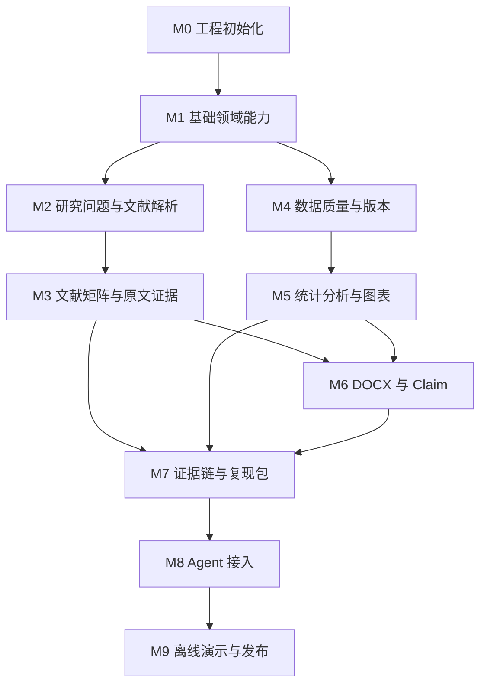

# 研证链 AI（RECA）实施路线图

> 面向高校科研训练的全流程可信科研智能体
> Research Evidence Chain Agent
> RECA 0.1 Competition Edition 开发执行计划

---

<!-- DOCUMENT_COMPOSITION_START -->
## 文档组成

本入口文档与其列出的子文档共同构成本领域的正式开发基准。
入口文档负责核心决策、红线和索引，子文档负责详细规范。
两者发生冲突属于文档缺陷，开发者和 Codex 不得自行猜测。

- [M1_FOUNDATION.md](./roadmap/milestones/M1_FOUNDATION.md)
- [M2_RESEARCH_AND_LITERATURE.md](./roadmap/milestones/M2_RESEARCH_AND_LITERATURE.md)
- [M3_EVIDENCE_MATRIX.md](./roadmap/milestones/M3_EVIDENCE_MATRIX.md)
- [M4_DATA_QUALITY.md](./roadmap/milestones/M4_DATA_QUALITY.md)
- [M5_ANALYSIS_AND_FIGURES.md](./roadmap/milestones/M5_ANALYSIS_AND_FIGURES.md)
- [M6_MANUSCRIPT_AND_CLAIMS.md](./roadmap/milestones/M6_MANUSCRIPT_AND_CLAIMS.md)
- [M7_EVIDENCE_AND_EXPORT.md](./roadmap/milestones/M7_EVIDENCE_AND_EXPORT.md)
- [M8_AGENT.md](./roadmap/milestones/M8_AGENT.md)
- [M9_DEMO_AND_RELEASE.md](./roadmap/milestones/M9_DEMO_AND_RELEASE.md)
- [DELIVERY_WORKFLOW.md](./roadmap/DELIVERY_WORKFLOW.md)
- [RISK_SCOPE_AND_RELEASE.md](./roadmap/RISK_SCOPE_AND_RELEASE.md)

`archive/` 为非权威历史材料。
<!-- DOCUMENT_COMPOSITION_END -->

## 文档信息

| 项目     | 内容                                                                                                                                              |
| ------ | ----------------------------------------------------------------------------------------------------------------------------------------------- |
| 文档名称   | `IMPLEMENTATION_ROADMAP.md`                                                                                                                     |
| 文档版本   | 1.5.0                                                                                                                                           |
| 适用项目版本 | RECA 0.1 Competition Edition                                                                                                                    |
| 文档状态   | APPROVED FOR M1 DEVELOPMENT                                                                                                                    |
| 文档类型   | 实施路线图、里程碑计划、任务依赖与交付门禁                                                                                                                           |
| 主要读者   | 项目负责人、产品负责人、架构负责人、前端开发、后端开发、AI 开发、测试人员、Codex                                                                                                    |
| 负责人    | RECA Team                                                                                                                                       |
| 最后更新时间 | 2026-07-31                                                                                                                                      |
| 建议位置   | `docs/IMPLEMENTATION_ROADMAP.md`                                                                                                                |
| 上位文档   | `README.md`、`AGENTS.md`、`docs/PRODUCT_REQUIREMENTS.md`、`docs/ARCHITECTURE.md`、`docs/DATA_MODEL_AND_WORKFLOW.md`、`docs/API_AI_TOOL_CONTRACTS.md` |
| 关联文档   | `docs/TEST_AND_ACCEPTANCE.md`、`docs/SECURITY_AND_OPEN_SOURCE.md`                                                                                |

---

## 变更记录

| 版本    | 日期         | 状态     | 变更说明                                                 | 负责人       |
| ----- | ---------- | ------ | ---------------------------------------------------- | --------- |
| 1.0.0 | 2026-07-29 | Draft  | 建立 RECA 0.1 从工程初始化到比赛发布的实施路线图                        | RECA Team |
| 1.1.0 | 2026-07-29 | Review | 补充 P0-Must 与 P0-Full、里程碑依赖、Codex 任务拆分、阶段门禁、风险与离线演示要求 | RECA Team |
| 1.1.0 | 2026-07-29 | Approved | 确认为 M0 开发前正式基准 | Myles-7 |
| 1.2.0 | 2026-07-30 | Approved | 吸收 ARS-Codex 的阶段、快照、审核与降级设计 | RECA Team |
| 1.3.0 | 2026-07-30 | Conditional Approval | M0 As-Built 同步、M1 门禁、Prompt 治理前移与跨文档一致性修复 | RECA Team |
| 1.4.0 | 2026-07-31 | Conditional Approval | 同步效果优先的开源复用、轻量许可证审查和 Competition Edition 安全分层 | RECA Team |
| 1.5.0 | 2026-07-31 | Conditional Approval | 为 M1-M9 增加 Research、Spike、Decision、Integration 接入步骤和第三方验收门禁 | RECA Team |

---

# 1. 文档目的

本文档用于将 RECA 的产品需求、技术架构、领域模型、API 契约、测试标准和安全要求转换为可以逐步执行的开发计划。

本文档重点回答：

1. RECA 应按什么顺序开发；
2. 各模块之间存在哪些前置依赖；
3. 哪些能力可以并行开发；
4. 哪些能力必须在其他能力完成后开发；
5. 每个里程碑需要交付哪些后端、前端、数据库、API、测试和文档内容；
6. 第一个可以对外展示的闭环何时形成；
7. P0-Must 与 P0-Full 如何分层交付；
8. Codex 应如何拆分和执行开发任务；
9. 哪些缺陷会阻止进入下一阶段；
10. 什么时候才允许接入科研总控 Agent；
11. 什么时候可以进入比赛演示和发布阶段；
12. 项目进度、风险、阻塞和范围变化如何管理。

本文档不重新定义产品需求、数据模型、API、技术栈、安全规则或测试标准。

当本文档与其他正式文档发生冲突时，应以对应领域的权威文档为准。

---

# 2. 文档权威边界

## 2.1 本文档负责

本文档是以下内容的执行基准：

* 开发阶段；
* 里程碑顺序；
* 前置依赖；
* 阶段交付物；
* 阶段完成条件；
* 阶段验收门禁；
* P0-Must 和 P0-Full 的实施顺序；
* Codex 任务拆分顺序；
* 并行开发边界；
* 阻塞项处理；
* 风险与降级安排；
* 演示检查点；
* 发布准备计划。

## 2.2 本文档不负责

| 内容                  | 权威文档                          |
| ------------------- | ----------------------------- |
| 产品功能和范围             | `PRODUCT_REQUIREMENTS.md`     |
| 技术栈和模块边界            | `ARCHITECTURE.md`             |
| 领域对象、字段、关系和状态机      | `DATA_MODEL_AND_WORKFLOW.md`  |
| API、AI Schema 和工具参数 | `API_AI_TOOL_CONTRACTS.md`    |
| 测试、指标和发布门禁          | `TEST_AND_ACCEPTANCE.md`      |
| 安全、隐私和许可证           | `SECURITY_AND_OPEN_SOURCE.md` |
| Codex 行为和代码修改规范     | `AGENTS.md`                   |

## 2.3 冲突处理

发现路线图与核心文档冲突时：

1. 不得通过修改路线图绕过正式需求；
2. 不得通过调整排期降低 Competition Edition 最小硬护栏；企业生产强化按安全权威文档延期；
3. 不得通过“演示需要”覆盖数据不可变和审批规则；
4. 不得在路线图中自行新增 P0 功能；
5. 应先识别冲突所属领域；
6. 按对应权威文档修正实现或正式更新文档；
7. 未完成正式变更前，采用更保守且不破坏原始数据的方案；
8. 在里程碑风险记录中说明冲突及处理结果。

---

# 3. 实施总原则

## 3.1 先领域能力，后 Agent

RECA 必须按照以下顺序建设：

```text
领域对象
→ 业务规则
→ 确定性工具
→ Application Service
→ API
→ 前端交互
→ 自动化测试
→ Agent Tool
→ Agent 编排
```

禁止采用以下顺序：

```text
先做聊天页面
→ 先接模型
→ 让模型直接操作数据
→ 后补领域模型和权限
```

Agent 只能编排已经独立可用、已通过测试且拥有正式 Tool Contract 的业务能力。

## 3.2 先纵向闭环，后横向扩展

优先形成一条能够真实运行的端到端链路，而不是同时实现大量未连通的页面。

优先顺序：

```text
一个主题
→ 一组真实文献
→ 一份真实数据
→ 一次确定性分析
→ 一张图表
→ 一份 DOCX
→ 一个 Claim
→ 一个复现包
```

之后再扩展：

* 更多统计方法；
* 更多图表；
* 更多文献来源；
* 更多论文检查规则；
* 更多 Agent 工具；
* 更多角色与协作能力。

## 3.3 原始输入不可变

任何开发阶段都必须遵守：

* 原始 PDF 不覆盖；
* 原始 CSV/XLSX 不覆盖；
* Original DatasetVersion 不覆盖；
* 原始 DOCX 不覆盖；
* 已完成 AnalysisResult 不修改；
* 已批准 ApprovalRecord 不无痕修改；
* 已完成 ToolCall 和 ModelInvocation 不无痕修改；
* ReproPackage 创建后不原地修改。

## 3.4 计划、审批、执行和结果分离

所有高风险能力必须保持：

```text
计划
→ 校验
→ 预览
→ 审批
→ 执行
→ 结果
→ 审计
```

适用：

* 数据处理；
* 分析运行；
* 图表生成；
* DOCX 自动修复；
* 复现包导出；

只读查询、检索、解析、质量扫描、候选生成和预览可自动执行；低风险采用使用轻量确认。正式审批集中于改变科研数据、正式结果、版本关系或不可逆输出的高风险操作，不能把每次读取、模型调用或低风险 ToolCall 都升级为 `ApprovalRecord`。

## 3.5 效果优先的开源复用

每个 M1-M9 里程碑都可以选择成熟开源实现，不要求先自行重写，也不要求预先建设复杂 Adapter。集成 PR 必须同时完成轻量许可证与来源检查、固定上游 Commit/Tag、选择集成模式、保留归属并记录修改；无许可证或来源不明内容不得复制。

直接依赖、独立服务、Fork、Vendor、Git Submodule、选择性复制和清洁室重实现均为可选模式。是否使用 Adapter 取决于替换需求、领域污染、离线 Mock、许可证或安全边界和维护成本。企业级安全强化不阻塞 Competition Core，但科研真实性、原始不可变、项目隔离、正式统计确定性和高风险审批不得降低。

ARS-Codex 的实际复制或运行时接入必须在相关开发阶段单独完成许可证、归属和架构记录；允许复用不提前 M8，不改变单总控 Agent，也不允许自由多 Agent。

每个第三方能力在对应里程碑按以下顺序推进：

```text
Research
→ Spike
→ Decision
→ Integration
```

`Research` 固定仓库、Commit、许可证、现有 RECA 状态和候选边界；`Spike` 用主演示样例比较真实效果、资源、失败和回退；`Decision` 选择直接依赖、Provider/Adapter、服务、Vendor、资源快照、设计参考或延期；`Integration` 才修改依赖或运行时，并在同一 PR 完成测试、实现元数据、来源、许可证、归属、Notices 和限制记录。Spike 未通过时保留回退或延期，不得用研究结论冒充已经实现。
* 有副作用的 Agent 工具。

## 3.5 确定性能力必须可脱离 Agent 运行

以下能力在接入 Agent 前必须能够通过 API 或测试独立运行：

* 文献检索；
* PDF 解析；
* 文献字段抽取；
* EvidenceSpan 定位；
* 数据质量检查；
* 数据转换；
* 统计分析；
* 图表生成；
* DOCX 检查；
* 证据链查询；
* 复现包导出。

## 3.6 每个里程碑必须可测试

里程碑完成不等于页面可打开。

每个里程碑必须至少满足：

* 核心领域规则有单元测试；
* API 与 Schema 有契约测试；
* 权限和项目隔离有测试；
* 失败路径有测试；
* 幂等和重复提交有测试；
* 关键文件哈希有测试；
* 阶段演示流程可重复运行。

## 3.7 比赛稳定性优先于功能数量

当工期、性能、外部服务或团队能力不足时，优先保证：

1. P0-Must 闭环完整；
2. 文献与数据来源真实；
3. 正式数字确定性计算；
4. 用户审批有效；
5. 原始文件不可变；
6. 证据链可以追溯；
7. 离线演示可用；
8. 失败有明确降级。

不得为了增加入口数量牺牲主流程稳定性。

---

# 4. 交付范围摘要

## 4.1 P0-Must / Competition Core

P0-Must 是比赛现场必须稳定、真实运行的最小完整闭环：项目与研究问题、真实文献和 PDF、十字段文献矩阵与 EvidenceSpan、数据版本与质量处理、经批准的确定性分析和图表、DOCX 与 Claim 审核、跨文献—数据—分析—图表—论文的证据链、ReproPackage、受控单总控 Agent，以及离线演示项目。

完整产品范围由 [PRODUCT_REQUIREMENTS.md](PRODUCT_REQUIREMENTS.md) 唯一权威定义。里程碑文件不得通过实施顺序增加、删除或降级 P0-Must。

## 4.2 P0-Full

P0-Full 在 Competition Core 上补齐完整统计方法与图表、批量文献/PDF 能力、细粒度权限、通用 Job 与 SSE 恢复、完整 DOCX 检查与低风险修复、完整证据图与失效传播、完整复现包、更多受控 Agent Tool、离线降级、黄金集和性能测试。

## 4.3 P1

P1 包含 LaTeX、扫描 PDF 高精度 OCR、复杂统计模型、实时协作、在线 Word、任意 Python/SQL/Shell/Notebook、大规模引文网络、图数据库、自建搜索、自由多 Agent、企业级多租户、Kubernetes 和大规模分布式任务平台。P1 不阻塞 RECA 0.1 发布，不得提前进入 M1–M9。

# 5. 里程碑总览

| 里程碑 | 名称           | 核心目标               | 主要输出                          | P0-Must |
| --- | ------------ | ------------------ | ----------------------------- | ------- |
| M0  | 工程初始化        | 建立可运行、可测试、可部署的基础工程 | 前后端、基础设施、CI、配置                | 是       |
| M1  | 基础领域能力       | 建立项目、文件、审批、任务和审计底座 | Project、Artifact、Approval、Job | 是       |
| M2  | 研究问题与文献解析    | 跑通研究问题、真实文献、PDF 解析 | RQ、OpenAlex、Document          | 是       |
| M3  | 文献矩阵与原文证据    | 形成第一个对外可展示的文献闭环    | 十字段矩阵、EvidenceSpan            | 是       |
| M4  | 数据质量与版本      | 建立数据身份证、质量、审批和新版本  | DatasetVersion、CleaningPlan   | 是       |
| M5  | 统计分析与图表      | 完成确定性分析和可复现图表      | AnalysisResult、Figure         | 是       |
| M6  | DOCX 与 Claim | 检查论文并形成可追踪论述       | ManuscriptIssue、Claim         | 是       |
| M7  | 证据链与复现包      | 连接全流程并导出复现材料       | Evidence Graph、ReproPackage   | 是       |
| M8  | Agent 接入     | 让 Agent 受控编排已有能力   | AgentRun、ToolCall             | 是       |
| M9  | 离线演示与发布      | 完成稳定性、合规和比赛验收      | Demo、Release Candidate        | 是       |

---

# 6. 依赖关系



## 6.1 严格前置依赖

以下依赖不得绕过：

* M1 必须在 M2、M4 前完成；
* M2 必须在 M3 前完成；
* M4 必须在 M5 前完成；
* M3 和 M5 必须在 M6 的跨模块数字核对前完成；
* M3、M5、M6 必须在 M7 完整证据链前完成；
* M7 核心查询能力必须在 M8 Agent 编排前完成；
* P0-Must E2E 必须在 M9 发布前通过。

## 6.2 可并行部分

以下任务可以在契约冻结后并行：

* M2 前端文献页面与后端 OpenAlex Adapter；
* M3 PDF.js 高亮与后端 EvidenceSpan API；
* M4 数据预览前端与质量规则引擎；
* M5 图表前端配置与统计引擎；
* M6 DOCX 问题页面与检查规则；
* M7 React Flow 页面与后端证据图查询；
* M9 演示脚本与发布测试准备。

并行开发前必须先冻结：

* 领域对象；
* 枚举；
* API 路径；
* 请求响应 Schema；
* 错误码；
* 测试样例。

---

<a id="milestone-m0"></a>

# 7. M0 完成基线

M0 是已完成的工程历史，不再在路线图复制完整计划。

```text
Status: COMPLETED
Merge commit: 79825914c7c975e8be256a5a89abe812f486769e
Completion tag: m0-complete
Required CI: PASS
Clean-room acceptance: PASS, exit code 0
M1 Entry Decision: ALLOWED
Open risks: M0-ISSUE-0006 LOW; M0-ISSUE-0009 LOW
```

六项 required CI 必须继续保留：

1. `backend-quality`
2. `frontend-quality`
3. `migration-test`
4. `compose-smoke`
5. `security-supply-chain`
6. `e2e-smoke`

涉及基础设施、迁移、Settings/Secret、Celery/Worker、MinIO/GROBID、健康检查或 generated/adapter 边界的变更必须继续执行隔离 clean-room acceptance。

两个非阻断 LOW 风险保持可见：

* `M0-ISSUE-0006`：Babel 7 advisory；不得以破坏性 Babel 8 升级或隐藏告警消除记录。
* `M0-ISSUE-0009`：Windows 默认 Playwright/Bun 入口问题；继续使用已验证的 shell/Compose 配置。

正式证据：

* [M0 Development Summary](reports/M0_DEVELOPMENT_SUMMARY.md)
* [M0 Acceptance Report](acceptance/M0_ACCEPTANCE_REPORT.md)
* [M0 Issue Register](acceptance/M0_ISSUE_REGISTER.md)
* [M0 Final Review](acceptance/M0_FINAL_REVIEW.md)
* [M0 Regression Baseline](testing/M0_REGRESSION_BASELINE.md)

M0 Regression Baseline 适用于 M1–M9，后续里程碑不得让 M0 已通过能力退化。

# 8. M1–M9 交付索引

| 里程碑 | 状态 | 严格前置依赖 | 交付摘要 | 详细文件 |
| --- | --- | --- | --- | --- |
| M1 | COMPLETION APPROVED | M0 COMPLETED | 项目、Artifact、Approval、Job、审计与 Prompt 治理底座 | [M1 Foundation](roadmap/milestones/M1_FOUNDATION.md) |
| M2 | COMPLETION APPROVED | M1 | 研究问题、检索计划、真实文献与 PDF 解析 | [M2 Research and Literature](roadmap/milestones/M2_RESEARCH_AND_LITERATURE.md) |
| M3 | COMPLETION APPROVED | M2 COMPLETED | 十字段矩阵、EvidenceSpan、用户决策、当前证据分析与 3 个候选问题；工程 Exit Gate 已通过，真实论文科学指标延期且未测量 | [M3 Evidence Matrix](roadmap/milestones/M3_EVIDENCE_MATRIX.md) |
| M4 | COMPLETED | M1 | DatasetVersion、质量检查、CleaningPlan 与转换；Exit Gate 于 2026-08-04 通过 | [M4 Data Quality](roadmap/milestones/M4_DATA_QUALITY.md) |
| M5 | COMPLETED | M4 | 六种确定性分析、不可变 AnalysisResult、五类科研 Figure 与生产 Workspace；Exit Gate 于 2026-08-05 通过 | [M5 Analysis and Figures](roadmap/milestones/M5_ANALYSIS_AND_FIGURES.md) |
| M6 | APPROVED_WITH_ISSUES | M3 + M5 | Stage 5 Exit Gate 通过；保留 Windows host-only PostgreSQL runner 限制 | [M6 Manuscript and Claims](roadmap/milestones/M6_MANUSCRIPT_AND_CLAIMS.md) |
| M7 | COMPLETION APPROVED | M3 + M5 + M6 | Evidence Graph、失效传播、Export 与 ReproPackage；Exit Gate 于 2026-08-06 通过 | [M7 Evidence and Export](roadmap/milestones/M7_EVIDENCE_AND_EXPORT.md) |
| M8 | COMPLETION APPROVED | M7 COMPLETION APPROVED | One governed ResearchOrchestrator, durable Approval-bound resume, typed Tool/Worker reconciliation and production Agent panel; Exit Gate passed 2026-08-07 | [M8 Agent](roadmap/milestones/M8_AGENT.md) |
| M9 | ENTRY ALLOWED | M8 EXIT PASS | Offline demo and release work may begin from the frozen M8 Tool, Approval, provider and direct-workspace boundaries | [M9 Demo and Release](roadmap/milestones/M9_DEMO_AND_RELEASE.md) |

PromptContract manifest、ModelInvocation 和 requested/max/effective 数据访问治理必须在 M1 建立；Git 管理的清单固定为 `backend/app/agents/prompts/prompt-manifest.yaml`，供 M2/M3 模型任务使用。正式 Agent 运行时仍在 M8 接入。`MANU-P0-018` 仍由 M6 交付。

# 9. 公共 Entry / Exit Gate

## 9.1 Entry Gate

进入任一里程碑前必须：

1. 所有严格前置里程碑的 Exit Gate 已通过；
2. M0 Regression Baseline 无回归；
3. 领域对象、枚举、API、Schema、错误码和测试样例已冻结到足以实施；
4. BLOCKER、CRITICAL、HIGH 问题已解决或存在经批准的阻塞决定；
5. 当前范围、Competition Core 与 P0-Full 边界明确。

## 9.2 Exit Gate

完成任一里程碑必须：

1. 本里程碑 Competition Core 完成并通过对应单元、契约、集成或 E2E；
2. 数据模型、API、前端、测试、安全和 Prompt/AI 要求与权威文档一致；
3. 原始对象不可变、计划—审批—执行—结果分离、确定性计算和项目隔离未被破坏；
4. 阻塞下一阶段的问题为零；
5. 风险、降级、未完成 P0-Full 和验证证据被显式记录。

具体 Entry/Exit Gate 以各里程碑文件为准。分支、PR、任务拆分和状态管理见 [DELIVERY_WORKFLOW.md](roadmap/DELIVERY_WORKFLOW.md)。

# 10. 当前风险与范围控制

当前主要风险包括 GROBID/模型/PDF 定位不稳定、P0 范围膨胀、Agent 提前接入、许可证不清、外网与资源限制、复杂 DOCX，以及统计结果与图表漂移。任何降级必须显式披露，不得静默跳过或把不可用显示为通过。

完整风险登记、范围裁剪、六周排期、演示检查点和发布准备见 [RISK_SCOPE_AND_RELEASE.md](roadmap/RISK_SCOPE_AND_RELEASE.md)。

# 11. 子路线图导航

## 11.1 里程碑

* [M1 Foundation](roadmap/milestones/M1_FOUNDATION.md)
* [M2 Research and Literature](roadmap/milestones/M2_RESEARCH_AND_LITERATURE.md)
* [M3 Evidence Matrix](roadmap/milestones/M3_EVIDENCE_MATRIX.md)
* [M4 Data Quality](roadmap/milestones/M4_DATA_QUALITY.md)
* [M5 Analysis and Figures](roadmap/milestones/M5_ANALYSIS_AND_FIGURES.md)
* [M6 Manuscript and Claims](roadmap/milestones/M6_MANUSCRIPT_AND_CLAIMS.md)
* [M7 Evidence and Export](roadmap/milestones/M7_EVIDENCE_AND_EXPORT.md)
* [M8 Agent](roadmap/milestones/M8_AGENT.md)
* [M9 Demo and Release](roadmap/milestones/M9_DEMO_AND_RELEASE.md)

## 11.2 公共规则

* [Delivery Workflow](roadmap/DELIVERY_WORKFLOW.md)
* [Risk, Scope and Release](roadmap/RISK_SCOPE_AND_RELEASE.md)

本入口文档与上述子文档共同构成实施路线图的正式开发基准。入口负责实施原则、范围摘要、总依赖、状态和公共门禁；子文档负责详细规范。发生冲突属于文档缺陷，开发者和 Codex 不得自行猜测。
