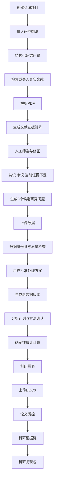

# 研证链 AI（RECA）产品需求文档

> 面向高校科研训练的全流程可信科研智能体
> Research Evidence Chain Agent

---

## 文档信息

| 项目     | 内容                                                                                                                               |
| ------ | -------------------------------------------------------------------------------------------------------------------------------- |
| 文档名称   | `PRODUCT_REQUIREMENTS.md`                                                                                                        |
| 文档版本   | 1.0.0                                                                                                                            |
| 适用项目版本 | RECA 0.1 Competition Edition                                                                                                     |
| 文档状态   | Approved                                                                                                                         |
| 文档类型   | 产品需求与范围基准                                                                                                                        |
| 主要读者   | 产品负责人、前端开发、后端开发、AI 开发、测试人员、Codex                                                                                                 |
| 负责人    | RECA Team                                                                                                                        |
| 最后更新时间 | 2026-07-29                                                                                                                       |
| 上位文档   | `README.md`、`AGENTS.md`                                                                                                          |
| 关联文档   | `ARCHITECTURE.md`、`DATA_MODEL_AND_WORKFLOW.md`、`API_AI_TOOL_CONTRACTS.md`、`TEST_AND_ACCEPTANCE.md`、`SECURITY_AND_OPEN_SOURCE.md` |

---

## 变更记录

| 版本    | 日期         | 状态    | 变更说明                            | 负责人       |
| ----- | ---------- | ----- | ------------------------------- | --------- |
| 1.0.0 | 2026-07-29 | Draft | 基于现有六份方案文档重构为 RECA 0.1 唯一产品需求基准 | RECA Team |
| 1.0.0 | 2026-07-29 | Approved | 确认为 M0 开发前正式基准 | Myles-7 |

---

# 1. 文档目的

本文档是 RECA 0.1 的唯一产品需求和范围基准，用于回答以下问题：

1. 项目为什么存在；
2. 项目服务哪些用户；
3. 比赛版本必须完成哪些能力；
4. 各项功能的输入、处理、输出和限制是什么；
5. 哪些科研判断必须由用户确认；
6. 哪些能力明确不进入 RECA 0.1；
7. 页面应该如何组织；
8. 系统达到什么条件才算完成。

本项目早期材料覆盖文献检索、文献综述、选题推荐、数据处理、科研图表、论文辅助、学术规范和实验误差等多个方向。RECA 0.1 不再追求九个模块全面铺开，而是收缩为一条稳定、真实、可追溯、可复现的科研闭环。

---

# 2. 文档权威性

## 2.1 正式需求来源

RECA 0.1 的功能开发只以本文档为正式产品需求来源。

`docs/archive/` 中的历史文件仅作为设计过程参考，不得直接作为开发任务依据。

## 2.2 冲突处理规则

当不同文档出现冲突时：

1. 开发红线以 `AGENTS.md` 为准；
2. 功能范围以本文档为准；
3. 数据对象和状态以 `DATA_MODEL_AND_WORKFLOW.md` 为准；
4. 请求响应和 AI Schema 以 `API_AI_TOOL_CONTRACTS.md` 为准；
5. 技术实现边界以 `ARCHITECTURE.md` 为准；
6. 完成标准以 `TEST_AND_ACCEPTANCE.md` 为准；
7. 安全和许可证以 `SECURITY_AND_OPEN_SOURCE.md` 为准。

## 2.3 需求变更规则

本文档状态达到 `Approved` 后：

* 新增 P0 功能必须经过产品负责人批准；
* 新增功能必须说明对工期、数据模型、API、测试和安全的影响；
* 新增功能必须同步更新验收矩阵；
* 不允许通过聊天、口头说明或临时提示词改变正式范围；
* 比赛功能冻结后只能修复阻断性问题。

---

# 3. 产品概述

## 3.1 项目名称

中文名称：

> 研证链 AI——面向高校科研训练的全流程可信科研智能体

英文名称：

> Research Evidence Chain Agent

英文简称：

> RECA

## 3.2 一句话定位

研证链 AI 是一个面向本科生、研究生和教师的可信科研智能体平台，将真实文献、原文证据、数据版本、确定性分析、科研图表和论文论述连接为可追溯、可复核、可复现的科研工作流。

## 3.3 产品核心价值

RECA 的核心价值不在于单独完成一次搜索、一次统计或一次论文检查，而在于将科研过程中的关键对象统一关联：

```text
研究问题
→ 文献记录
→ 原文证据
→ 数据集
→ 数据版本
→ 处理记录
→ 分析计划
→ 分析运行
→ 统计结果
→ 科研图表
→ 论文论述
→ 人工确认
→ 可信审核
```

## 3.4 产品形态

RECA 0.1 是一个 Web 前后端项目，主要包含：

* React/Vite 前端；
* FastAPI 后端；
* Celery 异步任务；
* PostgreSQL + pgvector；
* MinIO/S3 兼容对象存储；
* GROBID 文献解析服务；
* Valkey 消息队列和缓存；
* 一个受控科研总控智能体；
* 多组白名单工具；
* 跨模块科研证据链。

---

# 4. 产品背景

## 4.1 科研工具割裂

高校师生通常需要同时使用：

* 学术数据库；
* PDF 阅读器；
* 文献管理软件；
* Excel；
* SPSS、Python 或 R；
* 科研绘图工具；
* Word；
* 查重与格式检查系统。

不同工具之间通常没有统一的数据模型，导致：

* 文献结论无法快速返回原文；
* 数据清洗无法与分析结果绑定；
* 图表无法确认来自哪个数据版本；
* 论文数字无法确认来自哪次分析；
* AI 建议无法确认依据；
* 用户确认过程没有记录；
* 研究过程难以复现。

## 4.2 文献检索问题

传统检索流程常见问题：

* 用户不知道关键词；
* 中英文术语不统一；
* 查询范围过大或过小；
* 文献结果大量重复；
* 文献表面相关但研究对象不符；
* 文献使用的方法不符合需求；
* 阅读优先级不明确；
* AI 容易虚构论文。

## 4.3 文献综述问题

传统综述需要人工逐篇整理：

* 研究对象；
* 样本量；
* 核心变量；
* 理论基础；
* 研究设计；
* 分析方法；
* 测量工具；
* 主要结论；
* 研究局限。

普通 AI 总结还可能出现：

* 把研究假设写成研究结果；
* 忽略样本范围；
* 忽略方法差异；
* 忽略少数反例；
* 将“当前文献中未发现”写成“学术界没有研究”；
* 无法提供原文和页码。

## 4.4 数据分析问题

科研数据处理中常见：

* CSV 或 Excel 字段混乱；
* 缺失值编码不统一；
* 异常值未核验就删除；
* 类型和单位不一致；
* 分组标签错误；
* 用户不清楚变量角色；
* 不知道选择哪种统计方法；
* 大模型直接生成错误数字；
* 分析过程没有版本和日志。

## 4.5 科研图表问题

常见问题包括：

* 图表类型与研究问题不匹配；
* 横纵轴名称缺失；
* 单位不明确；
* 误差线没有说明；
* 坐标轴截断导致误导；
* 图表与统计结果不一致；
* 图注不完整；
* 图表无法重新生成。

## 4.6 论文质控问题

论文草稿中容易出现：

* 文内引用和文末参考文献不匹配；
* 样本量前后不一致；
* 正文数字与表格、图表不一致；
* 把相关关系描述为因果关系；
* 把单篇研究写成学术共识；
* 研究结论超出样本范围；
* 同一术语多种写法；
* 图表编号和引用不一致。

---

# 5. 产品目标

## 5.1 科研提效

减少以下重复劳动：

* 研究问题拆解；
* 中英文检索词生成；
* 文献元数据整理；
* 多篇文献横向比较；
* 数据质量检查；
* 基础统计计算；
* 科研图表绘制；
* 引用和数字核对；
* 复现资料整理。

## 5.2 科研提质

通过规则、确定性程序和审核机制降低：

* 虚构文献；
* PDF 抽取错误；
* 数据处理错误；
* 统计方法误用；
* 图文数字不一致；
* 引用遗漏；
* 因果夸大；
* 术语混乱；
* 无依据研究空白。

## 5.3 科研可信

所有重要输出尽量具有：

* 来源；
* 原文；
* 页码；
* 数据版本；
* 分析运行；
* 代码；
* 图表；
* 用户确认；
* 审核状态；
* 限制说明。

## 5.4 科研可复现

每次数据处理和分析保存：

* 输入版本；
* 参数；
* 代码；
* 依赖版本；
* 环境；
* 输出；
* 日志；
* 创建人；
* 时间；
* 审批记录。

## 5.5 科研教学

系统应解释：

* 为什么提出某个检索词；
* 为什么某篇文献相关；
* 为什么某个字段低置信度；
* 为什么推荐某种统计方法；
* 哪些统计前提未满足；
* 为什么推荐某种图表；
* 为什么某段论文存在风险。

---

# 6. 产品原则

## 6.1 AI 与确定性程序分工

AI 负责：

* 理解；
* 拆解；
* 规划；
* 推荐；
* 解释；
* 审核；
* 提醒。

确定性程序负责：

* 文献数据源调用；
* PDF 结构解析；
* 数据质量规则；
* 数据转换；
* 统计计算；
* 图表生成；
* 文档结构读取；
* 文件导出。

用户负责：

* 科研问题；
* 文献筛选；
* 数据处理；
* 变量角色；
* 方法选择；
* 结论采纳；
* 论文修改；
* 学术责任。

## 6.2 真实来源优先

* 未检索到的文献不得生成；
* DOI、作者、题目和期刊必须来自真实数据源或用户录入；
* 用户上传全文与外部元数据必须区分；
* 未验证文献必须标记；
* 模型记忆不得作为文献来源。

## 6.3 原始文件不可覆盖

* 原始 PDF 不覆盖；
* 原始数据不覆盖；
* 原始 DOCX 不覆盖；
* 所有处理生成新版本；
* 所有派生文件记录上游对象；
* 所有文件保存哈希。

## 6.4 关键步骤人工确认

系统必须在高风险科研步骤中保留用户最终决定权。

## 6.5 证据范围明确

所有综述和研究空白表述必须说明：

* 基于哪些文献；
* 基于哪个数据版本；
* 基于哪次分析；
* 基于哪些用户确认；
* 当前结果有哪些限制。

## 6.6 少而稳定

比赛版优先保证：

* 主流程稳定；
* 数据真实；
* 输出可追溯；
* 演示可完成；
* 失败有降级。

不以功能入口数量作为完成标准。

---

# 7. 版本范围

## 7.1 当前版本

```text
RECA 0.1 Competition Edition
```

## 7.2 主闭环



## 7.3 P0 模块

1. 科研项目；
2. 研究问题；
3. 文献检索；
4. PDF 文献解析；
5. 文献证据矩阵；
6. 文献筛选；
7. 当前证据集合分析；
8. 候选研究问题；
9. 数据上传与身份证；
10. 数据质量；
11. 数据处理审批；
12. 基础统计；
13. 科研图表；
14. DOCX 论文质控；
15. 科研证据链；
16. 科研复现包；
17. 受控科研总控智能体。

---

# 8. 目标用户

## 8.1 本科生

### 典型场景

* 毕业论文；
* 课程论文；
* 创新训练项目；
* 问卷分析；
* 科研入门；
* 学科竞赛。

### 主要需求

* 不知道如何检索；
* 不会整理文献；
* 选题范围过大；
* 不会判断数据问题；
* 不理解统计方法；
* 不会制作科研图表；
* 不熟悉论文规范。

### 使用目标

在不依赖复杂专业软件的情况下，完成一次基础、真实、可解释、可追溯的科研训练流程。

## 8.2 研究生

### 典型场景

* 开题报告；
* 文献综述；
* 实证研究；
* 论文投稿；
* 学位论文。

### 主要需求

* 大量文献横向比较；
* 共识和争议识别；
* 研究问题收缩；
* 数据处理复现；
* 统计结果核对；
* 图文一致性检查；
* AI 结果核验。

## 8.3 教师

### 典型场景

* 查看学生科研项目；
* 复核文献依据；
* 检查研究设计；
* 检查分析过程；
* 审核论文问题。

### 主要关注

* 文献纳入和排除；
* 结论原文依据；
* 数据来源和许可证；
* 数据处理历史；
* 分析方法和参数；
* 论文数字来源；
* AI 建议；
* 用户确认记录。

## 8.4 管理员

P0 中管理员只负责：

* 用户基础管理；
* 示例项目管理；
* 演示数据管理；
* 服务状态查看；
* 基础模板和规则配置。

P0 不建设完整校级科研管理后台。

---

# 9. 使用模式

## 9.1 科研项目模式

科研项目模式是主产品形态。

所有内容归属于同一个 `ResearchProject`：

* 研究问题；
* 文献；
* 数据；
* 分析；
* 图表；
* 论文；
* Claim；
* 审批；
* 审核；
* 导出。

比赛演示必须以项目模式为主。

## 9.2 快速工具模式

保留三个辅助入口：

1. 快速文献矩阵；
2. 快速数据与图表；
3. 快速论文检查。

快速工具仍需自动创建轻量项目，或要求用户选择已有项目。

不得产生无法归属、无法追踪的孤立结果。

## 9.3 示例项目模式

系统提供已预处理的演示项目，用于：

* 产品教学；
* 比赛展示；
* 无网络降级；
* 功能回归测试。

示例项目必须明确标记：

> 这是预处理示例项目，部分结果已提前生成。

---

# 10. 用户角色与权限

## 10.1 角色

| 角色      | 说明             |
| ------- | -------------- |
| Student | 学生用户           |
| Teacher | 教师用户           |
| Admin   | 系统管理员          |
| System  | 系统任务或后台 Worker |
| Agent   | 受控科研总控智能体      |

## 10.2 项目内权限

| 操作       | 项目所有者 | 项目成员 | 教师成员 |   管理员 |
| -------- | ----: | ---: | ---: | ----: |
| 查看项目     |     是 |    是 |    是 | 按管理范围 |
| 修改项目基础信息 |     是 |  按授权 |  按授权 |     是 |
| 上传文献     |     是 |  按授权 |    是 |     是 |
| 文献纳入或排除  |     是 |  按授权 |    是 |     是 |
| 上传数据     |     是 |  按授权 |    是 |     是 |
| 批准数据处理   |     是 |  按授权 |  可审核 |     是 |
| 批准分析计划   |     是 |  按授权 |  可审核 |     是 |
| 上传论文     |     是 |  按授权 |    是 |     是 |
| 查看证据链    |     是 |    是 |    是 |     是 |
| 导出复现包    |     是 |  按授权 |    是 |     是 |
| 删除项目     |     是 |    否 |    否 |     是 |

## 10.3 Agent 权限

Agent：

* 不能直接写正式统计结果；
* 不能删除原始文件；
* 不能批准用户决策；
* 不能执行任意代码；
* 不能绕过业务状态机；
* 只能调用白名单工具；
* 只能访问当前授权项目；
* 所有 Tool Call 必须记录。

---

# 11. 核心使用场景

## 11.1 场景一：从研究兴趣到候选问题

用户输入：

> 我想研究生成式 AI 对师范生学习的影响。

系统：

1. 提取研究对象和变量；
2. 识别题目范围过大；
3. 追问用户更关注关联、比较还是预测；
4. 生成中英文关键词；
5. 检索真实文献；
6. 形成文献矩阵；
7. 基于当前文献生成 3 个候选问题；
8. 要求用户和导师最终确认。

## 11.2 场景二：批量 PDF 形成文献矩阵

用户上传 10 篇 PDF。

系统：

1. 计算哈希；
2. 识别重复文件；
3. 调用 GROBID；
4. 提取正文、参考文献和页码信息；
5. 生成十字段矩阵；
6. 为结论、样本和方法绑定原文；
7. 标记低置信度字段；
8. 用户修正；
9. 保存修正历史。

## 11.3 场景三：公开数据完成基础分析

用户选择一份公开教育数据。

系统：

1. 展示数据身份证；
2. 检查字段和数据类型；
3. 发现缺失、异常和编码问题；
4. 生成清洗计划；
5. 用户查看受影响记录；
6. 用户批准；
7. 生成新数据版本；
8. 创建分析计划；
9. 检查统计前提；
10. 执行确定性分析；
11. 生成图表；
12. 保存代码和环境。

## 11.4 场景四：检查论文草稿

用户上传 DOCX。

系统：

1. 解析段落和参考文献；
2. 匹配文内引用和文末条目；
3. 提取样本量和统计数字；
4. 与项目分析结果核对；
5. 检查因果夸大；
6. 检查术语；
7. 生成问题清单；
8. 用户逐项采纳或驳回。

## 11.5 场景五：从论文论述追溯证据

用户点击一条论文结论。

系统展示：

* 原文证据；
* 对应 PDF 页码；
* 数据来源；
* 数据版本；
* 清洗记录；
* 分析方法；
* 分析代码；
* 统计结果；
* 图表；
* 用户确认；
* 审核状态。

---

# 12. 功能需求总表

| 模块       | 功能ID范围                            | P0状态 |
| -------- | --------------------------------- | ---- |
| 科研项目     | PROJ-P0-001 至 PROJ-P0-010         | 必须   |
| 研究问题     | RQ-P0-001 至 RQ-P0-009             | 必须   |
| 文献检索     | SEARCH-P0-001 至 SEARCH-P0-012     | 必须   |
| PDF与文献矩阵 | LIT-P0-001 至 LIT-P0-018           | 必须   |
| 文献筛选与分析  | REVIEW-P0-001 至 REVIEW-P0-011     | 必须   |
| 候选问题     | TOPIC-P0-001 至 TOPIC-P0-008       | 必须   |
| 数据与版本    | DATA-P0-001 至 DATA-P0-014         | 必须   |
| 数据质量与处理  | QUALITY-P0-001 至 QUALITY-P0-015   | 必须   |
| 统计分析     | ANALYSIS-P0-001 至 ANALYSIS-P0-016 | 必须   |
| 科研图表     | FIG-P0-001 至 FIG-P0-012           | 必须   |
| 论文质控     | MANU-P0-001 至 MANU-P0-017         | 必须   |
| 证据链      | EVID-P0-001 至 EVID-P0-014         | 必须   |
| 复现包      | EXPORT-P0-001 至 EXPORT-P0-008     | 必须   |
| 总控智能体    | AGENT-P0-001 至 AGENT-P0-010       | 必须   |

---

# 13. 模块一：科研项目管理

## 13.1 模块目标

以科研项目作为统一容器，管理用户从研究想法到复现包导出的全过程。

## 13.2 PROJ-P0-001 创建项目

### 用户目标

创建一个能够承载文献、数据、分析、图表和论文的科研项目。

### 输入

* 项目名称；
* 学科专业；
* 研究方向；
* 项目类型；
* 当前阶段；
* 预计完成日期；
* 项目描述；
* 研究周期；
* 资源限制；
* 可选指导教师；
* 可选成员。

### 系统处理

* 创建 `ResearchProject`；
* 自动创建项目所有者成员关系；
* 创建默认研究阶段；
* 创建初始审计记录；
* 创建项目级对象存储目录；
* 初始化项目统计。

### 输出

* 项目 ID；
* 项目总览；
* 当前阶段；
* 下一步建议。

### 验收标准

* 用户可以创建项目；
* 项目名称不能为空；
* 项目只对授权用户可见；
* 创建操作进入审计日志；
* 项目创建失败不能留下不完整文件目录。

## 13.3 PROJ-P0-002 项目基础信息编辑

用户可修改：

* 名称；
* 描述；
* 专业；
* 方向；
* 阶段；
* 预计完成日期；
* 项目约束。

修改需要保存：

* 修改前；
* 修改后；
* 修改人；
* 修改时间。

## 13.4 PROJ-P0-003 项目阶段

P0 项目阶段：

1. `INTENT`：研究意图；
2. `LITERATURE`：文献准备；
3. `REVIEW`：文献综述；
4. `TOPIC`：研究问题确认；
5. `DATA`：数据准备；
6. `ANALYSIS`：数据分析；
7. `FIGURE`：图表生成；
8. `MANUSCRIPT`：论文质控；
9. `EVIDENCE`：证据链审核；
10. `EXPORT`：成果导出。

阶段可由用户手动设置，也可由系统给出建议。

Agent 不得在未满足前置条件时强制推进阶段。

## 13.5 PROJ-P0-004 项目总览

显示：

* 当前研究问题；
* 当前阶段；
* 文献总数；
* 已纳入文献；
* 待确认文献；
* PDF 解析失败数；
* 数据集数量；
* 当前数据版本；
* 待批准清洗计划；
* 分析运行数量；
* 图表数量；
* 论文问题数量；
* 高风险问题数量；
* 待确认事项；
* 证据链完整度；
* 最近操作。

## 13.6 PROJ-P0-005 项目待办

待办包括：

* 待确认研究问题；
* 待修正文献字段；
* 待决定文献；
* 待批准数据处理；
* 待确认变量；
* 待批准分析计划；
* 待确认图表；
* 待处理论文问题；
* 证据不足 Claim。

## 13.7 PROJ-P0-006 项目成员

P0 支持：

* 添加已注册用户；
* 设置成员角色；
* 移除成员；
* 查看成员列表。

P0 不支持实时协同编辑。

## 13.8 PROJ-P0-007 项目归档

项目可进入 `ARCHIVED` 状态。

归档后：

* 默认只读；
* 不再执行新任务；
* 可导出；
* 可恢复；
* 不删除文件。

## 13.9 PROJ-P0-008 项目删除

项目删除采用软删除。

要求：

* 只有项目所有者或管理员可执行；
* 必须二次确认；
* 删除进入审计日志；
* 原始文件不立即物理删除；
* 数据保留周期由安全文档规定。

## 13.10 PROJ-P0-009 快速工具归属

快速工具必须：

* 选择已有项目；或
* 创建轻量项目。

轻量项目可后续补充名称和研究问题。

## 13.11 PROJ-P0-010 项目操作日志

记录：

* 操作人；
* 操作类型；
* 对象类型；
* 对象 ID；
* 修改摘要；
* 时间；
* 是否 AI 建议；
* 是否用户确认；
* 请求 ID；
* 任务 ID。

---

# 14. 模块二：研究问题

## 14.1 模块目标

将模糊研究兴趣转化为结构化、可编辑、可版本化、可确认的研究问题。

## 14.2 RQ-P0-001 输入研究想法

支持用户输入自然语言。

最小长度和最大长度由 API 契约规定。

## 14.3 RQ-P0-002 结构化提取

输出 `ResearchQuestionSpec`：

* `research_object`；
* `population`；
* `context`；
* `independent_variables`；
* `dependent_variables`；
* `control_variables`；
* `research_goal`；
* `relationship_type`；
* `method_preference`；
* `time_scope`；
* `region_scope`；
* `language_scope`；
* `resource_constraints`；
* `ethical_constraints`；
* `uncertainties`。

## 14.4 RQ-P0-003 信息不足提示

系统识别：

* 对象不明确；
* 变量不明确；
* 关系类型不明确；
* 数据来源不明确；
* 时间范围不明确；
* 研究周期不明确。

P0 不要求复杂多轮问卷，但应给出最多 3 个高价值补充问题。

## 14.5 RQ-P0-004 用户编辑

用户可修改全部结构化字段。

AI 输出不得直接成为正式研究问题。

## 14.6 RQ-P0-005 研究问题版本

每次保存创建 `ResearchQuestionVersion`。

保存：

* 原始文本；
* 结构化字段；
* 修改人；
* 创建时间；
* 上一版本；
* 修改原因；
* 确认状态。

## 14.7 RQ-P0-006 最终确认

用户确认后：

* 当前版本状态为 `CONFIRMED`；
* 创建 `ApprovalRecord`；
* 后续文献查询和分析计划默认引用该版本。

## 14.8 RQ-P0-007 取消确认

用户修改已确认问题时：

* 创建新版本；
* 旧版本保留；
* 依赖旧问题的分析计划可能失效；
* 系统提示影响范围。

## 14.9 RQ-P0-008 研究问题收缩建议

系统可建议：

* 缩小对象；
* 限定地区；
* 限定年份；
* 减少变量；
* 从“影响”改为“关联、比较或预测”；
* 限定方法；
* 限定数据来源。

## 14.10 RQ-P0-009 验收标准

* 模糊文本可转为结构化字段；
* 用户可编辑全部字段；
* 每次修改有版本；
* 未确认问题不能进入正式分析；
* 研究问题输出不包含虚假文献；
* Agent 不能替用户确认。

---

# 15. 模块三：文献检索

## 15.1 模块目标

根据研究问题生成可解释检索策略，并从真实来源获得文献元数据。

## 15.2 SEARCH-P0-001 查询规划

输入：

* 已确认或草稿研究问题；
* 时间范围；
* 语言；
* 文献类型；
* 开放获取偏好；
* 数量上限。

输出：

* 中文核心词；
* 英文核心词；
* 同义词；
* 缩写；
* 相关理论；
* 相关测量工具；
* 对象限定词；
* 方法限定词；
* 布尔检索式；
* 查询限制；
* 风险提示。

## 15.3 SEARCH-P0-002 查询编辑

用户可：

* 增加词；
* 删除词；
* 修改布尔关系；
* 调整时间范围；
* 调整语言；
* 调整文献类型。

## 15.4 SEARCH-P0-003 OpenAlex 检索

系统通过 Provider 调用 OpenAlex。

每条结果保存：

* OpenAlex ID；
* DOI；
* 题目；
* 作者；
* 年份；
* 来源；
* 摘要；
* 开放获取状态；
* 数据源；
* 获取时间；
* 原始响应摘要；
* 验证状态。

## 15.5 SEARCH-P0-004 检索缓存

要求：

* 相同查询可使用缓存；
* 缓存记录查询参数；
* 显示数据获取时间；
* 网络失败可读取演示缓存；
* 不把缓存结果伪装成实时结果。

## 15.6 SEARCH-P0-005 DOI 导入

用户输入 DOI 后：

* 规范化 DOI；
* 查询元数据；
* 检查是否已存在；
* 创建或关联文献记录；
* 记录来源。

## 15.7 SEARCH-P0-006 文献去重

P0 去重依据：

1. DOI 完全匹配；
2. 标准化题目完全匹配；
3. 题目高度相似且作者年份匹配；
4. 用户人工确认。

系统不得无提示删除。

## 15.8 SEARCH-P0-007 相关性解释

每篇文献显示：

* 匹配的研究对象；
* 匹配的变量；
* 匹配的方法；
* 可能用途；
* 与当前问题的差异；
* 推荐阅读级别。

相关性解释必须基于实际元数据或全文，不得虚构摘要内容。

## 15.9 SEARCH-P0-008 真实性状态

状态：

* `VERIFIED`；
* `PARTIALLY_VERIFIED`；
* `UNVERIFIED`；
* `CONFLICTED`；
* `USER_ENTERED`。

## 15.10 SEARCH-P0-009 阅读清单

P0 分类：

* 必读；
* 理论参考；
* 方法参考；
* 扩展阅读；
* 待确认。

用户可修改分类。

## 15.11 SEARCH-P0-010 引用导出

P0 支持：

* GB/T 7714 基础格式；
* BibTeX。

P1 扩展完整 CSL、多格式和 RIS。

## 15.12 SEARCH-P0-011 文献结果加入项目

用户选择后：

* 创建 `LiteratureRecord`；
* 记录来源；
* 设置初始决策状态；
* 可关联已有 PDF。

## 15.13 SEARCH-P0-012 验收标准

* 检索结果来自 Provider 或缓存；
* 不生成不存在的论文；
* 来源可见；
* DOI 去重有效；
* 网络失败有降级；
* AI 推荐词与真实结果明确区分；
* 用户可查看查询计划。

---

# 16. 模块四：PDF 文献与证据矩阵

## 16.1 模块目标

将用户合法上传的学术 PDF 转换为可校正的结构化文献记录和原文证据。

## 16.2 LIT-P0-001 PDF 上传

支持：

* 单文件上传；
* 多文件上传；
* PDF 格式；
* 上传进度；
* 文件大小限制；
* 文件类型检查；
* 文件名标准化。

## 16.3 LIT-P0-002 文件哈希

上传后计算 SHA-256。

用途：

* 文件去重；
* 版本识别；
* 复现包校验；
* 防止覆盖。

## 16.4 LIT-P0-003 重复文件处理

发现重复时：

* 不重复上传文件内容；
* 提示已有文件；
* 允许关联到当前项目；
* 不自动删除已有记录。

## 16.5 LIT-P0-004 GROBID 解析

主解析内容：

* 标题；
* 作者；
* 机构；
* 摘要；
* 章节；
* 正文段落；
* 参考文献；
* 引文标记；
* 页码或坐标信息；
* 图题和表题。

## 16.6 LIT-P0-005 pypdf 回退

GROBID 不可用或失败时：

* 提取基础页级文本；
* 标记解析方式；
* 标记低置信度；
* 不宣称结构抽取完整；
* 允许用户手工补充。

## 16.7 LIT-P0-006 页面信息

保存：

* 页面序号；
* 文本；
* 页内块；
* 章节路径；
* 坐标；
* 解析来源。

## 16.8 LIT-P0-007 文档分块

每个 `DocumentChunk` 保存：

* 文档 ID；
* 页码；
* 章节；
* 内容；
* 块序号；
  -关键词信息；
* Embedding 模型；
* Embedding 版本；
* 元数据。

## 16.9 LIT-P0-008 元数据匹配

系统尝试将 PDF 与检索记录匹配。

匹配依据：

* DOI；
* 标题；
* 作者；
* 年份。

冲突时要求用户确认。

## 16.10 LIT-P0-009 十字段抽取

字段：

1. 题目；
2. 作者；
3. 年份；
4. 研究对象；
5. 样本量；
6. 核心变量；
7. 研究设计；
8. 分析方法；
9. 主要结论；
10. 局限性。

## 16.11 LIT-P0-010 EvidenceSpan

主要语义字段必须尽量生成 `EvidenceSpan`：

* 文档；
* 页码；
* 章节；
* 原文；
* 坐标；
* 提取字段；
* 置信度；
* 解析版本。

## 16.12 LIT-P0-011 置信度

置信度用于提示复核优先级，不表示统计概率。

推荐等级：

* `HIGH`；
* `MEDIUM`；
* `LOW`；
* `UNKNOWN`。

## 16.13 LIT-P0-012 用户修正

用户可以：

* 修改字段；
* 选择正确 EvidenceSpan；
* 输入补充证据；
* 标记无证据；
* 驳回抽取结果。

## 16.14 LIT-P0-013 修正历史

保存：

* 原值；
* 新值；
* 修改人；
* 修改时间；
* 修改原因；
* 原证据；
* 新证据；
* AI 版本。

## 16.15 LIT-P0-014 文献矩阵

默认列：

* 题目；
* 作者；
* 年份；
* 对象；
* 样本；
* 变量；
* 设计；
* 方法；
* 结论；
* 局限；
* 决策；
* 证据状态。

支持：

* 排序；
* 筛选；
* 固定列；
* 字段编辑；
* 证据跳转；
* 导出。

## 16.16 LIT-P0-015 PDF 阅读器

左右分栏：

* 左侧文献矩阵；
* 右侧 PDF 阅读器。

点击字段后：

1. 打开对应 PDF；
2. 跳转页码；
3. 高亮 EvidenceSpan；
4. 展示原文上下文；
5. 展示 AI 抽取值；
6. 提供确认或修正。

## 16.17 LIT-P0-016 解析任务状态

状态：

* `UPLOADED`；
* `QUEUED`；
* `PARSING`；
* `EXTRACTING`；
* `NEEDS_REVIEW`；
* `COMPLETED`；
* `FAILED`；
* `LOW_CONFIDENCE`。

## 16.18 LIT-P0-017 批量处理

P0 目标：

* 单项目稳定处理 5—20 篇 PDF；
* 批量任务显示进度；
* 单篇失败不阻断全部任务；
* 失败可重试。

## 16.19 LIT-P0-018 验收标准

* 原始 PDF 不覆盖；
* 10 篇演示论文可稳定处理；
* 主要结论可跳转原文；
* 用户可修正；
* 修正有历史；
* 扫描件明确提示；
* GROBID 不可用时有回退；
* 不根据未上传全文生成原文证据。

---

# 17. 模块五：文献筛选与当前证据集合分析

## 17.1 REVIEW-P0-001 文献决策

状态：

* `INCLUDED`；
* `EXCLUDED`；
* `UNCERTAIN`。

## 17.2 REVIEW-P0-002 排除理由

排除时可填写：

* 对象不符；
* 变量不符；
* 方法不符；
* 文献类型不符；
* 年份不符；
* 重复文献；
* 全文不可用；
* 质量问题；
* 其他。

## 17.3 REVIEW-P0-003 决策历史

每次决策变化都保留。

## 17.4 REVIEW-P0-004 AI 推荐

AI 可提供：

* 推荐状态；
* 推荐理由；
* 相关字段；
* 置信度。

AI 不得自动完成最终排除。

## 17.5 REVIEW-P0-005 共识识别

系统基于已纳入文献输出：

* 相同结论；
* 支持文献；
* 条件范围；
* 反例；
* 证据强弱提示。

## 17.6 REVIEW-P0-006 争议识别

展示：

* 支持方文献；
* 反对或不支持文献；
* 可能差异；
* 样本差异；
* 方法差异；
* 地区差异；
* 测量差异。

## 17.7 REVIEW-P0-007 当前证据不足

只允许表述：

* 当前文献集合中样本不足；
* 当前文献集合中方法单一；
* 当前文献集合中某群体较少；
* 当前文献集合中纵向证据较少；
* 当前文献集合中结论不一致。

不得断言：

* 学术界完全没有；
* 从未有人研究；
* 已经证明某个空白。

## 17.8 REVIEW-P0-008 原文依据

每项共识、争议或证据不足应关联：

* 支持文献；
* 反对文献；
* EvidenceSpan；
* 页码；
* 抽取字段；
* 置信度；
* 用户确认状态。

## 17.9 REVIEW-P0-009 待核实问题

输出：

* 需要补充的文献；
* 低置信度字段；
* 未核验元数据；
* 冲突结论；
* 缺少全文的记录。

## 17.10 REVIEW-P0-010 结果导出

支持导出：

* 文献矩阵；
* 筛选记录；
* 共识争议摘要；
* 当前证据不足清单。

## 17.11 REVIEW-P0-011 验收标准

* 只分析已纳入文献；
* 结论显示文献范围；
* 反例不可隐藏；
* 每项主要结论有来源；
* 用户可返回原文；
* 不把当前集合缺失扩大为学术界空白。

---

# 18. 模块六：候选研究问题

## 18.1 TOPIC-P0-001 生成条件

至少满足：

* 存在研究问题草稿；
* 存在已纳入文献；
* 文献矩阵已完成主要字段；
* 用户已填写部分资源条件。

## 18.2 TOPIC-P0-002 用户资源输入

包括：

* 专业；
* 已掌握方法；
* 可使用软件；
* 可获得样本；
* 可获得数据；
* 项目周期；
* 团队人数；
* 导师方向；
* 伦理限制；
* 预期成果。

## 18.3 TOPIC-P0-003 生成数量

每次生成 3 个候选研究问题。

## 18.4 TOPIC-P0-004 候选内容

每个候选项包含：

* 问题表述；
* 研究对象；
* 核心变量；
* 研究目标；
* 文献依据；
* 当前证据状态；
* 可能创新；
* 数据要求；
* 方法建议；
* 预计难点；
* 周期；
* 伦理风险；
* 导师确认事项；
* 限制说明。

## 18.5 TOPIC-P0-005 等级评价

评价维度：

* 文献基础；
* 数据可获得性；
* 方法难度；
* 周期可控性；
* 资源匹配；
* 伦理风险。

不显示无依据的 0—100 精确评分。

## 18.6 TOPIC-P0-006 横向比较

以表格展示 3 个候选项。

## 18.7 TOPIC-P0-007 用户选择

用户可以：

* 采用候选项；
* 修改候选项；
* 保存为研究问题新版本；
* 标记暂不采用。

最终采用必须用户确认。

## 18.8 TOPIC-P0-008 验收标准

* 候选项有真实文献依据；
* 不只是热门词组合；
* 说明数据和方法要求；
* 说明限制；
* 评分有理由；
* 不替代导师确认。

---

# 19. 模块七：数据与版本

## 19.1 DATA-P0-001 文件格式

P0 支持：

* CSV；
* XLSX。

XLS、SAV、DTA、RData 放入后续版本。

## 19.2 DATA-P0-002 文件限制

建议默认：

* 单文件不超过 100 MB；
* 不超过 100,000 行；
* 不超过 200 列。

实际限制由部署配置决定。

## 19.3 DATA-P0-003 数据上传

上传后：

* 计算哈希；
* 创建 Artifact；
* 创建 Dataset；
* 创建原始 DatasetVersion；
* 提取基础结构；
* 不修改原始文件。

## 19.4 DATA-P0-004 原始版本

状态为：

```text
ORIGINAL
```

规则：

* 永久只读；
* 不允许覆盖；
* 不允许原地清洗；
* 不允许修改文件内容；
* 可软删除但不可无痕消失。

## 19.5 DATA-P0-005 数据身份证

记录：

* 名称；
* 发布者；
* 来源；
* 来源标识；
* DOI；
* 获取日期；
* 许可证；
* 推荐引用；
* 样本量；
* 字段量；
* 研究对象；
* 字段说明；
* 已知限制；
* 是否含敏感信息。

## 19.6 DATA-P0-006 数据预览

显示：

* 前若干行；
* 字段名；
* 推断类型；
* 缺失比例；
* 唯一值数量；
* 示例值。

## 19.7 DATA-P0-007 字段字典

每个字段保存：

* 原始名称；
* 显示名称；
* 数据类型；
* 研究含义；
* 单位；
* 缺失编码；
* 类别标签；
* 是否 ID；
* 是否敏感；
* 用户确认状态。

## 19.8 DATA-P0-008 变量角色

分析前用户确认：

* 因变量；
* 自变量；
* 控制变量；
* 分组变量；
* ID；
* 时间变量；
* 是否重复测量。

系统不得仅根据字段名做正式决定。

## 19.9 DATA-P0-009 版本关系

每个新版本保存：

* 父版本；
* 创建原因；
* 转换记录；
* 文件哈希；
* 创建人；
* 创建时间；
* 状态。

## 19.10 DATA-P0-010 版本比较

展示：

* 行数变化；
* 列数变化；
* 缺失变化；
* 修改动作；
* 受影响行；
* 受影响字段。

## 19.11 DATA-P0-011 版本失效

当发现错误时，可标记：

* `INVALIDATED`。

失效版本：

* 不删除；
* 不用于新分析；
* 已有关联分析保留；
* 显示失效原因。

## 19.12 DATA-P0-012 数据来源合规提示

缺少许可证时：

* 标记 `LICENSE_UNKNOWN`；
* 提示不建议用于公开演示或分发；
* 不阻止个人本地分析；
* 导出时给出警告。

## 19.13 DATA-P0-013 数据敏感字段提示

发现疑似敏感字段时：

* 高亮；
* 提示用户确认；
* 默认不发送给模型；
* 记录处理决定。

## 19.14 DATA-P0-014 验收标准

* CSV/XLSX 可上传；
* 原始版本不可覆盖；
* 数据身份证可编辑；
* 字段含义由用户确认；
* 新处理生成新版本；
* 版本关系可追溯；
* 敏感字段有提醒。

---

# 20. 模块八：数据质量与处理

## 20.1 QUALITY-P0-001 数据质量概览

展示：

* 行数；
* 列数；
* 缺失比例；
* 重复数量；
* 常量列；
* 类型异常；
* 高风险问题数量；
* 中风险问题数量；
* 一般提示数量。

## 20.2 QUALITY-P0-002 缺失值

识别：

* 空值；
* 空字符串；
* 用户定义缺失编码；
* 疑似特殊缺失编码。

## 20.3 QUALITY-P0-003 重复

识别：

* 完全重复行；
* 重复 ID；
* 指定关键字段重复。

## 20.4 QUALITY-P0-004 类型异常

识别：

* 数值列混入文本；
* 日期列格式混乱；
* 类别列编码混合；
* ID 被推断为数值。

## 20.5 QUALITY-P0-005 范围问题

支持：

* 用户定义范围；
* 明显不合理范围；
* 百分比超范围；
* 年龄等常见字段提示。

未经用户确认，不以字段名自动执行删除。

## 20.6 QUALITY-P0-006 极端值

P0 可使用：

* IQR；
* 标准化分数；
* 用户定义阈值。

输出只能称为：

> 极端值或异常线索。

不得直接称为错误数据。

## 20.7 QUALITY-P0-007 类别一致性

识别：

* 大小写差异；
* 前后空格；
* 同义编码；
* 中英文混合；
* 数值和文本混合编码。

## 20.8 QUALITY-P0-008 分组不平衡

显示：

* 各组样本量；
* 比例；
* 风险提示。

不自动阻止分析，但应提示解释限制。

## 20.9 QUALITY-P0-009 单位疑似不一致

通过：

* 数值尺度；
* 字段说明；
* 用户输入；
* 同组分布差异；

提示疑似单位问题。

## 20.10 QUALITY-P0-010 隐私字段

识别疑似：

* 手机号；
* 身份证号；
* 学号；
* 邮箱；
* 姓名；
* 地址。

## 20.11 QUALITY-P0-011 CleaningPlan

处理建议包括：

* 保留；
* 标记；
* 删除；
* 修正；
* 插补；
* 统一编码；
* 合并类别；
* 统一单位；
* 使用稳健分析；
* 返回原始记录核验。

## 20.12 QUALITY-P0-012 处理预览

批准前显示：

* 目标版本；
* 处理动作；
* 参数；
* 受影响记录；
* 处理前示例；
* 处理后示例；
* 行数变化；
* 风险；
* 可撤销说明。

## 20.13 QUALITY-P0-013 用户批准

只有批准状态的 CleaningPlan 才能执行。

## 20.14 QUALITY-P0-014 执行处理

执行后：

* 创建 DataTransformation；
* 创建新 DatasetVersion；
* 保存代码或确定性参数；
* 重新运行数据质量检查；
* 保存日志。

## 20.15 QUALITY-P0-015 验收标准

* 规则输出具体证据；
* 不自动删除；
* 未批准不执行；
* 处理前可预览；
* 原始数据不覆盖；
* 处理后生成新版本；
* 失败不产生正式版本；
* 支持重新检查。

---

# 21. 模块九：统计分析

## 21.1 ANALYSIS-P0-001 分析目标

用户选择：

* 数据概况；
* 两组比较；
* 变量关系；
* 基础预测。

## 21.2 ANALYSIS-P0-002 AnalysisPlan

保存：

* 研究问题版本；
* 数据版本；
* 分析目标；
* 变量；
* 样本条件；
* 方法；
* 参数；
* 前提检查；
* 替代方法；
* 限制；
* 用户确认。

## 21.3 ANALYSIS-P0-003 描述统计

根据变量类型输出：

数值变量：

* 样本量；
* 缺失量；
* 均值；
* 标准差；
* 中位数；
* 四分位数；
* 最小值；
* 最大值。

类别变量：

* 频数；
* 比例；
* 缺失；
* 类别数。

## 21.4 ANALYSIS-P0-004 独立样本两组比较

适用前提：

* 两个独立组；
* 明确连续结果变量；
* 用户确认独立性。

工具根据前提选择受控方案，并输出警告。

## 21.5 ANALYSIS-P0-005 配对两组比较

要求：

* 存在配对标识或明确重复测量；
* 用户确认配对关系。

## 21.6 ANALYSIS-P0-006 Pearson 相关

要求：

* 两个连续变量；
* 线性关系检查；
* 异常值提示；
* 有效样本量足够。

## 21.7 ANALYSIS-P0-007 Spearman 相关

用于：

* 等级变量；
* 非正态或单调关系；
* Pearson 前提不足的受控场景。

## 21.8 ANALYSIS-P0-008 简单线性回归

P0 只支持：

* 一个主要自变量；
* 一个连续因变量；
* 可选少量固定基础参数由产品进一步限制。

复杂多元模型放入 P1。

## 21.9 ANALYSIS-P0-009 前提检查

包括：

* 数据类型；
* 有效样本量；
* 缺失处理；
* 独立性；
* 正态性提示；
* 方差齐性提示；
* 线性；
* 极端值影响；
* 残差基础检查。

系统必须说明：

* 已满足；
* 未满足；
* 无法判断；
* 需要用户确认。

## 21.10 ANALYSIS-P0-010 用户批准

正式运行前用户确认：

* 数据版本；
* 变量；
* 方法；
* 缺失处理；
* 样本定义；
* 分组定义；
* 前提警告。

## 21.11 ANALYSIS-P0-011 AnalysisRun

每次运行创建独立记录。

状态：

* `QUEUED`；
* `RUNNING`；
* `COMPLETED`；
* `FAILED`；
* `CANCELLED`；
* `INVALIDATED`。

## 21.12 ANALYSIS-P0-012 AnalysisResult

保存：

* 方法；
* 样本量；
* 变量；
* 统计量；
* p 值；
* 置信区间；
* 效应信息；
* 前提结果；
* 警告；
* 环境；
* 代码 Artifact。

## 21.13 ANALYSIS-P0-013 结果解释

AI 只读取结构化结果。

解释必须：

* 不改变数字；
* 不隐藏不显著结果；
* 不将相关写成因果；
* 不超出样本；
* 说明限制；
* 引用分析运行 ID。

## 21.14 ANALYSIS-P0-014 重复运行

相同计划可重新运行，但必须创建新的 AnalysisRun。

## 21.15 ANALYSIS-P0-015 结果失效

当数据版本或计划被判定错误时：

* 标记 AnalysisRun 或 Result 失效；
* 保留原记录；
* 关联图表显示失效提示；
* 相关 Claim 进入待审核。

## 21.16 ANALYSIS-P0-016 验收标准

* 所有数字来自程序；
* 分析绑定数据版本；
* 未确认计划不得运行；
* 结果与基准脚本一致；
* 失败任务不写正式结果；
* 相同输入可复现；
* 不把相关解释为因果；
* 有前提和限制说明。

---

# 22. 模块十：科研图表

## 22.1 FIG-P0-001 表达目标

用户选择：

* 分布；
* 比较；
* 关系；
* 相关结构。

## 22.2 FIG-P0-002 图表推荐

系统根据：

* 表达目标；
* 变量类型；
* 分析结果；
* 分组情况；

推荐图表，并说明原因。

## 22.3 FIG-P0-003 P0 图表类型

* 直方图；
* 箱线图；
* 散点图；
* 带置信区间的组间比较图；
* 相关矩阵。

## 22.4 FIG-P0-004 变量确认

用户确认：

* 横轴；
* 纵轴；
* 分组变量；
* 单位；
* 图表标题；
* 误差线定义。

## 22.5 FIG-P0-005 图表生成

Matplotlib 生成：

* PNG；
* SVG；
* PDF。

## 22.6 FIG-P0-006 图注

图注包含：

* 图表目的；
* 变量；
* 样本；
* 分组；
* 误差线含义；
* 数据版本；
* 分析运行；
* 生成时间。

## 22.7 FIG-P0-007 规范检查

检查：

* 轴标题；
* 单位；
* 图例；
* 图注；
* 样本量；
* 误差线；
* 坐标轴截断；
* 分辨率；
* 图表和数据版本；
* 图表和统计结果。

## 22.8 FIG-P0-008 代码导出

保存绘图代码 Artifact。

## 22.9 FIG-P0-009 参数保存

保存：

* 尺寸；
* 分辨率；
* 字体；
* 标记；
* 排序；
* 轴范围；
* 图例位置。

## 22.10 FIG-P0-010 图表版本

修改参数后创建新 Figure 版本或新 Figure 记录，不覆盖正式图表。

## 22.11 FIG-P0-011 图表确认

用户可标记：

* 草稿；
* 已确认；
* 已失效。

## 22.12 FIG-P0-012 验收标准

* 图表绑定数据版本；
* 图表绑定分析运行；
* 图表数字一致；
* 可导出图像和代码；
* 图注完整；
* 误导性轴有提示；
* 重跑结果基本一致。

---

# 23. 模块十一：DOCX 论文质控

## 23.1 MANU-P0-001 DOCX 上传

仅支持 DOCX。

原文件保存为只读 Artifact。

## 23.2 MANU-P0-002 文档解析

读取：

* 段落；
* 标题样式；
* 表格；
* 图题；
* 表题；
* 参考文献区域；
* 文内引用；
* 数字表达；
* 基础文档顺序。

复杂公式、文本框、修订记录只读或提示不支持。

## 23.3 MANU-P0-003 引用提取

支持常见：

* 作者—年份；
* 顺序编码；
* 中文括号；
* 英文括号。

P0 不保证覆盖所有自定义格式。

## 23.4 MANU-P0-004 文内与文末双向核对

检查：

* 文内有、文末无；
* 文末有、正文未引用；
* 作者年份不一致；
* 顺序号异常；
* 重复条目。

## 23.5 MANU-P0-005 项目文献库核对

论文引用与项目 LiteratureRecord 比较。

状态：

* 已匹配；
* 可能匹配；
* 未匹配；
* 元数据冲突。

## 23.6 MANU-P0-006 DOI 格式检查

检查 DOI 基础格式，不保证在线真实性核验。

## 23.7 MANU-P0-007 样本量检查

提取常见样本量表达，并比较：

* 摘要；
* 方法；
* 结果；
* 表格；
* AnalysisResult。

## 23.8 MANU-P0-008 统计数字核对

可核对：

* p 值；
* 相关系数；
* 回归系数；
* 样本量；
* 百分比；
* 均值；
* 标准差。

正式核对优先基于项目内部 AnalysisResult。

## 23.9 MANU-P0-009 图文一致性

检查：

* 正文引用图表编号；
* Figure 与正文数字；
* 图表编号顺序；
* 图注基础信息。

## 23.10 MANU-P0-010 因果夸大

识别：

* “导致”；
* “决定”；
* “证明”；
* “产生影响”；

并结合分析类型判断是否可能过度。

## 23.11 MANU-P0-011 样本外推

检查：

* 从局部样本扩大到所有学生；
* 从单校扩大到全国；
* 从横断面扩大到长期效果；
* 从当前文献集合扩大到整个领域。

## 23.12 MANU-P0-012 学术共识夸大

检查：

* 单篇研究写成广泛共识；
* 少量文献写成一致结论；
* 忽略反例。

## 23.13 MANU-P0-013 术语一致性

检查：

* 同一变量多种名称；
* 中英文不一致；
* 缩写未定义；
* 研究对象名称变化；
* 方法名称不一致。

## 23.14 MANU-P0-014 基础格式

检查：

* 标题层级；
* 图表编号；
* 缩写首次出现；
* 数字与单位；
* 中英文标点；
* 多余空格。

## 23.15 MANU-P0-015 问题清单

每个问题包含：

* Issue ID；
* 严重程度；
* 章节；
* 段落位置；
* 原文；
* 问题类型；
* 原因；
* 证据；
* 建议；
* 是否可自动修复；
* 状态。

## 23.16 MANU-P0-016 自动修复边界

P0 可自动修复：

* 多余空格；
* 明确的低风险标点；
* 部分基础样式；
* 简单标题样式。

P0 不自动修复：

* 统计数字；
* 引用内容；
* 研究结论；
* 因果表述；
* 公式；
* 复杂图表；
* 修订记录。

## 23.17 MANU-P0-017 验收标准

* 原文件不覆盖；
* 问题可定位；
* 数字可与分析结果核对；
* 引用可双向检查；
* 因果风险可识别；
* 高风险问题不自动改；
* 输出问题清单；
* 处理失败不损坏原文件。

---

# 24. 模块十二：科研证据链

## 24.1 EVID-P0-001 Claim

Claim 表示：

* 综述结论；
* 数据结果表述；
* 论文论述；
* 方法判断；
* 候选研究问题依据。

## 24.2 EVID-P0-002 Claim 类型

* `LITERATURE_CLAIM`；
* `DATA_CLAIM`；
* `ANALYSIS_CLAIM`；
* `MANUSCRIPT_CLAIM`；
* `TOPIC_CLAIM`。

## 24.3 EVID-P0-003 Claim 与文献证据

关系：

* 支持；
* 反对；
* 限定；
* 不确定。

## 24.4 EVID-P0-004 Claim 与数据

关联：

* Dataset；
* DatasetVersion；
* 数据身份证；
* 数据限制。

## 24.5 EVID-P0-005 Claim 与处理

关联：

* CleaningPlan；
* DataTransformation；
* 上游版本；
* 下游版本。

## 24.6 EVID-P0-006 Claim 与分析

关联：

* AnalysisPlan；
* AnalysisRun；
* AnalysisResult；
* CodeArtifact；
* 环境。

## 24.7 EVID-P0-007 Claim 与图表

关联：

* Figure；
* 图表版本；
* 数据版本；
* 分析运行。

## 24.8 EVID-P0-008 Claim 与人工确认

关联：

* ApprovalRecord；
* 确认人；
* 确认时间；
* 确认内容。

## 24.9 EVID-P0-009 Claim 与审核

AuditResult 状态：

* 已验证；
* 待确认；
* 证据不足；
* 来源不完整；
* 数据不一致；
* 图表不一致；
* 可能过度推断；
* 用户驳回。

## 24.10 EVID-P0-010 证据范围

页面必须显示：

* 当前文献数量；
* 数据版本；
* AnalysisRun；
* 用户确认版本；
* 审核时间；
* 限制。

## 24.11 EVID-P0-011 图谱页面

使用 React Flow。

节点可点击：

* 文献节点打开详情；
* EvidenceSpan 跳转 PDF；
* DatasetVersion 查看身份证；
* AnalysisRun 查看方法和代码；
* Figure 打开图表；
* Approval 查看确认记录；
* Audit 查看审核结果。

## 24.12 EVID-P0-012 完整度

完整度用于提示，不作为科研质量分数。

可计算：

* 是否有来源；
* 是否有原文；
* 是否有数据版本；
* 是否有分析结果；
* 是否有确认；
* 是否有审核。

## 24.13 EVID-P0-013 失效传播

上游对象失效时：

* 关联 Claim 标记待审核；
* 图表显示警告；
* 论文问题重新检查；
* 不删除旧链路。

## 24.14 EVID-P0-014 验收标准

* 可展示完整链路；
* 节点可点击；
* 证据范围可见；
* 上游失效有提示；
* 图谱来自后端真实关系；
* 不在前端写死；
* Claim 可追溯到文献或分析结果。

---

# 25. 模块十三：科研复现包

## 25.1 EXPORT-P0-001 导出入口

项目所有者或授权成员可创建导出任务。

## 25.2 EXPORT-P0-002 导出内容

包含：

* 研究问题；
* 检索计划；
* 文献清单；
* 文献矩阵；
* EvidenceSpan；
* 文献决策；
* 数据身份证；
* 数据版本；
* 处理日志；
* 分析计划；
* 分析代码；
* 分析结果；
* 图表；
* 论文检查；
* 证据图；
* Agent 日志；
* 审批日志；
* 环境锁定信息。

## 25.3 EXPORT-P0-003 manifest.json

记录：

* 文件路径；
* Artifact ID；
* SHA-256；
* 对象类型；
* 上游对象；
* 创建时间；
* 版本；
* 是否包含敏感内容。

## 25.4 EXPORT-P0-004 README_REPRODUCE.md

说明：

* 项目背景；
* 数据来源；
* 运行步骤；
* 环境要求；
* 分析入口；
* 已知限制；
* 隐私提示。

## 25.5 EXPORT-P0-005 导出前检查

检查：

* 数据许可；
* 敏感信息；
* 失效结果；
* 缺少文件；
* 证据不足；
* 未确认项。

## 25.6 EXPORT-P0-006 异步导出

导出使用 Job。

## 25.7 EXPORT-P0-007 导出版本

每次导出创建独立 Export 和 ReproPackage。

## 25.8 EXPORT-P0-008 验收标准

* ZIP 可正常解压；
* manifest 完整；
* 文件哈希一致；
* 目录结构稳定；
* 失效对象有提示；
* 敏感内容有警告；
* 不覆盖历史导出。

---

# 26. 模块十四：科研总控智能体

## 26.1 AGENT-P0-001 产品定位

P0 采用：

> 一个科研总控 Agent + 白名单工具组 + 可信审核步骤。

不采用自由多智能体互相对话。

## 26.2 AGENT-P0-002 阶段判断

Agent 可读取项目状态并判断：

* 当前阶段；
* 缺少内容；
* 待确认事项；
* 下一步建议。

## 26.3 AGENT-P0-003 任务规划

Agent 可生成结构化任务计划，但不能直接改变项目状态。

## 26.4 AGENT-P0-004 工具选择

Agent 只能调用：

* 文献工具；
* 数据工具；
* 分析工具；
* 图表工具；
* 论文工具；
* 证据审核工具；
* 导出工具。

## 26.5 AGENT-P0-005 用户确认

遇到高风险操作时，Agent 必须：

1. 说明操作；
2. 说明影响；
3. 创建审批请求；
4. 等待用户批准；
5. 不自行继续执行。

## 26.6 AGENT-P0-006 结构化输出

所有关键输出必须通过 Schema 校验。

## 26.7 AGENT-P0-007 运行记录

保存：

* AgentRun；
* 输入摘要；
* 模型；
* 提示版本；
* ToolCall；
* 结果；
* 错误；
* 耗时；
* Project ID。

## 26.8 AGENT-P0-008 审核步骤

重要结果后执行：

* 文献证据审核；
* 分析结果来源审核；
* 图表版本审核；
* 论文结论审核。

## 26.9 AGENT-P0-009 禁止行为

Agent 不得：

* 生成未检索文献；
* 计算统计数字；
* 修改原始数据；
* 批准自己的建议；
* 直接写数据库；
* 执行任意代码；
* 绕过权限；
* 隐藏工具错误；
* 把 Mock 结果当真实结果。

## 26.10 AGENT-P0-010 验收标准

* 只能调用白名单工具；
* 所有调用有记录；
* 未批准操作不能执行；
* 结果通过 Schema；
* 工具失败返回结构化错误；
* Agent 不直接写正式统计结果；
* Agent 不替用户确认。

---

# 27. 页面与交互需求

## 27.1 全局布局

建议采用：

* 顶部项目导航；
* 左侧功能导航；
* 中间工作区；
* 右侧上下文或待确认面板；
* 全局任务状态入口。

## 27.2 首页

包含：

* 新建项目；
* 最近项目；
* 快速工具；
* 示例项目；
* 待办事项；
* 使用说明。

## 27.3 项目总览页

显示：

* 项目名称；
* 当前问题；
* 阶段；
* 核心统计；
* 待办；
* 最近操作；
* 下一步建议；
* 证据链完整度。

## 27.4 研究问题页

布局：

* 原始研究兴趣；
* 结构化字段；
* 不确定项；
* 修改区；
* 版本历史；
* 确认按钮。

## 27.5 文献工作台

推荐左右分栏。

左侧：

* 检索计划；
* 文献列表；
* 文献矩阵；
* 决策筛选。

右侧：

* PDF；
* EvidenceSpan；
* 原文上下文；
* 字段编辑；
* 确认面板。

## 27.6 文献分析页

显示：

* 共识；
* 争议；
* 反例；
* 当前证据不足；
* 待补充文献；
* 原文依据。

## 27.7 候选问题页

以 3 列卡片和比较表展示：

* 问题；
* 文献依据；
* 数据要求；
* 方法；
* 难度；
* 风险；
* 采用按钮。

## 27.8 数据分析工作台

分区：

1. 数据身份证；
2. 数据预览；
3. 字段字典；
4. 质量问题；
5. CleaningPlan；
6. 数据版本；
7. AnalysisPlan；
8. AnalysisResult。

## 27.9 图表工作台

包含：

* 表达目标；
* 图表推荐；
* 变量选择；
* 图表预览；
* 规范问题；
* 图注；
* 导出。

## 27.10 论文质控页

左侧：

* 问题筛选；
* 严重程度；
* 问题清单。

右侧：

* 原文上下文；
* 证据；
* 建议；
* 采纳或驳回。

P0 不开发完整在线 Word 编辑器。

## 27.11 证据链页

包含：

* 图谱；
* 节点详情；
* 关系筛选；
* 风险筛选；
* 证据范围；
* 完整度提示。

## 27.12 导出页

显示：

* 导出内容；
* 许可提示；
* 敏感信息提示；
* 未确认项；
* 导出进度；
* 历史导出。

---

# 28. 通用交互规范

## 28.1 人工确认

所有确认弹窗至少包含：

* 操作名称；
* 操作原因；
* 影响对象；
* 预期结果；
* 风险；
* 是否生成新版本；
* 取消；
* 确认。

## 28.2 高风险问题

高风险使用醒目标识，但不能只依赖颜色。

## 28.3 低置信度

低置信度结果必须显示：

* 原因；
* 来源；
* 建议复核方式；
* 编辑入口。

## 28.4 异步任务

长任务显示：

* 当前阶段；
* 百分比或步骤；
* 开始时间；
* 已耗时；
* 可否取消；
* 错误；
* 重试。

## 28.5 空状态

每个页面提供：

* 当前缺少什么；
* 下一步如何操作；
* 示例输入；
* 返回项目总览入口。

## 28.6 错误状态

不得只显示“发生错误”。

错误提示应包含：

* 用户可理解的说明；
* 是否可重试；
* 是否影响原始文件；
* 请求 ID；
* 建议操作。

---

# 29. 非功能需求

## 29.1 准确性

* 文献元数据可追溯；
* 统计数字来自程序；
* 图表绑定数据版本；
* 主要结论有证据；
* 低置信度有标记；
* 用户修正有记录。

## 29.2 可解释性

每项建议尽量说明：

* 为什么；
* 使用什么来源；
* 使用什么规则；
* 有哪些限制；
* 是否需要确认。

## 29.3 可复现性

每次分析保存：

* 数据；
* 代码；
* 参数；
* 环境；
* 版本；
* 结果；
* 日志。

## 29.4 性能目标

建议目标：

| 场景            | 目标             |
| ------------- | -------------- |
| 普通 API        | P95 不超过 2 秒    |
| 项目总览          | 2 秒内展示         |
| 小型数据质量检查      | 10 秒内完成        |
| 单篇普通 PDF 初步解析 | 30 秒内完成或进入异步进度 |
| 图表生成          | 10 秒内完成        |
| DOCX基础检查      | 30 秒内完成或进入异步进度 |
| 长任务提交         | 2 秒内返回 Job ID  |

这些为比赛环境目标，可根据硬件在测试文档中调整。

## 29.5 稳定性

* 长任务不阻塞 API；
* 任务失败可重试；
* Worker 崩溃不覆盖原始文件；
* 演示数据本地缓存；
* 核心流程可离线展示；
* 单篇 PDF 失败不阻断批量任务。

## 29.6 易用性

* 不只使用聊天窗口；
* 采用工作台；
* 提供步骤导航；
* 提供示例；
* 专业术语有说明；
* 用户可修改 AI 结果；
* 高风险操作确认；
* 页面状态一致。

## 29.7 可访问性

P0 基本要求：

* 按钮有文本；
* 表单有标签；
* 状态不只依赖颜色；
* 键盘可访问核心操作；
* 对比度满足基础可读性；
* 表格支持横向滚动。

## 29.8 可维护性

* 模块边界清晰；
* 外部能力通过 Adapter；
* Schema 版本化；
* 依赖锁定；
* 数据库迁移；
* 测试覆盖关键路径；
* 不在业务代码直接调用第三方 SDK。

---

# 30. 数据规模边界

RECA 0.1 建议支持：

| 对象        | 建议范围        |
| --------- | ----------- |
| 单项目 PDF   | 5—20 篇      |
| 单 PDF     | 不超过 50 MB   |
| 数据文件      | 不超过 100 MB  |
| 数据行数      | 不超过 100,000 |
| 数据列数      | 不超过 200     |
| 单 DOCX    | 不超过 30 MB   |
| 单次候选问题    | 固定 3 个      |
| 单次图表      | 1—5 张       |
| 单项目 Claim | 建议不超过 500 条 |

超出范围时：

* 提示用户；
* 可拒绝；
* 可拆分处理；
* 不承诺稳定性能。

---

# 31. 明确不做

## 31.1 文献

* 付费全文绕过下载；
* 全网爬虫；
* 扫描件高精度 OCR；
* 自动下载未授权论文；
* 撤稿数据库完整覆盖；
* 完整引文网络。

## 31.2 数据

* 任意代码执行；
* 自动为显著性修改数据；
* 自动删除异常值；
* 全功能统计平台；
* 结构方程模型；
* 混合效应模型；
* 复杂时间序列；
* 贝叶斯模型；
* 生存分析。

## 31.3 论文

* 一键生成完整论文；
* 自动降重；
* 规避查重；
* 精确抄袭率；
* 完整 Word 在线编辑器；
* 复杂公式自动重排；
* 修订记录自动处理；
* LaTeX 排版。

## 31.4 协作与管理

* 多人实时编辑；
* 校级科研管理；
* 复杂审批流；
* 课程管理；
* 成绩管理。

## 31.5 实验诊断

* 全学科实验故障诊断；
* 在没有实验过程资料时确定错误原因；
* 自动生成实验结论。

---

# 32. P1 增强功能

P0 稳定后再考虑：

* 文献主题聚类；
* 研究时间线；
* 文献关系图；
* 用户反馈重排序；
* 主动学习文献筛选；
* 多元线性回归；
* 常用非参数方法；
* 更多图表；
* 完整 CSL 引用；
* APA、Chicago 等格式；
* 教师批注；
* 低风险 DOCX 格式修复；
* 学校论文模板；
* 更多公开数据源；
* 文献真实性扩展核验；
* 简单领域异常线索包。

---

# 33. 产品成功指标

## 33.1 核心流程指标

* 主演示流程成功率：100%；
* 正式演示文献虚构数：0；
* 统计数字可追溯率：100%；
* 原始文件覆盖次数：0；
* 用户确认记录率：100%；
* 主演示 Claim 证据链覆盖率：100%。

## 33.2 文献指标

* 十字段抽取准确率；
* EvidenceSpan 页码准确率；
* 文献真实性状态完整率；
* 用户修正率；
* 无来源字段率。

## 33.3 数据指标

* 已植入质量问题检出率；
* 误报率；
* 版本可追溯率；
* 统计结果一致率；
* 未批准修改次数。

## 33.4 论文指标

* 引用问题检出率；
* 数字问题检出率；
* 因果夸大检出率；
* 术语问题检出率；
* 问题定位准确率。

## 33.5 体验指标

* 用户完成主演示流程所需步骤；
* 关键页面成功加载率；
* 任务失败提示完整率；
* 用户理解确认内容的比例。

具体目标值见 `TEST_AND_ACCEPTANCE.md`。

---

# 34. 验收概要

| 模块    | 核心验收              |
| ----- | ----------------- |
| 项目    | 可创建、授权、归档、审计      |
| 研究问题  | 可结构化、编辑、版本、确认     |
| 检索    | 来源真实、可缓存、不虚构      |
| PDF   | 可解析、可回退、可跳转页码     |
| 矩阵    | 十字段、可编辑、有证据       |
| 筛选    | 纳入/排除/待确认、有历史     |
| 综述    | 共识争议有原文、范围受限      |
| 候选问题  | 3个、有依据、有条件        |
| 数据    | CSV/XLSX、身份证、版本   |
| 质量    | 问题有证据、处理需批准       |
| 分析    | 数字来自程序、结果可复现      |
| 图表    | 绑定版本、可导出代码        |
| 论文    | 引用、数字、因果、术语检查     |
| 证据链   | Claim可返回原文和分析     |
| 导出    | ZIP、manifest、哈希完整 |
| Agent | 白名单工具、审批、结构化输出    |

---

# 35. 主要风险与产品应对

| 风险      | 影响      | 产品应对                |
| ------- | ------- | ------------------- |
| 虚构文献    | 严重损害可信度 | 只展示数据源结果，AI不得生成文献列表 |
| PDF解析错误 | 文献矩阵错误  | 原文定位、低置信度、人工修正      |
| 功能范围过大  | 无法完成    | 严格 P0/P1 分级         |
| 统计方法误用  | 科研误导    | 限定方法、前提检查、用户确认      |
| 模型生成数字  | 结果不可信   | 数字只读 AnalysisResult |
| 数据误处理   | 研究结果失真  | 处理计划、预览、审批、新版本      |
| DOCX损坏  | 用户文件损失  | 原文件只读、保守修改、新文件输出    |
| 网络不可用   | 答辩失败    | 本地缓存、示例项目、离线降级      |
| 数据许可证不明 | 合规风险    | 数据身份证、导出警告          |
| 敏感信息泄露  | 隐私风险    | 字段检测、默认不发送模型        |
| Agent越权 | 系统风险    | 工具白名单、状态机、审计        |
| 证据链不完整  | 创新点弱    | 主演示项目100%链路覆盖       |

---

# 36. 比赛演示需求

## 36.1 主案例

> 生成式 AI 使用与师范生学习投入之间的关系。

## 36.2 演示步骤

1. 创建项目；
2. 输入模糊研究兴趣；
3. 结构化研究问题；
4. 展示检索词和真实文献；
5. 展示文献矩阵；
6. 点击结论跳转 PDF；
7. 展示共识、争议和当前证据不足；
8. 生成 3 个候选问题；
9. 上传公开数据；
10. 展示数据身份证；
11. 展示质量问题；
12. 用户批准处理；
13. 生成新数据版本；
14. 确认分析计划；
15. 执行真实统计；
16. 生成图表；
17. 上传测试 DOCX；
18. 检出引用、数字和因果问题；
19. 展示完整证据链；
20. 导出复现包。

## 36.3 实时内容

现场实时运行：

* 研究问题解析；
* 单篇 PDF 抽取；
* 数据质量检查；
* 一次统计分析；
* 一次论文检查。

## 36.4 预处理内容

可提前准备：

* 批量 PDF；
* Embedding；
* 文献矩阵；
* 完整图谱；
* 完整复现包。

必须标记已预处理。

---

# 37. 发布门禁概要

RECA 0.1 发布前必须满足：

1. 核心 E2E 通过；
2. 阻断级 Bug 为 0；
3. 正式演示文献真实；
4. 统计数字全部来自程序；
5. 原始文件未被覆盖；
6. 所有高风险操作有审批；
7. 主演示证据链完整；
8. 全新 Docker 环境可启动；
9. 演示模式可离线运行；
10. 第三方依赖许可证已记录。

---

# 38. 术语表

| 术语                      | 定义            |
| ----------------------- | ------------- |
| ResearchProject         | 科研项目统一容器      |
| ResearchQuestion        | 当前研究问题逻辑对象    |
| ResearchQuestionVersion | 研究问题具体版本      |
| Artifact                | 文件或系统产物统一对象   |
| Document                | 用户上传的实际文档     |
| LiteratureRecord        | 文献学术元数据       |
| LiteratureExtraction    | 文献结构化抽取结果     |
| EvidenceSpan            | 文献原文证据片段      |
| LiteratureDecision      | 文献纳入、排除或待确认记录 |
| Dataset                 | 数据集逻辑对象       |
| DatasetVersion          | 数据集不可变具体版本    |
| DataQualityIssue        | 数据质量问题        |
| CleaningPlan            | 待批准数据处理方案     |
| DataTransformation      | 已执行数据转换       |
| AnalysisPlan            | 待确认分析方案       |
| AnalysisRun             | 一次确定性程序运行     |
| AnalysisResult          | 结构化统计结果       |
| Figure                  | 科研图表          |
| Manuscript              | 论文逻辑对象        |
| ManuscriptVersion       | DOCX具体版本      |
| ManuscriptIssue         | 论文质控问题        |
| Claim                   | 科研论述或结论       |
| ClaimEvidenceLink       | Claim 与证据的关联  |
| ApprovalRecord          | 人工确认记录        |
| AuditResult             | 可信审核结果        |
| Job                     | 异步任务调度记录      |
| AgentRun                | 智能体运行记录       |
| ToolCall                | 智能体工具调用       |
| ReproPackage            | 科研复现包         |

---

# 39. 核心枚举

## 39.1 优先级

* `P0`：比赛必须；
* `P1`：核心稳定后；
* `P2`：比赛后。

## 39.2 严重程度

* `CRITICAL`；
* `HIGH`；
* `MEDIUM`；
* `LOW`；
* `INFO`。

## 39.3 审批状态

* `DRAFT`；
* `NEEDS_APPROVAL`；
* `APPROVED`；
* `REJECTED`；
* `CANCELLED`；
* `EXPIRED`。

## 39.4 任务状态

* `QUEUED`；
* `RUNNING`；
* `NEEDS_REVIEW`；
* `COMPLETED`；
* `FAILED`；
* `CANCELLED`。

## 39.5 证据状态

* `VERIFIED`；
* `NEEDS_REVIEW`；
* `INSUFFICIENT`；
* `SOURCE_INCOMPLETE`；
* `CONFLICTED`；
* `INVALIDATED`；
* `REJECTED_BY_USER`。

---

# 40. 附录A：P0功能完成定义

一个功能只有同时满足以下条件才可标记完成：

1. 功能符合本文档范围；
2. 数据模型已实现；
3. API 契约已实现；
4. 权限已实现；
5. 错误路径已实现；
6. 审计已实现；
7. 单元测试已通过；
8. 集成测试已通过；
9. 关键页面已实现；
10. 验收用例已通过；
11. 文档已同步；
12. 未违反安全和开源规则；
13. 未使用 Mock 冒充真实能力；
14. 已知限制已记录。

---

# 41. 附录B：长期产品愿景

长期版本可扩展：

* 多数据库文献检索；
* 文献聚类和时间线；
* 主动学习筛选；
* 教师批注；
* 多元统计；
* 非参数方法；
* 更多图表；
* 学校模板；
* 复杂 DOCX 格式；
* LaTeX；
* 引文网络；
* 多领域实验误差包；
* 团队协作；
* 科研教学管理。

长期愿景不得自动进入 RECA 0.1 开发范围。

---

# 42. 最终产品结论

RECA 0.1 的产品成功标准不是“拥有最多功能”，而是稳定完成以下链路：

> 用户从模糊研究想法出发，通过真实文献形成结构化证据矩阵，在当前文献范围内识别共识、争议和证据不足，基于来源明确的数据完成一次经过用户确认的确定性统计分析，生成绑定数据版本的科研图表，发现论文中的引用、数字、因果和术语问题，并从最终论述返回文献原文、数据版本、分析代码、统计结果、图表和人工确认记录。

只要该链路做到真实、稳定、可解释、可追溯、可复现，RECA 0.1 即达到比赛版本的产品目标。
