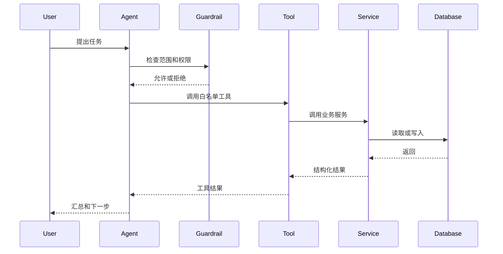

# AGENT_ASYNC_AND_DEGRADATION

- 所属入口文档：[ARCHITECTURE.md](../ARCHITECTURE.md)
- 文档状态：APPROVED FOR M1 DEVELOPMENT
- Migration status: COMPLETE

## 权威范围

Job、ProcessingRun、Celery、SSE、单总控 Agent、StageResolver、ProjectContextSnapshot、Prompt manifest、数据访问和降级策略的详细架构。

## 不负责的内容

不定义自由多 Agent，不替代业务状态、AI Schema、Tool 契约或 Provider Adapter 的完整转换定义。

## 文档导航

- 返回 [ARCHITECTURE.md](../ARCHITECTURE.md)
- [SYSTEM_COMPONENTS_AND_MODULES.md](SYSTEM_COMPONENTS_AND_MODULES.md)
- [DATA_FLOWS_AND_ADAPTERS.md](DATA_FLOWS_AND_ADAPTERS.md)
- [AGENT_ASYNC_AND_DEGRADATION.md](AGENT_ASYNC_AND_DEGRADATION.md)
- [OPERATIONS_DEPLOYMENT_AND_ADRS.md](OPERATIONS_DEPLOYMENT_AND_ADRS.md)

以下正文由原入口文档对应章节机械迁入，原有语义、状态和边界不变。


# 22. Agent 架构

## 22.1 设计结论

M8 计划使用 OpenAI Agents SDK 承担 Runner、Function Tool、结构化输出、
HITL、usage 和错误传播等运行机制，但 RECA 只保留一个
`ResearchOrchestrator`。经 ADR-001 审查的 ARS Workflow、Prompt、Policy
Marker 和测试可作为 `SELECTIVE_VENDOR` 资产适配，不形成第二套 Agent 或
工作流数据库。

采用：

```text
一个科研总控Agent
├── StageResolver
├── ProjectContextSnapshotBuilder
├── PromptRegistry
├── ToolPolicy
├── ApprovalPolicy
├── ModelDataPolicy
├── AuditPolicy
├── ResponseComposer
└── 白名单领域工具
```

不采用：

* 多 Agent 自由讨论；
* Agent 直接写业务表；
* Agent 自动批准；
* Agent 任意执行 Python；
* Agent 任意调用外部服务。

## 22.2 Agent 职责

Agent 负责：

* 读取项目状态；
* 判断当前科研阶段；
* 识别缺少的信息；
* 推荐下一步；
* 生成任务计划；
* 选择工具；
* 请求用户确认；
* 汇总工具结果；
* 解释限制。

### StageResolver

`StageResolver` 是确定性阶段规则与有限用户意图识别的组合，不是可自由
改变项目状态的第二个 Agent。它基于：

```text
persisted project state
+ current user intent
+ missing preconditions
→ allowed_next_actions
→ blocking_reasons
→ recommended_next_action
```

项目状态、对象归属和前置条件优先由 Service 判断；模型只辅助理解用户的
自然语言意图。

### ProjectContextSnapshot

`ProjectContextSnapshot` 是由数据库事实重建的只读查询 DTO：

* 可缓存，但数据库始终是唯一事实来源；
* 不提供反向写入接口；
* Agent 不得修改快照或用快照覆盖业务对象；
* DTO 字段统一为 `snapshot_schema_version`、`snapshot_revision`、`project_id`、`current_stage`、`source_object_versions`、`available_artifact_ids`、`pending_approval_ids`、`blocking_issue_ids`、`allowed_next_actions`、`generated_at`、`snapshot_hash`；
* AgentRun 保存上述 schema/revision/hash、输入对象版本和 `safe_snapshot_summary`，不默认保存完整敏感快照；
* 需要复现时，从历史业务对象重新构造快照。

`PromptRegistry` 在 M1 以 Git 管理的 `backend/app/agents/prompts/prompt-manifest.yaml` 建立，供 M2/M3 模型任务使用；M8 只消费它而非首次创建它。`ToolPolicy`、`ApprovalPolicy`、`ModelDataPolicy` 和
`AuditPolicy` 分别负责版本化提示契约、工具权限、审批前置条件、模型数据
最小化和审计规则。它们不能被 Prompt 文本或不可信文档覆盖。

## 22.3 Agent 不负责

* 文献真实性数据库查询的底层执行；
* PDF 解析；
* 统计数字计算；
* 图表渲染；
* 数据实际修改；
* DOCX 文件底层改写；
* 权限判断；
* 业务状态强制修改。

## 22.4 工具调用流程



## 22.5 Guardrail

Guardrail 检查：

* 是否要求虚构文献；
* 是否要求修改统计数字；
* 是否要求绕过用户确认；
* 是否要求执行任意代码；
* 是否超出当前项目权限；
* 是否含敏感数据；
* 是否试图把相关写成因果；
* 是否要求自动生成完整论文。

## 22.6 Agent 状态

业务状态保存在 RECA 数据库。

Agents SDK Session 不作为业务事实来源。

SDK Trace 也不作为 `AuditLog`、`AgentRun`、`ToolCall` 或
`ModelInvocation`。Trace 只用于受控遥测，并应最小化敏感输入、输出、工具
参数和文档正文；正式审计仍由 RECA 记录追加写入。

## 22.7 ToolCall 审计

每次调用保存：

* AgentRun；
* Tool 名称；
* 参数摘要；
* 发起时间；
* 完成时间；
* 状态；
* 错误；
* 结果对象 ID；
* Project ID；
* 用户 ID。

## 22.8 ModelInvocation

每次模型调用记录：

* 模型；
* 供应商；
* 任务类型；
* Prompt 版本；
* Schema 版本；
* 输入 Token；
* 输出 Token；
* 耗时；
* 状态；
* 输入来源 ID；
* 输出对象 ID。

模型数据访问由 Service 和 `ModelDataPolicy` 强制执行，不依赖 Prompt 自我声明：

* `requested_data_access_level`：PromptContract 声明的最低必要等级；
* `max_allowed_data_access_level`：Tool/Policy 允许的最高等级；
* `effective_data_access_level`：本次调用实际发送内容的等级。

必须满足 `effective_data_access_level <= max_allowed_data_access_level` 并遵循数据最小化；请求超过上限时必须拒绝或缩减。统一等级为 `METADATA_ONLY`、`REDACTED_CONTENT`、`VERIFIED_EVIDENCE_ONLY`、`APPROVED_FULL_CONTENT`。回退 Provider 不得自动继承更高权限，`ModelInvocation` 必须记录三层等级、脱敏策略版本和输入来源。

---

# 23. 异步任务架构

## 23.1 异步任务类型

```text
DOCUMENT_PARSE
LITERATURE_EXTRACT
DOCUMENT_EMBED
LITERATURE_SUMMARIZE
DATASET_PROFILE
DATASET_TRANSFORM
ANALYSIS_RUN
FIGURE_RENDER
MANUSCRIPT_CHECK
EVIDENCE_AUDIT
REPRO_PACKAGE_EXPORT
```

## 23.2 Job 创建

API 在同一数据库事务中：

1. 校验前置条件；
2. 创建业务对象；
3. 创建 Job；
4. 提交事务；
5. 将任务发送到 Celery。

若队列发送失败：

* Job 标记 `DISPATCH_FAILED`；
* 可由补偿任务重新发送；
* 不丢失业务请求。

## 23.3 Job 状态

```text
DRAFT
QUEUED
RUNNING
NEEDS_REVIEW
COMPLETED
FAILED
CANCEL_REQUESTED
CANCELLED
DISPATCH_FAILED
```

## 23.4 幂等键

任务幂等键建议包含：

```text
task_type
resource_id
input_version
parameters_hash
```

## 23.5 Worker 锁

Worker 开始执行前：

* 查询 Job；
* 检查状态；
* 获取数据库或 Valkey 锁；
* 检查是否已有结果；
* 更新为 RUNNING。

## 23.6 重试

可重试错误：

* 网络超时；
* GROBID 暂时不可用；
* OpenAlex 限流；
* 对象存储暂时失败；
* 模型服务临时错误。

不可自动重试错误：

* 文件损坏；
* Schema 不合法；
* 数据版本失效；
* 用户权限不足；
* 处理计划未批准；
* 参数错误。

## 23.7 超时

不同任务设置不同超时。

建议：

| 任务        |  默认超时 |
| --------- | ----: |
| 单篇 PDF 解析 | 180 秒 |
| 文献抽取      | 180 秒 |
| 数据质量      | 120 秒 |
| 数据转换      | 300 秒 |
| 统计分析      | 180 秒 |
| 图表生成      |  60 秒 |
| DOCX 检查   | 180 秒 |
| 复现包       | 600 秒 |

## 23.8 进度

Job 保存：

* 当前阶段；
* 总步骤；
* 已完成步骤；
* 进度百分比；
* 当前消息；
* 最后心跳。

## 23.9 SSE

前端通过 SSE 订阅：

```text
/api/v1/jobs/{job_id}/events
```

事件类型：

* `job.created`；
* `job.started`；
* `job.progress`；
* `job.needs_review`；
* `job.completed`；
* `job.failed`；
* `job.cancelled`。

## 23.10 任务取消

取消为协作式取消。

Worker 在关键步骤检查取消标记。

不得强制中断数据库事务而留下半成品。

---

# 34. 离线与降级方案

## 34.1 OpenAlex 不可用

降级：

* 本地缓存；
* 演示快照；
* DOI 手工录入；
* 用户上传 PDF。

## 34.2 GROBID 不可用

降级：

* pypdf；
* 页级文本；
* 低置信度；
* 手工补充。

## 34.3 模型服务不可用

降级：

* 已缓存结构化结果；
* 确定性统计和图表继续；
* 显示服务不可用；
* 禁止伪装为实时生成。

## 34.4 Embedding 不可用

降级：

* 关键词召回；
* PostgreSQL 全文搜索；
* 已缓存向量。

## 34.5 Valkey 不可用

* 新异步任务不可提交；
* API 返回可重试错误；
* 已完成数据可查看；
* 不切换为同步重任务。

## 34.6 MinIO 不可用

* 禁止新文件上传；
* 数据库保持一致；
* 不创建空 Artifact；
* 展示明确错误。

## 34.7 本地演示模式

启动参数可启用：

```text
DEMO_MODE=true
```

Demo Mode：

* 使用预置项目；
* 使用缓存文献；
* 使用预计算 Embedding；
* 使用本地模型结果快照；
* 实时执行少量确定性任务。

## 34.8 DegradationRecord

任何 Provider、解析器、检索、模型、SSE 或其他主能力回退都必须产生严格的 `DegradationRecord` DTO，并绑定相关 `ProcessingRun`、`ToolCall`、`ModelInvocation` 或 `AuditLog`：

```text
requested_capability
primary_provider
fallback_provider
reason_code
impact
result_status
user_visible_message
```

它只记录回退事实和影响，不是第二套业务状态。不得静默跳过，不得把 `UNAVAILABLE`、缓存结果、单模型运行或低定位可信度显示为完整成功；回退也不得扩大数据访问、工具权限或绕过 Approval。

---
