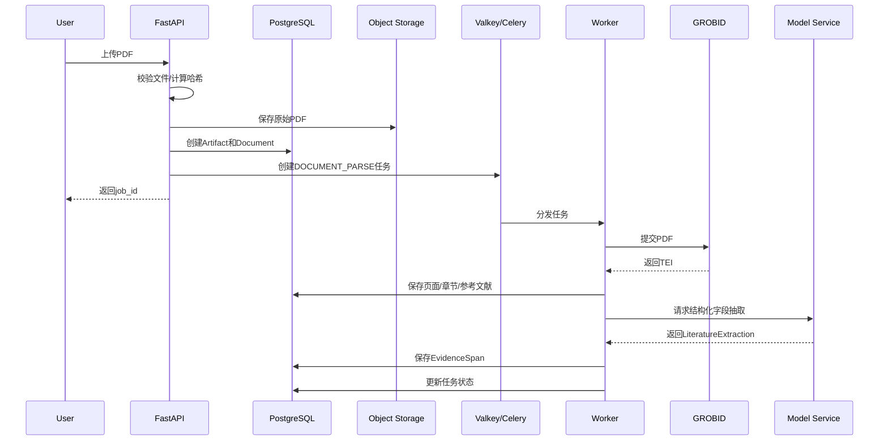
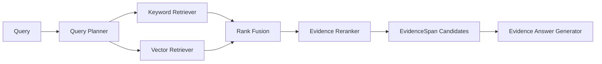
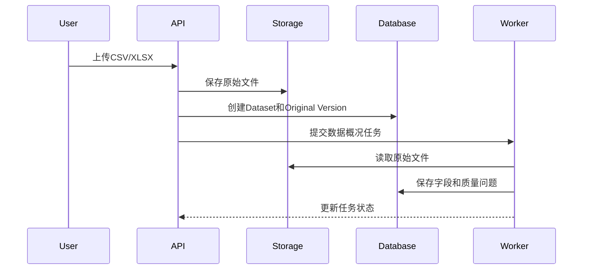
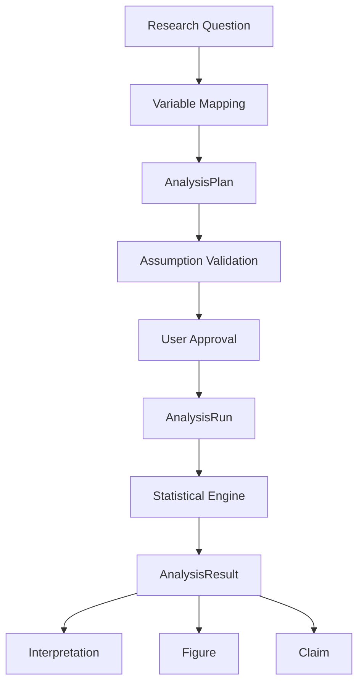
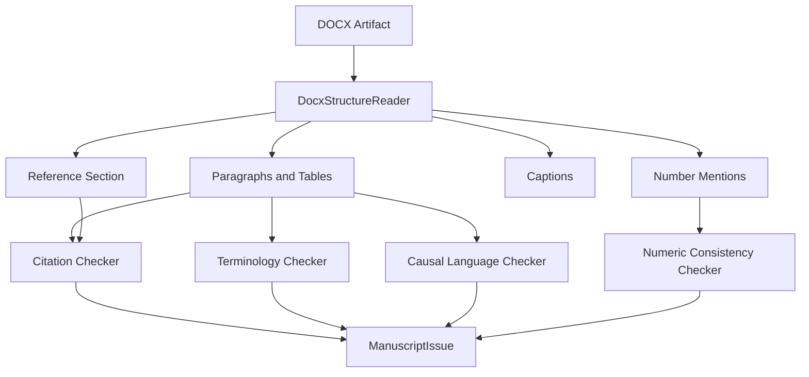

# DATA_FLOWS_AND_ADAPTERS

- 所属入口文档：[ARCHITECTURE.md](../ARCHITECTURE.md)
- 文档状态：APPROVED FOR M1 DEVELOPMENT
- Migration status: COMPLETE

## 权威范围

Adapter Protocol，以及文献、PDF、数据、分析、图表、DOCX、Evidence 和外部服务转换边界的详细架构。

## 不负责的内容

不定义领域字段、具体 API DTO、供应商许可证结论或运行时 Agent 权限。

## 文档导航

- 返回 [ARCHITECTURE.md](../ARCHITECTURE.md)
- [SYSTEM_COMPONENTS_AND_MODULES.md](SYSTEM_COMPONENTS_AND_MODULES.md)
- [DATA_FLOWS_AND_ADAPTERS.md](DATA_FLOWS_AND_ADAPTERS.md)
- [AGENT_ASYNC_AND_DEGRADATION.md](AGENT_ASYNC_AND_DEGRADATION.md)
- [OPERATIONS_DEPLOYMENT_AND_ADRS.md](OPERATIONS_DEPLOYMENT_AND_ADRS.md)

以下正文由原入口文档对应章节机械迁入，原有语义、状态和边界不变。


# 14. 适配器层

第三方能力接入不再默认等同于 Adapter。实现应在以下模式中按收益选择：

```text
DIRECT_LIBRARY_INTEGRATION
PROVIDER_OR_ADAPTER_INTEGRATION
INDEPENDENT_SERVICE
ISOLATED_SERVICE
SELECTIVE_VENDOR
RESOURCE_SNAPSHOT
DESIGN_REFERENCE
```

外部 API 可能变化、需要多实现或离线 Mock、第三方对象可能污染领域层时
使用 Provider/Adapter；成熟稳定、接口很小、无替换需求且不会污染领域模型
的库可以直接集成；大型运行组件使用独立服务；许可证或安全边界使用隔离
服务；精确复用研究资产使用 Selective Vendor；固定资源使用 Resource
Snapshot；只借鉴结构使用 Design Reference。无论采用哪种模式，第三方对象
都必须在进入核心领域前转换，Service 仍控制项目、版本、审批、EvidenceSpan
和正式结果。

## 14.1 文献数据源接口

```python
class LiteratureProvider(Protocol):
    async def search(
        self,
        query_plan: QueryPlan,
    ) -> list[LiteratureRecordDTO]:
        ...

    async def get_by_doi(
        self,
        doi: str,
    ) -> LiteratureRecordDTO | None:
        ...

    async def verify(
        self,
        record: LiteratureRecordDTO,
    ) -> LiteratureVerificationResult:
        ...
```

P0 实现：

```text
OpenAlexLiteratureProvider
CachedLiteratureProvider
```

## 14.2 学术文档解析接口

```python
class ScholarlyDocumentParser(Protocol):
    async def parse(
        self,
        artifact: ArtifactReference,
    ) -> ParsedScholarlyDocument:
        ...
```

实现：

```text
GrobidDocumentParser
PypdfFallbackParser
```

## 14.3 Evidence Retriever 接口

```python
class EvidenceRetriever(Protocol):
    async def retrieve(
        self,
        project_id: UUID,
        query: str,
        document_ids: list[UUID],
        top_k: int,
    ) -> list[EvidenceCandidate]:
        ...
```

P0 实现：

```text
HybridEvidenceRetriever
├── KeywordRetriever
├── VectorRetriever
├── ReciprocalRankFusion
└── EvidenceReranker
```

## 14.4 数据质量接口

```python
class DatasetProfiler(Protocol):
    async def profile(
        self,
        dataset_version_id: UUID,
    ) -> DatasetProfileResult:
        ...
```

实现：

```text
PanderaDatasetProfiler
```

## 14.5 统计引擎接口

```python
class StatisticalEngine(Protocol):
    async def run(
        self,
        analysis_plan: AnalysisPlanDTO,
    ) -> AnalysisResultDTO:
        ...
```

实现：

```text
ScipyStatsmodelsEngine
```

## 14.6 图表引擎接口

```python
class FigureRenderer(Protocol):
    async def render(
        self,
        figure_plan: FigurePlanDTO,
    ) -> FigureRenderResult:
        ...
```

实现：

```text
MatplotlibFigureRenderer
```

## 14.7 论文检查接口

```python
class ManuscriptChecker(Protocol):
    async def check(
        self,
        manuscript_version_id: UUID,
        project_context: ManuscriptProjectContext,
    ) -> ManuscriptCheckResult:
        ...
```

实现：

```text
DocxManuscriptChecker
```

## 14.8 对象存储接口

```python
class ObjectStorage(Protocol):
    async def put(...): ...
    async def get(...): ...
    async def delete(...): ...
    async def exists(...): ...
    async def presign_download(...): ...
```

实现：

```text
MinioObjectStorage
LocalObjectStorage
```

## 14.9 模型服务接口

```python
class ModelGateway(Protocol):
    async def structured_generate(
        self,
        task: ModelTask,
        input_data: dict,
        output_schema: type[BaseModel],
    ) -> BaseModel:
        ...
```

模型 Adapter 不得直接写业务数据库。

## 14.10 显式降级策略

每个可能回退的 Adapter 由 Service 注入 `DegradationPolicy`，而不是由
Adapter 静默改变行为：

```text
Primary Adapter
→ failure classification
→ permitted fallback
→ impact classification
→ audit event
→ user-visible disclosure
```

降级策略必须：

* 指定可接受的主能力、回退能力和失败原因；
* 保留 `UNAVAILABLE` 与 `FAILED` 的区别；
* 不把缺失解析器、页码不可信或缓存结果标记为成功或实时结果；
* 不因回退扩大模型数据访问范围、跳过 Approval 或绕过项目隔离；
* 将结果影响交给 API 和前端展示。

---

# 15. 文献处理架构

## 15.1 文献处理流程



## 15.2 文件上传阶段

API 同步完成：

* 权限检查；
* MIME 检查；
* 文件大小检查；
* 文件哈希；
* 重复检测；
* Artifact 创建；
* 对象存储写入；
* Job 创建。

不在同步请求中解析 PDF。

## 15.3 GROBID 处理

GROBID 返回 TEI XML 后，由自研 `GrobidTeiAdapter` 转换为：

* 文档元数据；
* 章节；
* 段落；
* 引文标记；
* 文末参考文献；
* 页面和坐标。

业务代码不得直接遍历任意 TEI XPath。

TEI 细节集中在 Adapter 中。

## 15.4 回退机制

GROBID 失败时：

1. 保存失败类型；
2. 尝试 pypdf；
3. 保存页级文本；
4. 标记解析方式；
5. 标记低置信度；
6. 不执行依赖复杂结构的规则；
7. 提示用户人工复核。

若 pypdf 或页码验证能力不可用，解析结果必须保留 `UNAVAILABLE` 或定位
不确定状态；不得将缺少验证能力解释为页码已经可信。

## 15.5 文献字段抽取

模型输入只包含：

* 当前文档；
* 当前字段任务；
* 相关文本块；
* 页码；
* 文档元数据。

模型输出必须通过 `LiteratureExtraction` Schema。

## 15.6 EvidenceSpan

EvidenceSpan 不应只保存文本。

推荐保存：

* 文档；
* 页面；
* 章节；
* 原文；
* 字符范围；
* 坐标；
* 解析器；
* 解析器版本；
* 模型；
* 提示版本；
* 置信度；
* 用户确认状态。

---

# 16. 文献检索与证据检索架构

## 16.1 元数据检索

```text
ResearchQuestionSpec
→ QueryPlanner
→ QueryPlan
→ OpenAlexProvider
→ LiteratureRecordDTO
→ Normalizer
→ Deduplicator
→ RelevanceReranker
→ LiteratureRecord
```

## 16.2 查询规划

AI 可以生成：

* 中文词；
* 英文词；
* 同义词；
* 对象词；
* 方法词；
* 布尔表达式。

但实际文献结果只能来自 Provider。

## 16.3 文献去重

优先级：

1. DOI；
2. 标准化标题；
3. 作者 + 年份；
4. 题目相似度；
5. 用户确认。

## 16.4 混合证据检索



## 16.5 关键词召回

P0 可使用：

* PostgreSQL 全文搜索；
* 规范化关键词匹配；
* 标题、摘要、章节加权；
* 项目范围过滤。

## 16.6 向量召回

Embedding 保存：

* 模型名称；
* 模型版本；
* 维度；
* 创建时间；
* 文本哈希。

必须按 `project_id` 限制检索。

## 16.7 排名融合

推荐使用简单、可测试的排名融合，例如 Reciprocal Rank Fusion。

不运行或复制 PaperQA 的完整文献域、项目状态、Agent 状态或向量存储系统。
允许在效果 Spike 通过后选择性 Vendor 其检索、Evidence Packing、Prompt 和
测试资产。所有输出先转换为 `CandidateEvidence`，再通过项目、文档版本、
页码和原文验证形成 `EvidenceSpan`；验证失败时保持缺失，不创建伪对象。

## 16.8 Evidence Reranker

P0 可以采用：

* 规则加权；
* 模型结构化重排；
* 文献字段匹配；
* 页码和章节偏好。

## 16.9 检索结果约束

回答只能引用召回列表中的 EvidenceSpan。

未召回内容不能成为正式依据。

## 16.10 ASReview 阅读优先级

ASReview 可通过 Provider 读取项目内已确认标签并返回候选排序、模型信息和
停止建议。它不得写 `LiteratureDecision`、审批或项目状态；手工顺序始终是
回退。主动学习模型、种子和训练标签版本必须可复现。

---

# 17. 数据处理架构

## 17.1 数据上传流程



## 17.2 原始数据保护

原始文件：

* 只允许读取；
* 不提供修改 API；
* 不允许覆盖；
* 不允许 Worker 写回；
* 仅通过 Artifact ID 访问。

## 17.3 数据处理流程

```text
DatasetVersion
→ DatasetProfile
→ DataQualityIssue
→ CleaningPlan
→ Preview
→ ApprovalRecord
→ DataTransformation
→ New DatasetVersion
→ Reprofile
```

## 17.4 CleaningPlan 与 Transformation 分离

CleaningPlan 是用户批准前的方案。

DataTransformation 是实际执行记录。

不得将二者合并。

## 17.5 受控数据转换

P0 只允许预定义转换操作：

* 删除明确指定行；
* 替换明确值；
* 统一类别编码；
* 类型转换；
* 缺失值标记；
* 用户选择的插补；
* 单位换算；
* 字段重命名。

禁止执行用户提供的任意代码。

## 17.6 数据文件生成

每个新版本：

1. 从父版本读取；
2. 应用批准操作；
3. 写入临时文件；
4. 校验文件可读；
5. 计算哈希；
6. 保存对象存储；
7. 创建 DatasetVersion；
8. 提交事务；
9. 更新 Job。

失败时不得创建正式版本。

---

# 18. 统计分析架构

## 18.1 分析流程



## 18.2 分析计划

AnalysisPlan 保存：

* 数据版本；
* 研究问题；
* 变量；
* 方法；
* 参数；
* 样本定义；
* 缺失处理；
* 前提检查；
* 用户确认。

## 18.3 统计工具白名单

P0：

* `run_descriptive_statistics`；
* `run_independent_group_comparison`；
* `run_paired_group_comparison`；
* `run_correlation`；
* `run_simple_linear_regression`；
* `validate_analysis_assumptions`。

## 18.4 统计引擎输出

统计库对象必须转换为内部 Schema。

不得将 statsmodels 原始 Result 对象直接返回前端。

## 18.5 数字来源

所有正式数字从 `AnalysisResult` 读取。

AI 解释不得重新计算或改写。

## 18.6 分析代码

每次运行生成 CodeArtifact，记录：

* 模板版本；
* 参数；
* 代码；
* 依赖；
* Python 版本；
* 数据版本哈希。

## 18.7 运行隔离

P0 不执行用户代码，因此可在受控 Worker 内运行。

Worker 设置：

* 任务超时；
* 内存限制；
* CPU 限制；
* 临时目录；
* 文件访问范围；
* 禁止外网或按任务配置。

## 18.8 结果失效

若上游 DatasetVersion 失效：

* AnalysisRun 不删除；
* 状态改为失效；
* Figure 显示警告；
* 关联 Claim 进入待审核。

---

# 19. 图表架构

## 19.1 图表生成流程

```text
FigurePlan
→ Variable Validation
→ DatasetVersion Load
→ Optional AnalysisResult Load
→ Matplotlib Template
→ Render
→ Figure Validation
→ Artifact Save
→ Figure Record
```

## 19.2 图表模板层

目录：

```text
chart_templates/
├── histogram.py
├── boxplot.py
├── scatter.py
├── group_comparison.py
└── correlation_matrix.py
```

每个模板定义：

* 支持变量类型；
* 必填参数；
* 默认尺寸；
* 轴规则；
* 图注规则；
* 导出格式；
* 规范检查。

## 19.3 图表与分析绑定

涉及统计结果的图表必须绑定：

* `analysis_run_id`；
* `analysis_result_id`；
* `dataset_version_id`。

纯描述性图表至少绑定 DatasetVersion。

## 19.4 图表输出

输出：

* PNG；
* SVG；
* PDF；
* 代码；
* 图注；
* 参数 JSON。

## 19.5 图表规范检查

检查器与渲染器分离。

渲染成功不代表图表通过规范检查。

---

# 20. DOCX 论文处理架构

## 20.1 处理流程



## 20.2 python-docx 边界

python-docx 负责：

* 段落；
* Run；
* 样式；
* 表格；
* Section；
* 基础图片信息。

OOXML 辅助层负责：

* 文档顺序；
* 字段；
* 图题表题；
* 脚注只读；
* 命名空间；
* 部分复杂引用。

## 20.2A 引用引擎与资源边界

Competition Core 使用 RECA 确定性基础格式化和双向引用核对。选择的 CSL
Styles/Locales 以 `RESOURCE_SNAPSHOT` 接入并记录 rights、Commit、哈希和
修改。完整 Citation Engine 使用 `ISOLATED_SERVICE` 或其他经 ADR-005
批准的隔离方式；citeproc 输出只负责格式化，不证明引用来源真实。

Zotero 仅作为 RIS、BibTeX、CSL JSON 等交换格式与 UX 的
`DESIGN_REFERENCE`，不把 Zotero Item、Collection 或 Related 状态直接变成
RECA 领域对象。

## 20.3 检查器分离

推荐独立检查器：

* `InTextCitationChecker`；
* `ReferenceListChecker`；
* `NumericConsistencyChecker`；
* `CausalLanguageChecker`；
* `TerminologyChecker`；
* `CaptionChecker`；
* `BasicStyleChecker`。
* `NumericDriftChecker`；
* `CitationDriftChecker`；
* `ClaimStrengthDriftChecker`；
* `ProtectedTermChecker`；
* `FigureVersionDriftChecker`。

## 20.4 项目上下文

论文检查可读取：

* LiteratureRecord；
* AnalysisResult；
* Figure；
* ResearchQuestion；
* Claim。

不得依赖模型记忆核对数字。

## 20.5 自动修改边界

高风险内容只提示。

自动修改器必须：

* 输入原 ManuscriptVersion；
* 输出新 Artifact；
* 生成差异记录；
* 不覆盖原文件；
* 失败时不产生正式版本。

---

# 21. 科研证据链架构

## 21.1 核心目标

证据链不是前端可视化功能，而是正式领域模型。

## 21.2 核心节点

* Claim；
* LiteratureRecord；
* EvidenceSpan；
* DatasetVersion；
* DataTransformation；
* AnalysisPlan；
* AnalysisRun；
* AnalysisResult；
* Figure；
* ManuscriptIssue；
* ApprovalRecord；
* AuditResult。

## 21.3 核心关系

```text
SUPPORTED_BY
CONTRADICTED_BY
QUALIFIED_BY
DERIVED_FROM
TRANSFORMED_FROM
ANALYZED_BY
PRODUCED
VISUALIZED_AS
MENTIONED_IN
CONFIRMED_BY
AUDITED_BY
INVALIDATED_BY
```

## 21.4 图谱存储

P0 不引入图数据库。

使用 PostgreSQL 关系表存储节点和边。

React Flow 仅用于展示。

## 21.5 图谱查询

后端返回：

* 节点；
* 边；
* 节点状态；
* 风险；
* 点击目标；
* 证据范围；
* 完整度。

## 21.6 失效传播

失效传播采用显式业务服务，不依赖数据库级联删除。

示例：

```text
DatasetVersion INVALIDATED
→ AnalysisRun NEEDS_REVIEW
→ Figure NEEDS_REVIEW
→ Claim NEEDS_REVIEW
→ AuditResult重新生成
```

## 21.7 完整度

完整度只用于提醒，不作为学术质量评分。

---

# 29. 外部服务边界

## 29.1 OpenAlex

用于：

* 文献元数据搜索；
* DOI 记录；
* 作者；
* 年份；
* 来源；
* 开放获取状态。

必须：

* Provider 封装；
* 缓存；
* 超时；
* 重试；
* 限流；
* 演示快照。

## 29.2 GROBID

作为独立 Docker 服务。

API 不直接暴露给前端。

## 29.3 模型服务

通过 ModelGateway 接入。

模型服务不得接收：

* 用户未批准的完整敏感数据；
* 系统密钥；
* 无关项目内容。

## 29.4 MinIO

仅通过 ObjectStorage Adapter 使用。

业务代码不直接创建 MinIO Client。

---
