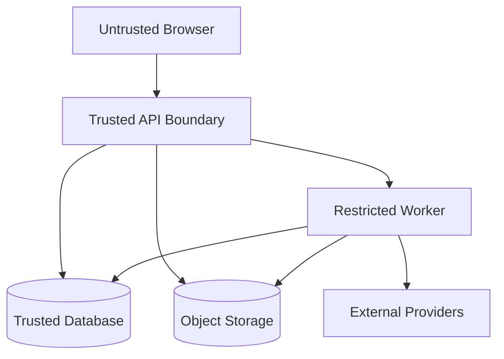

# OPERATIONS_DEPLOYMENT_AND_ADRS

- 所属入口文档：[ARCHITECTURE.md](../ARCHITECTURE.md)
- 文档状态：Conditional Approval
- Migration status: COMPLETE

## 权威范围

缓存、安全与运维边界、日志、健康检查、配置、性能、扩展、架构测试、部署、备份恢复、ADR、风险和架构验收。

## 不负责的内容

不改变产品范围、测试指标、许可证治理决定或其他权威文档定义的业务契约。

## 文档导航

- 返回 [ARCHITECTURE.md](../ARCHITECTURE.md)
- [SYSTEM_COMPONENTS_AND_MODULES.md](SYSTEM_COMPONENTS_AND_MODULES.md)
- [DATA_FLOWS_AND_ADAPTERS.md](DATA_FLOWS_AND_ADAPTERS.md)
- [AGENT_ASYNC_AND_DEGRADATION.md](AGENT_ASYNC_AND_DEGRADATION.md)
- [OPERATIONS_DEPLOYMENT_AND_ADRS.md](OPERATIONS_DEPLOYMENT_AND_ADRS.md)

以下正文由原入口文档对应章节机械迁入，原有语义、状态和边界不变。


# 28. 缓存架构

## 28.1 Valkey 用途

* Celery Broker；
* Celery Result Backend；
* 短期 API 缓存；
* 分布式锁；
* SSE 临时事件；
* 限流状态。

## 28.2 不应缓存

* 正式业务事实；
* ApprovalRecord；
* AnalysisResult 唯一副本；
* 审计日志；
* 用户权限唯一来源。

数据库是权威数据源。

## 28.3 文献检索缓存

缓存键包含：

* Provider；
* 查询；
* 过滤器；
* 页码；
* API 版本。

缓存结果保存获取时间和来源。

---

# 30. 安全边界

## 30.1 信任边界



## 30.2 Browser 不可信

所有输入重新校验。

## 30.3 Worker 受限

Worker：

* 不访问宿主机任意路径；
* 不执行用户代码；
* 使用临时目录；
* 设置超时；
* 设置资源限制；
* 日志脱敏。

## 30.4 外部模型不可信

模型输出必须：

* Schema 校验；
* 来源校验；
* 业务规则校验；
* 需要时人工确认。

## 30.5 上传文件不可信

* 类型白名单；
* 大小限制；
* ZIP 路径检查；
* 文件名清理；
* 不直接执行；
* 解析隔离。

---

# 31. 日志与可观测性

## 31.1 结构化日志

日志字段：

* timestamp；
* level；
* service；
* request_id；
* user_id；
* project_id；
* job_id；
* agent_run_id；
* tool_call_id；
* error_code；
* duration_ms。

## 31.2 请求追踪

每个请求生成 `request_id`。

异步任务继承请求上下文。

## 31.3 审计日志与系统日志分离

系统日志用于运维。

AuditLog 用于业务追溯。

不得仅依赖应用日志作为审计。

## 31.4 指标

建议监控：

* API 响应时间；
* 错误率；
* Job 队列长度；
* Job 成功率；
* Worker 心跳；
* GROBID 响应时间；
* 模型调用失败率；
* 对象存储失败；
* 数据库连接；
* 文献解析成功率。

## 31.5 比赛版实现

P0 可采用：

* JSON 日志；
* Docker 日志；
* 简单健康检查；
* 后台服务状态页面。

完整 Prometheus/Grafana 可放 P1。

---

# 32. 健康检查

建议端点：

```text
/health/live
/health/ready
/health/dependencies
```

## 32.1 Live

仅表示进程存活。

## 32.2 Ready

检查：

* 数据库；
* Valkey；
* 对象存储。

## 32.3 Dependencies

检查：

* GROBID；
* OpenAlex；
* 模型服务。

外部服务不可用不一定让 API 不 Ready，但应显示降级。

---

# 33. 配置管理

## 33.1 配置来源

* 环境变量；
* `.env`；
* 部署密钥；
* 数据库中的非敏感运行配置。

## 33.2 配置分组

* 应用；
* 数据库；
* 对象存储；
* Valkey；
* Celery；
* GROBID；
* OpenAlex；
* 模型；
* 文件限制；
* 任务超时；
* 日志。

## 33.3 密钥

密钥不得：

* 写入代码；
* 写入 Git；
* 返回前端；
* 写入日志；
* 放入复现包。

---

# 35. 性能架构

## 35.1 性能目标

| 场景          | 目标          |
| ----------- | ----------- |
| 普通 API P95  | ≤ 2 秒       |
| 项目总览        | ≤ 2 秒       |
| 异步任务提交      | ≤ 2 秒       |
| 小型数据质量      | ≤ 10 秒      |
| 图表生成        | ≤ 10 秒      |
| 单篇 PDF 初步解析 | ≤ 30 秒或显示进度 |
| DOCX 基础检查   | ≤ 30 秒或显示进度 |

## 35.2 数据规模

P0 建议：

* 每项目 5—20 篇 PDF；
* 单数据集不超过 100,000 行；
* 单数据集不超过 200 列；
* 单 DOCX 不超过 30 MB；
* 单项目 Claim 不超过 500 条。

## 35.3 数据库索引

重点索引：

* `project_id`；
* `status`；
* `created_at`；
* `document_id`；
* `dataset_id`；
* `dataset_version_id`；
* `analysis_run_id`；
* `doi_normalized`；
* `sha256`；
* `job_id`。

## 35.4 向量检索

P0 优先精确向量搜索。

数据量增大后再评估 HNSW。

---

# 36. 扩展性设计

## 36.1 新文献数据源

实现新的 `LiteratureProvider`。

不得修改 Literature Service 核心流程。

## 36.2 新 PDF 解析器

实现新的 `ScholarlyDocumentParser`。

## 36.3 新统计方法

必须同时增加：

* AnalysisPlan Schema；
* 前提检查；
* 工具；
* 结果 Schema；
* 黄金测试；
* 图表适配；
* 论文数字规则。

不得只新增一个函数。

## 36.4 新图表

实现新的 Figure Template 和 Validator。

## 36.5 新文档格式

P1 可实现：

* MarkdownManuscriptReader；
* LatexManuscriptReader。

不得破坏 Manuscript 领域模型。

## 36.6 新模型供应商

实现 ModelGateway Adapter。

业务代码不得依赖特定供应商响应格式。

## 36.7 新领域规则包

可增加：

* 教育问卷；
* 体育体测；
* 心理行为实验。

规则包只能读取受控输入并输出统一 DataQualityIssue。

---

# 37. 架构测试策略

## 37.1 单元测试

重点：

* 领域规则；
* 状态转换；
* 适配器转换；
* 去重；
* 哈希；
* 排名融合；
* 统计输出转换；
* 图表参数；
* 引用匹配。

## 37.2 合约测试

针对：

* LiteratureProvider；
* DocumentParser；
* StatisticalEngine；
* ObjectStorage；
* ModelGateway。

## 37.3 集成测试

针对：

* PostgreSQL；
* MinIO；
* Valkey；
* Celery；
* GROBID；
* OpenAlex Mock Server。

## 37.4 E2E

覆盖核心主线。

## 37.5 架构规则测试

可使用静态检查确保：

* 模块不循环依赖；
* API 层不直接导入第三方 SDK；
* Agent Tool 不直接访问数据库；
* Statistics 模块不调用模型；
* 原始 Artifact 无更新接口。

---

# 38. 部署拓扑

## 38.1 本地开发

```text
Browser
→ Vite Dev Server
→ FastAPI
→ Docker PostgreSQL
→ Docker Valkey
→ Docker MinIO
→ Docker GROBID
→ Local Celery Worker
```

## 38.2 本地 Docker

```text
docker compose up
```

所有服务容器化。

## 38.3 云端单机

```text
Nginx
├── Frontend
└── FastAPI
    ├── Worker
    ├── PostgreSQL
    ├── Valkey
    ├── MinIO
    └── GROBID
```

## 38.4 不建议

P0 不采用：

* Kubernetes；
* 多区域数据库；
* 服务网格；
* 独立 API Gateway；
* Kafka；
* Elasticsearch；
* 单独向量数据库。

---

# 39. 备份与恢复

## 39.1 需要备份

* PostgreSQL；
* MinIO；
* `.env` 安全副本；
* 演示项目；
* 依赖锁文件；
* Docker 镜像列表。

## 39.2 演示前备份

必须准备：

* 数据库快照；
* MinIO 文件快照；
* 完整 Docker 镜像；
* 演示项目导出；
* 录屏。

## 39.3 恢复验证

演示前应在全新环境恢复一次。

---

# 40. 关键架构决策记录

<a id="dec-001"></a>
## DEC-001：使用 React/Vite 而不是 Next.js

| 项目     | 内容                                    |
| ------ | ------------------------------------- |
| 状态     | Accepted                              |
| 决策     | React + Vite + TypeScript             |
| 原因     | 复用 Full Stack FastAPI Template，减少工程替换 |
| 放弃方案   | Next.js App Router                    |
| 代价     | 不使用 SSR 和 Next.js 服务端能力               |
| 重新评估条件 | 产品需要 SEO、SSR 或复杂服务端渲染                 |

<a id="dec-002"></a>
## DEC-002：采用模块化单体

| 项目     | 内容                 |
| ------ | ------------------ |
| 状态     | Accepted           |
| 决策     | 单 FastAPI 应用，模块化组织 |
| 原因     | 比赛周期短，统一认证、事务和部署   |
| 放弃方案   | 文献、数据、论文拆分微服务      |
| 代价     | 单应用代码规模增加          |
| 重新评估条件 | 团队扩大或模块需独立扩缩容      |

<a id="dec-003"></a>
## DEC-003：使用 Valkey

| 项目     | 内容                         |
| ------ | -------------------------- |
| 状态     | Accepted                   |
| 决策     | Celery Broker 和缓存使用 Valkey |
| 原因     | Redis 协议兼容，许可证边界更清晰        |
| 放弃方案   | 新版 Redis                   |
| 代价     | 部分文档仍使用 redis:// 协议名称      |
| 重新评估条件 | Celery 官方兼容性发生变化           |

<a id="dec-004"></a>
## DEC-004：单总控 Agent

| 项目     | 内容                       |
| ------ | ------------------------ |
| 状态     | Accepted                 |
| 决策     | 一个总控 Agent + 工具组 + 审核    |
| 原因     | 科研流程需要可控、可追踪和人工确认        |
| 放弃方案   | 多 Agent 自由对话             |
| 代价     | Agent 自主性较低              |
| 重新评估条件 | P1 需要明确独立专业 Agent 且有测试支持 |

<a id="dec-005"></a>
## DEC-005：GROBID 为主解析器

| 项目     | 内容                     |
| ------ | ---------------------- |
| 状态     | Accepted               |
| 决策     | GROBID 主解析，pypdf 回退    |
| 原因     | 学术文档结构、参考文献和 TEI 输出更适合 |
| 放弃方案   | 仅 pypdf/pdfplumber     |
| 代价     | 增加 Java 服务和模型资源        |
| 重新评估条件 | GROBID 对目标文献长期效果不足     |

<a id="dec-006"></a>
## DEC-006：PaperQA 不整体接入

| 项目     | 内容                    |
| ------ | --------------------- |
| 状态     | Accepted              |
| 决策     | 不整体接管文献域；允许深度选择性复用检索、Evidence Packing、Prompt 和测试 |
| 原因     | 避免文档、状态、Agent 和向量存储重复 |
| 放弃方案   | 直接运行完整 PaperQA        |
| 代价     | 需要 Vendor 来源记录、转换层和 EvidenceSpan 验证 |
| 重新评估条件 | 完整运行时可证明显著增益且不接管 RECA 业务状态 |

<a id="dec-007"></a>
## DEC-007：PostgreSQL + pgvector

| 项目     | 内容                       |
| ------ | ------------------------ |
| 状态     | Accepted                 |
| 决策     | 关系数据与向量统一保存              |
| 原因     | P0 数据量小，减少独立服务           |
| 放弃方案   | Pinecone、Milvus、Weaviate |
| 代价     | 向量扩展能力有限                 |
| 重新评估条件 | 文献规模大幅增长                 |

<a id="dec-008"></a>
## DEC-008：原始文件不可变

| 项目     | 内容            |
| ------ | ------------- |
| 状态     | Accepted      |
| 决策     | 所有原始文件和原始版本只读 |
| 原因     | 科研可追溯和文件安全    |
| 放弃方案   | 原地修改          |
| 代价     | 存储空间增加        |
| 重新评估条件 | 不允许推翻，只可优化去重  |

<a id="dec-009"></a>
## DEC-009：AI 输出必须结构化

| 项目     | 内容                         |
| ------ | -------------------------- |
| 状态     | Accepted                   |
| 决策     | 关键 AI 输出通过 Pydantic Schema |
| 原因     | 可落库、可测试、可审核                |
| 放弃方案   | 自由文本直接驱动业务                 |
| 代价     | Prompt 和 Schema 维护成本       |
| 重新评估条件 | 不允许完全取消                    |

<a id="dec-010"></a>
## DEC-010：统计结果只来自确定性程序

| 项目     | 内容                         |
| ------ | -------------------------- |
| 状态     | Accepted                   |
| 决策     | SciPy/statsmodels 计算，模型只解释 |
| 原因     | 保证准确性和复现                   |
| 放弃方案   | 模型计算或口算                    |
| 代价     | 工具接口开发                     |
| 重新评估条件 | 不允许推翻                      |

<a id="dec-011"></a>
## DEC-011：图数据库不进入 P0

| 项目     | 内容                  |
| ------ | ------------------- |
| 状态     | Accepted            |
| 决策     | PostgreSQL 关系表保存证据链 |
| 原因     | 数据规模小，减少服务          |
| 放弃方案   | Neo4j               |
| 代价     | 复杂图查询能力有限           |
| 重新评估条件 | P1 图谱规模与查询显著增长      |

<a id="dec-012"></a>
## DEC-012：快速工具自动归属轻量项目

| 项目     | 内容           |
| ------ | ------------ |
| 状态     | Accepted     |
| 决策     | 快速工具结果必须归属项目 |
| 原因     | 避免孤立结果，保持证据链 |
| 放弃方案   | 无项目独立结果      |
| 代价     | 用户多一步项目确认    |
| 重新评估条件 | 不建议推翻        |

## 40.13 开源能力栈 ADR

本文件保留早期 `DEC-*` 历史。完整开源集成决策由
[ADR-002 至 ADR-008](../decisions/) 正式化，ARS-Codex 特殊许可证与复用条件
由 [ADR-001](../decisions/ADR-001-ARS-CODEX-USAGE.md) 决定。ADR 不把计划项目
改写为已实现，也不改变现有 API、模型、Tool 或里程碑标识。

---

# 41. 架构风险

| 风险             | 影响    | 缓解措施          |
| -------------- | ----- | ------------- |
| GROBID 资源消耗高   | 演示卡顿  | 预处理、单篇实时、资源限制 |
| OpenAlex 网络不稳定 | 检索失败  | 缓存和演示快照       |
| 模型 Schema 失败   | 任务失败  | 重试、修复提示、人工补充  |
| PDF 坐标不稳定      | 高亮错误  | 页码回退、文本上下文    |
| Celery 重复执行    | 重复结果  | 幂等键和数据库锁      |
| 文件与数据库不一致      | 孤立文件  | 临时对象和补偿清理     |
| DOCX 结构复杂      | 解析不完整 | 检查优先、低置信度     |
| Agent 越权       | 科研风险  | 工具白名单和审批      |
| 模块依赖失控         | 难维护   | 分层和架构测试       |
| 证据链过度复杂        | 页面难用  | P0 限定节点和关系    |

---

# 42. 架构验收标准

## 42.1 工程底座

* Docker Compose 可启动；
* 前端、API、Worker、数据库、Valkey、MinIO、GROBID 正常；
* 健康检查可用；
* 数据库迁移可执行。

## 42.2 模块边界

* 业务模块分离；
* API 不直接调用第三方 SDK；
* Adapter 可 Mock；
* Agent Tool 不直接写数据库；
* 统计模块不调用模型。

## 42.3 文件

* 原始文件不可覆盖；
* 文件哈希存在；
* 文件与 Artifact 对应；
* 对象存储路径隔离。

## 42.4 异步任务

* 长任务返回 Job ID；
* Job 状态可查看；
* 失败可重试；
* 重复执行不重复写结果；
* Worker 崩溃不破坏原始数据。

## 42.5 文献

* GROBID 可解析；
* pypdf 可回退；
* LiteratureExtraction 可结构化；
* EvidenceSpan 可定位；
* 文献检索可缓存。

## 42.6 数据与分析

* DatasetVersion 不可变；
* CleaningPlan 必须审批；
* AnalysisRun 绑定数据版本；
* AnalysisResult 来自统计程序；
* Figure 绑定 AnalysisRun。

## 42.7 论文

* DOCX 原文件不覆盖；
* 检查器独立；
* 数字从 AnalysisResult 核对；
* 高风险内容不自动修改。

## 42.8 Agent

* 单总控 Agent；
* 工具白名单；
* ToolCall 可审计；
* 高风险操作需要 Approval；
* 模型输出通过 Schema。

## 42.9 离线演示

* 演示项目可加载；
* 缓存文献可展示；
* 已缓存模型结果可展示；
* 确定性统计可本地运行；
* 证据链可完整打开。

---

# 43. 后续扩展边界

P1 可在不改变核心架构的前提下扩展：

* 新 LiteratureProvider；
* 新统计工具；
* 新图表模板；
* 新 ManuscriptReader；
* 新 CitationFormatter；
* 新领域质量规则；
* 新教师审核界面；
* 新主动学习筛选；
* 新模型供应商；
* 新证据图谱布局。

任何扩展不得破坏：

1. 原始文件不可变；
2. 确定性统计；
3. 用户确认；
4. 项目隔离；
5. Schema 校验；
6. Tool 白名单；
7. 证据来源；
8. 版本血缘；
9. 审计记录。

---
