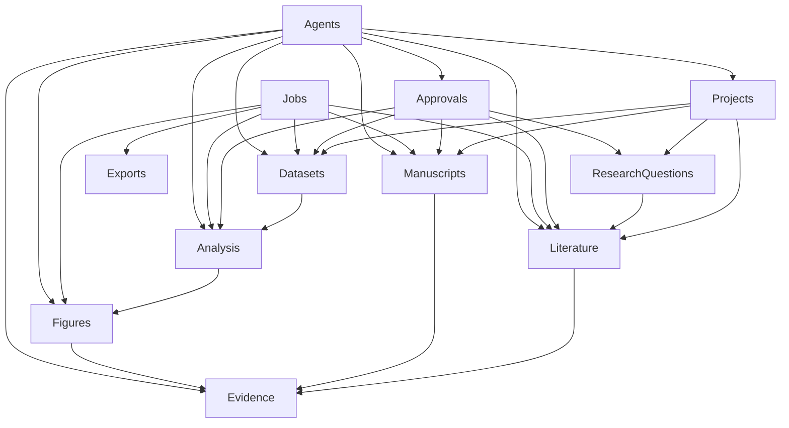

# SYSTEM_COMPONENTS_AND_MODULES

- 所属入口文档：[ARCHITECTURE.md](../ARCHITECTURE.md)
- 文档状态：Conditional Approval
- Migration status: COMPLETE

## 权威范围

前端、后端模块、Worker、数据库、对象存储、API 通信、事务、模块依赖和模块边界的详细架构。

## 不负责的内容

不定义业务需求、数据字段、API 契约、测试指标、安全规则或 Agent 的详细运行策略。

## 文档导航

- 返回 [ARCHITECTURE.md](../ARCHITECTURE.md)
- [SYSTEM_COMPONENTS_AND_MODULES.md](SYSTEM_COMPONENTS_AND_MODULES.md)
- [DATA_FLOWS_AND_ADAPTERS.md](DATA_FLOWS_AND_ADAPTERS.md)
- [AGENT_ASYNC_AND_DEGRADATION.md](AGENT_ASYNC_AND_DEGRADATION.md)
- [OPERATIONS_DEPLOYMENT_AND_ADRS.md](OPERATIONS_DEPLOYMENT_AND_ADRS.md)

以下正文由原入口文档对应章节机械迁入，原有语义、状态和边界不变。


# 10. 前端架构

前端属于 `CAPABILITY INTEGRATION` 层：PDF.js、TanStack Table 和 React Flow
提供显示与交互能力，generated API client 和 RECA view model 决定数据边界。
浏览器状态不得成为审批、EvidenceSpan、ClaimEvidenceLink 或版本事实。

## 10.1 前端目标

前端不是聊天机器人界面，而是科研工作台。

聊天或 Agent 面板仅用于：

* 下一步建议；
* 信息补充；
* 任务规划；
* 解释结果；
* 发起确认。

正式科研数据主要通过结构化页面展示。

## 10.2 前端模块

### 项目模块

负责：

* 项目列表；
* 创建项目；
* 项目总览；
* 项目阶段；
* 待办事项；
* 最近操作。

### 研究问题模块

负责：

* 原始研究想法；
* 结构化字段；
* 版本历史；
* 用户确认。

### 文献模块

负责：

* 查询规划；
* 搜索结果；
* 文献矩阵；
* 文献决策；
* PDF 原文；
* EvidenceSpan；
* 共识争议。

### 数据模块

负责：

* 数据上传；
* 数据身份证；
* 数据预览；
* 字段字典；
* 数据版本；
* 数据质量；
* CleaningPlan。

### 分析模块

负责：

* AnalysisPlan；
* 前提检查；
* 分析运行；
* 结构化结果；
* 运行日志。

### 图表模块

负责：

* 图表推荐；
* 变量选择；
* 图表预览；
* 图表规范检查；
* 导出。

### 论文模块

负责：

* DOCX 上传；
* 问题清单；
* 原文定位；
* 证据展示；
* 采纳或驳回。

### 证据链模块

负责：

* 图谱；
* 节点详情；
* 风险筛选；
* 证据范围；
* 完整度。

## 10.3 状态管理

前端状态分为三类：

### 服务端状态

使用查询缓存管理：

* 项目；
* 文献；
* 数据版本；
* Job；
* 分析结果；
* 论文问题。

推荐通过模板现有查询方案或 TanStack Query 管理。

### 页面状态

例如：

* 当前选中行；
* 表格筛选；
* PDF 当前页；
* 图谱缩放；
* 面板展开状态。

### 表单状态

例如：

* 研究问题编辑；
* 数据身份证；
* 分析计划；
* 图表参数。

不得将业务权威状态只保存在前端。

## 10.4 自动生成 API Client

前端 API Client 应根据 OpenAPI 自动生成。

禁止手工维护大量重复类型。

## 10.5 PDF.js 集成边界

PDF.js 负责：

* PDF 渲染；
* 页码导航；
* 文本层；
* 页面搜索；
* 坐标高亮。

RECA 前端负责：

* 文献 ID；
* EvidenceSpan；
* 证据状态；
* 高亮样式；
* 用户确认；
* 与矩阵联动。

## 10.6 React Flow 集成边界

React Flow 只负责：

* 节点布局；
* 连线；
* 缩放；
* 拖动；
* 交互。

图谱数据必须来自后端。

前端不得自行推断证据关系。

## 10.7 前端权限

前端可隐藏无权限按钮，但后端必须再次校验。

前端权限不能替代后端权限。

## 10.8 前端错误处理

所有 API 错误统一进入：

* 页面错误提示；
* 可重试状态；
* 请求 ID 展示；
* 不破坏当前页面数据。

---

# 11. 后端总体分层

## 11.1 分层结构

```text
API Layer
    ↓
Application Service
    ↓
Domain Model / Policy
    ↓
Repository / Adapter
    ↓
Database / External Service
```

开源能力按以下四层归属：

| 层 | 责任 | 典型内容 |
| --- | --- | --- |
| `RECA DOMAIN CORE` | 业务事实、版本、审批、证据与审计 | Domain、Service、Repository、数据库对象 |
| `CAPABILITY INTEGRATION` | 把成熟库转换为 RECA 能力 | Provider/Adapter、确定性引擎、前端集成 |
| `VENDORED RESEARCH ASSETS` | 隔离的 Prompt、工作流、脚本、测试或资源 | PaperQA/ARS 选择性资产、CSL snapshot |
| `EXTERNAL SERVICES` | 独立进程或远端能力 | GROBID、MinIO、Valkey、外部模型/OpenAlex |

## 11.2 API 层

负责：

* 认证；
* 参数校验；
* 权限检查；
* 调用 Service；
* 返回 DTO；
* HTTP 状态码；
* 请求 ID。

不得：

* 执行统计；
* 直接解析 PDF；
* 直接访问第三方 SDK；
* 直接写复杂业务事务。

## 11.3 Application Service

负责具体用例，例如：

* 创建项目；
* 上传文献；
* 批准清洗计划；
* 创建 AnalysisPlan；
* 启动 AnalysisRun；
* 生成复现包。

Service 负责：

* 业务规则；
* 事务边界；
* 状态转换；
* 权限；
* 审计；
* 调用 Adapter；
* 创建 Job。

## 11.4 Domain 层

负责：

* 领域枚举；
* 领域错误；
* 状态机规则；
* 不变量；
* 接口协议；
* 证据关系规则。

## 11.5 Repository 层

负责：

* 数据库持久化；
* 查询；
* 乐观锁；
* 分页；
* 项目隔离。

## 11.6 Adapter 层

负责将外部能力转换为内部领域结构。

## 11.7 Worker 层

负责耗时任务：

* PDF 解析；
* 文献抽取；
* Embedding；
* 数据质量；
* 数据转换；
* 统计分析；
* 图表生成；
* DOCX 检查；
* 复现包导出。

---

# 12. 后端业务模块

## 12.1 Projects 模块

负责：

* ResearchProject；
* ProjectMember；
* 项目阶段；
* 项目总览；
* 项目归档；
* 权限。

不得直接实现：

* 文献解析；
* 数据分析；
* 图表生成。

## 12.2 Research Questions 模块

负责：

* ResearchQuestion；
* ResearchQuestionVersion；
* 结构化问题；
* 用户确认；
* 版本影响分析。

## 12.3 Artifacts 模块

负责所有文件和产物：

* 上传；
* 哈希；
* MIME；
* 对象存储路径；
* 版本；
* 来源；
* 下载；
* 软删除；
* 完整性检查。

## 12.4 Literature 模块

负责：

* LiteratureRecord；
* Document；
* DocumentPage；
* DocumentChunk；
* LiteratureExtraction；
* LiteratureDecision；
* EvidenceSpan；
* 文献矩阵；
* 当前证据集合分析。

## 12.5 Datasets 模块

负责：

* Dataset；
* DatasetVersion；
* DatasetColumn；
* DataQualityIssue；
* CleaningPlan；
* DataTransformation；
* 数据身份证；
* 数据血缘。

## 12.6 Analysis 模块

负责：

* AnalysisPlan；
* 前提检查；
* 用户批准；
* AnalysisRun；
* AnalysisResult；
* CodeArtifact；
* 结果失效。

## 12.7 Figures 模块

负责：

* Figure；
* 图表参数；
* 图注；
* 图表规范；
* 图表版本；
* 图像 Artifact；
* 绘图代码 Artifact。

## 12.8 Manuscripts 模块

负责：

* Manuscript；
* ManuscriptVersion；
* ManuscriptIssue；
* 引用匹配；
* 数字检查；
* 因果语言；
* 术语；
* 低风险修复。

## 12.9 Evidence 模块

负责：

* Claim；
* ClaimEvidenceLink；
* EvidenceGraph；
* AuditResult；
* 完整度；
* 失效传播。

## 12.10 Approvals 模块

负责：

* ApprovalRecord；
* 审批对象；
* 审批内容；
* 状态；
* 操作人；
* 到期；
* 撤销。

## 12.11 Jobs 模块

负责：

* Job；
* 进度；
* 状态；
* 重试；
* 取消；
* 错误；
* Worker 关联；
* SSE 输出。

## 12.12 Agents 模块

负责：

* AgentRun；
* ModelInvocation；
* ToolCall；
* Agent 上下文；
* Guardrail；
* 工具权限；
* 追踪。

## 12.13 Exports 模块

负责：

* Export；
* ReproPackage；
* manifest；
* 文件收集；
* 敏感信息检查；
* ZIP 打包。

---

# 13. 模块依赖规则

## 13.1 推荐依赖方向



## 13.2 禁止循环依赖

业务模块之间不得直接形成 Python import 循环。

跨模块访问应通过：

* Application Service；
* Protocol；
* Query Service；
* 领域事件；
* 共享 ID。

## 13.3 Shared 模块限制

`shared/` 只允许放置：

* 时间工具；
* ID；
* 哈希；
* 分页；
* 通用错误；
* 通用 DTO；
* 日志上下文。

不得把具体业务逻辑放入 `shared/`。

## 13.4 第三方能力接入

模块只使用以下接入模式：

```text
DIRECT_LIBRARY_INTEGRATION
PROVIDER_OR_ADAPTER_INTEGRATION
INDEPENDENT_SERVICE
ISOLATED_SERVICE
SELECTIVE_VENDOR
RESOURCE_SNAPSHOT
DESIGN_REFERENCE
```

小而稳定、不会泄漏第三方对象的库允许由 Service 内部直接调用；外部 API、
多实现、离线 Mock 或复杂转换使用 Provider/Adapter；资源密集运行时使用
独立服务；许可证或安全隔离使用隔离服务；选择性 Prompt/工作流/测试使用
Vendor；CSL 等固定文件使用 Resource Snapshot；Zotero/GX/DVC 等只借鉴
设计。Router、Worker 和 Agent Tool 仍不得绕过 Service 直接操作第三方 SDK
或核心业务表。

---

# 24. 文件与对象存储架构

## 24.1 Artifact 统一模型

所有文件统一使用 Artifact：

* PDF；
* CSV；
* XLSX；
* DOCX；
* PNG；
* SVG；
* PDF 图表；
* 分析代码；
* 日志；
* JSON；
* ZIP；
* manifest。

## 24.2 数据库与文件分离

数据库保存：

* 元数据；
* 哈希；
* 大小；
* MIME；
* 存储键；
* 来源；
* 版本；
* 状态。

对象存储保存文件内容。

## 24.3 存储键

推荐：

```text
projects/{project_id}/
  artifacts/{artifact_id}/
    original/{filename}
    derived/{filename}
```

不得直接使用用户文件名作为唯一存储键。

## 24.4 上传安全

上传流程：

1. 校验扩展名；
2. 校验 MIME；
3. 限制大小；
4. 规范化文件名；
5. 计算哈希；
6. 写入临时对象；
7. 验证成功；
8. 转为正式对象；
9. 创建 Artifact。

## 24.5 下载

下载使用短期签名 URL 或 API 代理。

下载前检查：

* 用户权限；
* 项目归属；
* Artifact 状态；
* 是否已删除；
* 是否包含敏感数据。

## 24.6 文件删除

采用软删除和保留期。

物理删除由后台清理任务执行。

原始演示数据和审计相关文件不得立即删除。

---

# 25. 数据库架构

## 25.1 PostgreSQL 作为唯一业务数据库

保存：

* 用户；
* 项目；
* 文献；
* 数据版本；
* 分析；
* 图表；
* 论文；
* 证据关系；
* Agent；
* Job；
* 审计。

## 25.2 pgvector

用于：

* DocumentChunk Embedding；
* 项目内语义检索；
* 相似证据召回。

P0 数据量较小，优先精确检索。

P1 再评估 HNSW。

## 25.3 JSONB 使用原则

JSONB 适合：

* 第三方原始响应摘要；
* 可变参数；
* 统计结果细节；
* 图表参数；
* 模型元数据。

以下字段必须正式建列：

* Project ID；
* Status；
* Version；
* Parent ID；
* Created At；
* Created By；
* Artifact ID；
* DatasetVersion ID；
* AnalysisRun ID。

## 25.4 主键

所有核心对象使用 UUID。

## 25.5 乐观锁

可编辑对象建议包含：

```text
version_number
updated_at
```

避免用户编辑覆盖。

## 25.6 数据库迁移

所有模型变化必须：

1. 修改 SQLModel；
2. 创建 Alembic Migration；
3. 提供升级；
4. 必要时提供降级；
5. 更新文档；
6. 增加迁移测试。

---

# 26. API 通信架构

## 26.1 API 风格

使用 REST 风格 JSON API。

统一前缀：

```text
/api/v1
```

## 26.2 同步请求

适合：

* CRUD；
* 项目总览；
* 列表；
* 轻量校验；
* 获取状态。

## 26.3 异步请求

适合：

* PDF 解析；
* 批量抽取；
* 数据质量；
* 数据转换；
* 统计分析；
* 图表生成；
* DOCX 检查；
* 导出。

异步请求返回：

```json
{
  "job_id": "uuid",
  "resource_type": "document_parse",
  "resource_id": "uuid",
  "status": "QUEUED",
  "status_url": "/api/v1/jobs/uuid"
}
```

## 26.4 错误格式

统一错误：

```json
{
  "error": {
    "code": "DOC_PARSE_002",
    "message": "PDF解析服务暂时不可用",
    "details": {},
    "request_id": "uuid",
    "retryable": true
  }
}
```

## 26.5 API 版本

破坏性变化通过 `/api/v2` 或 Schema 版本升级处理。

P0 阶段保持 `/api/v1` 稳定。

---

# 27. 事务与一致性

## 27.1 单模块事务

同一业务动作的核心数据库修改应在同一事务中完成。

## 27.2 文件与数据库一致性

文件写入流程采用：

1. 上传临时对象；
2. 校验；
3. 创建数据库记录；
4. 转为正式状态；
5. 失败清理临时对象。

## 27.3 异步任务一致性

Job 和业务对象先入库，再发送队列。

避免队列已有任务但数据库无记录。

## 27.4 正式结果写入

Worker 应先在临时状态生成结果，全部成功后再将对象标记为正式完成。

## 27.5 幂等结果

重复执行任务时：

* 已存在相同结果则返回；
* 或创建明确的新运行版本；
* 不重复写同一个正式对象。

---
