# STATE_MACHINES_AND_INVARIANTS

- 所属入口文档：[DATA_MODEL_AND_WORKFLOW.md](../DATA_MODEL_AND_WORKFLOW.md)
- 文档状态：APPROVED FOR M1 DEVELOPMENT
- 当前增量状态：APPROVED
- Migration status: COMPLETE

## 权威范围

全部状态转换、唯一约束、外键一致性、项目隔离、版本不变量、失效传播、模型数据访问、Snapshot 哈希规则、索引、迁移和完整性检查。

## 不负责的内容

不重复定义业务对象完整字段，也不改变 PRD、API、测试或安全文档中的范围与门禁。

## 文档导航

- 返回 [DATA_MODEL_AND_WORKFLOW.md](../DATA_MODEL_AND_WORKFLOW.md)
- [FOUNDATION_AND_PROJECT_MODELS.md](FOUNDATION_AND_PROJECT_MODELS.md)
- [LITERATURE_AND_EVIDENCE_MODELS.md](LITERATURE_AND_EVIDENCE_MODELS.md)
- [DATA_ANALYSIS_AND_FIGURE_MODELS.md](DATA_ANALYSIS_AND_FIGURE_MODELS.md)
- [MANUSCRIPT_AGENT_AND_EXPORT_MODELS.md](MANUSCRIPT_AGENT_AND_EXPORT_MODELS.md)
- [STATE_MACHINES_AND_INVARIANTS.md](STATE_MACHINES_AND_INVARIANTS.md)

以下正文由原入口文档对应对象或章节机械迁入；字段、枚举、约束、外键和语义保持不变。

## 高风险语义核验索引

### ResearchQuestionVersion 与 AI Scoping

`ResearchQuestionVersion.status` 只使用 `DRAFT`、`NEEDS_INPUT`、`READY`、`CONFIRMED`、`SUPERSEDED`。`ResearchQuestion.status` 是逻辑对象状态，另包含 `ARCHIVED`。本文原第 29 章描述组合工作流：其中 `NEEDS_APPROVAL` 是 Approval 门禁状态，`ARCHIVED` 作用于逻辑 ResearchQuestion；两者都不得被误写成新的 ResearchQuestionVersion 字段枚举。

`ResearchQuestionScopingOutput.status` 是独立 AI 输出枚举：`NEEDS_USER_INPUT`、`CANDIDATES_READY`、`INSUFFICIENT_EVIDENCE`、`OUT_OF_SCOPE`，不得直接写入任何上述领域状态。

### Evidence 阅读范围与缺失定位

`user_declared_read_scope` 仅允许 `UNKNOWN`、`ABSTRACT`、`SECTIONS`、`FULL_TEXT_DECLARED`，不得从页码或局部文本推断全文阅读。无法定位原文时，不得创建伪造 EvidenceSpan；必须记录 `LiteratureExtractionField.evidence_status = NO_LOCATED_EVIDENCE`。

### ProjectContextSnapshot 与 AgentRun

`ProjectContextSnapshot` 是数据库派生的只读查询 Schema，不是第二事实来源。快照必须包含 `snapshot_schema_version`、`snapshot_revision`、`source_object_versions` 和 `snapshot_hash`；AgentRun 保存这些元数据与 `safe_snapshot_summary`，默认不保存完整敏感快照。

### Prompt manifest 与模型数据访问

Prompt 注册表固定为 `backend/app/agents/prompts/prompt-manifest.yaml`。`requested_data_access_level` 是 PromptContract 的最低必要等级，`max_allowed_data_access_level` 是 Tool/Policy 上限，`effective_data_access_level` 是实际发送等级；必须满足 effective 不高于 max_allowed，并遵循最小化原则。

### M1 ProjectMember、Artifact 与创建责任

* Project 创建在同一事务中创建唯一 OWNER membership 和 `PROJECT_CREATED` AuditLog；
* 项目在所有已提交状态中必须恰好有一个 active OWNER，且与 `ResearchProject.owner_id` 一致；
* 当前 OWNER 不可通过普通 role update 或 remove 降级/删除；添加成员也不得直接创建第二个 OWNER；
* ownership transfer 是显式原子命令：锁定项目、当前 OWNER 和目标 active member，在同一事务中更新双方 role、`owner_id` 与 AuditLog；失败时全部回滚；
* 非 OWNER 的 ProjectMember 使用 `removed_at` 表达移除，重新加入复用同一 `(project_id, user_id)` 关系；
* Artifact 上传初始化创建 `UPLOADING` 记录；只有服务端完整性校验成功才能进入 `AVAILABLE`；
* `AVAILABLE` 原始 Artifact 不得回到 `UPLOADING`，不得覆盖内容；
* ApprovalRecord、AuditLog、Job 和 ProcessingRun 没有 generic public create command：它们分别由拥有业务操作的 Service 或 Worker side effect 创建。

### MANU-P0-018 AuditResult

`MANU-P0-018` 使用 `REVISION_DRIFT_AUDIT` AuditResult，审核只读并绑定输入、输出与来源版本。Competition Core 与 P0-Full 边界由 PRD 和 M6 路线图定义，不得在数据模型中扩大。

## 状态枚举位置索引

字段局部枚举保留在各对象完整定义中；本文是状态转换和跨对象不变量的权威位置：

| 领域 | 对象定义 | 状态转换/不变量 |
| --- | --- | --- |
| 项目、Artifact、审批、Job | [基础与项目模型](FOUNDATION_AND_PROJECT_MODELS.md) | 本文第 41–42 章及约束章节 |
| 研究问题、文献、EvidenceSpan | [文献与证据模型](LITERATURE_AND_EVIDENCE_MODELS.md) | 本文第 29–32 章及高风险语义索引 |
| 数据、分析、图表 | [数据分析与图表模型](DATA_ANALYSIS_AND_FIGURE_MODELS.md) | 本文第 33–37 章 |
| 论文、Claim、Agent、导出 | [论文、Agent 与导出模型](MANUSCRIPT_AGENT_AND_EXPORT_MODELS.md) | 本文第 38–44 章及高风险语义索引 |

# 25. 版本与血缘规则

## 25.1 不可变对象

以下对象一旦完成不得修改核心内容：

* Artifact 文件内容；
* DatasetVersion 文件；
* ManuscriptVersion 文件；
* AnalysisRun 输入快照；
* AnalysisResult 数字；
* Figure 图像和参数；
* ApprovalRecord 决策；
* AuditLog；
* ModelInvocation；
* ToolCall；
* ReproPackage。

## 25.2 可修改逻辑对象

以下对象可更新当前指针或显示信息：

* ResearchProject；
* ResearchQuestion；
* Dataset；
* Manuscript；
* LiteratureRecord 的用户备注；
* Claim 草稿。

## 25.3 上游与下游

典型血缘：

```text
Artifact(PDF)
→ Document
→ DocumentPage
→ DocumentChunk
→ EvidenceSpan
→ LiteratureExtraction
→ Claim
```

```text
Artifact(CSV)
→ Dataset
→ DatasetVersion V1
→ CleaningPlan
→ DataTransformation
→ DatasetVersion V2
→ AnalysisPlan
→ AnalysisRun
→ AnalysisResult
→ Figure
→ Claim
```

```text
Artifact(DOCX)
→ Manuscript
→ ManuscriptVersion
→ ManuscriptCheckRun
→ ManuscriptIssue
→ Claim/AuditResult
```

## 25.4 版本号规则

逻辑对象内版本号连续递增，但不要求无空洞。

创建失败的版本不进入 AVAILABLE。

## 25.5 版本当前指针

`current_version_id` 仅指向当前有效版本。

旧版本始终保留。

## 25.6 参数哈希

DataTransformation、AnalysisRun、Figure 应保存参数哈希。

用于：

* 幂等；
* 复现；
* 比较；
* 缓存。

## 25.7 环境快照

AnalysisRun 至少保存：

* Python 版本；
* SciPy 版本；
* statsmodels 版本；
* pandas 版本；
* NumPy 版本；
* 代码模板版本。

## 25.8 第三方实现元数据不变量

* 业务状态只能由 RECA Service 和数据库对象决定，第三方运行状态不得直接映射为终态；
* 每次正式运行必须能定位引擎版本、配置哈希、输入版本与输出 Artifact；
* Vendor 或资源快照参与执行时必须记录上游项目、Commit、文件哈希和修改记录；
* Prompt、规则集、Schema、统计引擎和引用样式使用独立版本，不能以单一应用版本替代；
* 候选证据、筛选排序和引用渲染失败不得改变 EvidenceSpan、LiteratureDecision 或来源真实性；
* 缓存、Recorded 响应和降级结果必须保留来源与降级标记，不能伪装为主 Provider 正常完成。

---

# 26. 失效传播规则

## 26.1 ResearchQuestionVersion 变化

已确认问题被新版本替代时：

* 旧 QueryPlan 可保留；
* 旧 AnalysisPlan 标记需要复核；
* 不自动删除旧结果；
* 当前项目指向新版本。

## 26.2 LiteratureRecord 失效

元数据冲突或文献被移除时：

* 相关 EvidenceSpan 保留但标记；
* 相关 Claim 进入 NEEDS_EVIDENCE；
* AuditResult 重新生成。

## 26.3 EvidenceSpan 失效

原文定位错误时：

* LiteratureExtractionField 进入 NEEDS_REVIEW；
* ClaimEvidenceLink 标记 INVALIDATED；
* Claim 状态重新计算。

## 26.4 DatasetVersion 失效

* 下游 AnalysisRun 标记 INVALIDATED 或 NEEDS_REVIEW；
* Figure 标记 INVALIDATED；
* ManuscriptIssue 重新检查；
* Claim 标记 NEEDS_EVIDENCE；
* 已导出包不修改，但新导出显示警告。

## 26.5 AnalysisRun 失效

* AnalysisResult 不删除；
* Figure 标记 NEEDS_REVIEW；
* 数字 Claim 标记 INVALIDATED；
* 论文数字核对重新执行。

## 26.6 Figure 失效

* ManuscriptIssue 重新检查；
* Claim 到 Figure 的关系标记失效；
* 不影响 AnalysisResult 本身。

## 26.7 Approval 失效

当目标对象内容变化：

* 原 Approval 标记 SUPERSEDED；
* 新版本重新审批；
* 不复用旧批准。

---

# 27. 删除、归档与恢复

## 27.1 项目归档

归档后：

* 默认只读；
* 可查看；
* 可导出；
* 不允许新 Job；
* 可由所有者恢复。

## 27.2 项目软删除

软删除后：

* 普通列表不可见；
* 所有业务对象保留；
* 后台按保留策略处理物理删除；
* 管理员可恢复。

## 27.3 文献删除

从项目移除文献时：

* LiteratureRecord 软删除；
* Document 和 Artifact 可保留；
* 相关 Claim 标记待审核；
* 不级联删除 EvidenceSpan。

## 27.4 数据删除

原始数据不能立即物理删除。

删除时：

* Dataset 标记删除；
* DatasetVersion 保留；
* 下游分析进入不可用；
* 导出受限制。

## 27.5 论文删除

Manuscript 软删除。

Artifact 依据保留策略处理。

## 27.6 物理删除

物理删除由后台任务执行，并满足：

* 保留期结束；
* 无法律或审计保留要求；
* 无仍有效关联；
* 已生成删除审计记录。

---

# 28. 状态机统一约定

## 28.1 状态机字段

每个状态机必须明确：

* 当前状态；
* 允许来源状态；
* 允许目标状态；
* 触发人；
* 前置条件；
* 是否需要审批；
* 是否写审计；
* 是否创建版本；
* 是否可重试；
* 是否可取消；
* 失败后的恢复方式。

“是否需要审批”按规范性政策区分 `NONE`、`LIGHT_CONFIRMATION` 和 `FORMAL_APPROVAL`。这是对现有 `requires_approval` 和确认流程的解释，不新增稳定状态枚举：只读、扫描、候选生成和预览通常不需要正式审批；低风险采用使用轻量确认；修改科研数据、正式结果、版本或不可逆输出时才进入正式 `ApprovalRecord` 状态机。

## 28.2 禁止直接状态赋值

业务代码不得出现：

```python
object.status = requested_status
```

必须使用：

```python
state_service.transition(
    object_id=...,
    action=...,
    actor=...,
)
```

## 28.3 终态

终态不一定表示对象永远不变，而是该次运行结束。

例如 AnalysisRun COMPLETED 后不能修改，但可创建新 Run。

---

# 29. ResearchQuestion 状态机

## 29.1 状态

```text
DRAFT
NEEDS_INPUT
READY
NEEDS_APPROVAL
CONFIRMED
SUPERSEDED
ARCHIVED
```

## 29.2 转换

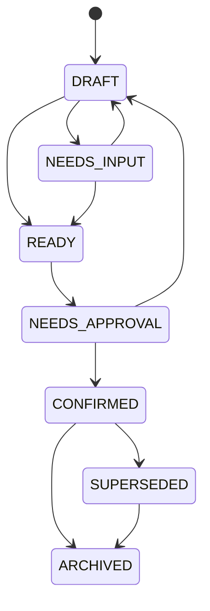

## 29.3 转换表

| 来源             | 动作                 | 目标             | 触发人        | 条件         |
| -------------- | ------------------ | -------------- | ---------- | ---------- |
| DRAFT          | parse              | NEEDS_INPUT    | User/Agent | 信息不足       |
| DRAFT          | validate           | READY          | System     | 必填字段完整     |
| NEEDS_INPUT    | update             | DRAFT          | User       | 补充输入       |
| READY          | request_approval   | NEEDS_APPROVAL | User/Agent | Schema通过   |
| NEEDS_APPROVAL | approve            | CONFIRMED      | User       | Approval通过 |
| NEEDS_APPROVAL | reject             | DRAFT          | User       | 修改后重提      |
| CONFIRMED      | create_new_version | SUPERSEDED     | User       | 新版本确认      |
| CONFIRMED      | archive            | ARCHIVED       | User       | 项目归档       |

---

# 30. Document 解析状态机

## 30.1 状态

```text
UPLOADED
QUEUED
PARSING
FALLBACK_PARSING
EXTRACTING
NEEDS_REVIEW
COMPLETED
FAILED
LOW_CONFIDENCE
CANCELLED
```

## 30.2 流程

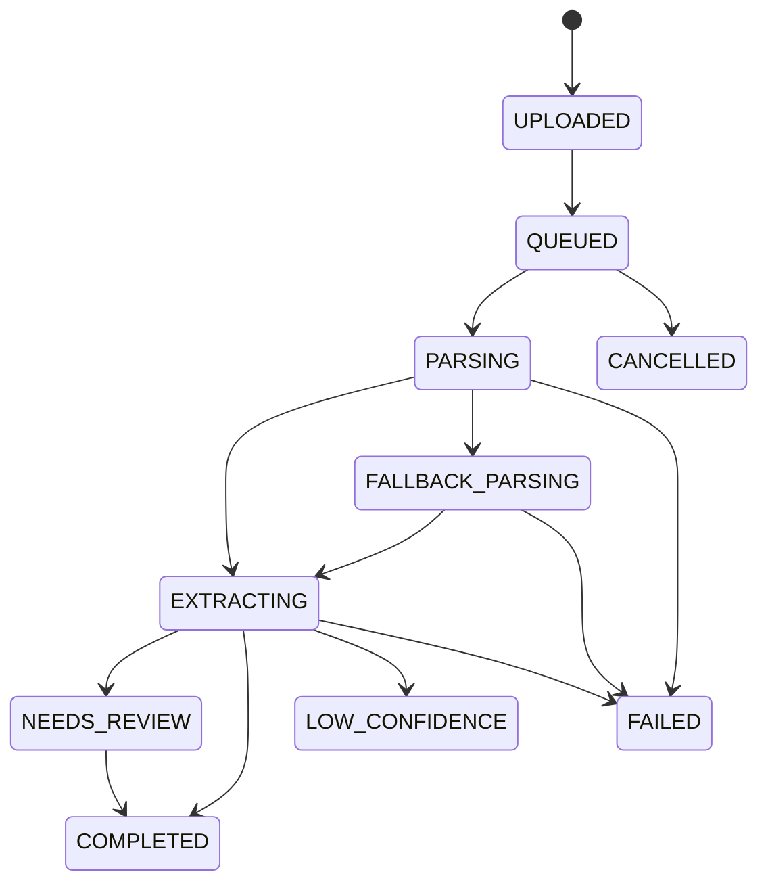

## 30.3 规则

* GROBID 失败后可进入回退；
* 扫描件可直接 LOW_CONFIDENCE；
* 用户修正后可 COMPLETED；
* 失败可重试；
* 重试创建新的 ProcessingRun。

---

# 31. LiteratureDecision 状态机

LiteratureDecision 采用事件历史，不直接修改同一行。

当前状态：

```text
UNCERTAIN
INCLUDED
EXCLUDED
```

允许转换：

* UNCERTAIN → INCLUDED；
* UNCERTAIN → EXCLUDED；
* INCLUDED → EXCLUDED；
* EXCLUDED → INCLUDED；
* INCLUDED/EXCLUDED → UNCERTAIN。

每次转换创建新 LiteratureDecision。

---

# 32. LiteratureExtraction 状态机

```text
DRAFT
EXTRACTING
NEEDS_REVIEW
CONFIRMED
SUPERSEDED
INVALIDATED
FAILED
```

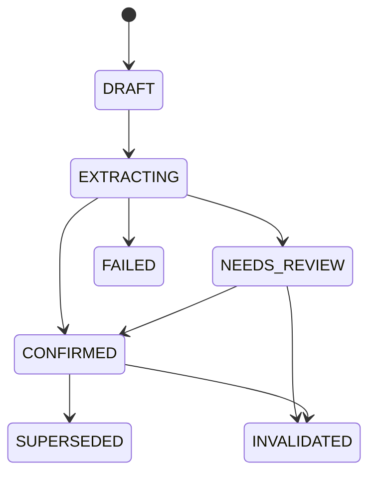

字段修正不应直接覆盖确认历史。

---

# 33. DatasetVersion 状态机

```text
CREATING
VALIDATING
AVAILABLE
FAILED
INVALIDATED
DELETED
```

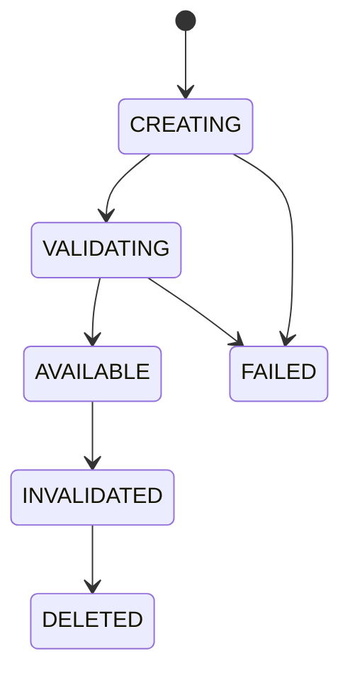

规则：

* AVAILABLE 后文件不可修改；
* FAILED 版本不设为 current；
* INVALIDATED 仍可查看；
* DELETED 是软删除状态。

---

# 34. CleaningPlan 状态机

```text
DRAFT
VALIDATING
NEEDS_INPUT
READY
NEEDS_APPROVAL
APPROVED
REJECTED
QUEUED
RUNNING
COMPLETED
FAILED
CANCELLED
INVALIDATED
```

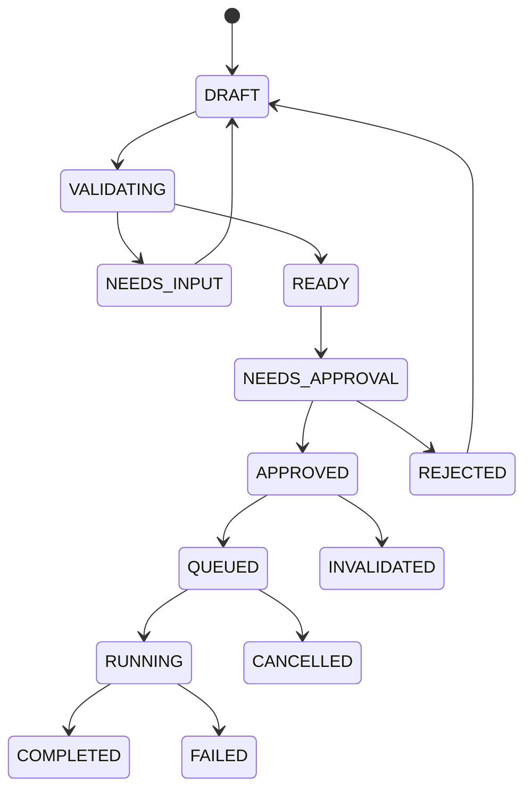

关键约束：

* APPROVED 后计划内容不可改；
* 修改计划需要创建新版本或重置 Draft；
* COMPLETED 必须有 DataTransformation 和 Target DatasetVersion；
* 计划所依赖的数据版本失效时进入 INVALIDATED。

---

# 35. AnalysisPlan 状态机

```text
DRAFT
VALIDATING
NEEDS_INPUT
READY
NEEDS_APPROVAL
APPROVED
REJECTED
QUEUED
RUNNING
COMPLETED
FAILED
CANCELLED
INVALIDATED
```

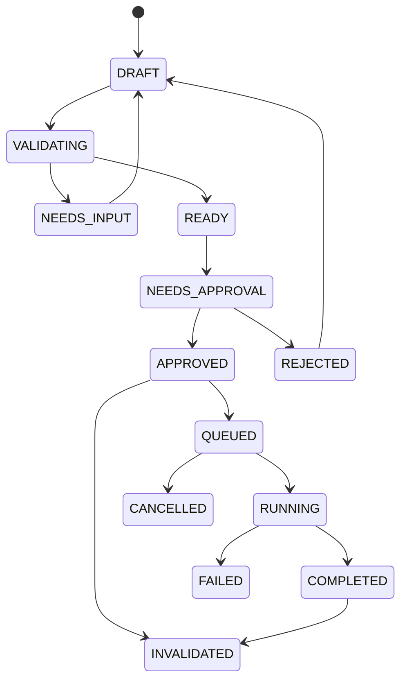

说明：

* AnalysisPlan 的 RUNNING/COMPLETED 可表示关联执行进度；
* 实际每次执行状态保存在 AnalysisRun；
* 同一 Plan 可产生多个 Run；
* 若允许重复运行，Plan 完成后仍保留 APPROVED 语义，代码实现可将运行状态完全放在 AnalysisRun。

推荐实现：

```text
AnalysisPlan: DRAFT → READY → NEEDS_APPROVAL → APPROVED → INVALIDATED
AnalysisRun: QUEUED → RUNNING → COMPLETED/FAILED/CANCELLED/INVALIDATED
```

---

# 36. AnalysisRun 状态机

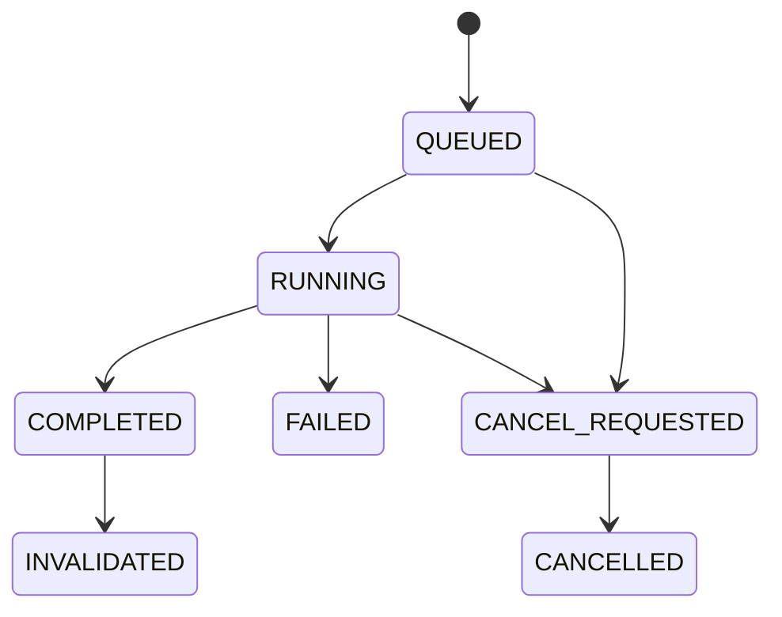

规则：

* COMPLETED 后不可改；
* 失败可基于同一 Plan 创建新 Run；
* INVALIDATED 必须说明原因；
* 取消不删除日志。

---

# 37. Figure 状态机

```text
DRAFT
RENDERING
READY
NEEDS_REVIEW
CONFIRMED
FAILED
INVALIDATED
ARCHIVED
```

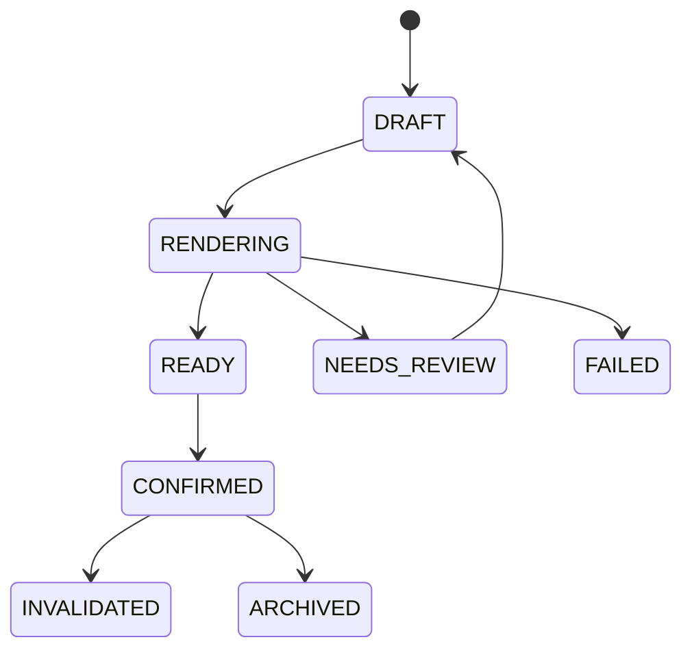

规则：

* 参数改变创建新 Figure；
* 不原地替换图像；
* AnalysisRun 失效时 Figure 失效。

---

# 38. ManuscriptCheck 状态机

```text
UPLOADED
QUEUED
PARSING
CHECKING_RULES
CHECKING_PROJECT_CONSISTENCY
NEEDS_REVIEW
COMPLETED
FAILED
LOW_CONFIDENCE
CANCELLED
```

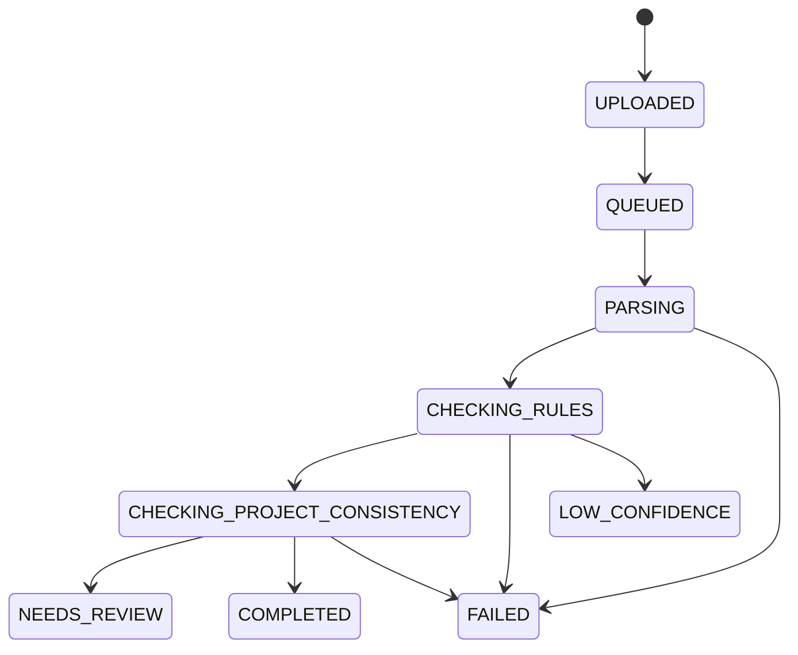

---

# 39. ManuscriptIssue 状态机

```text
OPEN
ACKNOWLEDGED
ACCEPTED
REJECTED
RESOLVED
INVALIDATED
```

| 来源                         | 动作                | 目标           |
| -------------------------- | ----------------- | ------------ |
| OPEN                       | acknowledge       | ACKNOWLEDGED |
| OPEN/ACKNOWLEDGED          | accept_suggestion | ACCEPTED     |
| OPEN/ACKNOWLEDGED          | reject_suggestion | REJECTED     |
| ACCEPTED                   | apply_fix         | RESOLVED     |
| OPEN/ACKNOWLEDGED/ACCEPTED | invalidate        | INVALIDATED  |

高风险问题被 ACCEPTED 不表示系统自动修改。

---

# 40. Claim 状态机

```text
DRAFT
NEEDS_EVIDENCE
SUPPORTED
CONFLICTED
INSUFFICIENT
CONFIRMED
REJECTED
INVALIDATED
```

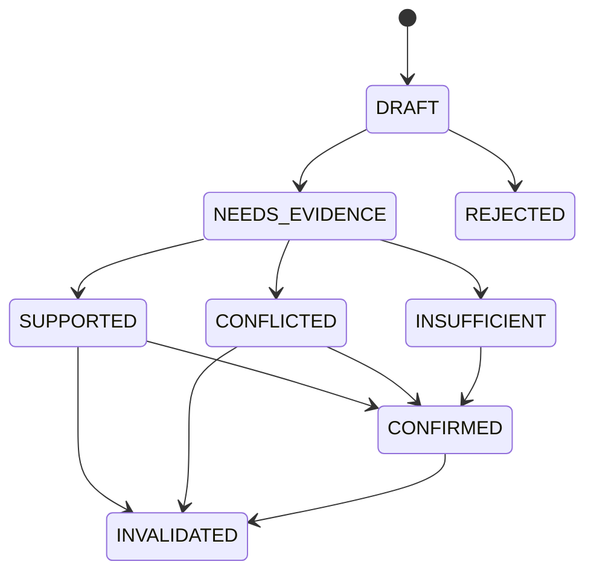

说明：

* CONFIRMED 表示用户确认该状态和表述，不等于“科学真理”；
* CONFLICTED 仍可作为综述中的争议 Claim；
* INSUFFICIENT 可作为“当前证据不足”结论。

---

# 41. ApprovalRecord 状态机

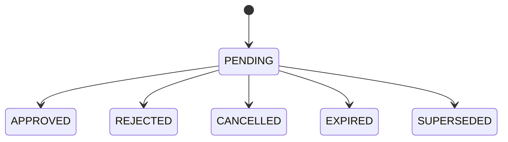

规则：

* 决策后不可修改；
* 修正通过新 Approval；
* 目标内容改变后，尚为 PENDING 的旧 Approval 转为 SUPERSEDED；已决定的历史记录保持原终态，新请求通过 `supersedes_approval_id` 引用旧记录；
* 对 `PENDING` 记录作决定前必须按相同规范化算法重算目标 payload hash；不一致时转为 `SUPERSEDED`；
* `expires_at <= now` 的 `PENDING` 记录在读取或决定边界转为 `EXPIRED`；
* 同一幂等 Key 和同一决定请求返回首次结果；使用新 Key 重复决定属于非法状态转换；
* CANCEL 只允许发起者或 OWNER，且只能从 PENDING 转换。

---

# 42. Job 状态机

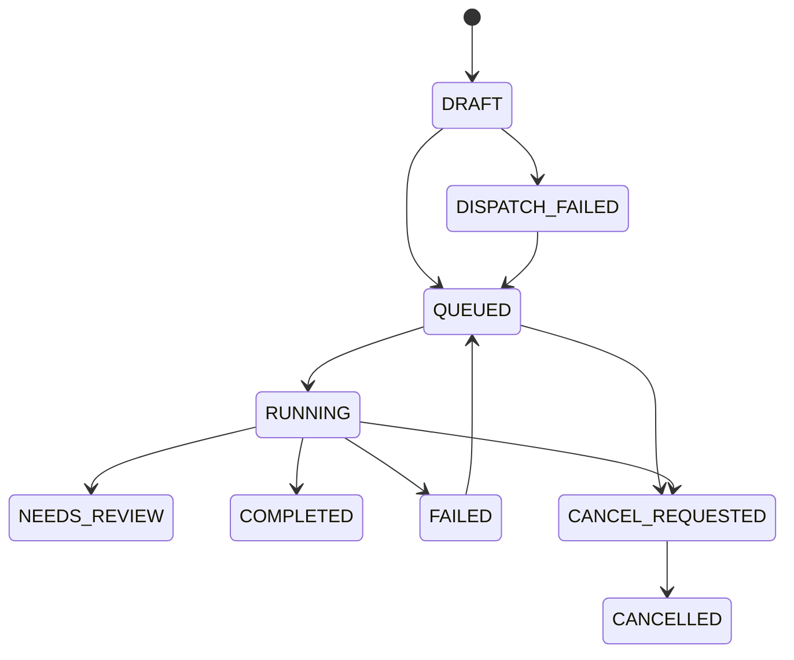

重试必须满足：

* `retryable=true`；
* 未超过 `max_retries`；
* 输入对象仍有效；
* 不存在已完成幂等结果。

重试语义：

* retry 复用原 Job，`FAILED` 或 `DISPATCH_FAILED` 转回 `QUEUED` 并递增 `retry_count`；
* 每次 Worker 实际开始执行时创建新的 ProcessingRun，并递增 `attempt_number`；
* `DISPATCH_FAILED` 尚未被 Worker 领取时重新分发不创建 ProcessingRun；
* 重复 Celery delivery 必须先锁定并读取 PostgreSQL Job；已有 active ProcessingRun、终态结果或不允许状态时不得再次执行；
* Celery state 和 Valkey event/cache 不得直接决定 Job 或 ProcessingRun 终态。

该 same-Job 规则是 intentional M1 clarifying amendment：批准基线只明确“retry 创建新的
ProcessingRun”，未定义是否创建新 Job；当前没有 M1 Job 数据或 migration compatibility
负担。

---

# 42A. Artifact 上传状态机

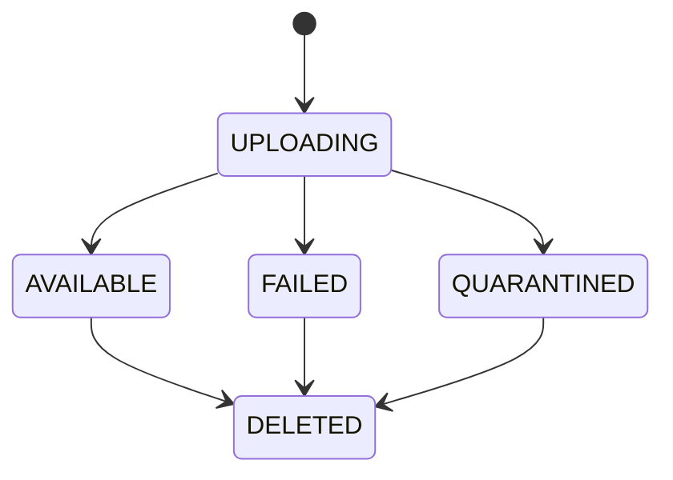

规则：

* 受控传输只能成功写入一次；重复写入不得覆盖对象；
* `complete` 只有在服务端 SHA-256、大小、MIME 和文件头检查全部通过时进入 AVAILABLE；
* 哈希、大小或类型不匹配进入 QUARANTINED；中断或过期进入 FAILED；
* AVAILABLE、QUARANTINED 和 DELETED 不允许重新 complete；
* 重复内容允许产生独立 Artifact，但幂等重放必须返回首次创建的同一 Artifact。

---

# 42B. ModelInvocation 状态机

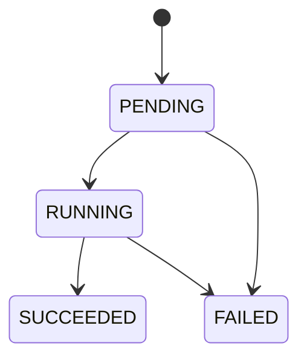

terminal ModelInvocation 不可修改；重试必须创建新记录。M1 只实现 Schema、持久化边界和 Mock/Recorded 契约，不发起 Provider 调用。

---

# 43. AgentRun 状态机

```text
CREATED
PLANNING
WAITING_FOR_INPUT
WAITING_FOR_APPROVAL
CALLING_TOOL
REVIEWING
COMPLETED
FAILED
CANCELLED
```

AgentRun 不直接代表业务对象完成。

业务状态仍由对应模块状态机管理。

---

# 44. Export 状态机

```text
DRAFT
VALIDATING
NEEDS_CONFIRMATION
QUEUED
PACKAGING
COMPLETED
FAILED
CANCELLED
```

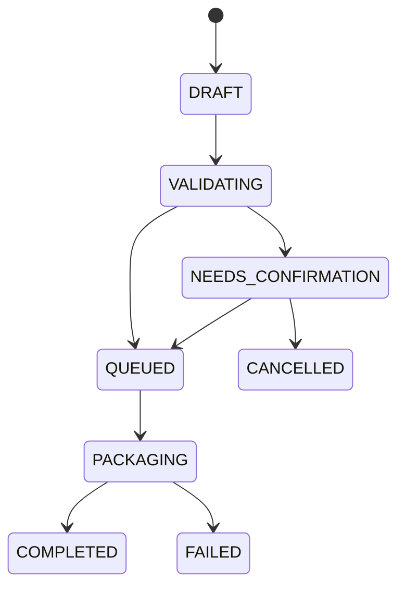

导出前验证：

* 许可证；
* 敏感数据；
* 失效对象；
* 未确认对象；
* 缺失 Artifact；
* Manifest 完整性。

---

# 45. 数据库索引建议

## 45.1 通用索引

所有核心表：

```text
(project_id)
(project_id, status)
(project_id, created_at)
```

## 45.2 文献

```text
(normalized_doi)
(project_id, normalized_title)
(document_id)
(literature_record_id, status)
```

## 45.3 EvidenceSpan

```text
(project_id, document_id)
(document_id, page_number)
(chunk_id)
```

## 45.4 数据

```text
(dataset_id, version_number)
(project_id, status)
(parent_version_id)
```

## 45.5 分析

```text
(analysis_plan_id)
(dataset_version_id)
(project_id, status)
(idempotency_key)
```

## 45.6 ClaimEvidenceLink

```text
(claim_id)
(evidence_object_type, evidence_object_id)
(project_id, status)
```

## 45.7 Job

```text
(project_id, status)
(celery_task_id)
(idempotency_key)
(status, created_at)
```

---

# 46. 数据库约束建议

## 46.1 同项目约束

应用服务必须确保关联对象属于同一 `project_id`。

P0 可由应用层校验；重要关系可增加复合外键或数据库触发验证，但不应让迁移过度复杂。

## 46.2 互斥字段

例如 LiteratureExtractionField：

* `value_text` 与 `value_json` 至少一个非空；
* `evidence_span_id` 允许空，但确认时应提示。

## 46.3 Check Constraint

示例：

```text
progress_percent BETWEEN 0 AND 100
version_number >= 1
row_count >= 0
column_count >= 0
page_number >= 1
```

## 46.4 删除行为

推荐：

* 核心对象外键使用 `RESTRICT` 或 `NO ACTION`；
* 不使用大范围 `ON DELETE CASCADE`；
* 子对象通过软删除或业务服务处理。

---

# 47. 数据迁移规则

## 47.1 新增字段

新增非空字段时：

1. 先允许空；
2. 回填；
3. 增加约束；
4. 更新代码；
5. 更新测试。

## 47.2 枚举变更

新增枚举需：

* 更新数据库；
* 更新 Pydantic；
* 更新前端类型；
* 更新状态机；
* 更新测试。

## 47.3 删除字段

P0 尽量不直接删除。

先：

* 停止写入；
* 保留读取；
* 数据迁移；
* 后续版本再删除。

## 47.4 表重命名

必须提供兼容迁移，避免破坏已有演示数据。

---

# 48. 数据完整性检查

系统应提供周期性完整性任务，检查：

* Artifact 存在但对象存储缺失；
* 对象存储存在但数据库无 Artifact；
* Dataset.current_version_id 无效；
* Manuscript.current_version_id 无效；
* AnalysisResult 无 AnalysisRun；
* Figure 无图像 Artifact；
* ClaimEvidenceLink 指向不存在对象；
* ApprovalRecord 目标不存在；
* Completed Job 无输出对象；
* ReproPackage Manifest 与文件不一致。

---

# 49. 前端状态映射

前端不应自行猜测可操作项。

API 应返回：

* 当前状态；
* `allowed_actions`；
* `requires_approval`；
* `blocking_reasons`；
* `warnings`。

示例：

```json
{
  "status": "NEEDS_APPROVAL",
  "allowed_actions": [
    "approve",
    "reject",
    "edit"
  ],
  "requires_approval": true,
  "blocking_reasons": [],
  "warnings": [
    "将影响数据集中的12条记录"
  ]
}
```

---

# 50. P0 实现优先顺序

## 第一批：基础对象

1. User；
2. ResearchProject；
3. ProjectMember；
4. Artifact；
5. Job；
6. AuditLog。
7. ModelInvocation。

## 第二批：研究问题与文献

1. ResearchQuestion；
2. ResearchQuestionVersion；
3. Document；
4. DocumentPage；
5. DocumentChunk；
6. LiteratureRecord；
7. LiteratureExtraction；
8. EvidenceSpan；
9. LiteratureDecision。

## 第三批：数据

1. Dataset；
2. DatasetVersion；
3. DatasetColumn；
4. DataQualityRun；
5. DataQualityIssue；
6. CleaningPlan；
7. CleaningPlanAction；
8. DataTransformation；
9. ApprovalRecord。

## 第四批：分析和图表

1. AnalysisPlan；
2. AnalysisAssumptionCheck；
3. AnalysisRun；
4. AnalysisResult；
5. FigurePlan；
6. Figure；
7. FigureValidationIssue。

## 第五批：论文与证据链

1. Manuscript；
2. ManuscriptVersion；
3. ManuscriptCheckRun；
4. ManuscriptIssue；
5. Claim；
6. ClaimEvidenceLink；
7. AuditResult。

## 第六批：Agent 与导出

1. AgentRun；
2. ToolCall；
3. Export；
4. ReproPackage；
5. ExportItem。

---

# 51. 最小可用字段策略

若工期有限，不得删除以下关键字段：

## 所有核心表

* id；
* project_id；
* status；
* created_at。

## 版本表

* version_number；
* parent_version_id；
* artifact_id；
* status。

## 运行表

* input object；
* parameters；
* engine version；
* implementation metadata 或可定位到等效版本化 manifest 的关联；
* status；
* started_at；
* completed_at；
* error。

## 证据对象

* source object；
* source text；
* page；
* relation；
* status。

## 审批对象

* target；
* payload snapshot；
* decision user；
* decision time；
* status。

---

# 52. 禁止的数据模型反模式

## 52.1 一个大 JSON 保存整个项目

禁止：

```text
projects.state JSONB
```

存储全部文献、数据和分析。

## 52.2 用聊天消息代替业务对象

聊天记录不能代替：

* AnalysisPlan；
* CleaningPlan；
* ApprovalRecord；
* LiteratureDecision。

## 52.3 用状态字段保存所有流程

禁止只用：

```text
status = "done"
```

而不保存运行、结果和审批。

## 52.4 覆盖旧版本

禁止更新 DatasetVersion 对应文件内容。

## 52.5 统计结果只保存文本

禁止：

```text
result_text = "r=0.42, p<0.05"
```

而无结构化 statistics。

## 52.6 证据链只保存在前端

React Flow 节点不是权威数据。

## 52.7 ToolCall 直接写结果表

工具必须通过业务 Service 和领域规则。

## 52.8 AI 输出直接成为用户确认

AI 建议和用户决定必须分离。

---

# 53. 数据模型验收标准

## 53.1 基础

* 所有核心对象使用 UUID；
* 核心业务对象包含 project_id；
* 所有表有创建时间；
* 可编辑对象有乐观锁或并发策略；
* 数据库迁移可执行。

## 53.2 文件

* 原始 Artifact 不可覆盖；
* SHA-256 存在；
* 文件来源可追溯；
* 删除采用软删除。

## 53.3 文献

* Document 与 LiteratureRecord 分离；
* EvidenceSpan 保存原文和页码；
* LiteratureDecision 保存历史；
* AI 抽取与用户确认分离。

## 53.4 数据

* Dataset 与 DatasetVersion 分离；
* 原始版本只读；
* CleaningPlan 与 Transformation 分离；
* 每次处理生成新版本；
* 版本血缘可查询。

## 53.5 分析

* AnalysisPlan、Run、Result 分离；
* 所有结果绑定 DatasetVersion；
* 完成的 AnalysisRun 不可修改；
* 数字结构化保存；
* 环境版本可查询。

## 53.6 图表

* Figure 绑定 DatasetVersion；
* 统计图绑定 AnalysisRun；
* 图像和代码有 Artifact；
* 参数变化不覆盖旧 Figure。

## 53.7 论文

* Manuscript 与 Version 分离；
* 原始 DOCX 不覆盖；
* Issue 可定位；
* Issue 可关联 AnalysisResult 或文献证据。

## 53.8 证据链

* Claim 和 EvidenceSpan 分离；
* ClaimEvidenceLink 可表示支持、反对和限定；
* 节点关系不可跨项目；
* 上游失效可传播；
* React Flow 数据来自后端。

## 53.9 审批

* 高风险操作有 ApprovalRecord；
* 只读、扫描、候选生成、预览和一般模型调用不要求 ApprovalRecord；
* 低风险采用可使用轻量确认，不进入正式审批状态机；
* Agent 不能批准；
* 审批保存内容快照；
* 对象变化后旧审批失效。

## 53.10 运行

* Job 与 ProcessingRun 分离；
* 任务幂等；
* ToolCall 和 ModelInvocation 可审计；
* 失败保留错误码；
* 重试不重复写正式结果。

---

# 54. 附录A：推荐 SQLModel 基类

以下为说明性结构，不替代正式代码审查。

```python
from datetime import datetime
from uuid import UUID, uuid4

from sqlmodel import Field, SQLModel


class BaseEntity(SQLModel):
    id: UUID = Field(default_factory=uuid4, primary_key=True)
    created_at: datetime = Field(default_factory=datetime.utcnow)
    updated_at: datetime = Field(default_factory=datetime.utcnow)


class ProjectScopedEntity(BaseEntity):
    project_id: UUID = Field(index=True, foreign_key="researchproject.id")
```

不可变对象不应提供通用 update 方法。

---

# 55. 附录B：推荐状态转换接口

```python
class StateTransitionResult(BaseModel):
    object_type: str
    object_id: UUID
    previous_status: str
    current_status: str
    action: str
    approval_required: bool
    audit_log_id: UUID
    warnings: list[str]


class StateMachine(Protocol):
    async def transition(
        self,
        object_id: UUID,
        action: str,
        actor: ActorContext,
        payload: dict | None = None,
    ) -> StateTransitionResult:
        ...
```

---

# 56. 附录C：证据链示例

论文论述：

> 生成式 AI 使用频率与师范生学习投入呈正相关。

对应数据：

```text
Claim
├── claim_type: MANUSCRIPT_STATEMENT
├── status: CONFIRMED
├── scope: 某公开数据集中的师范生样本
│
├── SUPPORTED_BY → EvidenceSpan A
│   ├── 文献ID
│   ├── PDF第8页
│   └── 原文片段
│
├── QUALIFIED_BY → EvidenceSpan B
│   ├── 研究为横断面设计
│   └── 不支持因果解释
│
├── DERIVED_FROM → DatasetVersion V2
├── ANALYZED_BY → AnalysisRun RUN-018
├── PRODUCED_BY → AnalysisResult RESULT-018
├── VISUALIZED_AS → Figure FIG-006
├── CONFIRMED_BY → ApprovalRecord APR-014
└── AUDITED_BY → AuditResult AUD-009
```

页面必须明确显示：

* 相关不等于因果；
* 数据版本；
* 样本范围；
* 方法；
* 原文支持；
* 限制条件。

---

# 57. 附录D：数据版本示例

```text
Dataset: 师范生生成式AI使用调查数据
│
├── V1 ORIGINAL
│   ├── rows: 1,020
│   ├── sha256: ...
│   └── status: AVAILABLE
│
├── CleaningPlan CP-001
│   ├── 统一性别编码
│   ├── 将999标记为缺失
│   └── 用户批准 APR-021
│
├── DataTransformation DT-001
│   └── 输入 V1
│
└── V2 CLEANED
    ├── parent: V1
    ├── rows: 1,020
    ├── sha256: ...
    └── status: AVAILABLE
```

---

# 58. 附录E：分析运行示例

```text
AnalysisPlan AP-003
├── DatasetVersion: V2
├── Method: PEARSON_CORRELATION
├── X: ai_usage_frequency
├── Y: learning_engagement
├── Missing Policy: pairwise complete
├── Assumption: linearity warning
└── Approval: APR-025

AnalysisRun AR-006
├── Plan: AP-003
├── Engine: SciPy
├── Engine Version: x.x.x
├── Status: COMPLETED
├── CodeArtifact: CODE-006
└── Result: RESULT-006

AnalysisResult RESULT-006
├── sample_size: 984
├── coefficient: 0.31
├── p_value: ...
├── confidence_interval: ...
└── warnings:
    └── 不支持因果推断
```

所有正式论文数字从 `AnalysisResult` 读取，而不是从 AI 文本中读取。

---
