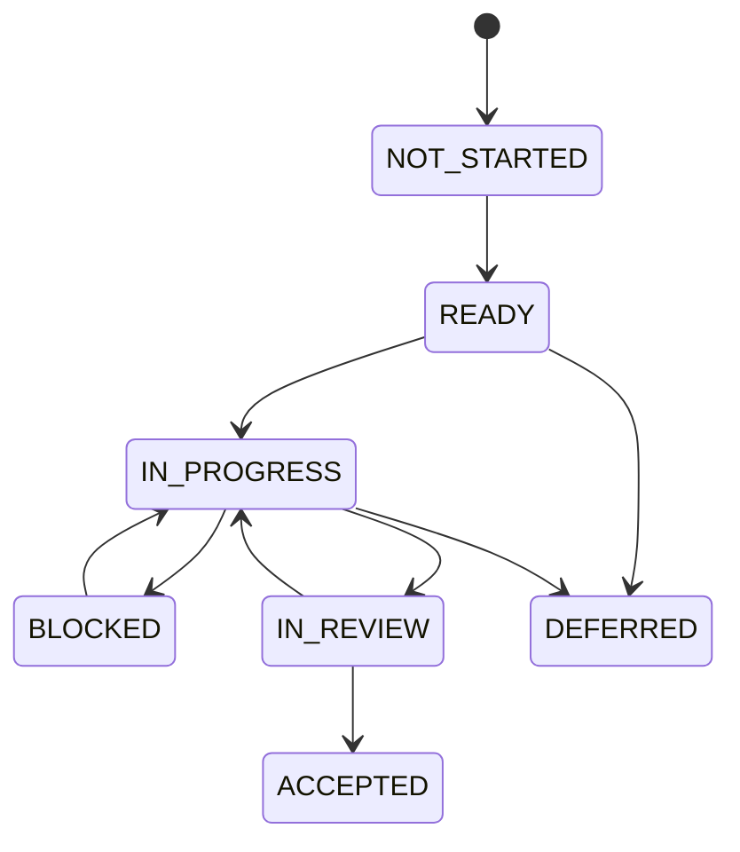

# DELIVERY_WORKFLOW

- 所属入口文档：[IMPLEMENTATION_ROADMAP.md](../IMPLEMENTATION_ROADMAP.md)
- 文档状态：APPROVED FOR M1 DEVELOPMENT
- 当前增量状态：APPROVED FOR M1 DEVELOPMENT
- 基线兼容性：保留 `docs-m1-approved` 的历史批准范围
- Migration status: COMPLETE

## 权威范围

分支、Commit、Pull Request、里程碑状态、Codex 任务拆分、并行开发和路线图变更控制的公共规则。

## 不负责的内容

不定义产品范围、里程碑业务内容、字段、API 或测试指标，也不允许绕过里程碑 Entry/Exit Gate。

## 文档导航

- 返回 [IMPLEMENTATION_ROADMAP.md](../IMPLEMENTATION_ROADMAP.md)
- [DELIVERY_WORKFLOW.md](DELIVERY_WORKFLOW.md)
- [RISK_SCOPE_AND_RELEASE.md](RISK_SCOPE_AND_RELEASE.md)
- [M0 Regression Baseline](../testing/M0_REGRESSION_BASELINE.md)

本文档最初由路线图对应章节迁移形成，后续已按正式变更流程增量维护。当前详细交付规则以本文档现版本为准，入口文档负责摘要和导航。

# 18. Codex 任务拆分规则

## 18.1 单任务原则

每个 Codex 任务应只包含一个清晰目标。

推荐任务规模：

* 一个领域对象；
* 一个状态机；
* 一个 Adapter；
* 一个 Service 用例；
* 一个 API 资源；
* 一组紧密相关的测试；
* 一个前端页面；
* 一个端到端流程切片。

禁止单任务同时包含：

```text
实现全部文献模块、全部数据模块、全部 Agent 和全部前端
```

## 18.2 任务必须包含的内容

每个任务提示词至少包含：

```text
任务目标
背景
权威文档
允许修改的文件
禁止修改的文件
领域对象
状态机
API 契约
安全约束
测试要求
完成条件
交付说明
```

## 18.3 推荐任务模板

```markdown
# 任务名称

## 目标

## 必须阅读

- AGENTS.md
- docs/...
- docs/IMPLEMENTATION_ROADMAP.md 对应里程碑

## 当前里程碑

M4 数据质量与版本

## 前置条件

## 修改范围

## 禁止修改

## 领域规则

## API 契约

## 安全要求

## 测试要求

## 完成条件

## 最终交付说明
```

## 18.4 Codex 修改顺序

单个功能推荐顺序：

```text
文档与契约确认
→ 领域枚举
→ 数据模型
→ Alembic Migration
→ Repository
→ Domain Policy
→ Application Service
→ 按需选择 Direct Library / Adapter / Isolated Service
→ Worker
→ API
→ OpenAPI
→ 前端类型
→ 前端页面
→ 单元测试
→ 契约测试
→ 集成测试
→ E2E
```

不要求每个小任务都覆盖全部层级，但不得跳过受影响层。

## 18.5 Codex 任务完成定义

任务只有在以下条件满足时才完成：

* 实现符合对应里程碑；
* 没有擅自扩大范围；
* 数据迁移存在；
* 权限校验存在；
* 项目隔离存在；
* 错误结构符合契约；
* 测试通过；
* 文档同步；
* 无原始文件覆盖；
* 无未记录技术债；
* 最终交付说明完整。

---

# 19. 分支与提交建议

本节为推荐流程，不覆盖团队现有 Git 规则。

## 19.1 分支命名

```text
feat/m1-project-foundation
feat/m2-openalex-adapter
feat/m3-evidence-span
feat/m4-cleaning-plan
feat/m5-correlation-analysis
feat/m6-manuscript-check
feat/m7-repro-package
feat/m8-agent-tool-registry
fix/m3-evidence-page-location
docs/implementation-roadmap
```

## 19.2 Commit 原则

一次 Commit 尽量对应一个完整、可验证的变化。

推荐：

```text
feat(projects): add project membership authorization
feat(artifacts): add immutable upload workflow
feat(literature): add OpenAlex provider adapter
feat(analysis): add Pearson correlation engine
test(evidence): add page-location golden cases
docs(roadmap): define M5 acceptance gates
```

## 19.3 Pull Request 最低要求

PR 描述至少包含：

* 所属里程碑；
* 需求 ID；
* 变更摘要；
* 数据模型影响；
* API 影响；
* 安全影响；
* 测试结果；
* 截图或演示；
* 已知限制；
* 后续任务。

---

# 20. 并行开发规则

## 20.1 可以并行的条件

只有在以下内容冻结后才能并行：

* 对象名称；
* 枚举；
* API 路径；
* Schema；
* 错误码；
* 测试 Fixture；
* 负责人；
* 依赖关系。

## 20.2 前后端并行

前端不得猜测 API。

建议流程：

```text
API 契约冻结
→ OpenAPI 更新
→ 前端 Client 生成
→ Mock Server 或契约 Fixture
→ 前后端并行开发
→ 契约测试
```

### 20.2.1 Open Design × Codex 并行流程

只有 UI Integration Contract 足够冻结后才进入设计与业务并行：

```text
Requirement Ready
→ Domain / API Contract Ready
→ Route + ViewModel + Component Props/Events + Mock Contract Ready
→ Parallel:
   - Codex: backend / API / adapter / controller / mapper
   - Open Design: design system / UI / Mock ViewModel
→ Incremental Integration
→ Component / Contract Test
→ E2E
→ Visual + Functional Review
→ Milestone Gate
```

两条分支基于同一冻结 contract，不得分别生成完整前端后在项目结束时一次性合并。Router、generated/adapter、feature UI、shared components 和 Design Token source 应按 [Frontend Design Integration Rules](../development/FRONTEND_DESIGN_INTEGRATION_RULES.md) 指定主责；共享高冲突文件同一时段只指定一个主修改人。

设计稿或 Mock 页面提前完成：

```text
≠ API 已实现
≠ 业务功能已完成
≠ milestone passed
```

设计变更按影响处理：

- 纯视觉变化：Design 层修改与视觉审查；
- Props / Events 变化：UI contract review；
- ViewModel 变化：Codex + Open Design review，并同步 mapper 与 Mock；
- API / Schema 变化：正式 API Contract 流程并重新生成 client；
- Requirement 变化：正式产品变更流程。

## 20.3 第三方集成与业务服务并行

需要替换、离线 Mock、许可证隔离、安全边界或复杂转换时，业务服务依赖 Protocol，不依赖具体 SDK。

例如：

```python
class LiteratureProvider(Protocol):
    async def search(self, query_plan: QueryPlan) -> list[LiteratureRecordDTO]:
        ...
```

业务服务可使用 Mock Provider 测试，Adapter 可独立开发。

成熟稳定、接口很小、没有替换需求且不污染领域模型的库可由 Service 直接集成；大型或特殊许可证组件可使用独立服务、Fork 或 Vendor。集成 PR 必须同步许可证、上游 Commit/Tag、归属和修改记录，不要求为了形式完整先实现 Adapter。

第三方接入任务必须显式经过：

```text
Research record
→ minimal effect/failure/fallback Spike
→ boundary and license Decision
→ Integration with adapted tests and attribution
```

研究、Spike 和决策可与业务 Service 契约准备并行；在结果边界、回退和许可证义务未确定前，不得把第三方对象写入领域模型或把计划项目加入正式运行时。

## 20.4 禁止并行的场景

以下任务不应在上游未冻结时并行：

* 数据模型未定时同时开发多个 API；
* AnalysisResult Schema 未定时开发图表和 DOCX 数字核对；
* EvidenceSpan 定位规则未定时开发 PDF 高亮；
* Tool Contract 未定时开发 Agent；
* Approval 规则未定时开发执行工具。

---

# 21. 里程碑状态管理

每个里程碑使用以下状态：

```text
NOT_STARTED
READY
IN_PROGRESS
BLOCKED
IN_REVIEW
ACCEPTED
DEFERRED
```

## 21.1 状态含义

| 状态          | 含义           |
| ----------- | ------------ |
| NOT_STARTED | 前置条件未满足或尚未计划 |
| READY       | 前置条件满足，可以开始  |
| IN_PROGRESS | 已开始开发        |
| BLOCKED     | 存在无法继续的依赖或缺陷 |
| IN_REVIEW   | 功能完成，正在验收    |
| ACCEPTED    | 已满足阶段完成条件    |
| DEFERRED    | 明确推迟到后续版本    |

## 21.2 状态转换



## 21.3 阶段验收人

建议：

| 内容        | 主要验收人    |
| --------- | -------- |
| 产品范围      | 产品负责人    |
| 数据模型      | 后端或架构负责人 |
| API 契约    | 前后端负责人   |
| 确定性统计     | 数据分析负责人  |
| AI Schema | AI 负责人   |
| 测试门禁      | 测试负责人    |
| 安全与许可证    | 安全或项目负责人 |
| 比赛演示      | 项目负责人    |

Codex 不能自行将里程碑标记为最终 ACCEPTED。

---

# 27. 路线图维护规则

## 27.1 更新时机

以下情况必须更新本文档：

* P0-Must 变化；
* 里程碑顺序变化；
* 关键依赖变化；
* 里程碑延期；
* 新增阻塞风险；
* Agent 接入条件变化；
* 演示方案变化；
* 发布门禁变化。

## 27.2 不需要更新的情况

以下变化通常不需要修改路线图：

* 小型 Bug 修复；
* 代码重构但不改变模块边界；
* UI 文案调整；
* 单个测试样例增加；
* 不改变里程碑的内部实现优化。

## 27.3 变更记录

每次修改本文档必须记录：

* 版本；
* 日期；
* 变更原因；
* 影响里程碑；
* 是否影响 P0-Must；
* 是否影响演示；
* 是否需要同步其他文档。

---
