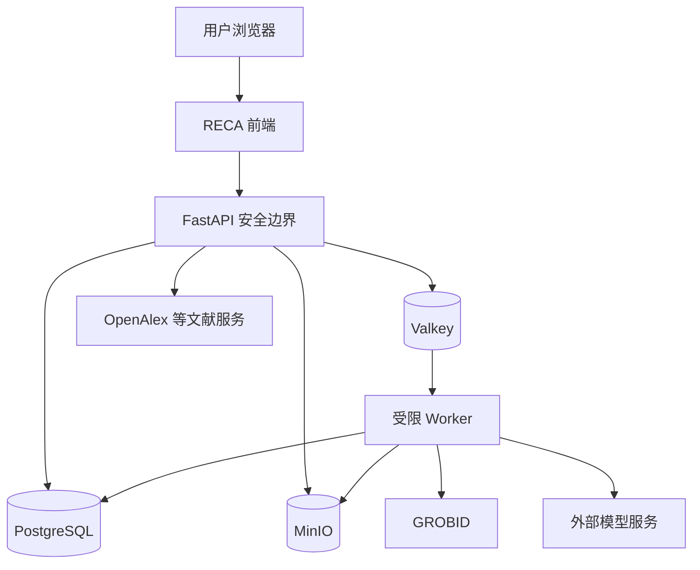

# Security Controls

- 文档名称：Security Controls
- 所属入口文档：[SECURITY_AND_OPEN_SOURCE.md](../SECURITY_AND_OPEN_SOURCE.md)
- 文档状态：Conditional Approval
- Migration status: COMPLETE

## 权威范围

本文件是威胁模型、认证、授权、项目隔离、输入验证、数据库与对象存储、外部服务、Web、日志、密钥、开发生命周期、Docker 和安全测试控制的唯一完整定义。

## 不负责的内容

不负责文件解析、模型与 Agent 专项规则、事件响应流程或第三方许可证治理。

## 返回入口文档

返回 [SECURITY_AND_OPEN_SOURCE.md](../SECURITY_AND_OPEN_SOURCE.md)。

## 已迁入的原章节

- 原第 6-10、22-23、25-28、34、53、57 章

## 临时状态说明

阶段 9 迁移已完成。本文件与入口文档共同构成安全与开源治理正式开发基准；发生冲突时视为文档缺陷，不得自行猜测、降低安全要求或选择根许可证。

---

## 6. 威胁模型

### 6.1 受保护资产

RECA 需要保护：

* 用户身份；
* 登录凭据；
* Access Token；
* 项目成员关系；
* 私有科研选题；
* 未发表论文；
* 用户上传 PDF；
* 数据集；
* 敏感字段；
* 数据处理记录；
* AnalysisResult；
* 图表；
* Agent 日志；
* 模型调用记录；
* 系统密钥；
* 对象存储凭据；
* 数据库凭据；
* 复现包；
* 第三方许可证信息。

### 6.2 潜在攻击者

包括：

* 未登录用户；
* 普通注册用户；
* 同一系统中的其他项目用户；
* 被移除的项目成员；
* 恶意上传者；
* 恶意文档作者；
* 提示注入内容；
* 被攻陷的外部服务；
* 配置错误的开发者；
* 泄露密钥的第三方；
* 误操作用户；
* 越权 Agent。

### 6.3 主要威胁

| 威胁       | 示例                      |
| -------- | ----------------------- |
| 身份冒用     | 窃取 Token 后访问项目          |
| 越权读取     | 修改 UUID 读取他人 PDF        |
| 越权写入     | 修改他人 CleaningPlan       |
| 路径穿越     | 上传 `../../secret.txt`   |
| 恶意文件     | 伪装 PDF、压缩炸弹             |
| ZIP Slip | DOCX 或导出包解压逃逸           |
| 提示注入     | PDF 中包含“忽略系统规则”         |
| 任意代码执行   | Agent 调用 Python 或 Shell |
| SQL 注入   | 通过筛选参数构造 SQL            |
| 敏感数据泄露   | 完整数据表发送模型               |
| 日志泄露     | 日志记录 JWT 或身份证号          |
| 供应链攻击    | 恶意依赖或被接管包               |
| 许可证违规    | 将受限 PDF 打包分发            |
| 统计结果篡改   | 模型直接改写 p 值              |
| 审批绕过     | 未批准清洗直接执行               |
| 缓存污染     | 将错误结果缓存为可信文献            |
| 跨项目证据链   | Claim 关联他人数据            |
| 备份泄露     | 未加保护的数据库备份              |
| 资源耗尽     | 超大 PDF、超大数据、无限 Agent 循环 |

### 6.4 信任边界



浏览器、上传文件、外部服务和模型输出均位于不同程度的不可信边界之外。

---

## 7. 身份认证

### 7.1 认证方式

RECA 0.1 沿用 FastAPI 全栈模板的认证机制，使用：

```http
Authorization: Bearer <access_token>
```

### 7.2 密码要求

密码：

* 不以明文保存；
* 使用成熟密码哈希算法；
* 哈希参数由模板和安全评估确定；
* 不写入日志；
* 不返回 API；
* 不放入导出包。

建议最低要求：

* 至少 8 个字符；
* 支持长密码；
* 不限制用户只能使用特定符号；
* 拒绝明显弱密码可作为 P1。

### 7.3 Access Token

要求：

* 有过期时间；
* 包含用户 ID；
* 不包含敏感科研数据；
* 服务端验证签名；
* Token 密钥从环境变量读取；
* 不写入 URL；
* 不在普通日志中记录。

### 7.4 Token 存储

前端应沿用模板的安全实现。

不得：

* 将长期密钥写入代码；
* 在前端打包管理员密钥；
* 把 Token 发送给第三方模型；
* 在错误页面打印完整 Token。

### 7.5 登录保护

P0 最低要求：

* 登录失败返回通用错误；
* 不泄露邮箱是否存在；
* 登录接口限流；
* 多次失败可短暂限制；
* 管理员账户使用强密码。

### 7.6 被停用账户

`is_active=false` 后：

* 不能登录；
* 现有 Token 应尽快失效或在服务端校验时拒绝；
* 不删除历史审计记录；
* 项目所有权需要管理员处理。

### 7.7 管理员权限

管理员权限仅用于：

* 用户管理；
* 示例项目；
* 服务状态；
* 必要安全恢复。

管理员不应默认浏览所有用户科研内容。

如确需访问，必须：

* 明确授权；
* 记录审计；
* 说明原因；
* 遵守学校管理制度。

---

## 8. 授权与角色

### 8.1 系统角色

* `STUDENT`；
* `TEACHER`；
* `ADMIN`。

系统角色不直接替代项目角色。

### 8.2 项目角色

* `OWNER`；
* `EDITOR`；
* `REVIEWER`；
* `VIEWER`。

### 8.3 角色能力

| 操作              | OWNER | EDITOR | REVIEWER | VIEWER |
| --------------- | ----: | -----: | -------: | -----: |
| 查看项目            |     是 |      是 |        是 |      是 |
| 修改基础信息          |     是 |      是 |      按授权 |      否 |
| 添加成员            |     是 |      否 |        否 |      否 |
| 上传文献            |     是 |      是 |      按授权 |      否 |
| 文献筛选            |     是 |      是 |        是 |      否 |
| 上传数据            |     是 |      是 |      按授权 |      否 |
| 创建 CleaningPlan |     是 |      是 |      按授权 |      否 |
| 批准数据处理          |     是 |    按授权 |      可复核 |      否 |
| 创建 AnalysisPlan |     是 |      是 |      按授权 |      否 |
| 批准分析            |     是 |    按授权 |      可复核 |      否 |
| 上传论文            |     是 |      是 |        是 |      否 |
| 查看证据链           |     是 |      是 |        是 |      是 |
| 导出复现包           |     是 |    按授权 |      按授权 |      否 |
| 删除项目            |     是 |      否 |        否 |      否 |

### 8.4 服务端授权流程

每个受保护 API 必须依次验证：

1. Token 有效；
2. 用户启用；
3. 资源存在；
4. 资源所属 `project_id`；
5. 用户是项目成员；
6. 项目成员未被移除；
7. 用户具备对应操作权限；
8. 项目状态允许；
9. 目标对象状态允许；
10. 必要审批存在。

### 8.5 禁止仅通过路径判断授权

错误示例：

```python
document = get_document(document_id)
return document
```

正确逻辑：

```python
document = get_document(document_id)
authorize_project_resource(
    user=current_user,
    project_id=document.project_id,
    permission="literature.read",
)
return document
```

### 8.6 UUID 不构成秘密

任何用户知道某个 UUID，都不能因此访问对应资源。

### 8.7 项目成员移除

成员被移除后：

* 立即失去项目访问；
* 已生成签名下载 URL 应设置较短有效期；
* 历史操作记录保留；
* 其创建的科研对象不删除。

---

## 9. 项目数据隔离

### 9.1 强制项目作用域

核心查询必须包含项目约束。

错误示例：

```sql
SELECT * FROM claims WHERE id = :claim_id;
```

推荐：

```sql
SELECT *
FROM claims
WHERE id = :claim_id
  AND project_id = :authorized_project_id;
```

### 9.2 跨对象关联校验

创建以下关系时必须验证同项目：

* LiteratureRecord 与 Document；
* EvidenceSpan 与 LiteratureExtraction；
* DatasetVersion 与 AnalysisPlan；
* AnalysisRun 与 Figure；
* Claim 与 ClaimEvidenceLink；
* ManuscriptIssue 与 AnalysisResult；
* ApprovalRecord 与目标对象；
* ExportItem 与 Artifact。

### 9.3 向量检索隔离

pgvector 查询必须过滤：

```text
project_id = current_project_id
```

不得先全库召回再在应用层过滤。

### 9.4 SSE 隔离

订阅 Job 事件前验证：

* Job 所属项目；
* 用户项目读取权限。

### 9.5 对象存储隔离

存储键包含：

```text
projects/{project_id}/artifacts/{artifact_id}/...
```

但路径结构不能代替 API 授权。

### 9.6 导出隔离

复现包只能包含当前项目对象。

导出前执行自动检查：

* 所有 ExportItem 的 `project_id` 一致；
* ClaimEvidenceLink 不跨项目；
* Artifact 归属一致；
* 无系统密钥和其他用户数据。

---

## 10. 输入验证

### 10.1 通用规则

所有外部输入必须通过 Pydantic 或等效 Schema 验证。

### 10.2 字符串

要求：

* 限制长度；
* 去除无意义控制字符；
* 不将用户输入直接拼入 SQL；
* 不将用户输入直接用于文件路径；
* 前端展示时防止 XSS。

### 10.3 枚举

只接受定义值。

不得为兼容错误输入静默转换成其他高风险状态。

### 10.4 UUID

必须验证格式和资源归属。

### 10.5 数值

检查：

* 最小值；
* 最大值；
* 是否有限；
* 是否允许负数；
* 是否允许 NaN；
* 是否允许无穷大。

### 10.6 JSONB

JSONB 参数仍必须拥有 Schema。

不得接受任意嵌套表达式作为数据处理或查询语言。

### 10.7 过滤和排序

仅允许白名单字段。

不得将用户输入作为原始 SQL 排序字段。

### 10.8 富文本

P0 不允许任意 HTML 作为正式科研内容。

展示用户文本时默认转义。

---

## 22. 数据库安全

### 22.1 数据库账户

生产或演示部署至少区分：

* 应用账户；
* 迁移账户；
* 备份账户；
* 管理账户。

P0 单机环境可简化，但应用账户不应具有创建超级用户等高权限。

### 22.2 连接配置

* 凭据来自环境变量或 Secret；
* 不写入代码；
* 不记录完整连接字符串；
* 云端部署优先使用加密连接；
* 限制数据库网络暴露。

### 22.3 SQL 注入

使用 ORM 和参数化查询。

禁止：

* 拼接用户输入 SQL；
* 用户指定原始 ORDER BY；
* Agent 执行 SQL；
* 用户提交 SQL 过滤器。

### 22.4 数据库迁移

Alembic Migration：

* 进入版本控制；
* Code Review；
* 在测试数据库验证；
* 备份后执行生产迁移；
* 不在启动时静默执行破坏性迁移。

### 22.5 软删除

软删除资源默认不返回普通用户。

管理员恢复也必须有审计。

### 22.6 审计表

AuditLog 应限制更新和删除。

P0 可通过应用层保证追加写，正式生产可进一步使用数据库权限强化。

---

## 23. 对象存储安全

### 23.1 网络暴露

MinIO 管理控制台不应直接暴露到公共互联网，或必须有强认证和网络限制。

### 23.2 Bucket

项目文件使用私有 Bucket。

不得设置公共读。

### 23.3 签名 URL

要求：

* 短期有效；
* 按请求生成；
* 生成前授权；
* 不写入长期日志；
* 不在公开页面缓存。

### 23.4 存储凭据

API 和 Worker 使用最小权限凭据。

前端不接触 Secret Key。

### 23.5 文件路径

对象存储键由系统生成。

不使用用户文件名作为安全标识。

### 23.6 临时文件

临时对象：

* 使用独立前缀；
* 处理完成后清理；
* 失败后由补偿任务清理；
* 不长期保留敏感文件副本。

### 23.7 对象完整性

下载或打包前可校验 SHA-256。

---

## 25. 外部服务安全

### 25.1 LiteratureProvider

OpenAlex 等 Provider：

* 设置超时；
* 限制重试；
* 限流；
* 校验响应；
* 缓存注明时间；
* 不信任返回 HTML；
* 不将 Provider 数据直接写入正式字段而不标准化。

### 25.2 GROBID

* 独立容器；
* 受限资源；
* 输入临时文件；
* 输出 TEI 继续校验；
* 不把 TEI 当可信 HTML 展示。

### 25.3 模型服务

* 通过 ModelGateway；
* API Key 仅后端持有；
* 设置超时；
* 限制重试；
* 记录供应商；
* 记录实际模型；
* 输出 Schema 校验；
* 不授予业务数据库访问。

### 25.4 外部 URL

P0 不支持用户提供任意 URL 由后端抓取。

若未来支持，必须防止 SSRF：

* 协议白名单；
* 域名白名单；
* DNS 重绑定防护；
* 禁止内网地址；
* 禁止云元数据地址；
* 限制重定向；
* 限制响应大小。

---

## 26. Web 安全

### 26.1 HTTPS

云端部署必须使用 HTTPS。

本地开发可使用 HTTP。

### 26.2 安全响应头

建议配置：

* `Content-Security-Policy`；
* `X-Content-Type-Options: nosniff`；
* `Referrer-Policy`；
* `Permissions-Policy`；
* `Strict-Transport-Security`；
* 防止不必要 iframe 嵌入。

### 26.3 XSS

用户输入和文献内容展示时转义。

不得直接使用不可信 HTML。

### 26.4 CSRF

若使用 Cookie 认证，必须实施 CSRF 防护。

若使用 Bearer Token，应确保 Token 不被浏览器自动附带给第三方站点。

### 26.5 CORS

只允许配置的前端来源。

不得在带凭据场景中使用任意来源。

### 26.6 点击劫持

根据产品需要设置 `frame-ancestors` 或等效策略。

### 26.7 错误页面

生产错误不得展示：

* 堆栈；
* 数据库连接；
* 文件路径；
* 密钥；
* 内部服务地址。

---

## 27. 日志安全

### 27.1 日志分类

#### 系统日志

用于：

* 运行状态；
* 错误；
* 性能；
* 依赖状态。

#### 审计日志

用于：

* 用户操作；
* 权限；
* 审批；
* 状态变化；
* ToolCall；
* 导出。

#### 模型调用记录

用于：

* Prompt 版本；
* Schema；
* 模型；
* 输入来源；
* 结果状态。

### 27.2 禁止记录

普通日志不得记录：

* 密码；
* JWT；
* API Key；
* Secret；
* 完整数据库连接；
* 完整身份证号；
* 完整手机号；
* 完整邮箱列表；
* 完整数据表；
* 未脱敏论文全文；
* 签名下载 URL 全文；
* MinIO Secret。

### 27.3 脱敏

可使用：

```text
138****0000
110101********0000
u***@example.com
```

日志中只保留问题定位所需信息。

### 27.4 请求体

默认不记录文件内容和完整请求体。

对普通 JSON 请求，可记录：

* Schema 名；
* 字段名；
* 对象 ID；
* 输入哈希；
* 非敏感摘要。

### 27.5 错误堆栈

内部日志可记录堆栈，但必须脱敏。

用户响应只返回错误码和 Request ID。

### 27.6 日志访问

日志只对授权运维和开发人员开放。

访问生产日志也应有审计或访问控制。

### 27.7 日志保留

P0 建议：

* 系统调试日志：较短周期；
* 审计日志：至少覆盖比赛和项目周期；
* 模型调用元数据：根据隐私与供应商政策；
* 安全事件日志：根据调查需要延长。

具体周期由部署方决定并记录。

---

## 28. 密钥与配置管理

### 28.1 密钥类型

包括：

* Token 签名密钥；
* 数据库密码；
* MinIO Access Key；
* MinIO Secret Key；
* 模型 API Key；
* 第三方文献服务密钥；
* 管理员初始密码；
* SMTP 密钥；
* 备份加密密钥。

### 28.2 存储

密钥：

* 使用环境变量或 Secret 管理；
* 不提交 Git；
* 不放入前端；
* 不写入 Docker 镜像层；
* 不放入测试快照；
* 不放入 ReproPackage。

### 28.3 `.env.example`

只包含：

* 变量名；
* 安全占位符；
* 配置说明。

不得包含真实密钥。

### 28.4 Git 泄露防护

建议启用：

* Secret 扫描；
* Pre-commit 检查；
* GitHub Secret Scanning；
* 依赖机器人；
* 提交前人工检查。

### 28.5 密钥轮换

发生以下情况立即轮换：

* 被提交到 Git；
* 被写入日志；
* 被发送给模型；
* 成员离开团队；
* 供应商提示泄露；
* 安全事件；
* 演示机器丢失。

### 28.6 初始管理员

不得在公开仓库写死默认管理员密码。

初始化时：

* 从环境变量读取；
* 或首次启动引导创建；
* 使用后立即修改。

---

## 34. 安全开发生命周期

### 34.1 需求阶段

每个高风险功能明确：

* 数据类型；
* 权限；
* 审批；
* 外部服务；
* 文件处理；
* 日志；
* 删除；
* 导出。

### 34.2 设计阶段

进行：

* 威胁建模；
* 信任边界；
* 最小权限；
* 数据流；
* 失败路径；
* 许可证评估。

### 34.3 开发阶段

要求：

* 输入 Schema；
* 权限函数；
* 参数化查询；
* 不写死密钥；
* 不引入任意代码执行；
* 不覆盖原始文件；
* 错误脱敏。

### 34.4 Code Review

安全关注：

* 是否缺项目过滤；
* 是否直接使用用户路径；
* 是否记录敏感内容；
* 是否绕过 Approval；
* 是否把模型输出当事实；
* 是否新增网络访问；
* 是否新增依赖；
* 是否改变许可证边界。

### 34.5 测试阶段

执行：

* 权限；
* 跨项目；
* 文件攻击；
* Agent 越权；
* Prompt 注入；
* Secret 扫描；
* 依赖扫描；
* 导出检查。

### 34.6 发布阶段

满足安全门禁并签字。

---

## 53. Docker 安全

### 53.1 镜像

* 固定版本；
* 优先使用官方镜像；
* 可使用 Digest；
* 定期扫描；
* 不在镜像中嵌入 Secret。

### 53.2 非 root

自研 API、Worker 和前端容器尽量使用非 root 用户。

### 53.3 文件系统

可行时：

* 根文件系统只读；
* 临时目录单独挂载；
* 不挂载 Docker Socket；
* 不挂载宿主机根目录。

### 53.4 网络

服务分为：

* 对外网络；
* 内部网络。

PostgreSQL、Valkey、MinIO 管理端和 GROBID 不应默认公开暴露。

### 53.5 Capabilities

移除不需要的 Linux Capabilities。

### 53.6 健康检查

健康检查不返回密钥或内部敏感详情。

### 53.7 Compose 配置

正式部署时不要将弱默认密码写入 `docker-compose.yml`。

---

## 57. 安全测试要求

### 57.1 身份和权限

必须测试：

* 未登录；
* Token 过期；
* 被停用用户；
* Viewer 写操作；
* 移除成员访问；
* 跨项目 UUID；
* 管理员访问审计。

### 57.2 文件

必须测试：

* 文件伪装；
* 路径穿越；
* ZIP Slip；
* 压缩炸弹；
* 损坏文件；
* 超大文件；
* 宏文档；
* 外部关系。

### 57.3 模型和 Agent

必须测试：

* 文档提示注入；
* 用户提示注入；
* 试图执行 Shell；
* 试图执行 SQL；
* 试图修改 p 值；
* 试图绕过 Approval；
* 试图读取其他项目；
* 试图发送敏感数据。

### 57.4 日志

必须测试日志中不存在：

* Token；
* API Key；
* 数据库密码；
* 完整身份证；
* 完整手机号；
* 完整数据表。

### 57.5 导出

必须测试：

* 不包含 Secret；
* 不包含其他项目文件；
* 敏感数据默认排除；
* PDF 许可证警告；
* Manifest 哈希；
* ZIP 路径。

### 57.6 依赖

必须执行：

* Secret 扫描；
* 依赖漏洞扫描；
* Docker 镜像扫描；
* 许可证清单检查；
* 无许可证代码检查。

---
