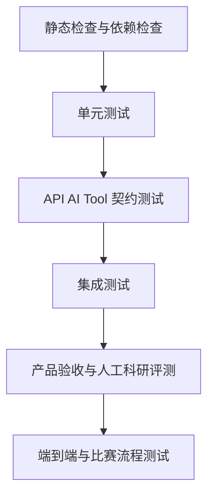

# Test Strategy and Environments

- 文档名称：Test Strategy and Environments
- 所属入口文档：[TEST_AND_ACCEPTANCE.md](../TEST_AND_ACCEPTANCE.md)
- 文档状态：Conditional Approval
- Migration status: COMPLETE

## 权威范围

本文件是测试金字塔细节、测试目录、环境、测试数据治理、Mock/Recorded/Live 分层、单元测试和前端测试策略的唯一完整定义。

## 不负责的内容

不负责具体黄金指标、Acceptance ID、M0 clean-room 细目、资源契约参数或发布门禁。

## 返回入口文档

返回 [TEST_AND_ACCEPTANCE.md](../TEST_AND_ACCEPTANCE.md)。

## 已迁入的原章节

- 原第 5、7、8、9、19、23、42 章

## 临时状态说明

阶段 8 迁移已完成。本文件与入口文档共同构成测试与验收正式开发基准；发生冲突时视为文档缺陷，不得自行猜测或降低标准。

## 第三方能力测试环境

第三方集成的最小 Spike 与正式验收必须标记实际执行模式：

| 模式 | 用途 | 限制 |
| --- | --- | --- |
| `MOCK` | 纯转换、错误映射和局部 Service 单元测试 | 不能证明真实兼容、主演示效果或发布可用 |
| `RECORDED` | 固定上游响应、TEI、模型输出或元数据的离线回放 | 必须记录来源、获取日期/Commit、脱敏和许可证；不得修改 fixture 迎合实现 |
| `LIVE` | 最小兼容 Spike、服务协议、资源和真实失败验证 | 外网波动不得成为 required CI 的唯一判定来源 |
| `OFFLINE` | 比赛断网、缓存、预置材料和显式降级验收 | 必须标出非实时、缺失能力和恢复路径 |

资源密集型服务或引擎应在主演示数据规模记录 CPU、内存、磁盘、冷启动、热启动和处理时间。资源观测是容量与降级依据，不把缺少企业压测平台升级为校赛阻断项。

---

## 5. 测试金字塔



建议数量分布：

| 测试层    |    建议比例 | 目标             |
| ------ | ------: | -------------- |
| 静态检查   |    持续执行 | 快速发现类型、格式和依赖问题 |
| 单元测试   | 55%—65% | 覆盖领域规则和确定性函数   |
| 契约测试   | 15%—20% | 保证模块接口稳定       |
| 集成测试   | 10%—15% | 验证真实组件协作       |
| E2E 测试 |  5%—10% | 验证核心用户流程       |
| 人工验收   |    核心场景 | 验证科研合理性和可用性    |

比例为指导值，不是机械考核指标。

---

## 7. 测试目录结构

```text
tests/
├── fixtures/
│   ├── projects/
│   ├── literature/
│   ├── pdf/
│   ├── datasets/
│   ├── manuscripts/
│   ├── ai_outputs/
│   ├── api_payloads/
│   └── security/
│
├── golden/
│   ├── literature/
│   │   ├── metadata/
│   │   ├── extraction/
│   │   ├── evidence_spans/
│   │   └── decisions/
│   ├── datasets/
│   │   ├── normal/
│   │   ├── missing_values/
│   │   ├── category_errors/
│   │   ├── outliers/
│   │   └── sensitive_fields/
│   ├── analysis/
│   │   ├── descriptive/
│   │   ├── group_comparison/
│   │   ├── correlation/
│   │   └── regression/
│   ├── figures/
│   ├── manuscripts/
│   ├── evidence_graph/
│   └── end_to_end/
│
├── unit/
│   ├── domain/
│   ├── services/
│   ├── adapters/
│   ├── tools/
│   ├── quality_rules/
│   ├── statistics/
│   ├── charts/
│   ├── manuscripts/
│   └── evidence/
│
├── contract/
│   ├── api/
│   ├── ai_schemas/
│   ├── agent_tools/
│   └── adapters/
│
├── integration/
│   ├── database/
│   ├── object_storage/
│   ├── celery/
│   ├── grobid/
│   ├── openalex/
│   └── full_stack/
│
├── e2e/
│   ├── project_creation.spec.ts
│   ├── literature_workflow.spec.ts
│   ├── data_analysis_workflow.spec.ts
│   ├── manuscript_workflow.spec.ts
│   └── complete_research_chain.spec.ts
│
├── performance/
├── security/
└── acceptance/
```

---

## 8. 测试环境

### 8.1 环境分类

| 环境              | 用途                         |
| --------------- | -------------------------- |
| Local           | 开发者本地快速测试                  |
| CI Unit         | 静态检查和单元测试                  |
| CI Integration  | PostgreSQL、Valkey、MinIO 集成 |
| Staging         | 全栈验收和演示彩排                  |
| Demo Offline    | 无外网比赛演示环境                  |
| Production-like | 发布前完整 Docker 环境            |

### 8.2 测试数据库

要求：

* 每次测试独立数据库或独立 Schema；
* 测试结束自动清理；
* 不连接生产数据库；
* 测试迁移从空库执行；
* 支持固定种子数据。

### 8.3 测试对象存储

使用独立 Bucket：

```text
reca-test-artifacts
```

每个测试使用独立前缀：

```text
tests/{test_run_id}/
```

### 8.4 测试队列

使用独立 Valkey 数据库或独立前缀。

不得与开发任务混用。

### 8.5 模型测试模式

支持：

* `MODEL_MODE=MOCK`；
* `MODEL_MODE=RECORDED`；
* `MODEL_MODE=LIVE`。

CI 默认使用 Mock 或审核后的 Recorded Response。

Live Model 测试仅在受控环境运行。

### 8.6 外部文献服务测试模式

支持：

* Mock OpenAlex；
* 录制响应；
* 少量在线 Smoke Test；
* 本地缓存。

---

## 9. 测试数据治理

### 9.1 测试数据登记

每个测试文件至少记录：

* 文件名；
* 数据类型；
* 来源；
* 许可证；
* 是否修改；
* 是否脱敏；
* 预期用途；
* 预期问题；
* SHA-256。

建议登记在：

```text
tests/fixtures/MANIFEST.md
```

### 9.2 PDF 测试集

至少包含：

1. 正常英文学术 PDF；
2. 正常中文学术 PDF；
3. 双栏论文；
4. 页码标签与物理页不同的论文；
5. 参考文献较多的论文；
6. 无 DOI 的论文；
7. 元数据与外部记录冲突的论文；
8. 扫描版 PDF；
9. 损坏 PDF；
10. 重复 PDF。

### 9.3 数据集测试集

至少包含：

1. 完全正常 CSV；
2. 正常 XLSX；
3. 混合编码 CSV；
4. 缺失值数据；
5. 重复行；
6. 重复 ID；
7. 类别编码不一致；
8. 极端值；
9. 单位疑似不一致；
10. 分组严重不平衡；
11. 手机号、身份证号或学号模拟字段；
12. 不支持格式文件；
13. 超大文件模拟数据。

### 9.4 DOCX 测试集

至少包含：

1. 正常论文草稿；
2. 文内有引用、文末无条目；
3. 文末有条目、正文未引用；
4. 作者年份不一致；
5. 重复参考文献；
6. 样本量前后不一致；
7. p 值不一致；
8. 相关写成因果；
9. 样本外推；
10. 术语不一致；
11. 图表编号错误；
12. 多余空格和标点问题；
13. 含复杂表格；
14. 含公式；
15. 文件损坏；
16. 非 DOCX 文件伪装。

### 9.5 敏感数据

只能使用模拟数据，例如：

```text
13800000000
110101199001010000
202600001
```

不得使用真实个人敏感信息。

---

## 19. 单元测试范围

### 19.1 项目模块

测试：

* 创建项目；
* 项目成员；
* 权限；
* 阶段转换；
* 归档；
* 恢复；
* 软删除；
* 总览统计；
* 待办生成。

### 19.2 研究问题模块

测试：

* 字段校验；
* 版本号；
* 当前版本指针；
* 确认；
* 新版本替代；
* 旧审批失效；
* 信息不足状态。

### 19.3 Artifact 模块

测试：

* 文件名标准化；
* MIME 校验；
* 哈希；
* 重复检测；
* 存储键；
* 不可变规则；
* 软删除；
* ArtifactRelation。

### 19.4 文献模块

测试：

* DOI 规范化；
* 标题规范化；
* 去重；
* LiteratureRecord 合并；
* LiteratureDecision 历史；
* EvidenceSpan 验证；
* 抽取字段确认；
* 当前矩阵聚合。

### 19.5 检索模块

测试：

* QueryPlan 转 Provider Query；
* 缓存键；
* 搜索结果标准化；
* Provider 错误映射；
* 限流；
* 重试；
* 排名融合。

### 19.6 数据模块

测试：

* CSV 读取；
* XLSX 读取；
* 字段推断；
* 数据身份证；
* DatasetVersion；
* 父版本；
* 新版本创建；
* 失效传播。

### 19.7 数据质量规则

每条规则独立测试。

规则输入固定，输出应包含：

* Issue 类型；
* 严重程度；
* 字段；
* 记录；
* 证据；
* 建议。

### 19.8 CleaningPlan

测试：

* Action 参数；
* 预览；
* 审批快照；
* 执行；
* 失败回滚；
* 幂等；
* 新版本；
* 日志。

### 19.9 分析模块

测试：

* 变量角色；
* 方法限制；
* 前提检查；
* 数字结果；
* 环境快照；
* 结果失效；
* 重复运行。

### 19.10 图表模块

测试：

* 参数 Schema；
* 数据加载；
* 模板；
* 图注；
* 规范检查；
* Artifact；
* 版本。

### 19.11 论文模块

测试：

* 文档顺序；
* 段落；
* 表格；
* 引用解析；
* 参考文献解析；
* 数字提取；
* 因果词；
* 术语；
* Issue 状态。

### 19.12 证据模块

测试：

* Claim 状态；
* Link 关系；
* 同项目约束；
* 完整度；
* 失效传播；
* 图谱输出。

### 19.13 Approval 模块

测试：

* 创建；
* 批准；
* 拒绝；
* 取消；
* 过期；
* 替代；
* 快照哈希；
* Agent 不能批准。

### 19.14 Job 模块

测试：

* 创建；
* 分发；
* 心跳；
* 进度；
* 完成；
* 失败；
* 重试；
* 取消；
* 幂等。

---

## 23. 前端测试

### 23.1 页面测试

覆盖：

* 首页；
* 项目总览；
* 研究问题；
* 文献工作台；
* 数据工作台；
* 分析结果；
* 图表；
* 论文质控；
* 证据链；
* 导出；
* Job 面板；
* Approval 面板。

### 23.2 表单测试

验证：

* 必填；
* 错误提示；
* 保存；
* 取消；
* 并发冲突；
* 离开页面未保存提醒；
* 服务器错误。

### 23.3 文献矩阵

测试：

* 排序；
* 筛选；
* 分页；
* 字段编辑；
* 决策；
* 点击 EvidenceSpan；
* PDF 跳转；
* 低置信度标记；
* 批量任务状态。

### 23.4 PDF.js

验证：

* PDF 加载；
* 页码；
* 缩放；
* 文本层；
* EvidenceSpan 高亮；
* 无坐标回退；
* 文件不可用；
* 权限拒绝。

### 23.5 数据表格

验证：

* 大列数滚动；
* 缺失显示；
* 类型；
* 敏感字段标识；
* 质量问题定位；
* 处理预览。

### 23.6 React Flow

验证：

* 节点数量；
* 边；
* 点击；
* 过滤；
* 缩放；
* 失效节点；
* 无数据；
* 大图谱基础性能。

### 23.7 可访问性

至少验证：

* 表单标签；
* 键盘操作；
* 焦点；
* 对比度；
* 状态不只依赖颜色；
* 错误可被屏幕阅读器识别。

---

## 42. Mock 与真实能力规则

### 42.1 允许使用 Mock 的场景

* 单元测试；
* 契约测试；
* 前端开发；
* 外部服务失败模拟；
* CI 无外网测试。

### 42.2 不允许 Mock 通过的验收

以下必须使用真实或确定性能力：

* 比赛主演示文献；
* PDF 原文；
* 数据质量结果；
* 数据处理；
* 统计数字；
* 图表；
* DOCX 文件解析；
* 证据链；
* 复现包。

### 42.3 演示快照

演示快照允许用于：

* 网络不可用；
* 模型不可用；
* 批量 PDF 预处理；
* Embedding 预处理。

必须在 UI 明确标识。

### 42.4 禁止行为

不得：

* 将固定 JSON 假装为实时 OpenAlex；
* 将预先写死数字假装为统计运行；
* 将静态图假装为当前数据生成；
* 将手工写死图谱假装为数据库关系；
* 将录屏代替系统真实能力而不说明。

---
